# 当前分支流处理执行逻辑与设计架构

> 本文依据当前工作树中的生产代码静态追踪得出，目标是回答一条行情从 SDK 回调进入后，如何经过复制、解码、分片、存储、KLine、最新值、共享内存、代际快照和因子发布；还会说明 Python 如何按证券键查找标的、读取固定 Store generation 的完整历史、按 checkpoint 获取单标的 tick 增量，以及如何在显式 EOF 后事务化提交 rolling/factor 状态。最后说明系统如何切分代际、处理故障并安全停止。

| 项目 | 当前基线 |
| --- | --- |
| 分支 | `perf/online-recovery-fast-isolation` |
| HEAD | `6851ce6ec992b6da2f18b75de345ca3cc211b643`（本文还覆盖当前未提交工作树） |
| 文档范围 | 当前生产数据面、Wire V2 查询面和 online CSV recovery 生命周期 |
| 生产入口 | `apps/mdl_production_main.cpp` |
| 核心编排 | `runtime::RealtimePipelineV1` |
| 文档更新日期 | 2026-08-02 |

---

> **并行解码覆盖说明：** 本文后续出现的“每 source 一个完整 decoder
> thread”描述是 `parallel_decoder_worker_count=0` 的默认拓扑。正值会武装
> adaptive topology。在 production-default `idle_inline=true` 且有效门槛
> 大于零的 profile 中，四个 source owner 先沿原路径 inline 完整解码；达到
> 有效 queue 门槛后，才 lazy-start `Wd` 个 stateless parse worker 和四个
> source-ordered committer。`idle_inline=false`、配置门槛为零或容量钳制后
> 的有效门槛为零时，第一笔记录直接选择 farm。`DecodeStateless` 可并行，但
> `FinalizeInSourceOrder`、History `TrySubmit/SealSource` 仍按 source 严格
> 非重叠。farm 排空并通过 release/acquire handoff 后可回到 inline；generation
> fence 同时等待 committed frontier 与 `farm_outstanding==0`。下文 History
> 的 `W` 表示 Store workers，与 decoder worker 数 `Wd` 无关。

## 1. 一句话结论

当前实现不是一条单线程流水线，而是三个互相咬合、但一致性语义不同的执行平面：

1. **逐条消息热路径**：串行 SDK 回调分配全局顺序并复制消息，四个 source owner 并行处理；显式启用 adaptive topology 且某次 Pop 已读取的 source-local ring 剩余深度达到门槛时，stateless parse 再分发到 `Wd` 个 worker，随后按 source 顺序 finalize。该判断复用 Pop 本来就需要的 tail acquire，不增加第二次跨核 depth 读取；它是逐次 Pop 的瞬时观测，不是持续时间判定。完整 event 再按 `instrument_id % worker_count` 路由到唯一 Store worker；Store worker 严格按
   `Store → KLine → handoff 回收 → 进程内 latest → 外部 applied sink/IPC`
   的顺序提交一条“已应用记录”。
2. **代际发布冷路径**：控制线程冻结一个排他 watermark，把 marker 注入四个 decoder；marker 在 `source × worker` 队列中变为 fence。所有 worker 到达同一屏障后，只复制 Store 端点和 KLine 快照，由 builder 构造不可变 generation，随后发布 Store、KLine 和配置启用时的 Factor。
3. **跨进程读取平面**：IPC 服务同时提供四种不同读模型：
   - per-instrument latest：低延迟当前值，逐行一致；
   - bounded mixed-tick ring：全市场 tick 连续流，过慢会显式 overrun；
   - complete-history V2：固定一次 Store generation，读取某标的的 snapshot 与 tick 全历史；
   - instrument tick-delta V2：一个 session 固定同一目标 generation，按 origin 或已验证 checkpoint 读取多个标的的有限 tick 增量。只有读到显式 EOF 后，目标 checkpoint 才可提交。

三个平面共享同一套顺序号和 Registry 身份；热路径/generation 的完整性失败
会传播到 IPC health gate，而单个 reader/session 仍可能有只影响自身的协议或
资源错误。它们的职责不同：

- 热路径追求逐条低延迟；
- generation 路径追求一个完整、可验证、可长期持有的一致前缀；
- history/delta 读取只消费已经发布的不可变 Store generation，不回读正在追加的 mutable Store；
- live latest 是“每个标的、每种类别最新已应用记录”，不是全市场原子快照；
- session-local live journal 只存在于 online CSV recovery；每个受支持 callback
  必须先成功 capture，随后才可进入 preview admission，capture 失败会使
  Pipeline/session fail closed。普通 from-open 与 standalone partial 不创建它；
- IPC 启用后属于生产输出的一部分：逐条投影、Store/KLine generation 发布或控制面健康失败都会让进程 fail closed；
- `record_coverage_complete`、`coverage_from_open`、`field_complete` 是三件不同的事，不能互相替代。

---

## 2. 总体设计架构图

图中的实线表示逐条数据流，虚线表示控制、屏障或只读获取。

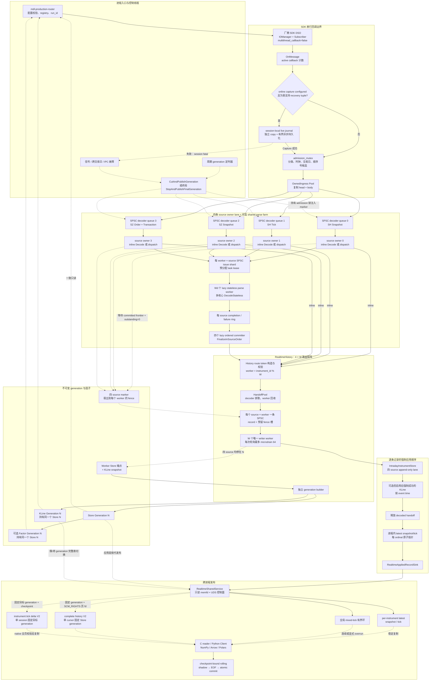

### 2.1 模块依赖方向

核心依赖是单向的：

```text
apps
  ├── recovery/mdl_csv_startup_replay + live_journal + online_recovery
  │     ├── sdk message layout
  │     └── runtime/realtime_pipeline external-ingress API
  ├── runtime/realtime_pipeline
  │     ├── sdk + realtime/owned_ingress/capture interface
  │     ├── market/decoder + history + store + kline + latest
  │     └── factor
  └── ipc
        ├── latest/ring wire projection
        ├── Store complete-history V2 wire
        ├── generation-bound instrument tick-delta V2 wire
        ├── shared service + bounded history-reader workers
        └── native validator / Python reader / checkpoint / rolling
```

`RealtimeHistoryV1` 不依赖具体 IPC 类型，只依赖通用的
`RealtimeAppliedRecordSinkV1` 接口。逐条共享内存投影由该接口接入；不可变
Store generation 则由生产应用在每次 Pipeline cut 成功后显式传给 IPC
服务。因此 IPC 不会反向进入 decoder、History 或 Store 的领域依赖。

---

## 3. 启动与对象装配顺序

生产入口位于 [`apps/mdl_production_main.cpp`](../apps/mdl_production_main.cpp)。启动顺序本身就是正确性约束：

`--intraday-store-from-open`、`--intraday-recovery-csv-dir` 与
`--intraday-live-partial` 的控制面激活点不同：常规 from-open 模式在创建
Pipeline 前已经启动 FAST 控制线程；CSV 恢复只使用 online 路径，先创建
`LIVE_PARTIAL` preview mapping 但保持 `INITIALIZING`，再由唯一 SDK owner 把
callback 同步 capture 到 live journal 并推进 preview。recovered mapping、
CERTIFIED worker、SDK-less shadow、handoff 固定容量和已 parked 的 recovery
thread 都就绪且 preview backlog 低于启动高水位后，才对外切到
`LIVE_PARTIAL` 并释放 recovery thread。shadow 从 CSV 和 durable journal 重建
完整状态；recovered FAST 在 shadow generation 与可选 CERTIFIED prefix barrier
完成后才进入 ACTIVE。详见
[`csv-startup-recovery-v1.md`](csv-startup-recovery-v1.md)。

盘中明确不恢复时，partial 模式在连接 SDK 前启动 FAST 与 bounded canonical
Event worker/control，并用同一个 exposure gate 暂缓 descriptor 传递。Pipeline
连接成功且 process-start metadata 完成后才打开 gate。FAST 以 `LIVE_PARTIAL`
允许 latest 查询，并按既有 generation interval 发布不可变 Store generation；
Event 则按 per-channel native sequence 发布 process-start partial journal。
首次 generation 后可查询从本进程启动点到该 cut 的单标的完整 History 和 tick
generation delta。它不创建 startup live journal/shadow，也不宣称
`coverage_from_open`；
可选 KLine 使用交易所自然时间窗口，只发布 process-start latest KLine；router
在 SDK Connect 成功后采样保守 process-start boundary，并在共享 exposure gate
开放前由 Event worker 完成 metadata barrier。只有已发布 bar 严格满足
`window_start < boundary < window_end` 时才标记为 left-truncated；
无成交窗口不合成 bar，且 session 不宣称 `full_day_kline_valid` 或
`certified_prefix_valid`。canonical Event journal 明确声明 process-start
coverage；深圳 6.33/6.36 在 capture observation 层共享 per-channel native
domain，并由 bounded exact-next gate 纠序。CSV online recovery 的
partial preview 使用独立的 latest-only 启动策略，即使内部存在 Store
generation 也不会开放 History/delta。

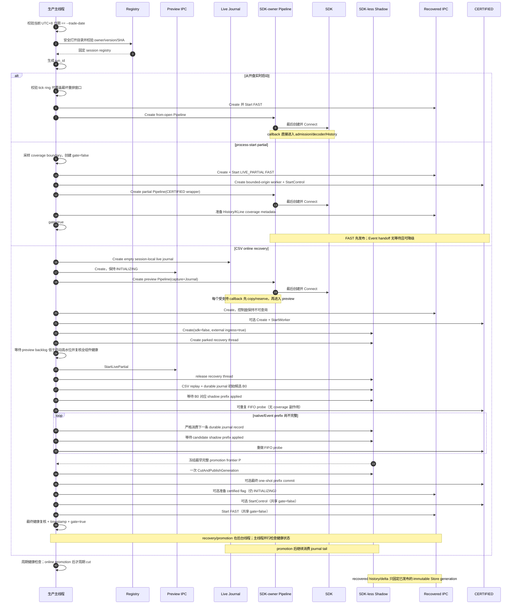

具体顺序：

1. 校验交易日，禁止把新交易日数据写入旧 session。
2. 加载并校验固定 Registry。运行期间标的 universe 和 ordinal 不变化。
3. 生成本次进程唯一的 `run_id`；online recovery 另外生成独立 preview
   `run_id`，两个 socket/cursor 不能跨 run 复用。
4. 常规 from-open 模式先建立并启动 FAST 控制面，再创建唯一的 SDK-owner
   Pipeline。partial 模式先在共享 exposure gate 后启动 FAST 与 canonical
   Event，再创建唯一 SDK-owner Pipeline，SDK Connect 成功且 coverage metadata
   就绪后一次开放 gate。online recovery 则先创建空 live journal 和尚未对外启动的
   `LIVE_PARTIAL` preview mapping，再创建带 capture sink 的 SDK-owner preview
   Pipeline；这保证 SDK Connect 后的受支持 callback 先进入 journal，再推进
   partial preview，同时允许 `INITIALIZING` mapping 保存已 applied 的 latest 与
   processing progress。
5. online recovery 随后创建尚不可查询的 recovered IPC、可选 CERTIFIED
   worker，以及 `sdk=false`、`external_ingress_enabled=true` 的 shadow Pipeline；
   handoff 会在此时预留 overlap hash/heap，recovery thread 也先创建并停在
   start/cancel latch。固定冷资源完成、全组件健康且 preview backlog 低于
   64 条后，才启动 preview control 并释放 bulk recovery。CSV 和 durable
   journal record 都只进入 shadow；preview 与 shadow 不共享 Store、runtime
   state、mapping 或 `run_id`。
6. 每个 Pipeline 依次创建：
   - 有界 `OwnedIngressMessagePoolV1`；
   - `RealtimeHistoryV1`，内部含 Store、latest、KLine、worker 与 builder；
   - 配置启用时才创建 Factor engine；standalone partial 显式禁用；
   - 四个 source owner 和四个 decoder queue；`Wd=0` 时它们执行完整
     decode。`Wd>0` 只预分配有界 issue/completion/task-lease 状态，parse
     workers 与四个 ordered committers 在首次 source-local farm activation
     时才 lazy-start；
   - 仅 SDK-owner Pipeline 最后加载并连接 SDK；shadow 创建后直接接受外部
     owned message 注入。
7. online coordinator 先固定有限初始候选 `B0`。可选 CERTIFIED 对该候选做
   无 coverage 副作用的 exact FIFO probe；`GAP_OPEN/CATCHING_UP` 时 coordinator
   使用同一 reader/seam、同一 absolute deadline，逐个 global serial 扩展候选，
   每次先等待对应 shadow applied frontier 再 probe，并在第一个完整前缀冻结
   最终 `P`。随后只执行一次 `CutAndPublishGeneration`，其 watermark 必须匹配
   冻结 shadow frontier，再执行一次最终 CERTIFIED prefix commit。CERTIFIED 与
   recovered FAST control 在同一个关闭的 exposure gate 后启动；最终健康复核
   与 promotion timestamp 成功后，仅一次 release store 打开 gate。promotion
   后同一 coordinator 从 `P+1` 继续消费 durable journal tail。
8. 每次周期或终局 cut 完成后，生产主线程先发布 exact Store generation，
   再发布可选 KLine generation。第一次 Store generation 发布前，
   `OPEN_HISTORY` 和 `OPEN_DELTA_SESSION` 会明确返回 unavailable，而不是读取
   mutable Store。

SDK-owner Pipeline 在连接前设置 `accepting=true`。原因是厂商 `Connect()`
可能同步调用回调；此时 History、decoder 和所有有界内存池都必须已经就绪。
普通 from-open callback 直接 admission；online preview callback 根据是否配置
capture sink 选择 `CaptureAndIngestLive`。生产 Pipeline 不再包含 CSV replay、
startup buffering 或恢复后 direct-callback cutoff 分支。

---

## 4. 输入分类、source 与顺序号

生产订阅固定为五类消息，禁止订阅厂商合并 tick：

| SDK service/version/type | 逻辑 source slot | 生产 stream id | 类别 | `tick_stream_sequence` |
| --- | ---: | ---: | --- | --- |
| `4.101.4` | 0 | 1001 | 上海快照 | 0 |
| `4.101.24` | 1 | 1002 | 上海逐笔 | 全局 mixed-tick 序列 |
| `6.101.28` | 2 | 2001 | 深圳快照 | 0 |
| `6.101.33` | 3 | 2002 | 深圳逐笔委托 | 全局 mixed-tick 序列 |
| `6.101.36` | 3 | 2002 | 深圳逐笔成交 | 全局 mixed-tick 序列 |
| `6.101.53` | — | — | 厂商合并 tick | **硬禁止；出现即 fatal** |

订阅目录定义在
[`include/l2flow/sdk/market_message_catalog_v1.h`](../include/l2flow/sdk/market_message_catalog_v1.h#L18)，生产订阅执行在
[`src/sdk/production_subscription_v1.cpp`](../src/sdk/production_subscription_v1.cpp#L26)。

### 4.1 三套顺序号各自解决什么问题

| 顺序号 | 分配者 | 范围 | 用途 |
| --- | --- | --- | --- |
| `global_ingress_sequence` | `admission_mutex` 下的 Pipeline | 所有被接受消息 | 定义整个进程的确定性接收顺序；跨四 source 合并历史；generation 完整性校验 |
| `source_sequence` | 同上 | 每个 source 独立、从 1 连续递增 | 证明 source lane 没有丢失、重复或越序；定位 marker/fence |
| `tick_stream_sequence` | 同上 | SH tick 与 SZ order/transaction 共用 | IPC 连续 tick cursor 与有界 ring；快照固定为 0 |

`UINT64_MAX` 保留给排他 cut，因此不会分配给真实消息。

关键不变量：

```text
accepted_global_sequence 从 1 稠密递增
accepted_source_sequence[source] 从 1 稠密递增
accepted_tick_sequence 仅对 mixed-tick 从 1 稠密递增

global_sequence_exclusive - 1
    == Σ(source_sequence_exclusive[source] - 1)

tick_stream_sequence_exclusive - 1
    == (source_sequence_exclusive[1] - 1)
     + (source_sequence_exclusive[3] - 1)
```

顺序号先计算为候选值，只有 OwnedMessage 成功进入对应 decoder queue 后才提交计数器。因此 queue full 的消息不会留下“已经编号但从未进入下游”的洞。

---

## 5. 单条消息的完整执行时序

入口实现在 `src/runtime/realtime_pipeline_v1.cpp`，worker 应用顺序实现在
`src/market/realtime_history_v1.cpp`。这里不固定源码行号，避免正常演进使锚点
失真。

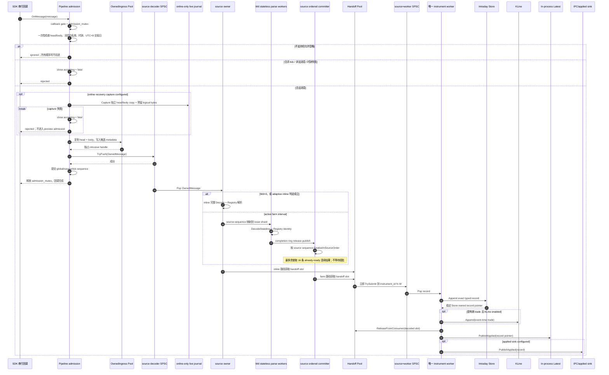

### 5.1 SDK 回调边界

SDK 配置 `multithread_callback=false`，但代码仍用 `admission_mutex` 显式定义唯一的接收顺序权威。回调路径还维护：

- `callback_gate`：停止时先关闭，拒绝新回调；
- `active_callbacks`：SDK shutdown 后等待所有已进入回调归零；
- `accepting`：数据 admission 的 session 状态；
- `fatal`：任何强制投影失真后的 sticky 状态。

回调中不保留 SDK 借用内存。`InspectOwnedIngressMessageV1` 读取消息头和 body，随后 pool 在同一分配块中复制对象及 body。decoder 得到的是进程拥有的 immutable ingress。

### 5.2 admission 的事务边界

一次成功 admission 的线性化点是：

```text
source decoder queue TryPush 成功
        ↓
提交 global/source/tick 计数器
```

此前的错误不推进序列。普通 from-open 与 standalone partial 直接进入上述
admission。online recovery 的受支持 callback 则在进入 admission 前经过
required capture：live journal 独立复制 vendor head/body 并预留队列和逻辑
字节，capture 失败会关闭 preview admission 并使 Pipeline fatal，不存在
“preview 已接受、journal 丢失却仍继续”的容错路径。

### 5.3 解码与 Registry 解析

每个 source 有一个专属 `MarketDecoderV1`，其可变状态所有权在任一时刻始终
唯一，但拥有线程会切换：没有 farm outstanding 时由 inline source owner
持有；active farm interval 由 ordered committer 持有；排空后的
release/acquire frontier 才允许交还 inline owner。

- 只接收其固定 service/version/schema；
- decoded event 自有字符串和数组，不引用 SDK body；
- 按 `market + security source + security id` 查固定 Registry；
- 解析出 `instrument_id`、`registry_ordinal`、数量单位、安全类型和 worker 路由信息；
- `DecodeStateless` 不读写跨消息状态，可由多个 parse worker 并行执行；
- `FinalizeInSourceOrder` 只由当时拥有该 source 状态的 ordered committer
  （或 inline owner）严格按 source sequence 调用；
- 上海产品阶段状态只由上述唯一 ordered owner 维护，不与其他 source 共享可变状态。

非白名单消息在 admission 层忽略；白名单消息一旦 schema 或 Registry 处理违反强约束，则进入 fatal，而不是静默跳过。

---

## 6. History 并发拓扑与路由

`RealtimeHistoryV1` 是热路径的并发核心。它把“source 顺序所有权”和“instrument 写所有权”分开：

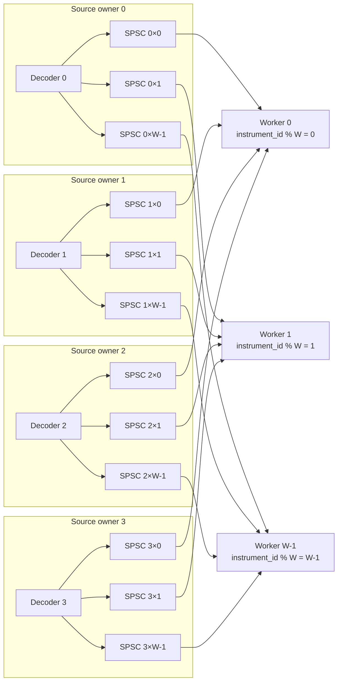

### 6.1 为什么是 `4 × W` SPSC，而不是一个 MPSC

每条队列只有：

- 一个 producer：固定 source 的当前 ordered producer（inline owner 或
  farm committer，二者由排空 handoff 保证不重叠）；
- 一个 consumer：固定 worker。

因此 record 热路径不需要 MPSC 竞争，也不需要 append 全局锁。每个 worker 是其标的集合的唯一 writer，Store 和 KLine 都可依赖 thread ownership。

同一 instrument 可能从四个 source 到来，但最终全部进入同一个 worker。worker 轮询四条输入队列，每条最多 microdrain 64 条，避免一个活跃 source 永久饿死其他 source。

### 6.2 HandoffPool 的所有权循环

decoded event 体积可能达到数 KB，队列中不直接复制大 variant，而只传一个 slot 指针：

```text
source decoder
    │ AcquireForProducer
    ▼
HandoffPool slot（内含 move-only decoded event）
    │ pointer 经 source×worker SPSC
    ▼
worker 完成 Store/KLine 应用
    │ ReleaseFromConsumer
    ▼
反向 SPSC recycle
    │
    └────────────── 回到 source decoder
```

pool 有硬上限，只按需增长；耗尽或回收协议破坏都会 fail closed。Store append 完成后，decoded handoff 可以回收，因为 Store 已把精确 typed payload move 到自己的 append-only arena。

---

## 7. worker 的“已应用”边界

对每条 record，worker 的顺序不能交换：

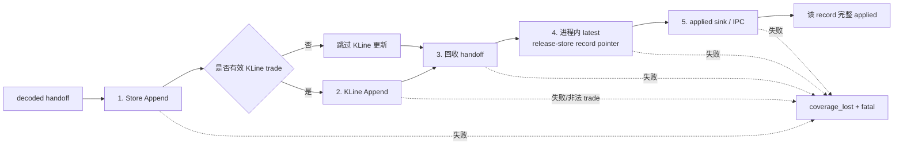

含义：

1. **Store 是历史事实源**。先有稳定的 Store-owned record，其他投影才能引用或编码它。
2. **KLine 启用后属于必需投影**。有效 trade 不能被静默漏算；非法 event time/price/quantity 也不能假装 KLine 完整。
3. **handoff 回收在 latest 前**。latest 保存的是 Store 指针，不依赖 decoded slot。
4. **进程内 latest 先于外部 sink**。外部 IPC 失败时，代码立即把 latest/Store 覆盖标成失效，使后续读取 fail closed。
5. Store append 不能事务回滚；后续投影失败时系统不再声称覆盖完整，而是 sticky `coverage_lost + fatal`。

因此，“Store 已写入”不等于“记录可安全对外宣称已应用”；完整 applied 边界在可选的外部 sink 成功之后。

---

## 8. Intraday Store：历史事实源

Store 在创建时把 Registry 固定 universe 预编译为：

```text
registry ordinal
    └── instrument row
          ├── route token
          │     ├── worker = instrument_id % W
          │     └── worker_local_row
          ├── source lane 0: append-only segments
          ├── source lane 1: append-only segments
          ├── source lane 2: append-only segments
          ├── source lane 3: append-only segments
          ├── latest snapshot pointer
          └── latest tick pointer
```

每个 source lane：

- record header 从 arena 头部向前增长；
- exact typed payload 从 arena 尾部向后增长；
- header 保存相对 payload offset；
- segment 满时追加新 segment，不搬迁旧记录；
- 保存 source 最后序列和记录数；
- 受全局 record/byte quota 约束，不做 eviction。

`Store::Append` 的主要检查：

1. route token 必须属于当前 session；
2. worker、instrument、ordinal 必须完全匹配；
3. 该 instrument/source lane 内的 source sequence 与 ingress sequence 必须严格递增；稠密性由更上层的 source owner 和 generation 总量校验保证，因为单个 instrument 只会看到整个 source 序列的一个子序列；
4. record/byte 配额必须足够；
5. typed payload placement-move 成功后才链接 header；
6. 按更大的 `global_ingress_sequence` 更新该 instrument 的 latest snapshot 或 latest tick 指针。

Store 内部按 source 分 lane，但跨 source 查询会按 `global_ingress_sequence` 做确定性归并。因此物理写入可以并行，逻辑历史仍有单一全局顺序。

这里的 Store row latest pointer 是唯一 worker 维护、供 generation capture 使用的 mutable session 状态；第 10 节的 `RealtimeLatestReadModelV1` 则是完成 KLine 与 handoff 后才 release-store 的跨线程实时读取索引。二者指向同一类 Store-owned record，但可见性边界不同。

### 8.1 immutable generation 为什么能安全长期读取

worker 到达 generation fence 时，`CaptureWorker` 只捕获每条 lane 的：

- head/tail segment 指针；
- tail 当时已经使用的 record 数；
- lane record count 与 accounting；
- latest snapshot/tick 定位器。

它不复制历史 payload。`BuildGeneration` 把所有 worker slice 按 registry
ordinal 重新组装，并把 Store 的 `SessionState` 放进共享所有权中。因此：

1. generation 看到的是 cut 时刻的端点，cut 后追加到同一 tail segment 的
   新 record 也不会越过已捕获的 `tail_used`；
2. 后续 segment 追加不会移动旧 record；
3. generation、由它打开的 cursor，以及 IPC 服务固定的
   `shared_ptr` 都能延长底层 session/arena 的生命周期；
4. 新 generation 可以继续复用同一批稳定 segment，不需要复制当天全部历史。

这也是 complete-history V2 和 tick-delta V2 的共同事实基础：两者都从
immutable generation 打开 cursor，而不是在正在写入的 Store 上加一把长时间
读锁。

### 8.2 Store 的三种 cursor

| Store cursor | source 范围 | 顺序 | 典型用途 |
| --- | --- | --- | --- |
| `IntradayInstrumentCursorV1` | 4 条 source lane | 可 oldest-first 或 newest-first；跨 lane 按 ingress sequence 归并 | 单标的完整历史、tail |
| `IntradayInstrumentTickDeltaCursorV1` | 只选 source 1 和 3 | oldest-first；按 ingress sequence 归并 | generation-bound 单标的 tick 增量 |
| `IntradayUniverseCursorV1` | 全部标的、全部 lane | instrument ID 升序；标的内 ingress sequence 升序 | generation 内全市场扫描 |

完整历史 cursor 从各 lane 的 generation head/endpoints 开始流式归并。tick
delta cursor 则从目标 generation 的 source 1/3 tail 向前回扫，找到
`ingress_sequence_begin_inclusive` 边界并计算 base/target/delta 的分 source
计数，然后再从该边界向前输出。因此 delta open 的定位工作是
`O(本次增量 tick 数)`，后续读取也是 `O(本次增量 tick 数)`；当前实现没有
额外的按 generation 随机跳转索引。

边界是全局 generation 的半开区间：

```text
[base.ingress_sequence_exclusive,
 target.ingress_sequence_exclusive)
```

输出却只包含指定 instrument 的 source 1/3 tick，所以输出记录的
`ingress_sequence` 和 `tick_stream_sequence` 全局严格递增；`source_sequence`
则只在各自的 source lane 内严格递增。三者对单 instrument 都通常不连续。
完整性不能靠“最后一行序列 + 1”推断，必须依赖 generation 端点、
instrument-local 计数与显式 EOF 对账。

---

## 9. KLine 处理逻辑

KLine 是 worker-local 投影：

- 只有上海逐笔成交语义和深圳 transaction 成交语义会投影为 trade；
- 使用交易所 **event time** 分桶，绝不使用接收 realtime/monotonic 时钟；
- 每个 worker 拥有一个 aggregator，与 Store 共享相同的 instrument 路由；
- 每个配置 window 计算 `floor(event_time / window)`；
- 支持迟到事件回写旧 bucket；
- immutable snapshot 与热写 series 共享 chunk，写入共享 chunk 时 copy-on-write；
- OHLC 的先后不依赖线程调度，而使用确定性事件顺序元组：

```text
(event_time,
 native_sequence_or_source_sequence,
 source_sequence,
 global_ingress_sequence)
```

这样即使 event time 乱序，open/close 的选择仍可重放且确定。volume、trade count 与 revision 随每次有效 trade 更新。

KLine generation 持有构建它的同一个 Store generation，防止读取者把 `KLine N` 与 `Store M` 混用。

---

## 10. live latest snapshot/tick

当前实现的进程内 latest read model 不是另一份记录副本，而是固定 Registry
ordinal 上的 Store record 指针索引。

### 10.1 内存布局

```text
snapshot_slots[registry_size]  // 每项独立 atomic<const Record*>
tick_slots[registry_size]      // 每项独立 atomic<const Record*>
```

两类 slot 使用独立的 64-byte 对齐数组，降低 snapshot 与 tick 写入之间的伪共享。唯一 worker 写入相应 ordinal，因此发布只需 release-store，不需要 CAS 竞争；读取用 acquire-load。

### 10.2 “latest”的精确定义

- snapshot slot：该 instrument 最新的快照类 Store record；
- tick slot：该 instrument 最新的 SH tick、SZ order 或 SZ transaction；
- 比较键是 `global_ingress_sequence`，不是 event time；
- snapshot 与 tick 相互独立；
- tick 不是“最新成交”，可能是委托或逐笔成交；
- clean stop 后，只要 Pipeline/Store session 对象仍存活，已发布指针仍有效。

### 10.3 读取保证与非保证

保证：

- 单个返回行来自一条完整、稳定的 Store record；
- batch 按输入 instrument 顺序返回；
- coverage 在读取前后都检查，若读取期间变为失效则清空结果并失败；
- 未观察、未知 instrument、非法参数有明确状态。

不保证：

- batch 中多个 instrument 不属于同一个全市场 cut；
- polling 不保证看到每个中间更新；
- latest snapshot 和 latest tick 不组成联合事务；
- 它不是 generation Store 的替代品。

若需要跨标的一致前缀，应读取 Store/Factor generation；若需要连续逐笔，应使用 IPC tick cursor。

---

## 11. generation cut、屏障与发布

generation 路径入口在
[`RealtimePipelineV1::Impl::CutWithLock`](../src/runtime/realtime_pipeline_v1.cpp)。

### 11.1 完整时序

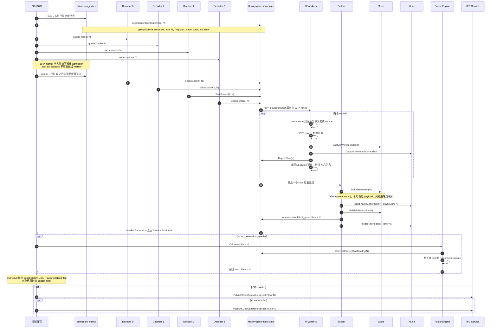

### 11.2 为什么 marker 必须在 admission 锁内注入

cut 先读取以下已提交计数：

```text
global_exclusive = global_ingress_sequence + 1
source_exclusive[s] = source_sequence[s] + 1
```

然后在仍持有 admission 锁时，把四个 marker 放进四条 decoder queue。这样：

- marker 前的消息一定属于 generation N；
- 回调无法在 watermark 被读取后、marker 入队前插入；
- admission 解锁后到来的消息一定排在对应 source marker 后，属于下一前缀。

### 11.3 source seal 如何变成 worker barrier

source owner 按其 SPSC queue 顺序消费 marker。marker 前由 inline owner 处理的
suffix 已经同步提交给 History；若该 source 曾向 farm dispatch，owner 只等待
`last_dispatched_source_sequence`（最后一个实际 farm-dispatched sequence）的
committed frontier，并确认所有已签发 lease 都已在 History submission gate
结束后 retired。它不是笼统等待“最后一个 cut 前 sequence”；inline 部分无需
再由 committer 覆盖。满足这些条件后才调用 `SealSource`。`SealSource` 校验
完整 source sequence 和 global exclusive，再向该 source 的每个 History
worker queue 各插入一个 fence。

worker 看见某 source fence 后暂时不再消费该 source 的 post-cut record，但继续排空其他 source。只有四个 source 都停在同一 generation，才捕获本 worker 的 Store/KLine slice。

捕获完成后 worker 立即恢复热路径；O(instrument_count) 的 generation 构建交给独立 builder，不阻塞后续 record append。

### 11.4 generation 完整性校验

Store builder 除了验证身份和路由，还验证：

```text
total_records == global_sequence_exclusive - 1
records_by_source[s] == source_sequence_exclusive[s] - 1
所有 captured latest pointer 的 ingress_sequence < global_sequence_exclusive
worker slice 集合恰好覆盖 [0, W)
run_id / session / registry version / registry SHA / trade_date 全部一致
```

任一条件不满足都不会发布一个“看起来成功但实际上缺记录”的 generation。

### 11.5 IPC Store generation 的第二层发布校验

Pipeline 内部发布 Store generation 后，生产主线程还要把同一个
`shared_ptr` 发布给 IPC。IPC 不盲信调用者，而是再次验证：

- generation 从 1 开始，每次必须恰好 `previous + 1`；
- run、trade date、Registry version/SHA 和 instrument count 与服务固定配置一致；
- `record_count == ingress_sequence_exclusive - 1`；
- 四路全市场计数分别等于 `source_sequence_exclusive - 1`；
- 所有 instrument summary 按固定 registry ordinal 对齐；
- 每个 instrument 的总数等于四路分 source 计数之和；
- 相对上一代，Store process-local provenance、coverage 模式保持不变，
  generation/cut time/全局计数/分 source 计数/每标的计数均不倒退。

这里允许“新 generation 没有新消息”：generation number 仍递增，但 cut
端点和各项计数可以与上一代相同。这样的空增量对 V2 很重要，因为 consumer
仍可在新 generation 上运行 `on_generation` 并提交新 checkpoint。

老 cursor 已经持有自己的 generation `shared_ptr`，所以 IPC 原子替换“最新
可打开 generation”不会改变正在扫描的旧 generation。Store generation
发布失败会把 IPC 标记为 coverage lost；生产主循环随后停止，不会继续对外
宣称服务健康。

---

## 12. Factor 发布逻辑

Factor 不在逐条 worker 热路径运行。`factor_generation_enabled=true` 时，它在
完整 Store generation 发布后计算；false 时不创建 calculator，也不要求 cut
结果携带 Factor generation：

```text
Store Generation N 构建并发布
        ↓
Factor calculator 对固定 registry 顺序计算完整 rows
        ↓
校验 row count、instrument id/order、finite value、invalid canonical form
        ↓
History::CommitIfCurrentAndHealthy(Store N)
        ↓
一次 release-store 发布整个 Factor Generation N
```

默认 calculator 是 snapshot last-price 投影：

- 读取 Store generation 中每个 instrument 的 latest snapshot；
- 合法正价格从 p6 规格归一化为浮点值；
- 没有合法值则输出 canonical invalid `+0`；
- 必须为 Registry 中每个 instrument 恰好输出一行，顺序完全一致。

启用时，Factor generation 持有它的 input Store generation。需要一致读取
时，应先 acquire Factor，再从 `factor->input_store()` 访问 Store，而不是分别
acquire “最新 Factor”和“最新 Store”，否则两次 acquire 之间可能跨代。

---

## 13. Online recovery 的 session-local live journal

live journal 不是通用审计旁路，只在指定 CSV online recovery 时创建。对于
五类受支持行情 callback，SDK-owner preview Pipeline 的顺序是：

```text
检查受支持的 vendor head/body
  -> journal Capture：独立复制 head/body，预留 queue 与 logical bytes
  -> Capture 成功
  -> preview Ingest/admission
```

`Capture()` 成功是异步 retention boundary，不等于该 record 已经
`fdatasync`。writer 只有在一个完整 batch 及其跨越的 segment 全部持久化后才
推进 `committed_serial`；shadow reader 不读取该 durable frontier 之后的记录。
capture queue/容量耗尽、write/sync 失败、journal reader 校验失败，或者最终
`committed_serial != accepted_serial` 都会使 online recovery session fail
closed。普通 from-open 和 `--intraday-live-partial` 的配置保持
`live_ingress_capture_sink == nullptr`，因此完全不进入这条 capture 路径。

journal 的启动、flush 和 reader tail 生命周期由生产应用与 online recovery
coordinator 管理，并不属于 `RealtimePipelineV1::StopAndDrain()` 的职责。详细
闭合 handoff 与 durable frontier 契约见
[`csv-startup-recovery-v1.md`](csv-startup-recovery-v1.md)。

---

## 14. IPC 共享内存发布路径

Linux IPC 服务同时承担两种不同任务：

1. 一个长期存在、持续更新的 latest/ring 共享映射；
2. 基于不可变 Store generation、按请求临时生成的只读 history/delta 页。

两者都使用固定宽度、little-endian wire ABI，不把 C++ 对象、指针或 STL
容器暴露给其他进程，但不要把临时历史页误认为长期共享映射中的新 region。

### 14.1 共享区布局

| 区域 | 内容 | 更新方式 |
| ---: | --- | --- |
| header | session identity、状态、coverage、heartbeat、各区域 offset/size | 原子状态字段 |
| 1 | instrument rows | 初始化后只读 |
| 2 | instrument key blob | 初始化后只读 |
| 3 | KLine window definitions | 初始化后只读 |
| 4 | per-instrument latest snapshot slots | 每 slot seqcount |
| 5 | per-instrument latest tick slots | 每 slot seqcount |
| 6 | latest KLine tables | generation 奇偶双缓冲 |
| 7 | bounded global tick ring | 每 slot seqcount + slot lock |
| 8/9 | 保留 | 未使用 |

典型 slot 大小：

- snapshot slot：4096 B；
- tick slot：512 B；
- KLine row：256 B。

服务创建可写 mapping 后，通过 `/proc/self/fd` 打开独立只读 fd，并应用 memfd seals；客户端经 Unix domain socket 和 `SCM_RIGHTS` 只获得只读 fd。

instrument row 与 key blob 在初始化后不再变化。native reader 会据此建立
按完整组合键排序的查找索引，所以 symbol lookup 不需要进入 Pipeline 或
访问 mutable Registry 对象。

### 14.2 单条 applied record 的 IPC 顺序

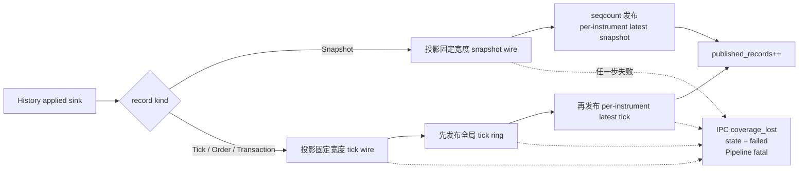

tick 必须先进入 ring，再更新 latest tick。否则客户端可能先看到“某标的最新 tick”，但连续 cursor 中相同 sequence 尚不可读。

### 14.3 seqcount 稳定复制

writer 对一个 slot 的发布协议：

```text
even tag
   └─CAS→ odd tag（写入中）
          ├─复制固定宽度 words
          └─release-store final even tag
```

reader：

1. acquire-load tag，必须为偶数；
2. 复制整行到进程私有 buffer；
3. 再次 acquire-load tag；
4. 仅在两次 tag 相等且为偶数时接受。

Python 不直接持有 mmap 上的可变 view，native reader 总是先做稳定复制，避免读取撕裂。

### 14.4 tick ring 与重排

不同 instrument worker 可以并行发布 tick，所以 IPC 接收顺序可能短暂重排。ring 使用：

```text
index = (tick_stream_sequence - 1) % capacity
```

并维护：

- `highest_published_tick_sequence`：见过的最大序列；
- `contiguous_tick_sequence`：从 1 开始无洞的最大连续前缀；
- 每 ring slot 的小锁：避免两个乱序 worker 同时覆盖同一模位置；
- 控制线程 eventfd：热路径只做有界推进，剩余连续前缀由控制线程补齐。

生产入口在启动前计算有界 applied window。设每 source decoder queue 容量为
`Q`、decode worker 数为 `Wd`、每 `(source, worker)` task lease 数为 `S`：

```text
D = min(4 × (Q + 1 + Wd × S),
        completion_tracker_capacity - 1,
        tick_ring_capacity - 1)
```

`Wd=0` 时并行项为零。上式的 target 会被 tracker/ring 的 `capacity - 1`
夹住；仅仅因为 target 大于 backing capacity 不会拒绝启动。无法安全计算、
容量小于 2、结果为零、超过全局硬上限，或夹住后的值仍违反容量不变量时才
拒绝。这个检查保护 producer 内部重排，但消费者仍可能因为自身太慢而被
覆盖；此时 reader 返回明确 overrun，而不是悄悄跳号。

### 14.5 KLine 的 IPC generation 切换

KLine IPC 不逐条发布，而是在完整 KLine generation 形成后：

1. 选择 `generation % 2` 对应的非当前表；
2. 写入所有 `instrument × window` 行，包括显式空行；
3. 再次检查 session 健康；
4. release-store `kline_generation=N`，一次性切换整张完整表。

客户端只按已发布 generation 选择偶/奇表，不会把半张 N 表和半张 N-1 表拼在一起。

Store generation 与 KLine generation 都在一次 Pipeline cut 成功后由生产
主线程发布，顺序固定为 Store 在前、KLine 在后。两次发布不是一个共享内存
原子事务：需要 Store 历史的 reader 固定 Store generation；需要 KLine 的
reader 读取 `kline_generation`；调用方不能把独立取得的二者自行推断成联合
快照。Pipeline 内部的 `RealtimeKLineGenerationV1` 本身仍持有 exact input
Store generation，C++ 一致读取应沿该所有权关系进行。IPC 的
`PublishKLineGeneration` 校验自己的代号、身份、窗口与完整表，却不接收或
重新验证那个 C++ `input_store` 指针；当前生产正确性来自主线程只传同一次
cut 返回的 exact handles，而不是来自两个独立 IPC 数字碰巧相等。

### 14.6 UDS 控制面、symbol lookup 与 reader 限额

控制面是 same-UID 的 `AF_UNIX/SOCK_SEQPACKET`：

- `SO_PEERCRED` 要求 peer UID 等于服务 effective UID；
- 普通 `GET_SESSION` 返回长期 latest/ring mapping 的只读 fd；
- `OPEN_HISTORY` 建立一个 complete-history V2 cursor；
- `OPEN_DELTA_SESSION` 建立一个 instrument tick-delta V2 session；
- 每个非终局 history/delta `READ` 返回一个新建、写完、解除 writable
  mapping、加满四个 seal 后重新以 `O_RDONLY` 打开的 memfd；
- same UID 被视为同一信任边界。服务端能限制活动 reader 与单页大小，但
  不能阻止受信任客户端在收到 fd 后长期自行持有页面。

symbol lookup 走长期 mapping 的 native C reader，组合键是：

```text
(market byte, security_id_source opaque bytes, security_id opaque bytes)
```

它不 trim、不做大小写折叠、不转码，也不根据证券代码前缀猜 market/source。
批量调用保持输入顺序与重复项，每项独立返回：

- `FOUND`；
- `UNKNOWN`；
- `INVALID_MARKET`；
- `EMPTY_SECURITY_ID`。

非 `FOUND` 的 `instrument_id` 恒为 0。若 market 和 security ID 同时非法，
实现先返回 `INVALID_MARKET`。`security_id_source` 为空本身不是单独错误，
仍按完整组合键查找。

complete-history V2 与 tick-delta V2 共用同一组服务端 worker slot。生产入口
没有为这些参数提供 CLI 覆盖，因而使用 `RealtimeSharedServiceConfigV2`
默认值：

| 限制 | 默认值 | 含义 |
| --- | ---: | --- |
| `maximum_history_readers` | 8 | history cursor 与 delta session 合计最多 8 个活动连接 |
| `maximum_history_page_records` | 16,384 | 服务端单页行数上限；还会与客户端请求取较小值 |
| `maximum_history_page_bytes` | 64 MiB | header + payload 的单页上限 |
| `history_reader_idle_timeout` | 30 s | 等待该连接下一请求/发送响应的超时 |

delta session 可以顺序打开多个 instrument cursor，但在 session 生命周期内
一直占用一个 slot；每个 history cursor 占用一个 slot。reader 资源
耗尽会返回明确的 `RESOURCE_EXHAUSTED`，不会降级成 mutable/不固定读取。

---

## 15. 跨进程读取路径：应该选哪一种

当前分支不是用一个 API 同时解决“当前值、连续流、完整历史、增量状态”四类
需求，而是显式拆成不同读模型：

| 读模型 | 何时可见 | 保留范围 | 输出范围 | 核心保证 | 明确不保证 |
| --- | --- | --- | --- | --- | --- |
| latest snapshot/tick | 单条 applied sink 成功后 | 每标的每类别仅一条 | 指定 instrument | 每行稳定、请求顺序保留 | 多标的同代、每个中间更新 |
| latest KLine | 完整 KLine generation 发布后 | 每标的每窗口一条 | 指定 instrument/window pair | 一次读取绑定已发布 KLine 表代际 | KLine 全历史、逐 tick 刷新 |
| global tick ring | slot 在单条 tick applied 时发布；cursor 只读到 contiguous prefix | 固定容量 | 全市场 mixed tick | 从 cursor 起点连续，未到达返回空，覆盖返回 overrun | 慢 consumer 永久保留 |
| complete-history V2 | Store generation 发布后；cursor open 时固定 | Store session 配额内的完整历史 | 一个 instrument 的 snapshot + tick | 固定 generation、每条 Store record 有一行、显式 EOF 对账 | Store 全字段无损、多个独立 cursor 自动同代 |
| instrument tick-delta V2 | Store generation 发布后；session open 时固定目标 | Store session 配额内的 source 1/3 tick | 同一目标 generation 下顺序读取多个 instrument | origin/checkpoint 到 target 的有限半开增量；EOF 后给出 verified checkpoint | snapshot、逐条最低延迟、字段无损 |

简单地说：

- 只要“现在是多少”用 latest；
- 要全市场逐笔低延迟流用 ring；
- 要某标的在固定代际中的 snapshot/tick 全部历史用 history V2；
- 要维护单标的可恢复 rolling/factor 状态用 tick-delta V2。

文中反复出现的三个“完整性”字段含义不同：

| 字段 | 它实际声明什么 | 它不声明什么 |
| --- | --- | --- |
| `coverage_from_open` | 一个由运维配置给出的事实断言：要么进程在首条相关市场消息前启动并持续健康，要么同交易日、从开盘完整的通联 CSV 与 session-local live journal 通过 online shadow 的闭合 handoff 恢复成功。生产入口只有在 `--intraday-store-from-open` 或 `--intraday-recovery-csv-dir` 模式设置它；`--intraday-live-partial` 明确保持 false，不根据“序列从 1 开始”自动推断 | 厂商上游行情本身没有丢包；CoreV2 保存了所有 C++ 字段；PDF 未保存的深圳快照 `ChannelNo` 可凭空恢复 |
| `record_coverage_complete` | generation 是本进程已接受记录的完整 cut 前缀；对 complete history 是该 instrument 四路 Store 记录，对 tick delta 是该 instrument 在所选 source 1/3 与半开区间内的 tick | 进程覆盖了开盘；上游 feed 完整；payload 字段无损 |
| `field_complete` | wire projection 是否无损保留 Store event 的所有字段 | 是否读到了所有 record |

complete-history 与 tick-delta 两种 Wire V2 协议都要求相应的
`record_coverage_complete=true`，同时固定 `field_complete=false`。另有
sticky `coverage_lost` 健康状态：
一旦置位，服务直接拒绝继续把任何上述标志解释为有效完整性承诺。

### 15.1 长期共享映射与 session 锚定

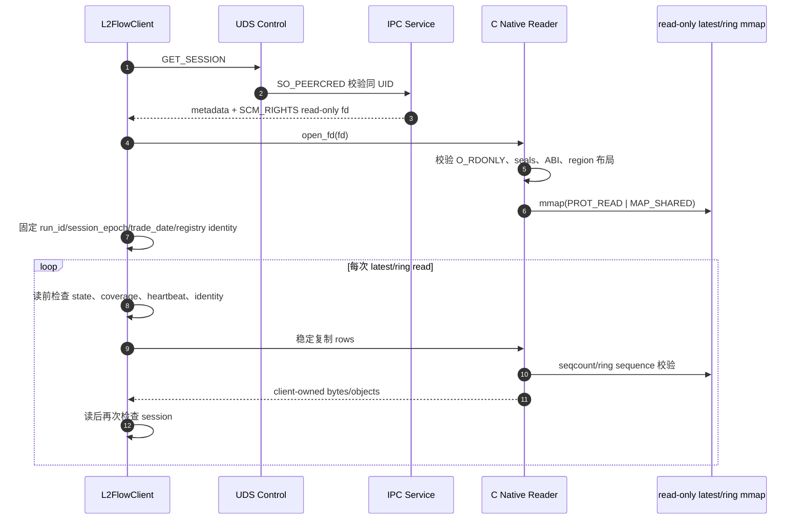

`L2FlowClient` 不静默跨 session 重连。默认 heartbeat stale threshold 是 3
秒；在 `ACTIVE` 或 `DRAINING` 状态下，heartbeat 过期会显式抛出
`StaleSessionError`。`FAILED` 或 coverage lost 会显式 unavailable。

按证券键反查也在这个 reader 上完成。Python 的单项
`resolve_instrument(market, security_id_source, security_id)` 接收三个精确
字段；批量 `resolve_instruments(keys)` 接收 `InstrumentKey` 序列，并保留
重复项和原顺序。得到稳定 `instrument_id` 后，调用方才把该 ID 用于 latest、
history 或 delta API。

### 15.2 complete-history V2：固定一代并完整扫描

complete-history 的“完整”指一个 instrument 在固定 Store generation 中的所有四路
Store record，而不是“截至调用瞬间的 mutable Store”：

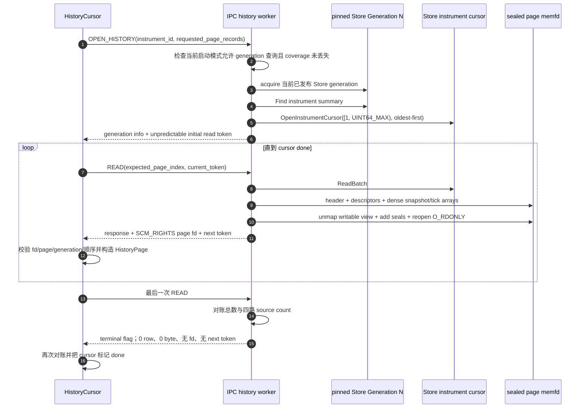

`expected_page_index` 拒绝重复、跳页和乱序请求；read token 则使客户端不能在
尚未收到当前页响应时预先排队一个确定可用的下一页请求。token 是同一
same-UID 连接上的顺序 nonce，不是跨用户认证机制。V2 数据页采用相同的
page-index + rotating-token lockstep。

open 时固定的是当时“最近一次成功发布给 IPC”的 Store generation。之后
generation N+1、N+2 可以继续发布，但当前 cursor 始终读取 N。每个 history
cursor 都独立 open 最新 generation；如果分别打开多个 instrument，中间恰好
发生新发布，它们可能固定到不同代。history open 本身没有“一个 session 固定多个 instrument”
的接口；调用方可以用 `expected_generation` 拒绝意外跨代。

已注册但在 N 中没有任何 record 的 instrument 是合法空历史：open 成功，
第一次 READ 就返回显式 EOF。未注册 ID 返回 `NOT_FOUND`。在第一代 Store
尚未发布时返回 `UNAVAILABLE`。

查询 gate 同时区分启动模式，不能只按 `server_state` 推断：from-open 或成功
recovered、且 `coverage_from_open=true` 的服务在完整前缀状态
`ACTIVE/DRAINING/STOPPED_CLEAN` 下开放；standalone partial 只有通过
`StartLivePartialWithProcessStartHistory()` 显式启用 process-start generation
查询后，才在 `LIVE_PARTIAL/DRAINING/STOPPED_CLEAN` 开放。online recovery
preview 使用 latest-only `StartLivePartial()`，因此即使内部持有 generation 也
始终拒绝 History/delta。

### 15.3 complete-history V2 页布局与“记录完整、字段不完整”

一个非终局 history V2 页的规范布局是：

```text
4096-byte RealtimeHistoryPageHeaderV2  // page magic "L2FHST2\0"
N × 40-byte record descriptors       // 保留原始 mixed ingress 顺序
S × 3104-byte snapshot payloads       // dense snapshot array
T × 336-byte tick payloads            // dense tick array

N = S + T
```

descriptor 中的 `payload_kind + payload_index` 指向对应 dense array，同时
重复保存：

- `ingress_sequence`；
- `source_sequence`；
- `tick_stream_sequence`；
- `source_slot`；
- `event_kind`；
- `projection_flags`。

因此 Python 可以按 descriptor 恢复原始 snapshot/tick 混合顺序，也可通过
`to_columns_by_kind()`、`to_arrow_by_kind()`、
`to_polars_by_kind()` 分成两张同质表。`records()` 则按原始顺序逐条迭代，
无需一次物化全天历史，但仍必须把迭代器耗尽到 EOF 才算完整。

history V2 `CoreV2` 的承诺是：

```text
record_coverage_complete = true
field_complete           = false
payload_projection       = CoreV2
```

也就是 fixed generation 中每个 Store record 都有且只有一个输出 record，
但固定 wire payload 并不是 C++ `StoredMarketEvent` 的无损序列化。尤其上海
`raw_type` / `raw_tick_flag` 超过 32-byte inline 容量时：

- 不截断成看似真实的短字符串；
- 不丢掉整条 record；
- inline 长度/内容置空；
- 设置对应 omission flag。

真实空字符串是 `length=0, omission flag=0`，与“因容量而省略”可区分。
`input_identity_sha256` 绑定 generation cut 与 Registry 身份，不是页内容或
payload bytes 的摘要。

成功声明“完整读取”至少依赖：

1. open 时 generation identity/计数合法；
2. 每页 identity 与 open 响应逐字一致；
3. 页索引和 token 严格轮换；
4. 页内/跨页 ingress sequence 严格递增；
5. 每条 source lane 的 source sequence 严格递增；
6. 累计总数与四路 source count 不超过 generation 声明；
7. 显式 EOF 时累计计数与声明完全相等。

这里的序列对单 instrument 是稀疏子序列，因此不要求相邻差为 1。

### 15.4 instrument tick-delta V2：先固定目标，再顺序读多个标的

V2 解决的是“我的 rolling state 已经处理到 generation B，现在要把同一目标
generation T 的新增 tick 应用进去”。它的 session/cursor 是两层结构：
这里的 “V2” 是 instrument-delta 协议族版本；控制消息仍使用共享 realtime
wire 的 `major=1, minor=1`，不是把整个共享内存 ABI 升成 major 2。

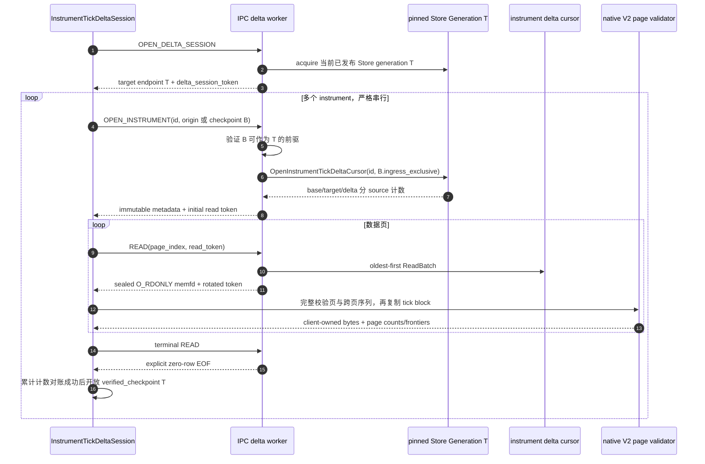

一个 V2 session 在 open 时只 acquire 一次目标 `shared_ptr`。后续 IPC 发布
T+1 不会改变它，所以同一 session 顺序处理的多个 instrument 天然共享目标
generation T。协议和 Python API 都只允许一个 active instrument cursor；
前一个必须到达显式 EOF，才能打开下一个。

如果 cursor 在 EOF 前被主动关闭，Python 会关闭整个 V2 session，因为服务端
连接仍处于“等待当前 cursor 下一页”的状态，不能安全跳到下一个 instrument。
达到 EOF 的 cursor 会自动从 session 解绑，此时 session 可继续复用。

V2 只选择：

```text
source slot 1 = Shanghai tick
source slot 3 = Shenzhen order + transaction
selected_source_mask = 0b1010
```

slot 0/2 snapshot 永远不进入 delta，相关 instrument count 恒为 0。

### 15.5 origin、checkpoint 与半开边界

V2 有两种 base：

1. `ORIGIN`：wire request 中 `base_checkpoint` 必须全零；其语义边界不是
   generation 0，而是所有 exclusive sequence 为 1、instrument tick count
   为 0 的 retained-session 起点。
2. `CHECKPOINT`：必须是某次相同 instrument cursor 在显式 EOF 后返回的完整
   target checkpoint。

wire 结构刻意保留冗余校验信息：全局 generation endpoint 是 248 bytes，
在其后加 instrument 身份与本地计数形成 312-byte checkpoint；base
checkpoint、target checkpoint、delta 计数和半开边界共同组成 720-byte
metadata。

一个 checkpoint 同时锚定三层信息：

| 层次 | 关键字段 | 作用 |
| --- | --- | --- |
| session/Registry | `run_id`、`session_epoch`、`trade_date`、instrument count、Registry version/SHA | 拒绝跨进程、跨日、跨 Registry 复用 |
| 全局 generation endpoint | generation、input identity、ingress/tick exclusive、四路 stream ID/source exclusive、cut time、coverage/projection flags | 证明 base 是 target 的合法全局前缀 |
| instrument-local endpoint | instrument ID、registry ordinal、source 1/3 累计 tick counts | 证明该标的实际已经处理到哪里 |

delta 的全局半开边界是：

```text
ingress:     [base.ingress_sequence_exclusive,
              target.ingress_sequence_exclusive)
mixed tick:  [base.tick_stream_sequence_exclusive,
              target.tick_stream_sequence_exclusive)
source s:    [base.source_sequence_exclusive[s],
              target.source_sequence_exclusive[s])  // s = 1, 3
```

返回的只是其中属于指定 instrument 的行。即使该 instrument 在 B 到 T 之间
一条 tick 都没有，target checkpoint 仍采用 T 的全局 endpoint，local count
可以保持不变。这避免 consumer 因“本标的本轮没数据”而永远停留在旧
generation。

服务端不要求旧 generation B 仍是当前发布对象。它会：

- 校验 checkpoint 的 session/Registry/static source 身份；
- 从 checkpoint 字段重建 B 的 watermark identity 并核对
  `input_identity_sha256`；
- 校验全局 ingress、tick 与四路 source delta 可对账且不倒退；
- 在目标 Store cursor 中重新计算边界前的 instrument-local count，并要求
  与 checkpoint 完全一致。

因此 checkpoint 是一个可持久化的严格游标，而不是客户端随意填写的
`last_sequence`。`InstrumentTickDeltaCheckpoint.to_dict()/from_dict()` 提供
严格 JSON-compatible 表示，但当前模块不替应用写文件、数据库或做外部原子
提交。checkpoint 也只证明“处理到哪里”，不会单独重建 rolling tail 或
factor state；恢复 `InstrumentTickRollingStore` 时，应用必须把这些状态与
checkpoint 作为同一个一致性单元保存和加载。

`cursor.verified_checkpoint` 在显式 EOF 前会抛出
`InstrumentTickDeltaCheckpointUnavailableError`。只读完若干数据页、看到
最后一条 row，仍不足以提交 checkpoint；稀疏输出无法代表完整 target
边界。

### 15.6 tick-delta V2 页验证、复制与 NumPy 语义

tick-delta 数据页比 mixed history 页简单，只有：

```text
4096-byte RealtimeInstrumentTickDeltaPageHeaderV2  // magic "L2FIDT2\0"
N × 336-byte RealtimeWireTickPayloadV2

mapping_bytes = 4096 + 336 × N
```

header 内嵌 open 时返回的完整 720-byte delta metadata，并记录 page index、
row count、首末 ingress sequence 和首末 mixed-tick sequence。每个数据页
非空；EOF 是控制响应，不创建 memfd。

native C validator 的检查顺序是 fail closed 的：

1. 参数、buffer 大小和输入/输出内存不得重叠；
2. 主机必须 little-endian；
3. expected metadata 自身必须 canonical；
4. fd 必须是 regular、`O_RDONLY`、精确大小，并具有
   `F_SEAL_WRITE | F_SEAL_GROW | F_SEAL_SHRINK | F_SEAL_SEAL`；
5. page magic、Wire ABI 2.4、header 大小、offset、metadata byte image 和 reserved
   字段必须完全匹配；
6. 每行必须是 canonical CoreV2 tick，instrument/ordinal/trade date/source
   identity 必须匹配；
7. event kind 只能是 source 1 的 SH tick，或 source 3 的 SZ
   order/transaction；
8. ingress、mixed tick 和对应 source sequence 必须落在 base/target 半开区间，
   且相对上一页末端严格递增；
9. header 首末值和本页分 source count 必须与实际 rows 一致。

只有整页全部通过后，validator 才把连续 tick payload 一次性复制到调用方
buffer，并提交新的跨页 frontier/count result；失败时输出 buffer 与 result
都不应被部分发布。

Python 预先分配一个精确大小的 immutable `bytes`，native validator 把验证
通过的连续 tick payload（不含 4096-byte header）从 memfd 复制进去，随后
关闭收到的 fd。`page.numpy_records()` 或
`InstrumentTickColumns.numpy_records()` 使用 `numpy.frombuffer()` 在这块
客户端自有 `bytes` 上建立只读 structured view：

```text
服务端 sealed memfd
    --一次 native 校验 + copy-->
Python-owned bytes
    --zero-copy view-->
NumPy structured array
```

所以“zero-copy”只指 `bytes → NumPy view`，不表示
`server memfd → Python` 端到端零拷贝。好处是避免为每个 tick 构造
`Tick/CommonRecord/DecimalValue` Python 对象，也避免 NumPy 再复制一次。
全局 ring 的 `TickCursor.read_columns()` 使用相同的 client-owned
fixed-record block 思路；传统 `read()` 仍保留完整 Python 对象 API。

tick-delta V2 复用 CoreV2 tick payload，因此同样：

```text
tick_record_coverage_complete = true
field_complete                = false
```

它保证所选 instrument、所选 tick lane、所选 generation 区间内每个 Store
tick 有一行，不保证 snapshot 覆盖，也不保证 C++ Store event 的所有字段
无损。

### 15.7 checkpoint-bound rolling 与 factor 事务

`InstrumentTickRollingStore` 是 Python 进程内、单 instrument、按记录数有界的
rolling state。`window_size` 表示最多保留最近多少条 tick，不是纳秒窗口，也
不按 event time 淘汰。

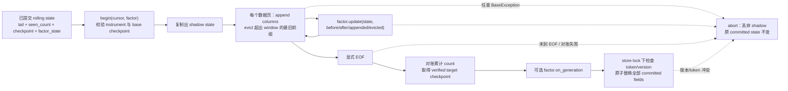

`begin()` 要求：

- cursor 的 instrument 与 Store 完全一致；
- cursor 的 `base_checkpoint` 等于 Store 当前 committed checkpoint；
- 没有另一笔 active transaction；
- factor 实现 `InstrumentTickRollingFactor.update()`；
- 若 factor 暴露 `factor_schema`，必须与 Store 固定 schema 相同。

每个数据页只修改 transaction 的 shadow：

- `appended` 是本页 column block；
- `before/after` 是页前后的 bounded window；
- `evicted` 是这次被挤出的最旧前缀；若单页本身大于 window，它还会包含
  本页 `appended` 中较早、未能留在 `after` 的那些行；
- `seen_count` 是该 instrument 从 origin 累计处理的 tick 数，不因 window
  eviction 减少；
- factor state 在事务开始、snapshot 和 commit 时做深复制，避免调用方通过
  可变引用绕过提交边界。

EOF 到达后，transaction 要求 target checkpoint 是 base 的合法 successor，
本轮分 source count 等于 target-local count 减 base-local count，且
`shadow_seen_count == target.total_instrument_tick_count`。可选
`factor.on_generation()` 即使本轮是零行 delta 也会调用，适合处理纯代际
逻辑。

`commit()` 在 Store 锁内同时替换：

- bounded wire tail；
- `seen_count`；
- verified target checkpoint；
- factor state；
- transaction version。

`factor_value` 随 `InstrumentTickRollingCommit` 返回，但不是
`InstrumentTickRollingStore` 内单独持久化的字段。应用如果还要把 factor
value 发布到数据库/消息系统，必须自行协调“外部 factor、checkpoint 和
rolling state”的持久化。简单地先发布 factor、再写 checkpoint，或反过来，
都存在进程在两步之间退出的窗口；实际系统应使用同一数据库事务、transactional
outbox，或带 checkpoint/generation 幂等键的发布协议。

任何 page/factor/EOF/commit 异常，包括非 `Exception` 的
`BaseException`，都会尝试 abort：释放 active token、丢弃 shadow，并在
cursor 尚未 EOF 时关闭 cursor/session。已经 committed 的 state 不变。

典型使用关系是：

```python
with client.open_instrument_tick_delta_session() as delta_session:
    cursor = delta_session.open_instrument(
        instrument_id,
        after=rolling_store.checkpoint,
    )
    commit = rolling_store.update(cursor, factor)

    persist_state_and_publish_idempotently(
        factor_value=commit.factor_value,
        checkpoint=commit.checkpoint.to_dict(),
        rolling_state=commit.state,
    )
```

上例的跨系统原子性和进程重启后的 Store 恢复由应用负责；库只保证当前
Python 进程内这次 rolling commit 的原子替换。

### 15.8 四条因子路径不能混用一致性声明

| 路径 | 输入 | 触发方式 | 一致性边界 |
| --- | --- | --- | --- |
| `latest_snapshot_factor.py` | per-instrument latest snapshot | polling | 单行稳定；可能跳过更新；非全市场同代 |
| `TickFactorRunner` | global ring 的连续 mixed tick | 行数/延迟 microbatch | cursor 连续；ring overrun 显式失败 |
| V2 rolling factor | generation-bound instrument delta columns | page update + EOF generation hook | verified checkpoint 后事务提交 |
| C++ `RealtimeFactorEngineV1` | 完整 Store generation | 每次 Pipeline cut | 全 Registry exact Store generation |

complete-history 使用对象模型，因为它同时承载 snapshot 与 tick 两类
CoreV2 payload；tick-delta 是 tick-only column-first 快路径，不是 history
API 的透明替换。benchmark-only
`RealtimeHistoryPageStageObserverV2` 只在显式安装时记录 history 页阶段耗时，
默认是 null，不进入 wire ABI，也不会给生产 history path 添加计时调用。

---

## 16. 正常停止、终局 generation 与状态机

### 16.1 生产正常停止

生产入口在信号或跨交易日边界触发时，健康路径调用
`StopAndPublishFinalGeneration`：

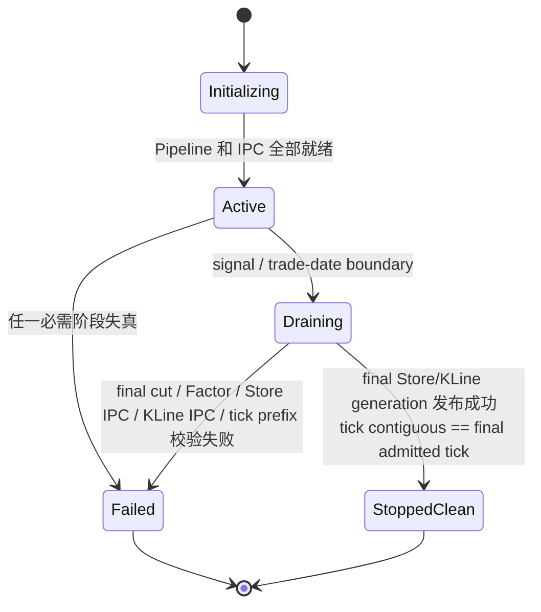

终局过程：

1. `stop_mutex + cut_mutex` 串行化停止和 cut；
2. 在 admission 锁下关闭 `accepting`，记录精确 cut monotonic time；
3. 关闭 callback gate；
4. 调用 SDK `Shutdown()`，等待 `active_callbacks == 0`；
5. 释放 Subscriber、Manager、factory；
6. decoder 仍在运行，使用已冻结计数执行最后一次 marker cut；
7. 等待 Store/KLine generation，发布最后 Factor；
8. 停止并排空 decoder 与 History；
9. 向 IPC 先发布最后 Store generation，再发布可选 KLine generation；
10. IPC 只有在 ring 的 highest 与 contiguous 前缀都等于 Pipeline 最终已接收
    tick sequence 时才进入 `stopped_clean`。

跨交易日回调不是数据损坏：它关闭 admission 且不推进任何 sequence，主线程随后发布旧交易日的完整最终前缀。

promotion 后的 online recovery 还多一层应用级闭合顺序。主线程先调用
`BeginCleanShutdownTailDrain(deadline)`，允许 tail governor 把 preview 后续的
non-accepting/stopped 解释为预期 quiesce；随后停止唯一 SDK owner 并发布
preview final generation，再调用 journal `StopAndFlush()`。recovery thread 必须
在绝对 deadline 前继续读取 durable suffix 直到显式 End；pressure 永久不下降
会以 `BACKPRESSURE_TIMEOUT` fail-close，避免 shutdown 的无界 join。join 后应用验证
`last_journal_serial == committed_serial == accepted_serial`，最后才发布 shadow
的 recovered final generation。该模式只放宽预期 lifecycle 状态；preview
fatal、非法 progress 或 trade-date boundary 仍会使 tail/session fail closed。
在线 governor 同时区分 CERTIFIED 的 data worker 与 control/accept thread：
worker-only recovery warmup 允许 control 尚未启动，但 `StartControl()` 之后的
异常 accept-loop 退出会使 promotion final gate 或永久 tail fail closed；该探针
只读 service 原子状态，不进入 FAST/CERTIFIED reader 数据路径。
普通 from-open 组合保持既有 FAST fail-open 策略：主循环仅以 atomic-only
control-state 低频记录 CERTIFIED accept-loop 降级，不停止 FAST，也不扫描
CERTIFIED wire header。control lifecycle 由单一 enum 线性化，promotion 的最终
确认使用同值 CAS，和并发的 terminal CAS 明确排序。online 的两个 recovered
accept loop 还共享一只单调原子 gate：gate=false 时允许线程完成启动但禁止
转移 descriptor；最后一次 release store(true) 是唯一外部暴露点。

### 16.2 `StopAndDrain` 的语义

`StopAndDrain` 只保证：

- 拒绝新 admission；
- SDK 回调已静止；
- decoder queue 与 History queue 被排空；
- worker 停止。

它不额外发布一个 final generation，也不停止、flush 或消费 online live
journal；journal 属于应用级 recovery 生命周期。生产健康退出应使用终局
generation API；`StopAndDrain` 更适合 fatal 清理或调用者明确不需要终局
不可变前缀的场景。

### 16.3 clean stop 后的读取窗口

IPC 的 `StoreGenerationQueriesAvailable()` 按启动模式判定：from-open/recovered
服务接受完整前缀的 `ACTIVE`、`DRAINING` 和 `STOPPED_CLEAN`；显式启用
process-start History 的 standalone partial 接受 `LIVE_PARTIAL`、`DRAINING`
和 `STOPPED_CLEAN`。两者都拒绝 `INITIALIZING`/`FAILED` 或 coverage lost，
online recovery preview 也不会得到 partial History 能力。因此在控制线程和
socket 尚未析构期间：

- draining 中已打开的 history/delta cursor 可继续读取它们已经固定的 generation；
- final Store generation 发布后，新 cursor/session 可以固定 final
  generation；
- `STOPPED_CLEAN` mapping 的 latest/ring/KLine 仍是可验证的静态最终状态。

这不是持久化服务承诺。进程退出或 `StopControl()` 关闭 socket/reader worker
后，新的连接当然不再可用；客户端应把 clean stop 看成“最终前缀完整”的状态
证明，而不是跨进程生命周期的存储。

---

## 17. 故障传播与 fail-closed 边界

| 故障 | 是否推进消息序列 | 影响范围 | 行为 |
| --- | --- | --- | --- |
| 不支持的消息类型 | 否 | 单消息 | 计入 ignored，继续 |
| 禁止的 combined tick | 否 | 全实时链 | 关闭 admission，fatal |
| 时钟读取失败、非法消息、pool/decoder queue 失败 | 否 | 全实时链 | fatal |
| UTC+8 日期跨日 | 否 | 当前 session | clean admission close，发布旧日终局 |
| decoder/schema/Registry/History submit 失败 | 已 admission | 全实时链 | fatal，停止各 queue |
| Store 配额、route、append 失败 | 已 admission | Store/latest/KLine/IPC | coverage lost + fatal |
| KLine 非法 trade 或 append 失败 | 已写 Store | KLine 及完整链 | coverage lost + fatal，不声称遗漏后的 KLine 完整 |
| handoff 回收失败 | 已写 Store | 完整链 | Store coverage lost + fatal |
| in-process latest 发布失败 | Store/KLine 已成功 | latest 及完整链 | latest coverage lost + fatal |
| IPC applied publish 失败 | Store/KLine/latest 已成功 | IPC 及完整链 | IPC failed，History 随后 fatal |
| generation watermark/barrier/build 失败 | 热记录可能已写 | generation/完整链 | 不发布不完整 generation，fatal |
| 已启用的 Factor 计算或校验失败 | Store N 已发布 | Factor/完整链 | 不发布部分 Factor，Pipeline fatal |
| IPC Store generation provenance/计数/代际校验失败 | Pipeline generation 已发布 | IPC/生产进程 | IPC coverage lost，主循环退出并标记 failed |
| IPC KLine generation 校验失败 | Store IPC generation 可能已发布 | IPC/生产进程 | 不切换错误 KLine 表，IPC failed |
| online journal capture queue/容量耗尽 | 否 | preview、recovered session | callback 不进入 preview admission；Pipeline/session fail closed |
| online journal write/sync 或 reader 完整性失败 | preview 消息序列可能已推进 | preview、recovered session | session fail closed；不得 promotion 或继续声明 recovered prefix |
| global tick cursor 落后超过 ring | 不适用 | 单 reader | explicit overrun，不静默跳号 |
| history/delta reader slot 或单页资源耗尽 | 不适用 | 单请求/连接 | explicit resource exhausted；不改写 Store |
| history V2 页投影/计数内部不一致 | 不适用 | IPC history 与连接 | 不发送伪完整 EOF；内部一致性错误会使服务 coverage lost |
| V2 checkpoint 不属于 pinned target | 不适用 | 当前 instrument open | explicit checkpoint mismatch；不伪造增量，session 可继续处理合法请求 |
| delta V2 服务端 query/projection/计数内部不一致 | 不适用 | 当前 delta session | 返回 internal failure 并关闭 session；与 complete-history 路径不同，该路径当前不自动置全局 coverage lost |
| V2 fd/page/跨页序列校验失败 | 不适用 | 当前 Python delta session | client fail closed、关闭 fd/socket；不提交 checkpoint |
| rolling page/factor/EOF/commit 失败 | 不适用 | 当前 Python transaction | abort shadow，committed rolling state 保持不变 |

### 17.1 fatal 的线性化

Pipeline `TripFatal` 的顺序是：

```text
accepting = false
    ↓
History::MarkFatal / coverage lost
    ↓
Pipeline fatal = true
    ↓
停止 decoder queue admission 并唤醒线程
```

先关 admission，防止 fatal 后仍有新消息得到顺序号。coverage 是 sticky；系统不会通过后续成功消息自动恢复“完整”声明。

---

## 18. 线程、所有权与同步矩阵

| 执行单元 | 数量 | 主要所有权 | 关键同步 |
| --- | ---: | --- | --- |
| 生产主/控制线程 | 1 | 生命周期、周期 cut、最终停止、IPC Store/KLine generation | `cut_mutex`、`stop_mutex` |
| SDK callback | SDK 串行配置 | admission 顺序号、OwnedIngress 入队 | `callback_gate`、`active_callbacks`、`admission_mutex` |
| source owner | 4 | source queue/dispatch；仅在无 farm outstanding 的 inline 区间持有 decoder 可变状态 | 每 source decoder SPSC；source-local activation；与 committer 的 release/acquire ownership handoff；marker 顺序 |
| stateless parse worker | `Wd`，首次 farm activation 才启动 | issue shard 中 task 的 schema parse 与 immutable identity | 每 worker × source SPSC issue shard；completion release publication |
| source ordered committer | 4，随 parse farm lazy-start | 按 source sequence finalize、History submission 与 task retirement | per-source completion/failure ring；committed/retired release frontier |
| online journal writer | online CSV recovery 时 1 个，否则 0 | journal fd、segment 与 durable frontier | 独立有界 queue/semaphore；应用显式 `StopAndFlush` |
| History worker | W | `instrument_id % W` 的 Store/KLine 热写 | 4 条输入 SPSC；无需 append 全局锁 |
| generation builder | 1 | pending generation 构建 | History generation mutex/condition variable |
| IPC control thread | 0/1 | UDS、heartbeat、tick contiguous 补推进 | poll/eventfd |
| IPC history reader worker | 启用 IPC 时最多 8 个 slot，按连接启停 | 一个 history cursor 或一个 delta session 固定的 Store generation、socket、临时页 | slot running flag、socket mutex、idle timeout；两种 Wire V2 查询共用配额 |
| Python latest/ring client | 任意 | 自己的长期只读 mapping、cursor 与 owned batch | client/native reader lock + seqcount retry |
| Python history/delta reader | 受服务端 slot 限制 | 独立 SOCK_SEQPACKET、收到的 page fd、累计 frontier | 每 cursor/session lock；page index + rotating token |
| Python rolling store | 通常每 instrument 一个 | bounded tick tail、checkpoint、factor state | 每 Store 至多一个 active transaction；token/version commit |

### 18.1 热路径避免的锁

- decoder queue：真 SPSC ring，条件变量只用于睡眠/唤醒；
- parallel issue/completion：预分配 task lease 与有界 ring；epoch 只负责唤醒，
  正确性由 release/acquire publication 和 exact source sequence 决定；
- History 路由：`source × worker` SPSC；
- Store append：唯一 worker 写 ownership，不使用全局 append mutex；
- KLine append：worker-local aggregator；
- latest：唯一 writer 的 release-store 指针；
- IPC slot：seqcount；tick ring 仅对模位置使用小粒度 slot lock。

### 18.2 必须保留的串行点

- `admission_mutex`：定义全局接收顺序和 cut 边界；
- `generation_mutex`：定义某一代的 begin/seal/slice/commit 状态机；
- factor publish mutex：禁止两个 generation 的完整因子交错发布；
- IPC Store/KLine publication guard：分别拒绝并发 publication；Store
  generation 以 atomic `shared_ptr` 替换，KLine 以完整双缓冲表切换；
- IPC V2 session lockstep：同一 socket 一次只有一个 instrument cursor，
  page index/read token 定义请求顺序；
- rolling Store lock + transaction token/version：只在 verified EOF 后一次
  提交所有 shadow 字段；
- stop/cut mutex：保证终局 cut 不和周期 cut 竞争。

这些串行点位于正确性边界，不应简单视为可删除的性能锁。

---

## 19. 核心不变量清单

### 19.1 数据完整性

1. 被接受消息的全局和 source 顺序稠密，无空洞。
2. SDK body 在回调返回前完成 owned copy。
3. 同一 instrument 只有一个 worker 写 Store/KLine/latest。
4. Store 是唯一完整历史事实源；其他都是投影。
5. enabled KLine 和 configured applied sink 必须成功，否则不再声明覆盖完整。
6. generation 发布前验证总记录数等于 watermark 前缀。
7. IPC Store generation 必须来自同一 Store session，代际恰好递增，且全局、
   分 source、分 instrument 计数全部可对账。
8. history/delta 只从 immutable generation 打开 cursor，不在 mutable Store 上做
   跨进程长扫描。

### 19.2 一致性

1. live latest：单行一致，不保证 batch 全市场一致。
2. Store generation：固定 watermark 的全市场完整前缀。
3. KLine generation：绑定 exact Store generation。
4. 启用时的 Factor generation：绑定 exact Store generation；禁用时 cut 的
   published 判定不要求 Factor handle。
5. IPC KLine：整表按 generation 原子切换。
6. IPC tick cursor：序列连续或显式 not-yet/overrun。
7. complete history：一个 cursor 固定一个 generation；记录覆盖完整不
   等于字段无损，也不等于从开盘覆盖。
8. V2 delta session：多个顺序 instrument cursor 固定同一 target
   generation；ingress/tick 全局严格递增、source sequence 在各自 lane 内
   严格递增，但都是稀疏子序列，不要求连续。
9. V2 checkpoint：只有显式 EOF 和总数/分 source 数对账后才可用。
10. rolling：数据页和 factor 只改 shadow，EOF 后才原子替换 committed state。

### 19.3 生命周期

1. SDK 最后启动、最先 quiesce。
2. 停止时先关 callback gate，再等待 active callback 清零。
3. fatal 后 admission 不可恢复。
4. clean stop 只有在 final tick 连续前缀完整时才对 IPC 宣称 `stopped_clean`。
5. Python client 固定 session，不静默跨 `run_id/session_epoch`。
6. generation/cursor 的共享所有权保证 Store segment 在读取期间不销毁。
7. history/delta page fd 在所有退出路径关闭；delta 提前关闭 cursor 会关闭整个
   lockstep session。
8. rolling abort 幂等并保留上一次 committed checkpoint/state。

---

## 20. 执行逻辑伪代码

### 20.1 逐条热路径

```cpp
OnSdkMessage(message):
    enter_active_callback()

    if live_ingress_capture_sink != null:
        inspection = inspect_supported_recovery_tuple(message)
        if inspection is supported_recovery_tuple:
            if !live_ingress_capture_sink.capture_independent_copy(inspection):
                trip_fatal_without_preview_admission
                leave_active_callback()
                return

    lock(admission_mutex)

    if fatal || !accepting:
        reject

    inspection = inspect_once(message)
    if unsupported:
        ignore_without_sequence_advance
    if forbidden_or_invalid:
        trip_fatal

    validate_clock_and_trade_date()
    metadata = candidate(global + 1, source + 1, optional_tick + 1)
    owned = ingress_pool.copy(inspection, metadata)

    if !decoder_queue[source].try_push(move(owned)):
        trip_fatal_without_sequence_advance

    commit_sequences(metadata)
    unlock(admission_mutex)
    leave_active_callback()

SourceOwnerLoop(source):
    for command in decoder_queue[source]:
        if command is marker:
            wait_until(committed_frontier_covers_last_farm_dispatch &&
                       farm_outstanding == 0)
            history.seal_source(source, generation)
        else if Wd == 0:
            event = decoder[source].decode(command.message)
            route = registry.resolve(event)
            history.try_submit(source, route, move(event))
        else:
            inline = false
            if idle_inline_enabled && activation_depth != 0:
                if !farm_interval_active:
                    inline = pop_observed_remaining_ring_depth <
                             effective_threshold
                else if farm_outstanding == 0 &&
                        pop_observed_remaining_ring_depth <
                            effective_threshold:
                    inline = true
            if inline:
                event = decoder[source].decode(command.message)
                route = registry.resolve(event)
                history.try_submit(source, route, move(event))
            else:
                worker = (source_sequence - 1 + source) % Wd
                issue[worker][source].push(preallocated_lease(command))

ParallelParseWorker(worker):
    fairly_poll_four_source_issue_shards()
    task.decoded = decoder[source].decode_stateless(task.message)
    apply_daily_identity_and_merge_market_notices(task.decoded)
    release_callback_owned_buffer(task)
    completion[source].publish_exact(task.source_sequence, task)

ParallelCommitLoop(source):
    take_at_most_16_already_ready_contiguous_tasks_without_waiting()
    if ready_count == 1:
        decoder[source].finalize_in_source_order(task.decoded)
        history.try_submit_scalar_immediately(task.decoded)
    else:
        batch = history.begin_submission_batch(source)
        for task in source_sequence_order:
            decoder[source].finalize_in_source_order(task.decoded)
            batch.try_submit_immediately(task.decoded)
        batch.finish_before_any_task_retirement()
    publish_committed_then_release_and_retire_each_task()

WorkerLoop(worker):
    fairly_poll_four_source_queues()
    if record:
        store_record = store.append(move(decoded_event))
        optional_enabled_kline.append_if_trade(store_record)
        handoff_pool.release(decoded_slot)
        latest.publish(store_record)
        optional_applied_sink.publish(store_record)
    if fence:
        park_source()
        if all_four_sources_parked_same_generation:
            report(store.capture_worker(), kline.capture())
            unpark_all_sources()
```

### 20.2 generation 路径

```cpp
CutAndPublish():
    lock(cut_mutex)
    lock(admission_mutex)

    watermark = {
        generation + 1,
        global_sequence + 1,
        each_source_sequence + 1,
        run_id, trade_date, registry_identity, monotonic_cut
    }

    history.begin_generation(watermark)
    for source in [0..3]:
        decoder_queue[source].push_until(marker(generation))

    unlock(admission_mutex)

    store_gen, kline_gen = history.wait_for_generation(generation)
    if factor_generation_enabled:
        factor_gen = factor.calculate_and_publish(store_gen)
    publish_pipeline_generation(generation)

    if ipc_enabled:
        require(ipc.publish_store_generation(exact(store_gen)))
        if kline_enabled:
            require(ipc.publish_kline_generation(exact(kline_gen)))

    return exact(store_gen, kline_gen, factor_gen)
```

### 20.3 complete-history V2

```python
OpenHistory(instrument_id, requested_rows):
    require(store_generation_queries_available_for_startup_mode)
    generation = atomic_acquire(latest_ipc_store_generation)
    require(generation is not None)
    summary = generation.find(instrument_id)
    cursor = generation.open_instrument_cursor(
        ingress=[1, UINT64_MAX),
        direction=OLDEST_FIRST,
        maximum_records=UINT64_MAX,
    )
    token = unpredictable_nonzero_u64()
    return generation_info(summary), token

ReadHistory(expected_page, token):
    require(expected_page == server_page_index)
    require(token == server_current_token)

    if cursor.done:
        require(emitted_total == generation_info.instrument_record_count)
        require(emitted_by_source ==
                generation_info.instrument_source_record_counts)
        return explicit_zero_row_eof_without_fd

    records = cursor.read_batch(page_capacity)
    page = project_descriptors_and_dense_payloads(records)
    validate_page_counts_and_sequences(page)
    page_fd = seal_and_reopen_read_only(page)
    next_token = unpredictable_u64_excluding(token)
    send(page_fd, next_token)
    commit_server_frontiers_only_after_send_success()
```

### 20.4 instrument tick-delta V2 与 rolling

```python
OpenDeltaSession():
    target = atomic_acquire(latest_ipc_store_generation)
    require(target is not None and history_healthy)
    session_token = unpredictable_nonzero_u64()
    return exact_generation_endpoint(target), session_token

OpenInstrumentDelta(instrument_id, after_checkpoint):
    require(no_active_cursor)
    if after_checkpoint is None:
        base_kind = ORIGIN
        ingress_begin = 1
    else:
        validate_checkpoint_is_predecessor(after_checkpoint, pinned_target)
        ingress_begin = after_checkpoint.ingress_sequence_exclusive

    cursor = pinned_target.open_instrument_tick_delta_cursor(
        instrument_id, ingress_begin
    )
    metadata = reconcile_base_target_delta_counts(
        cursor.summary, after_checkpoint, pinned_target
    )
    return cursor, metadata, initial_read_token

ConsumeAndCommitRolling(cursor, rolling_store, factor):
    with rolling_store.begin(cursor, factor) as tx:
        for page in cursor.pages():
            # 数据页更新 shadow/factor；EOF 页负责最终对账与 generation hook
            tx.apply_page(page)
        # commit() 内部要求 cursor 已到 EOF，并原子替换 Store committed fields
        return tx.commit()
```

---

## 21. 当前工作树的组合能力

本文不再用一个已经过时的 merge-base/提交列表描述“当前分支”。当前工作树把
以下能力组合在同一个生产入口中：

1. ordinary from-open：不创建 live journal，直接运行 SDK-owner Pipeline，
   并发布从开盘覆盖的 FAST、Store generation、KLine/Factor，以及默认的
   CERTIFIED canonical Tick/Event；
2. CSV online recovery：required live capture 维持 queryable latest-only
   preview，SDK-less shadow 从 CSV 与 durable journal 闭合 handoff，完成
   generation/CERTIFIED Tick+Event barrier 后发布独立 recovered session；
3. standalone partial：不宣称 from-open，周期发布 process-start Store
   generation、单标的 complete-history 与 tick-delta；默认 CERTIFIED worker
   在 capture observation 层按 per-channel native sequence 生成 process-start
   canonical Tick/Event，FAST callback-admission 顺序不变。可选发布自然交易时间
   窗口的 process-start partial latest KLine，但不开放 KLine history 或 full-day
   声明；`factor_generation_enabled=false`，不创建或调用 generation Factor
   engine；
4. Wire V2 查询：latest/ring、complete-history V2 和 generation-bound
   tick-delta V2 使用同一 daily-catalog/session identity，并以显式
   unavailable、EOF、overrun 或 checkpoint mismatch fail closed。

当前完整形态是：

```text
SDK
→ owned ingress
→ source owner inline decoder
  或 bounded issue → stateless parse farm → source-ordered finalize
→ instrument worker
→ Store
→ KLine
→ in-process latest
→ optional IPC latest/tick ring

online recovery SDK-owner 特有前置路径：
supported callback → required live-journal Capture → preview admission

并行控制路径：
watermark/fence
→ Store generation
→ KLine generation
→ optional Factor generation（standalone partial 显式禁用）
→ optional IPC Store generation
→ optional IPC KLine generation

跨进程读取路径：
registry mapping → exact symbol lookup
latest mapping  → latest snapshot/tick/KLine
tick ring       → global contiguous cursor / column block
Store generation → complete-history V2
Store generation → checkpoint-bound instrument tick-delta V2
V2 pages → transactional rolling/factor state
```

---

## 22. 关键代码导航

| 关注点 | 代码位置 |
| --- | --- |
| 生产装配、周期/终局 cut、IPC Store→KLine 发布 | [`apps/mdl_production_main.cpp`](../apps/mdl_production_main.cpp) |
| Pipeline 对外配置与返回的 exact generation handles | [`include/l2flow/runtime/realtime_pipeline_v1.h`](../include/l2flow/runtime/realtime_pipeline_v1.h) |
| Pipeline 初始化、SDK 回调/admission、cut、quiesce | [`src/runtime/realtime_pipeline_v1.cpp`](../src/runtime/realtime_pipeline_v1.cpp) |
| live journal capture、durable frontier 与 segment reader | [`include/l2flow/recovery/live_journal_v1.h`](../include/l2flow/recovery/live_journal_v1.h)、[`src/recovery/live_journal_v1.cpp`](../src/recovery/live_journal_v1.cpp) |
| CSV replay 与 online handoff/governor | [`src/recovery/mdl_csv_startup_replay_v1.cpp`](../src/recovery/mdl_csv_startup_replay_v1.cpp)、[`src/recovery/online_recovery_v1.cpp`](../src/recovery/online_recovery_v1.cpp) |
| owned ingress 分类、复制与 pool | [`src/realtime/owned_ingress_message_v1.cpp`](../src/realtime/owned_ingress_message_v1.cpp) |
| decoder schema 分发与 Registry 解析 | [`src/market/market_decoder.cpp`](../src/market/market_decoder.cpp) |
| History 接收、4×W queue、worker apply、fence、builder/commit | [`src/market/realtime_history_v1.cpp`](../src/market/realtime_history_v1.cpp) |
| Store public cursor/generation/tick-delta API | [`include/l2flow/market/intraday_instrument_store_v1.h`](../include/l2flow/market/intraday_instrument_store_v1.h) |
| Store append、immutable generation、merged history/delta reader | [`src/market/intraday_instrument_store_v1.cpp`](../src/market/intraday_instrument_store_v1.cpp) |
| KLine trade 投影与聚合 | [`src/market/kline_aggregator_v1.cpp`](../src/market/kline_aggregator_v1.cpp) |
| latest 原子发布与读取 | [`src/market/realtime_latest_read_model_v1.cpp`](../src/market/realtime_latest_read_model_v1.cpp) |
| C++ Factor 计算和原子提交 | [`src/factor/realtime_factor_engine_v1.cpp`](../src/factor/realtime_factor_engine_v1.cpp) |
| latest/ring 固定 Wire ABI（2.4） | [`include/l2flow/ipc/realtime_wire_v2.h`](../include/l2flow/ipc/realtime_wire_v2.h) |
| complete-history V2 控制面与页 ABI | [`include/l2flow/ipc/realtime_history_wire_v2.h`](../include/l2flow/ipc/realtime_history_wire_v2.h) |
| instrument tick-delta V2 endpoint/checkpoint/页 ABI | [`include/l2flow/ipc/realtime_instrument_tick_delta_wire_v2.h`](../include/l2flow/ipc/realtime_instrument_tick_delta_wire_v2.h) |
| IPC 服务配置、Store/KLine generation 发布接口 | [`include/l2flow/ipc/realtime_shared_service_v2.h`](../include/l2flow/ipc/realtime_shared_service_v2.h) |
| IPC 单条/ring、Store generation 校验、history/delta worker 与 memfd 页构建 | [`src/ipc/realtime_shared_service_v2.cpp`](../src/ipc/realtime_shared_service_v2.cpp) |
| native reader 与 V2 全页 validator C ABI | [`include/l2flow/ipc/realtime_shm_reader_c_v2.h`](../include/l2flow/ipc/realtime_shm_reader_c_v2.h) |
| native reader、symbol lookup、ring column block、V2 validator 实现 | [`src/ipc/realtime_shm_reader_c_v2.cpp`](../src/ipc/realtime_shm_reader_c_v2.cpp) |
| Python session/latest/ring/history/delta 入口 | [`python/l2flow_realtime/client.py`](../python/l2flow_realtime/client.py) |
| Python complete-history V2 cursor/页校验 | [`python/l2flow_realtime/history.py`](../python/l2flow_realtime/history.py) |
| Python instrument tick-delta V2 session/cursor | [`python/l2flow_realtime/instrument_delta.py`](../python/l2flow_realtime/instrument_delta.py) |
| Python 严格 checkpoint 模型 | [`python/l2flow_realtime/checkpoint.py`](../python/l2flow_realtime/checkpoint.py) |
| Python count-window rolling/factor transaction | [`python/l2flow_realtime/rolling.py`](../python/l2flow_realtime/rolling.py) |
| Python fixed tick block / NumPy structured view / Arrow/Polars | [`python/l2flow_realtime/batch.py`](../python/l2flow_realtime/batch.py) |
| Python native ctypes wrapper 与 fd ownership | [`python/l2flow_realtime/native.py`](../python/l2flow_realtime/native.py)、[`python/l2flow_realtime/_fd_owner.py`](../python/l2flow_realtime/_fd_owner.py) |
| Python microbatch factor runner | [`python/l2flow_realtime/factor.py`](../python/l2flow_realtime/factor.py) |
| Polars latest snapshot 示例 | [`python/examples/latest_snapshot_factor.py`](../python/examples/latest_snapshot_factor.py) |
| online recovery FAST latency 验证边界 | [`online-recovery-fast-latency-validation-20260801.md`](online-recovery-fast-latency-validation-20260801.md) |

---

## 23. 阅读和维护建议

以后修改这条链时，建议按以下顺序做影响分析：

1. 修改 admission：检查三套 sequence 是否仍然只在 decoder queue 成功后提交。
2. 修改路由/线程：检查同一 instrument 的唯一 writer 假设是否仍成立。
3. 修改 worker 投影：检查 `Store → KLine → handoff → latest → sink` 顺序和故障传播。
4. 修改 generation：检查 marker 是否仍在 admission 锁内，四 source fence 是否覆盖全部 worker。
5. 新增对外读模型：明确它是逐条 latest、连续 stream 还是 generation，不混用一致性声明。
6. 修改 IPC ring：重新计算最坏内部重排上界，并保留 explicit overrun。
7. 修改 Store generation 发布：同时检查 Pipeline 与 IPC 两层 identity、provenance、全局/分路/分标的计数，以及空增量 generation。
8. 修改 history V2 页：保持 mixed descriptor 与 dense payload 索引一致、长字段 omission 可区分，并以零行无 fd 的显式 EOF 完成总数对账。
9. 修改 delta V2 页或 checkpoint：同时更新 248-byte endpoint、312-byte checkpoint、720-byte metadata、native validator 和 Python parser，保留 origin 与半开边界语义。
10. 修改 NumPy 快路径：明确哪一段发生 copy；不能把 client-owned `bytes` 上的 view 描述成 server memfd 端到端零拷贝。
11. 修改 rolling/factor：保证数据页只写 shadow，只有显式 EOF 后才能提交 checkpoint；外部发布与持久化仍需应用级事务或幂等协议。
12. 修改停止流程：验证 SDK callback quiesce、final cut、Store→KLine 的终局 IPC 发布顺序和 `stopped_clean` 的 tick 前缀证明。

只要上述不变量保持，性能优化可以局部进行；一旦改变其中任意一个所有权或线性化点，就需要同时重审 Store 完整性、generation 水位线以及 IPC/Python 对外语义。
