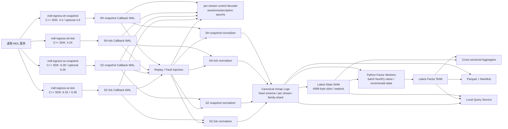

# 通联 MDL C++ 全市场 L2 实时行情与 Python 因子计算平台设计

> **文档状态**：实现设计基线（Design Baseline）  
> **版本**：V2.1（Phase 2 Callback WAL 规范冻结候选）  
> **日期**：2026-07-18  
> **目标平台**：Linux x86-64，通联 MDL C++ SDK 2.13.234，C++20，Python 3.11  
> **首期消息范围**：上交所 4.4、4.24；深交所 6.28、6.33、6.36；可选 4.6、6.29 指数快照  
> **核心技术路线**：C++ SDK 接入 + SDK Callback WAL + C++ 安全解码/质量控制 + mmap Canonical Log + 共享内存 Latest State + Python 批量因子运行时 + Parquet 固化

---

## 0. 最终技术决策

生产主链路确定为：

> **通联 C++ SDK 2.13.234 负责连接、订阅、回调捕获、原始记录、协议结构解码、序列检查、规范化、最新状态和数据质量；Python 只通过稳定的批量接口读取 C++ 产出的 Canonical 数据并进行增量因子计算。C++ 不按事件回调 Python，Python 不直接接触供应商消息对象。**

系统由四条相互隔离、可独立恢复的接入流组成：

```text
SH snapshot: 4.4  [+ optional 4.6]
SH tick:     4.24
SZ snapshot: 6.28 [+ optional 6.29]
SZ tick:     6.33 + 6.36  （必须位于同一 Subscriber/TCP 连接）
```

最终数据链路为：

```text
通联 MDL
  -> C++ Subscriber callback
  -> 有界预分配字节环
  -> SDK Callback WAL（全部 API/SYS/行情 callback）
  -> C++ control decoder + market normalizer
  -> Canonical mmap Log（固定结构、分片、单 writer）
  -> Latest State SHM / Python Factor Runtime / Parquet
```

本设计的强制原则如下：

1. **SDK Callback WAL 是接入层事实源。** 它保存回调得到的 23 字节 `MDLMessageHead` 和完整 SDK 解码后 body，不声称保存网络帧、压缩帧或 Merge 容器。
2. **先完整追加，再向下游发布。** Normalizer 只读取
   `append_global_wal_pos` 以内的完整 Raw 记录；持久化 checkpoint 只提交到
   `raw_durable_global_wal_pos` 以内。
3. **callback 不做业务解码。** API、SYS、SHL2、SZL2 callback 全部进入同一捕获函数；登录、订阅、断线等控制语义由 WAL 之后的 control decoder 解析。
4. **回调重入先检测、后触碰 SPSC。** 同一 Subscriber 一旦出现并发 callback，立即显式失败，不在错误的单生产者假设下继续运行。
5. **快照是当前盘口权威源。** 4.4/6.28 更新当前十档和最优档前 50 笔队列；4.24/6.33/6.36 用于逐笔因子和可选重建，不能覆盖权威快照。
6. **不使用浮点作为事实值。** 价格、金额和带小数数量保留原始定点整数、scale、validity，并精确规范到 `1e-6` 元或原生数量单位。
7. **交易所序列不因重连而重置。** 连接会话、订阅版本、通联 `SequenceID`、上交所 `BizIndex`、深交所 `ApplSeqNum` 分别建模。
8. **跨连接不存在隐含总序。** 四条 TCP 流只可按显式的接收时间安全前沿或业务定义进行组合；禁止简单读取“当前最新快照”后冒充历史 as-of。
9. **Python 使用批量、只读、可重放接口。** 语言边界为 mmap/SHM + C ABI/pybind11 + NumPy view，不使用逐事件函数调用、pickle 或 Python 队列承载全市场逐笔。
10. **不静默丢数。** 环溢出、磁盘错误、CRC 冲突、业务序列 gap、schema 未知必须 fail-stop 或显式降级，并将质量位传播到因子输出。
11. **实时可领先持久化，但不可伪装。** Latest State 和 latest factor 可基于 append-visible 数据；持久结果必须通过多输入 durability barrier。
12. **首版不启用缺少正式业务规范的深市 6.53。** 即使 SDK 头文件包含 `CombinedTick`，也必须等正式规范、并行对账和变更评审完成后再评估。

---

## 1. 核验范围、供应商基线与事实边界

### 1.1 已核验材料

| 材料 | 核验内容 | SHA-256 / 标识 |
|---|---|---|
| `mdl_sdk_2_13_234.tar.gz` | `mdl_api.h`、`mdl_api_types.h`、沪深消息头文件、C++ demo、Linux 预编译库 | `23830887091d35875c653d97a4874f27f04b4cc36a69de37a952510d0701cc71` |
| reference archive member `libmdl_api.so` | ELF/动态依赖/导出符号/版本创建行为 | 历史 hash `09bd58282d6f758bfb737b628f5c51daa591a60f31d4081992679fcbc2e2cfc5`（诊断证据，不是 schema v2 的唯一接受身份） |
| `通联_沪深L2行情数据结构展示V4.0(1).pdf` | 4.4、4.24、6.28、6.33、6.36 字段、单位、业务序列和交易阶段语义 | `0fcfc4eff6a5a74f6b6878ed79e604073aa6809f7fc331dd78d07271cd27db3e` |
| `全市场数据存储框架设计.txt` | WAL、内存热数据、消费者和历史固化的前序需求 | `d110a1ade8967824f1127fedef435a2926968b8570e44755f888eb885acc3582` |

Linux 参考动态库证据：

```text
ELF:        x86-64 shared object
Build ID:   ed9238d7788c4685f8d45e3b8e2ff1d0b6f0b1e7
SONAME:     未设置
MDL_VERSION: 213234
```

上述 library hash 和 Build ID 指参考 tar archive 内的 member，只用于诊断和
历史验收，不代表相同 Build ID 与相同 hash 等价。Schema v2 固定 SDK header
archive hash、`MDL_VERSION`、依赖集合、imported symbol-version 集合、协议常量
与结构 ABI；候选 `libmdl_api.so` 可以是不同的 2.13.234 构建，但必须先被限制
为不超过 1 GiB 的 sealed immutable snapshot，并通过 ELF、编译期 ABI、错误版本
factory、正确版本 create/shutdown/release 的全部兼容性检查。

启动时必须再次核验归档 hash、候选动态库兼容性、`MDL_VERSION`、结构大小、
schema hash 和构建 hash；任一不一致都拒绝进入生产连接。

### 1.2 可见源码与不可见实现

供应商包中可直接审计的内容包括：

- C++ API 声明和内联函数；
- packed 消息结构；
- C++ 手动/自动订阅 demo；
- 消息访问 helper；
- 预编译动态库的 ELF 元数据、符号和有限反汇编结果。

包中不包含 `libmdl_api.so` 内部实现源码。因此以下行为不得写成供应商已保证事实：

- TCP 内部接收队列和缓存长度；
- MergeMessage 内部拆包调度；
- callback 的精确线程模型；
- 重连过程中的缓存、补发或丢弃；
- `MDLMessage` 对象生命周期和 `_Copy()` 的分配策略；
- `SetReadBufferSize(int)` 参数的单位与上限；
- 服务器选择、主备切换时的内部序列语义。

对不可见实现，本设计采用“最小依赖 + 启动 preflight + 组件压测 + 断线/重连/并发验收”的策略，而不是推测。

### 1.3 已确认的 C++ API 事实

`mdl_api.h` 中与本项目相关的接口如下：

```cpp
IOManagerPtr CreateIOManager(int work_threads, int io_threads = 1);

SubscriberPtr IOManager::CreateSubscriber(
    MessageHandlerBase* handler,
    bool multithread_callback = false);

void Subscriber::AddSubscription(
    uint8_t service_id,
    uint16_t service_version,
    uint16_t message_id);

void Subscriber::AddSubscriptionByFieldValues(...);
void Subscriber::DelSubscription(...);
void Subscriber::ClearSubscriptions();
void Subscriber::ReSubscribe();
const char* Subscriber::GetSubscription();

void Subscriber::SetServerAddress(const char*);
void Subscriber::SetUserName(const char*);
void Subscriber::SetPassword(const char*);
void Subscriber::SetHeartbeatInterval(uint32_t);
void Subscriber::SetHeartbeatTimeout(uint32_t);
void Subscriber::SetMessageEncoding(MDLMessageEncoding);
void Subscriber::EnableMergeMessage(bool);
void Subscriber::SetReadBufferSize(int);
void Subscriber::SetSendMacAuth(bool);
void Subscriber::EnableServerSelect(bool);
const char* Subscriber::Connect();

MDLMessageHead* MDLMessage::GetHead() const;
char* MDLMessage::GetBody() const;
uint32_t MDLMessage::GetBodySize() const;
RefCountedPtrT<MDLMessage> MDLMessage::Copy() const;
```

关键实现约束：

- `CreateIOManager()` 内联调用 `DllCreateIOManager(MDL_VERSION, work_threads, io_threads)`；版本不兼容时可能返回空指针，必须检查。
- `GetBodySize()` 内联执行 `MessageSize - HeadSize`，在调用前必须先自行确认 `MessageSize >= HeadSize`，否则存在无符号下溢风险。
- `MessageHandler::OnMessage()` 按 `ServiceID` 分派 API、SYS、SHL2、SZL2 等 callback；本项目覆盖 API/SYS 和目标行情 callback。
- 头文件的 `MDLListT<T>::operator[]` 只根据 `Length` 判断索引，不根据整个 body 长度验证 offset；生产解码器必须使用自有 checked view。
- demo 明确提示一个 `IOManager` 可创建多个 Subscriber，而每个 Subscriber 建立一个连接；高流量逐笔适合拆分连接，不同端口需要独立 Subscriber，且不同 Subscriber 不应重复订阅同一消息号。

### 1.4 ABI 与结构基线

`mdl_api_types.h` 使用 `#pragma pack(1)`。本地编译核验的固定结构大小如下：

| 类型 | 大小 |
|---|---:|
| `MDLMessageHead` | 23 bytes |
| `MDLAnsiString` / `MDLUTF8String` | 6 bytes |
| `SHL2MarketData` 固定部分 | 248 bytes |
| `SHL2MarketData::BidLevelsItem` | 28 bytes |
| `SHL2MarketData::NOrdersItem` | 16 bytes |
| `NGTSTick` | 70 bytes |
| `Snapshot300111_v2` 固定部分 | 224 bytes |
| `Snapshot300111_v2::BidPriceLevelItem` | 28 bytes |
| `Snapshot300111_v2::OrdersItem` | 8 bytes |
| `Order300192_v2` | 58 bytes |
| `Transaction300191_v2` | 70 bytes |
| `CombinedTick` | 70 bytes |

这些数值只用于当前供应商版本的 ABI preflight 和固定部分下界校验。动态字符串和列表仍须逐字段验证，不能因为 `sizeof` 正确就直接信任 offset。

### 1.5 首期业务数据范围

| 市场 | 消息 | 首期用途 | 覆盖边界 |
|---|---|---|---|
| SH | 4.4 `SHL2MarketData` | 当前快照、十档、最优档队列 | 文档范围不含债券 |
| SH | 4.24 `NGTSTick` | 合并逐笔、订单流因子 | 竞价逐笔；盘后固价阶段不发布 |
| SZ | 6.28 `Snapshot300111_v2` | 当前快照、十档、最优档队列 | 含可转债，不含其他债券 |
| SZ | 6.33 `Order300192_v2` | 逐笔委托 | 含可转债，不含其他债券 |
| SZ | 6.36 `Transaction300191_v2` | 成交与撤单 | 含可转债，不含其他债券 |
| SH/SZ | 4.6/6.29 | 可选指数快照 | 独立启用、独立验收 |

首期不宣称覆盖上交所债券 L2，也不宣称覆盖深交所除可转债外的其他债券。资产覆盖必须进入订阅清单、接口文档和验收报告。

---
## 2. 目标、非目标与初始 SLO

### 2.1 功能目标

系统必须支持：

1. 沪深全市场核心 L2 实时接入；
2. 原始消息逐条可审计、可校验、可重放；
3. 通联序列和交易所业务序列的 gap/duplicate/conflict 检测；
4. 当前快照、十档盘口、档位笔数和最优档前 50 笔队列查询；
5. 逐笔委托、成交、撤单和状态事件消费；
6. 现有 Python 因子的低延迟增量计算；
7. 多个独立 consumer group，不相互阻塞；
8. 因子进程 crash 后从 checkpoint 确定性恢复；
9. 历史 canonical 数据和因子数据定期固化为 Parquet；
10. 完整日按 1×、2× 或更高速率重放；
11. 每个对外值返回 as-of、age、source sequence 和 quality flags；
12. 网络中断、进程崩溃、部分写、重复、磁盘压力时不静默丢数。

### 2.2 首期明确非目标

首期不要求：

- 仅靠逐笔流精确重建所有阶段的完整订单簿；
- 使用 6.53 替代 6.33/6.36；
- 把全部 Python 因子改写为 C++；
- 在本机热路径引入 Kafka、Redis Streams 或远程 RPC；
- 跨机 exactly-once；
- 单机硬件彻底损毁时的 RPO=0；
- 在没有真实全日样本的情况下承诺具体峰值吞吐。

### 2.3 初始工程 SLO

以下是实现验收目标，不是供应商性能保证。最终数值必须由目标服务器和真实全日 Raw WAL 校准。

| 指标 | 初始目标 |
|---|---:|
| C++ callback 内耗时 | p99 ≤ 50 μs，p99.9 ≤ 200 μs |
| callback 到 Raw WAL `append_global_wal_pos` 可见 | p99 ≤ 500 μs |
| callback 到 canonical publish | p99 ≤ 2 ms，p99.9 ≤ 10 ms |
| canonical publish 到 Python factor worker 可见 | p99 ≤ 2 ms |
| callback 到轻量事件因子最新值 | p99 ≤ 10 ms，复杂因子单独定义 |
| 本机 Latest State 共享内存读 | p99 ≤ 50 μs |
| 本机批量查询 1000 只证券 | p99 ≤ 2 ms |
| 完整日重放 | 至少 2× 持续全日；目标 5× |
| 稳态接入队列占用 | < 30% |
| 2× 峰值持续 30 分钟 | 队列 < 70%，无丢失、无持续 lag |
| 数据静默丢失 | 0 |
| 进程 crash 后 Raw WAL 恢复目标 | 对仅终止进程、内核/page cache/挂载与设备继续健康且无延迟写回错误的故障域，trailer 完整且已由 **Raw append cursor** release-publish 的 record 必须可恢复；callback 仅发布到 ring 的 entry 不在此保证内，这也不是主机断电或设备持久性保证 |
| 主机突然断电 Raw WAL RPO | 以最后有效 durable marker 为恢复边界；可丢失时间窗口按目标机 durability lag 实测，10 ms 仅为初始 sync trigger |
| 冷启动恢复 | checkpoint + replay 后 hash 与全量重放一致 |

### 2.4 容量计算方法

容量不使用拍脑袋的固定事件率，必须从真实样本测量。

```text
Raw 日容量
= 当日记录数 × (平均 vendor head + 平均 body + Raw 记录开销)
  × 副本系数 × 1.20

接入队列容量
= p99.99 峰值字节率 × 可容忍写盘停顿秒数 × 1.50

Canonical 热容量
= 平均 canonical 字节率 × 热保留秒数 × 1.25

因子状态容量
= 证券数 × 每证券每因子状态字节 × 因子数 × 1.20
```

队列必须按**字节**而不是仅按记录数限制，因为快照带动态列表，记录大小不恒定。

---

## 3. 总体架构与核心数据流



### 3.1 三层事实模型

系统明确区分三层数据：

| 层 | 内容 | 是否可重建 | 主要用途 |
|---|---|---:|---|
| SDK Callback WAL | 完整 callback header/body、接收时钟、流内顺序 | 否，唯一接入事实 | 审计、重放、重新解码 |
| Canonical Log | 已校验、已规范化、固定结构事件 | 是，从 Raw 重建 | 多消费者、因子、历史固化 |
| Latest/Factor State | 当前状态与滚动状态 | 是，从 Canonical/Raw 重建 | 低延迟随机读和策略消费 |

Raw 层不做业务去重；它保存供应商实际交付事实。Canonical 层才根据业务键处理精确重复，并产生质量事件。

### 3.2 数据平面与控制平面

#### 数据平面

```text
callback -> byte ring -> Raw writer -> Raw reader/decoder
         -> sequence guard -> normalizer -> Canonical writer
         -> State writer / Factor reader / Parquet sink
```

数据平面不能依赖远程配置中心、数据库或查询服务存活。监控异常不应阻塞接入；查询过载必须被隔离和限流。

#### 控制平面

```text
SDK/hash/ABI preflight
subscription manifest
server/credential binding
session/subscription epoch reconstruction
schema/registry/run manifest
process health and cutover control
checkpoint and retention catalog
```

控制平面中的任何可变配置都必须有版本和 hash。交易时段内禁止无审计地动态改变核心订阅集合。

### 3.3 为什么首版使用 mmap Canonical Log

Canonical Log 首版采用 append-only 文件 + Linux page cache + mmap，而不是仅使用易覆盖的循环共享内存：

1. 每个 consumer 拥有独立 cursor，慢消费者不会阻塞 writer；
2. 进程重启后可直接从 segment/cursor 追赶；
3. 封闭 segment 不可变，便于 hash、对账、fuzz 和调试；
4. Python 可映射固定 dtype，避免序列化；
5. 数据可由 Raw 重建，Canonical 不需要每批同步落盘；
6. 1 TB 级内存可通过 page cache 保留大量热段；
7. 首版不需要实现复杂的跨进程 ring 覆盖、租约和消费者回收协议。

若真实压测显示 canonical→factor 尾延迟不足，可增加 `/dev/shm` fast lane；fast lane 只能是优化路径，Raw 和 mmap Canonical 仍是恢复路径。

### 3.4 当前盘口与逐笔流的权威边界

```text
Current Book:
  SH -> 4.4 full snapshot
  SZ -> 6.28 full snapshot

Tick Features:
  SH -> 4.24
  SZ -> 6.33 + 6.36
```

Latest State 中的十档、档位笔数和前 50 笔数量队列只由完整快照原子更新。逐笔流可以维护：

- 订单流统计；
- 成交方向和撤单率；
- 可选 reconstructed book；
- 逐笔质量状态。

逐笔重建结果不得覆盖权威快照。逐笔 gap 后，快照可继续提供当前十档，但订单级重建必须保持 `TICK_RECON_INVALID`，直到按其自身恢复协议重新建立可信状态。

---

## 4. 接入进程、连接与订阅设计

### 4.1 默认四进程拓扑

| 服务 | `source_stream_id` 示例 | 一个进程内对象 | 必选订阅 | 说明 |
|---|---:|---|---|---|
| `mdl-ingress-sh-snapshot` | 1001 | 1 IOManager + 1 Subscriber | 4.4 | 可选 4.6；快照故障不拖累逐笔 |
| `mdl-ingress-sh-tick` | 1002 | 1 IOManager + 1 Subscriber | 4.24 | 独立 CPU、队列和 WAL |
| `mdl-ingress-sz-snapshot` | 2001 | 1 IOManager + 1 Subscriber | 6.28 | 可选 6.29 |
| `mdl-ingress-sz-tick` | 2002 | 1 IOManager + 1 Subscriber | 6.33、6.36 | 两类消息必须位于同一连接和同一 Raw 顺序 |

采用四进程而不是两进程的原因：

- 快照动态列表较大，和逐笔的 CPU/内存形态不同；
- 单条流的 ring、WAL、durability 和 alert 可独立度量；
- 一条快照流异常不会迫使逐笔链路重启；
- 更容易做 CPU/NUMA 绑定；
- 深市 6.33/6.36 仍保持统一的连接内顺序。

每个进程只有一个 Subscriber，因此 callback 重入检测和 SPSC 假设边界清晰。若未来同进程创建多个 Subscriber，每个 Subscriber 必须拥有独立 callback gate、ring、stream ID 和 Raw WAL，不能共享非线程安全序列状态。

### 4.2 C++ SDK 初始化顺序

```cpp
bool IngressService::initialize() {
    load_hash_pinned_endpoint_contract();
    resolve_credential_path();
    enforce_strict_service_path_policy();
    sdk_log_lease_ = open_marked_sdk_log_directory();

    // Full preflight captures and checks sealed snapshot A.
    verify_artifacts_elf_abi_and_runtime_on_sealed_snapshot_A();
    // The loader captures fresh snapshot B, repeats the component gate,
    // and performs final dlopen on B.
    factory_ = load_approved_factory_from_fresh_sealed_snapshot_B();
    if (!factory_) {
        return fail("approved SDK snapshot could not be loaded");
    }

    io_ = factory_->Create(cfg_.work_threads, cfg_.io_threads);
    if (!io_) {
        return fail("MDL_VERSION or library ABI mismatch");
    }

    io_->EnableLog(sdk_log_lease_->stable_prefix(), false);

    subscriber_ = io_->CreateSubscriber(
        &handler_,
        /*multithread_callback=*/false);
    if (subscriber_.IsNull()) {
        return fail("CreateSubscriber returned null");
    }

    subscriber_->SetServerAddress(
        cfg_.endpoint.resolved_server_address.c_str());
    subscriber_->SetUserName(secret_.token.c_str());
    subscriber_->SetHeartbeatInterval(
        cfg_.heartbeat_interval_seconds);
    subscriber_->SetHeartbeatTimeout(
        cfg_.heartbeat_timeout_seconds);
    subscriber_->SetMessageEncoding(cfg_.endpoint.message_encoding);
    subscriber_->EnableMergeMessage(cfg_.endpoint.merge_message);
    subscriber_->SetSendMacAuth(
        *cfg_.endpoint.send_mac_auth); // strict contract makes this present
    subscriber_->EnableServerSelect(cfg_.endpoint.server_select);

    // Baseline does not call SetReadBufferSize().
    add_required_subscriptions(*subscriber_);

    const char* err = subscriber_->Connect();
    if (err != nullptr && *err != '\0') {
        return fail(std::string("Connect failed: ") + err);
    }
    return true;
}
```

Phase 0–1 的生产实现不在这里调用头文件中的 link-time
`CreateIOManager`。它先把不超过 1 GiB 的 regular-file `libmdl_api.so` 精确复制到
`memfd_create(MFD_ALLOW_SEALING|MFD_CLOEXEC)`，施加并验证
`F_SEAL_WRITE|F_SEAL_GROW|F_SEAL_SHRINK|F_SEAL_SEAL`。大小上限在 memfd
创建和复制前执行。服务完整 preflight 使用 sealed snapshot A；生产 loader
随后独立捕获 fresh snapshot B，在 B 上重复 snapshot/ELF/dependency/
symbol-version/ABI/runtime component gate，并最终
`dlopen("/proc/self/fd/N")` 加载 B。也就是说每次 gate 与相应 load 使用同一
不可变字节身份，但 A、B 是两次独立的兼容性捕获，不能混称为同一 hash 身份。
SDK 日志目录必须预先创建专用 marker；服务保留目录 fd，并把
`/proc/self/fd/N/<basename>` 传给 `EnableLog`，防止父目录替换重定向日志；
同时在 marker 上保留 nonblocking exclusive `flock`，阻止第二个协作 ingress
并发租用同一日志目录。

对象生命周期规则：

- `MessageHandler` 的生命周期必须覆盖 Subscriber 和 IOManager；
- `SubscriberPtr` 必须保存在应用对象中，不依赖未文档化的内部持有；
- 退出时先进入 `STOPPING`，调用 `IOManager::Shutdown()` 停止连接，再等待 callback quiescence，随后关闭 producer、排空 ring、完成最后 durability marker；
- `Shutdown()` 的回调收敛语义属于不可见实现，必须通过组件测试验证；未验证前不能在 handler 已析构后保留 IOManager。

### 4.3 参数使用决策

| API | 首期决策 | 注意点 |
|---|---|---|
| `CreateIOManager(work_threads, io_threads)` | snapshot 起始 2/1，tick 起始 4/1 | 仅为压测起点；不按 CPU 总核数盲目放大 |
| `CreateSubscriber(handler, false)` | 固定 false | 并行度由进程和下游分片提供 |
| `SetUserName(token)` | 使用 | token 从 systemd credential 注入 |
| `SetPassword` | 不作为本项目依赖 | 账号契约以供应商实际授权为准 |
| `SetHeartbeatInterval/Timeout` | 起始 10s/30s | 必须做断线和超时实测 |
| `SetMessageEncoding` | 公网候选 7，内网候选 1 | 以端点能力和 A/B 压测为准 |
| `EnableMergeMessage` | 端点明确支持时启用 | callback 看到的是 SDK 解包后的消息，不是 Merge 容器 |
| `SetReadBufferSize(int)` | 首版不调用 | 单位、范围和副作用需供应商书面确认；之后以原始整数参数做 8/16/32/64 等 A/B，而不是擅自标注 MiB |
| `SetSendMacAuth(bool)` | 按端点合同配置 | 不按“SH/SZ”或环境名称自行推断 |
| `EnableServerSelect(bool)` | 默认 false | 仅在已定义地址池和切换验收时启用 |
| `ReSubscribe()` | 交易时段默认禁止 | 订阅变更必须产生新的 `subscription_epoch` 和审计记录 |
| `GetSubscription()` | 诊断/对账 | 返回内容只作供应商状态证据，不替代 SYS 响应解析 |
| `MDLMessage::Copy()` | 非热路径诊断 | 分配和实现不可见；生产 callback 使用自有预分配复制 |

### 4.4 订阅定义

```cpp
// sh-snapshot
sub->SubcribeMessage<mdl_shl2_msg::SHL2MarketData>();
// optional: mdl_shl2_msg::SHL2Index

// sh-tick
sub->SubcribeMessage<mdl_shl2_msg::NGTSTick>();

// sz-snapshot
sub->SubcribeMessage<mdl_szl2_msg::Snapshot300111_v2>();
// optional: mdl_szl2_msg::Snapshot309011_v2

// sz-tick -- same Subscriber
sub->SubcribeMessage<mdl_szl2_msg::Order300192_v2>();
sub->SubcribeMessage<mdl_szl2_msg::Transaction300191_v2>();
```

首期显式禁止订阅 `mdl_szl2_msg::CombinedTick` 作为核心源。字段过滤订阅只用于开发/诊断；全市场生产清单使用消息级订阅并在登录/订阅响应中逐项核验。

### 4.5 READY 条件

以下是 Phase 2 Raw journal/control page 与 Phase 3 authoritative control
decoder 均完成后的最终生产链 READY 目标，不是当前 Phase 1 shadow 或
Phase 2 过渡 observer 已经满足的声明。每个 ingress 服务独立 READY。
最终最低条件：

1. SDK/hash/ABI preflight 通过；
2. Raw segment、journal 和 control page 可写；
3. callback handler 和 WAL writer 已启动；
4. 成功收到 `LogonResponse(ReturnCode=MDLEC_OK)`；
5. 所有 required subscription 状态为 `MDLEC_OK`；
6. 已收到首条合法 required market record，或根据交易日历确认当前处于不应有行情的阶段；
7. ring、磁盘和 durability 无 fatal；
8. control decoder 已追到允许 lag。

Ingress READY 不等待 normalizer、Latest State 或 factor 追平。下游恢复不得阻止实时 Raw 捕获。

当前 Phase 1 的观测性 READY 边界更窄：shadow writer 必须启动成功，最新
`LogonResponse` 必须为 `MDLEC_OK`，当前登录 generation 的全部 required
subscription 必须为 OK，并且每个 required core message 都必须实际出现一条通过
fixed-body 和全部动态 string/list 范围校验的 body。它没有交易日历
“当前应无行情”的例外，也不创建权威 connection/subscription epoch。结构无效的
required record 仍保存在 shadow 中，但不能满足 first-seen。

---

## 5. 模块解耦与职责边界

| 模块 | 单一职责 | 输入 | 输出 | 失败边界 |
|---|---|---|---|---|
| `vendor_baseline` | 固定 SDK、so、ABI、依赖 | 制品和配置 | preflight 报告 | 不一致拒绝启动 |
| `sdk_adapter` | IOManager/Subscriber 生命周期 | 连接配置 | callback | 连接错误可重试；ABI 错误失败 |
| `callback_capture` | O(1) 校验、打时钟、复制 | `MDLMessage*` | ring entry | 重入/异常/超限 fail-stop |
| `ingress_ring` | callback 与写盘解耦 | bytes | 单 consumer 字节流 | 不覆盖；push 失败 fatal |
| `callback_wal` | 保存全部 callback 事实 | ring entry | `.raw/.idx` | EIO/ENOSPC/fdatasync 失败 fatal |
| `durability_journal` | 证明 Raw durable 边界 | segment sync 结果 | durable marker | marker 不可写则 fatal |
| `control_decoder` | 解析 API/SYS 会话和订阅 | Raw 顺序流 | epoch/control state | 无法解释控制消息则 NOT_READY |
| `safe_decoder` | 安全解码目标行情 | Raw record | typed view | 单条错误产生 quality；策略可毒化 |
| `sequence_guard` | transport/交易所序列 | typed event | accept/dedup/gap/conflict | conflict 毒化最小 scope |
| `normalizer` | 定点、枚举、时间、证券映射 | accepted event | Canonical record | schema 未知停止对应消息流 |
| `canonical_log` | 固定结构多消费者日志 | Canonical record | mmap segments/cursor | 可从 Raw 重建 |
| `source_frontier` | 证明跨流无更早未见事件 | capture/append/process 状态 | safe frontier | 断线/fatal 不宣称 healthy |
| `latest_state` | 当前权威快照 | SnapshotRecord | 4096-byte SHM slot | 旧输入不覆盖新状态 |
| `cpp_consumer` | 批量读、mux、dtype 校验 | Canonical/SHM | read-only batch | schema 不匹配拒绝 attach |
| `factor_runtime` | 增量因子和状态 | batches + Latest State | factor result | 单 factor group 隔离 |
| `factor_checkpoint` | 多输入一致 checkpoint | state + watermark set | atomic checkpoint | 不越过 Raw durable barrier |
| `factor_latest` | 最新因子随机读 | factor updates | SHM slots | seqlock 一致读 |
| `parquet_sink` | 历史列式固化 | closed segments/results | Parquet/manifest | 失败不删除源数据 |
| `query_service` | 当前/历史读接口 | SHM/mmap/Parquet | API | 过载限流，不反压接入 |
| `quality` | 统一质量语义 | 全链路状态 | flags/events/metrics | 默认 fail-closed |
| `ops` | health、metrics、runbook | 状态 | 告警/切换 | 不进入数据热循环 |

边界规则：

- `callback_capture` 不包含任何 4.4/4.24/6.28/6.33/6.36 业务 switch；
- `safe_decoder` 不管理文件、连接或因子；
- `normalizer` 不直接写 Latest State；
- Python 侧不包含供应商结构 offset 解析；
- Parquet、查询和横截面计算不能持有 ingress 的锁或写盘线程；
- 每个文件和库的 public interface 必须能在不阅读内部实现的情况下说明输入、输出、所有权和错误语义。

---

## 6. C++ callback 捕获设计

### 6.1 所有 callback 统一进入捕获函数

Handler 必须覆盖：

```cpp
void OnMDLAPIMessage(const MDLMessage* msg) noexcept override;
void OnMDLSysMessage(const MDLMessage* msg) noexcept override;
void OnMDLSHL2Message(const MDLMessage* msg) noexcept override; // SH streams
void OnMDLSZL2Message(const MDLMessage* msg) noexcept override; // SZ streams
```

API/SYS callback 不能只写普通日志，否则无法在重放中确定性重建连接会话和订阅状态。四类 callback 均使用同一 `capture_message()` 和同一 `ingress_sequence`。

### 6.2 回调重入保护

`multithread_callback=false` 是配置要求，但内部调度不可见，因此运行时仍须验证。

```cpp
void CallbackHandler::capture_message(const MDLMessage* msg) noexcept {
    if (callback_gate_.test_and_set(std::memory_order_acquire)) {
        metrics_.callback_reentry.fetch_add(1, std::memory_order_relaxed);
        fatal_.trip(FatalReason::CALLBACK_REENTRY);
        return; // 不读取非原子 sequence，不触碰 SPSC
    }

    callback_inflight_.store(true, std::memory_order_release);
    ScopeExit exit([&] {
        callback_inflight_.store(false, std::memory_order_release);
        callback_gate_.clear(std::memory_order_release);
    });

    try {
        capture_message_impl(msg);
    } catch (...) {
        fatal_.trip(FatalReason::CALLBACK_EXCEPTION);
    }
}
```

顺序不可更改：**先取得 gate，再更新 inflight，再读取 sequence/ring**。第二个并发 callback 会被显式拒绝并触发进程停止；不能在发生重入后继续声称流完整。

### 6.3 头部与 body 校验

当前版本强制要求：

```text
msg != nullptr
head != nullptr
HeadSize == 23 == sizeof(MDLMessageHead)
MessageSize >= HeadSize
MessageSize <= configured_max_message_size
body_size = MessageSize - HeadSize
body_size == 0 或 GetBody() != nullptr
ServiceID 属于 API/SYS/本进程允许集合
```

不要在校验前调用内联 `GetBodySize()`。不要通过 packed struct 赋值复制头部；使用 `memcpy` 到本地 23 字节缓冲，并使用 `load_unaligned<T>` 逐字段读取。

```cpp
std::array<std::byte, sizeof(MDLMessageHead)> head_bytes;
std::memcpy(head_bytes.data(), msg->GetHead(), head_bytes.size());
HeadView hv(head_bytes);

if (hv.head_size() != sizeof(MDLMessageHead) ||
    hv.message_size() < hv.head_size()) {
    fatal_.trip(FatalReason::INVALID_VENDOR_HEADER);
    return;
}

const uint32_t body_size = hv.message_size() - hv.head_size();
const char* body = msg->GetBody();
if (body_size != 0 && body == nullptr) {
    fatal_.trip(FatalReason::NULL_VENDOR_BODY);
    return;
}
```

零长度 body 使用空 span，不能对空指针做无意义的指针算术。

### 6.4 捕获元数据

```cpp
struct CaptureMetaV1 {
    uint32_t source_stream_id;
    uint32_t connection_epoch_hint;
    uint64_t ingress_sequence;
    uint64_t recv_realtime_ns;
    uint64_t recv_monotonic_ns;
    uint32_t capture_date;
    uint32_t flags;
};
```

说明：

- `ingress_sequence` 按
  `(capture_date, source_stream_id, stream_day_id)` 严格单调；
  `stream_day_id` 来自 writer/segment context，不塞入 40-byte callback meta；
  进程重启时从最后一条完整 Raw 记录 + 1 恢复。
- `recv_monotonic_ns` 使用 `CLOCK_MONOTONIC_RAW`；`recv_realtime_ns` 使用 `CLOCK_REALTIME`。
- `capture_date` 来自控制线程预先设置的原子缓存；callback 内不做时区、日历或字符串转换。
- `connection_epoch_hint` 仅是实时提示，不是最终事实。权威 `connection_epoch` 由 control decoder 按 Raw 顺序重建。
- crash 可能发生在“已在 callback 分配 ingress sequence、但尚未完整追加 Raw”窗口；该未持久序列无法由重启后本地序列证明。数据完整性仍依赖通联和交易所业务序列，文档不得把 ingress sequence 宣称为无条件无丢失证明。

### 6.5 callback 热路径

```cpp
void CallbackHandler::capture_message_impl(const MDLMessage* msg) {
    const auto head = copy_and_validate_head(msg);
    const uint32_t body_size = head.message_size - head.head_size;

    CaptureMetaV1 meta{};
    meta.source_stream_id = source_stream_id_;
    meta.connection_epoch_hint = epoch_hint_.load(std::memory_order_relaxed);
    meta.recv_monotonic_ns = clock_monotonic_raw_ns();
    meta.recv_realtime_ns = clock_realtime_ns();
    meta.capture_date = capture_date_.load(std::memory_order_relaxed);
    meta.ingress_sequence = next_ingress_sequence_;

    const auto body = body_size == 0
        ? std::span<const std::byte>{}
        : std::span<const std::byte>{
              reinterpret_cast<const std::byte*>(msg->GetBody()),
              body_size};

    if (!ring_.try_push_copy(meta, head.bytes, body)) {
        fatal_.trip(FatalReason::INGRESS_RING_OVERFLOW);
        return;
    }

    ++next_ingress_sequence_;  // ring release-publication 之后才推进
    captured_sequence_.store(meta.ingress_sequence, std::memory_order_release);
}
```

`callback_invocations` 可包含随后校验失败的调用；只有 ring release-publication
成功后才推进 `next_ingress_sequence` 和
`callback_published_records/vendor_bytes`。Ring push 失败会 fatal，但不消耗
sequence、也不计为 captured/published。

禁止在 callback 中：

- 解释 API/SYS response；
- 访问动态 string/list；
- 计算 CRC；
- 写文件或 `fsync`；
- 分配 `std::string`/容器；
- 调用 Python；
- 打印逐条日志；
- 做 instrument lookup；
- 等待 mutex、condition variable 或网络。

### 6.6 有界预分配字节环

每个 Subscriber 使用独立 SPSC byte ring：

```text
producer: callback
consumer: Raw writer
entry:    CaptureMeta + 23-byte head + body + commit length
```

要求：

- 预分配，运行时不 `new/delete`；
- 按字节而非记录数计费；
- entry 最后发布 commit length；
- writer 未消费前绝不覆盖；
- 70% 预警、85% 进入保护模式、push 失败立即 fatal；
- 保护模式只停止 debug sample、查询或压缩，不能丢行情；
- 容量起点为 `max(512 MiB, p99.99 峰值字节率 × 5s × 1.5)`，以全日样本调整。

若并发注入测试触发 callback 重入，必须先查明 SDK 配置/版本；确实需要并发 callback 时，设计变更为经过独立验证的 MPSC ring。禁止简单加粗粒度锁并保留当前 SPSC 声明。

### 6.7 时钟 epoch

四个 ingress 在同一主机、同一 Linux boot 下共享：

```text
clock_epoch_digest =
  SHA-256(clock_epoch_algorithm_version,
          host_uuid, linux_boot_id, canonical_clock_source_config)

clock_epoch_label = load_le_u64(clock_epoch_digest[0:8])  # 仅用于紧凑显示/索引
```

- 由 orchestrator 生成；持久/跨进程身份是
  `(algorithm_version, full 32-byte digest)`，并写入每个 Raw segment header；
- algorithm version 必须冻结各输入的 byte encoding/order 和 golden digest，
  不能连接歧义字符串；
- bare 64-bit label 不是身份。Orchestrator/reader 维护 collision-checked
  label→full-digest map；同一 label 对应不同 digest 时 fail closed；
- 下文未加 `_label` 的 `clock_epoch` 均指完整 algorithm+digest identity。固定
  compact record 可只存 label，但其 segment/batch/watermark context 必须携带
  full identity；
- 同一 boot 内进程重启不改变 `clock_epoch`；
- 主机重启、迁移或时钟源配置变化会产生新 epoch；
- 不同 clock epoch 的 `CLOCK_MONOTONIC_RAW` 数值不能直接比较；
- 因子运行时跨 epoch 必须 reset/warmup 或显式降级。

---

## 7. SDK Callback WAL 与持久性设计

### 7.1 Raw 的准确含义

Raw 记录保存：

```text
23-byte MDLMessageHead
+
完整 GetBody() body
+
本系统捕获元数据
```

它是“SDK callback 原始记录”，不是：

- TCP 数据包；
- 压缩前/后的网络帧；
- MergeMessage package 容器；
- 交易所原始线路协议字节。

该命名边界必须在接口、运维和合规文档中保持一致。

### 7.2 目录结构

```text
/data/mdl/raw/
  capture_date=YYYYMMDD/
    stream=1001-sh-snapshot/
      segment-00000001.raw
      segment-00000001.idx
      segment-00000002.raw
      durable.journal
      control.page          # volatile mmap state，不是 crash durable 证据
      manifest.json
    stream=1002-sh-tick/
    stream=2001-sz-snapshot/
    stream=2002-sz-tick/
```

每条 stream 有独立 writer、segment sequence、journal 和 cursor。不同 TCP 连接的 ingress sequence 不合并成虚假的全局顺序。

### 7.3 Segment Header V1

每个 `.raw` segment 以固定 4096 字节 header 开始：

```text
magic / format_version / endian
source_stream_id / capture_date / stream_day_id / segment_sequence
segment_flags                  # V1: NORMAL=0 或 FINALIZATION_CONTINUATION=1
reserve_state_uuid / finalization_cycle_id / immutable_grant_sha256
segment_base_wal_pos
first_ingress_sequence
created_realtime_ns / created_monotonic_ns
host_uuid / linux_boot_id
clock_epoch_algorithm / clock_epoch_digest / clock_epoch_label
sdk_archive_sha256 / libmdl_api_sha256
endpoint_contract_sha256 / config_sha256 / raw_schema_sha256
build_manifest_sha256
header_crc32c
reserved zero padding
```

`segment_base_wal_pos` 定义该 segment 在 stream 当日逻辑字节空间中的起点。对任意完整记录：

```text
record_start_wal_pos = segment_base_wal_pos + record_file_offset
record_end_wal_pos   = record_start_wal_pos + record_size
```

所有 append/durable cursor 都是**exclusive byte cursor**，即指向已覆盖字节
范围的末端。Canonical 中保存
`origin_wal_end_pos = record_end_wal_pos`；durability barrier 必须先核对
namespace identity，再比较：

```text
same(capture_date, source_stream_id, stream_day_id)
&& origin_wal_end_pos <= raw_durable_global_wal_pos
```

Raw 精确定位使用
`(capture_date, source_stream_id, stream_day_id, ingress_sequence)` 和稀疏索引
取得 record start；不把 record-start 位置误用于 durable 证明。

### 7.4 Raw Record Header V1

```cpp
#pragma pack(push, 1)
struct RawRecordHeaderV1 {
    uint32_t magic;                   // "MRW1"
    uint16_t version;                 // 1
    uint16_t header_size;             // 96
    uint32_t record_size;             // 含 header/payload/padding/trailer
    uint32_t flags;
    uint32_t source_stream_id;
    uint32_t connection_epoch_hint;
    uint64_t ingress_sequence;
    uint64_t recv_realtime_ns;
    uint64_t recv_monotonic_ns;
    uint32_t capture_date;
    uint32_t vendor_local_time_raw;
    uint64_t vendor_sequence_id;
    uint32_t vendor_message_size;
    uint32_t vendor_body_size;
    uint16_t vendor_service_version;
    uint16_t vendor_message_id;
    uint8_t  vendor_service_id;
    uint8_t  vendor_message_encoding;
    uint8_t  vendor_head_size;        // 当前必须为 23
    uint8_t  reserved0;
    uint32_t payload_crc32c;
    uint32_t header_crc32c;
    uint64_t reserved1;
};
static_assert(sizeof(RawRecordHeaderV1) == 96);

struct RawRecordTrailerV1 {
    uint32_t record_size;
    uint32_t commit_magic;
    uint64_t ingress_sequence;
};
static_assert(sizeof(RawRecordTrailerV1) == 16);
#pragma pack(pop)
```

以上 C++ 只表达字段顺序和目标大小，不授权实现把宿主 packed object 直接写盘；
Raw V1 必须通过显式 little-endian codec 生成和读取 wire bytes。

逻辑布局：

```text
RawRecordHeaderV1
vendor_head[23]
vendor_body[vendor_body_size]
zero_padding_to_8
RawRecordTrailerV1
```

校验定义：

- `payload_crc32c` 仅覆盖 23 字节 head + body，不覆盖 padding；
- `header_crc32c` 在自身字段置零后覆盖 96 字节 header；
- reserved 和 padding 必须写 0；
- trailer 最后写入；
- 头尾 `record_size` 和 `ingress_sequence` 必须一致；
- `source_stream_id/capture_date` 必须匹配 segment namespace；
- `vendor_head_size==23`，且 payload head 的 MessageSize 必须等于
  `vendor_message_size==23+vendor_body_size`；
- header 中复制的 encoding、ServiceID、ServiceVersion、MessageID、
  LocalTime 和 SequenceID 必须与 23-byte payload head 逐字段一致；
- 所有加法、乘法和对齐使用 checked arithmetic。

### 7.5 写入协议

Raw writer 单线程：

1. 从 ring 读取完整 entry；
2. 构造 header 并计算 CRC；
3. 使用显式 offset 的循环 `pwritev` 处理 `EINTR` 和短写；
4. 写 header、23-byte head、body、padding；
5. 最后写 trailer；
6. 完整记录写入后 release 更新内存和 control page 的
   `append_global_wal_pos`、`append_ingress_sequence`；
7. 达到 bytes/time 阈值时执行 durability protocol；
8. journal sync 成功后更新内存和 control page 的 durable cursor；
9. 轮转 segment 时完成最终 durability、索引和 manifest 原子发布。

EIO、ENOSPC、EROFS、journal 错误均为 fatal。不能跳过一条记录后继续。

### 7.6 append 与 durable 的证明协议

`control.page` 只是进程间实时状态，主机 crash 后不能作为 durable 证据。
`durable.journal` 先写一个固定 4096-byte `DurableJournalHeaderV1`，至少绑定：

```text
magic / format_version / endian / header_size
capture_date / source_stream_id / stream_day_id
raw_schema_sha256
created host/boot/clock identity  # 仅为 anchor 创建 provenance
header_crc32c
reserved zero padding
```

`stream_day_id` 是创建新 stream-day namespace 时由 Linux `getrandom` 取得的
128-bit identity，并同时写入每个 segment header、Raw manifest 和 control
page。Journal 中的 created host/boot/clock 只描述 anchor 的创建 provenance，
同一 stream-day 跨 reboot 后的新 segment 不要求与其相等。Recovery 必须先验证
journal header、目录和所有 segment 共同的
`capture_date/source_stream_id/stream_day_id/raw_schema` identity；不能把另一天
或另一份复制目录中的合法 marker 套到当前 segment 上。

Journal header 之后才连续追加 48-byte durable markers：

```cpp
#pragma pack(push, 1)
struct DurableMarkerV1 {
    uint32_t magic;                     // "MDR1"
    uint16_t version;
    uint16_t marker_size;               // 48
    uint32_t source_stream_id;
    uint32_t segment_sequence;
    uint64_t durable_global_wal_pos;
    uint64_t durable_ingress_sequence;
    uint64_t durable_segment_offset;
    uint32_t marker_crc32c;
    uint32_t marker_flags;              // bit 0: SEGMENT_SEALED
};
static_assert(sizeof(DurableMarkerV1) == 48);
#pragma pack(pop)
```

`durable_global_wal_pos` 和 `durable_segment_offset` 都是 **exclusive end cursor**；marker 证明 `[segment/data begin, durable end)` 已经完成 segment `fdatasync`，而不是证明“起点等于该值的记录”已持久。`durable_ingress_sequence` 是该 durable 范围中最后一条完整记录的 ingress sequence；空范围使用上一 marker 的值，不能虚构新序列。

`marker_flags` V1 只允许 `SEGMENT_SEALED=0x00000001`；其他 bit 必须拒绝。
Seal marker 的 offset/ingress 必须精确等于该 segment 的最终 logical end/last
record，且只在 `ftruncate(logical_end) -> fdatasync(segment)` 成功后写入并同步。
它是 authoritative sealed fact；RawManifest 的 closed 字段只是派生缓存。Sealed
segment 不得再追加 record 或**不同内容**的同段 marker；recovery 可把
byte-identical duplicate 当作幂等重复，正常 writer 不主动生成它。后续新状态
marker 只能进入下一连续 segment。

首个 stream-day 没有上一 record，header-only marker 使用
`durable_ingress_sequence=0`；真实 callback ingress sequence 从 1 开始。

持久化顺序：

```text
A. 完整追加若干 Raw records
B. 更新 append cursor
C. fdatasync(current_segment)
D. append DurableMarkerV1 to durable.journal
E. fdatasync(durable.journal)
F. 更新内存/control.page durable cursor
```

运行时只有 E 返回成功后才允许发布新的 durable cursor。Recovery 无法观察
crash 前某次 `fdatasync` 是否已经返回；它只接受重启后实际存在于 journal
连续有效前缀、且反查到已校验 segment boundary 的完整 marker，并在对外发布前
重新 `fdatasync` 保留的 journal 前缀。该推理依赖 C 必须先于 D 的写入协议及
目标设备兑现 flush 语义。两个 `fdatasync` 会增加 I/O，10 ms 仅为起始值；
必须在目标 NVMe 上测量 1/2/5/10/20 ms 周期的吞吐、尾延迟和 RPO。

### 7.7 恢复协议

以下是 Raw bytes 算法摘要，不替代 Phase 2 coordinator state machine。启动先按
第 20 章完成 state attach：PROVISIONED 先做 zero-mutation route/anchor
discovery；真正 fresh route 取得 SCAFFOLDING permit 并在 durable journal
anchor barrier 后进入 INIT，已有 Raw route 则在原有 scaffolding 全部
secure-open/锁定后直接 durable RECOVERING。CONSUMED 只取得 matching ACTIVE
grant，RELEASING 不进入 Raw repair；未授权时下列步骤只能 read-only。随后：

1. 先验证 namespace anchor，再枚举并校验 segment header；manifest/index
   只作定位提示，不作事实源，全程先保持 read-only；
2. Journal pass A 先验证 marker framing/CRC/flags 和不依赖 record 的局部 chain，
   得到 candidate prefix；terminal suffix 与 chain violation 按 Phase 2 规则
   区分；
3. 用 candidate seal/next-base 界定范围，并对每个 candidate segment 从
   data-begin 全量验证 checked record size、header/payload CRC、duplicated
   vendor-head fields、namespace、ingress `+1`、zero padding 和 trailer；
   稀疏索引不能授权跳过 Raw prefix；
4. Journal pass B 把 marker 反查到已验证 record end 或合法 data-begin 空边界，
   得到 accepted prefix；此前不得修改文件。Durable 范围内任何损坏均
   `RAW_CORRUPTION_FATAL`；
5. 只有最高 open segment、最后 durable boundary 之后且不存在更高 segment
   时，才允许截断 invalid/partial tail；sealed/non-terminal segment 的错误
   必须 fatal；
6. marker 后完整存活的 records 分类为 `RECOVERED_APPEND_ONLY`；跨 segment
   提升时按 segment 顺序分别执行
   `fdatasync(segment) -> marker -> fdatasync(journal)`；
7. 所有被 `ftruncate` 的 segment 必须先 `fdatasync`，journal 保留前缀也必须
   `fdatasync`，然后才能发布 recovered cursor；目录项修复还要同步发生变化的
   parent dirfd。

本小节是算法摘要；marker terminal-suffix、sealed/open segment 和精确范围分类
以第 20 章 Phase 2 的“Recovery 与分类”规范为准，不能实现成另一套较宽松算法。

### 7.8 稀疏索引与 manifest

`.idx` 是可重建的派生物，但 V1 仍使用可机械验证的固定 wire layout：

```text
RawIndexHeaderV1[4096]
RawIndexEntryV1[entry_count]   # 每项 64 bytes
RawIndexFooterV1[4096]
```

Header 绑定 magic/version/endian/header/entry/footer size、
`capture_date/source_stream_id/stream_day_id`、segment sequence/base、
Raw schema SHA-256、采样阈值和 header CRC-32C；reserved 必须为零。每 4096 条
或每 4 MiB Raw 增量任一先到时至少保存一项。Entry 是显式 little-endian wire
codec，不是宿主自然对齐 struct；规范 offsets 为：

```text
0   u64 ingress_sequence
8   u64 record_start_wal_pos
16  u64 record_end_wal_pos
24  u64 segment_file_offset
32  u64 vendor_sequence_id
40  u64 recv_monotonic_ns
48  u32 connection_epoch_hint
52  u16 vendor_service_version
54  u16 vendor_message_id
56  u8  vendor_service_id
57  u8  reserved[3]              # 全零
60  u32 entry_crc32c
```

CRC 字段置零后覆盖完整 64 bytes。Footer 绑定 entry count、segment record
count/logical end、
segment SHA-256，以及生成该 index 所依据的完整 48-byte accepted
`SEGMENT_SEALED` marker。`index_file_crc32c` 字段置零后覆盖从 header byte 0
到 footer byte 4095 的整个文件；footer 其他 reserved bytes 必须为零。文件长度
必须精确等于 `4096 + 64*entry_count + 4096`，所有 offsets、字段宽度和 CRC
golden bytes 由 RawIndexV1 schema 冻结。

索引可重建，不是 durable cursor 的事实源；但一个通过上述校验的 final index
会精确陈述它依赖哪一条已同步 seal marker，因此可用于识别“不应出现”的
barrier 因果矛盾。`RawManifestV1` 使用 RFC 8785 JSON Canonicalization
Scheme（JCS）的 UTF-8 bytes（无 BOM、无尾随换行）编码，并按
`.tmp -> fsync(file) -> rename -> fsync(dir)` 发布。为避免 I-JSON/IEEE-754
number 对大整数失真，schema 中所有 `uint64` cursor/sequence/time/size 编码为
无前导零的 decimal string，128-bit identity 编码为 32 字符 lowercase hex，
SHA-256 编码为 64 字符 lowercase hex；类型和编码由 golden bytes 冻结。
Segment SHA-256 精确覆盖 `[0, logical_end_offset)`。Manifest 记录：

```text
manifest_generation
closed_entry_count
closed_prefix_sha256
segment sequence/range/hash
segment_base_wal_pos
record_count
actual first/last ingress sequence or null when record_count=0
next_expected_first_ingress_sequence
append/durable marker reference
clock epoch
SDK/config/schema/build hash
closed/open state
```

Closed entry 一经发布不可改写；关闭 open entry 只会把它追加为下一个 closed
entry。`closed_prefix_sha256(N)` 的 exact hash domain、报告 frontier tuple 和
append-only extension 判定以第 20 章 `RawManifestFrontierV1` 定义为准；它不是
整份会继续变化的 `manifest.json` content hash。

### 7.9 参数起点与磁盘策略

```text
segment:          4 GiB 或 5 min，先到者
sync trigger:     10 ms 或 4 MiB 未同步数据，先到者
sparse index:     4096 records 或 4 MiB
alignment:        8 bytes
preallocation:    posix_fallocate；seal/recovery 按逻辑末尾 ftruncate 未使用零尾
emergency reserve: 20-50 GiB
```

最低生产建议：企业级 NVMe、断电保护、RAID1/ZFS mirror；Parquet 尽量使用另一磁盘组。设备是否真正兑现 flush 语义属于硬件验收项。单机镜像仍不能覆盖整机损毁，需要后续异步副本。

---
## 8. Replay 与故障注入设计

### 8.1 Replay 与 Live 共用生产链路

Replay 只替换 Raw 数据来源，不能复制另一套业务逻辑：

以下 decoder/Canonical 部分是 Phase 3+ 的目标链；Phase 2 在 validating
Raw/Injected view 边界结束。

```text
Live Callback WAL tail ─┐
                         ├─> control decoder
Replay Callback WAL ────┤   safe decoder
                         └─> sequence guard -> normalizer -> Canonical
```

控制事件和行情事件必须按同一 `ingress_sequence` 重放，否则 `connection_epoch`、`subscription_epoch` 和 market record 的会话归属会漂移。

### 8.2 Replay 输入契约

Replay reader 输出和 live Raw reader 相同的 `RawRecordView`：

```text
source_stream_id
capture_date / stream_day_id
record_start_wal_pos / record_end_wal_pos
ingress_sequence
capture metadata
23-byte vendor head
vendor body
segment clock_epoch
append/durable classification
```

生产 decoder 不允许通过 `is_replay` 分支改变字段语义、序列处理或质量策略。允许变化的只有节奏、故障注入和输出目录。

### 8.3 速率模式

支持：

- `as-fast-as-possible`；
- 固定 0.1×～N×；
- 按原始 `recv_monotonic_ns` 间隔；
- 指定时间、WAL 位置、ingress sequence；
- Phase 2 指定 source stream、ServiceID/ServiceVersion/MessageID；
- 证券、Channel 过滤仅在 Phase 4 安全 decoder 可用后启用；
- 暂停、单步、断点和 determinism seed。

跨 `clock_epoch` 重放时不能直接用两个 epoch 的 monotonic 数值相减。Phase 2
节奏控制通过相邻 record 的 `segment clock_epoch` 变化识别边界，在边界结束
前一段并重置 pacing origin，把边界前后的精确 Raw locator 写入
`RunManifestV1`；它不修改 RawRecordView，也不伪造一个不存在于 callback WAL
的 Raw 记录。Phase 3 及以后才由派生层输出
`CLOCK_EPOCH_CHANGED` control/quality record。

### 8.4 故障注入

以下是完整多阶段 replay/chaos 工具的最终能力清单，不是 Phase 2 单独完成的
声明。Phase 2 只实现 Raw view transformer、WAL syscall/storage fault 和既有
callback/ring harness；控制语义、动态字段和业务序列 fault 分别随 Phase 3–5
启用。

最终原生支持：

```text
丢弃指定 Raw/业务序列
精确重复
相同业务键不同 payload
交换相邻事件
截断 header/body/trailer
非法 string/list offset
null/未知枚举
segment 短写和 journal 撕裂
连接失败/断线/成功重登
登录失败/部分订阅失败
callback reentry
ring 满
fdatasync 延迟/失败
consumer 暂停
clock epoch 切换
```

故障注入配置、随机种子、代码/SDK/schema/config hash 和输入 Raw 范围必须写入 run manifest，确保结果可复现。

### 8.5 Replay 输出隔离

Replay 默认写入独立 namespace：

```text
/data/mdl/replay/<run_id>/raw/
/data/mdl/replay/<run_id>/run-manifest.json
/data/mdl/replay/<run_id>/canonical
/dev/shm/mdl-replay-<run_id>-latest-*
/data/mdl/replay/<run_id>/factors
```

Phase 2 只产生前两项；Canonical、Latest State 和 factor 路径分别在后续阶段
实现后才可出现。Synthetic Raw 必须位于 replay namespace，不能覆盖 live Raw。

禁止测试重放覆盖 live cursor、Latest State 或生产 checkpoint。只有在显式 cutover 工具验证完整 hash 后，才能原子替换生产派生数据。

---

## 9. C++ 安全解码与消息映射

### 9.1 不直接信任 packed accessor

供应商消息使用：

- `#pragma pack(1)`；
- `MDLAnsiString/MDLUTF8String {Length, Offset}`；
- `MDLListT<T> {Length, Offset}`；
- 列表 item 内嵌套列表。

Offset 相对于**描述符对象自身地址**，不是 body 起点。`MDLListT::operator[]` 不根据整个 body 大小校验。生产 decoder 必须先验证描述符，再访问数据。

### 9.2 `CheckedBodyView`

```cpp
class CheckedBodyView {
public:
    std::span<const std::byte> body() const noexcept;

    template<class T>
    Result<T> load_fixed(size_t offset) const noexcept;

    Result<std::span<const std::byte>>
    resolve_relative(const void* descriptor,
                     uint32_t relative_offset,
                     uint64_t byte_length) const noexcept;

    template<class Item>
    Result<CheckedListView<Item>> list(const MDLList& descriptor,
                                       uint32_t max_items) const noexcept;
};
```

任意相对范围：

```text
descriptor_offset = descriptor_address - body_begin
absolute_start     = descriptor_offset + relative_offset
absolute_end       = absolute_start + count * item_size
```

全部使用 checked 64/128 位算术，要求：

```text
descriptor 位于 body 内
count * item_size 不溢出
absolute_start <= body_size
absolute_end <= body_size
count <= schema max
```

空描述符兼容规则：

- `Length==0 && Offset==0`：规范空值；
- `Length==0 && Offset!=0`：若 offset 可解析则接受为空并加 `NONCANONICAL_EMPTY_OFFSET`；
- `Length>0 && Offset==0`：非法；
- 字符串不使用 `strlen`，按显式 Length 读取；
- 非法文本保留 Raw，Canonical 字段 invalid，并设置质量位。

### 9.3 固定部分下界与 schema gate

| Service.Message | C++ 类型 | 最小 body |
|---|---|---:|
| 4.4 | `SHL2MarketData` | 248 |
| 4.24 | `NGTSTick` | 70 |
| 6.28 | `Snapshot300111_v2` | 224 |
| 6.33 | `Order300192_v2` | 58 |
| 6.36 | `Transaction300191_v2` | 70 |

Decoder 首先核验 `(ServiceID, ServiceVersion, MessageID)` 和固定部分大小。未知 service version 或 body 小于下界时，不做 reinterpret 访问，输出 `SCHEMA_UNKNOWN`/`DECODE_TRUNCATED` 并按 required stream 策略停止。

### 9.4 定点数

供应商类型：

```cpp
MDLFloatT<N>  -> int32_t raw, null = INT_MIN
MDLDoubleT<N> -> int64_t raw, null = LLONG_MIN
```

生产表示：

```cpp
struct FixedValue {
    int64_t raw;
    int64_t p6;
    uint8_t scale;
    bool valid;
};
```

对 `scale <= 6`：

```text
p6 = raw * 10^(6-scale)
```

使用 `__int128` 检查溢出。禁止通过 `GetDouble()` 后再乘回整数；禁止用 0 表示 null。

### 9.5 时间

每条 Canonical 保留：

```text
trade_date
exchange_time_raw       # hhmmssmmm
exchange_time_ns        # Asia/Shanghai + trade_date
vendor_local_time_raw
recv_realtime_ns
recv_monotonic_ns
clock_epoch（来自 segment）
```

规则：

- `MDLTime` 校验 hour<24、minute<60、second<60、millisecond<1000；
- 延迟使用 monotonic，不使用 wall clock 差；
- exchange time 相同仍按 BizIndex/ApplSeqNum/Raw 顺序保序；
- 交易日由 stream run 控制，不从 callback 本地日期临时猜测；
- invalid time 不阻止 Raw 保存，但 Canonical 时间 invalid 并传播质量。

### 9.6 数量单位

Canonical 不擅自把所有数量转换成股：

```text
SHARE / FUND_UNIT / LOT / BOND_PIECE / INDEX_UNIT / UNKNOWN
```

数量单位由版本化 instrument registry 和流范围共同决定。Registry 未知时保留 `qty_native` 并设置 `INSTRUMENT_UNKNOWN`/`QTY_UNIT_UNKNOWN`，不能默认为股。

### 9.7 SH 4.4 `SHL2MarketData`

解码内容：

- scalar：时间、证券、状态、昨收/开高低新/收、成交量额笔数等；
- `BidLevels`、`SellLevels`；
- 最多十档价格、量、委托笔数；
- 买一、卖一前 50 笔数量队列；
- IOPV、全市场买卖总量和加权价；
- per-field validity。

C++ 结构中的 `PriLevOpera`、`OrderQueOper`、`OrderQueID` 在当前业务文档中没有足够公开语义。首期 decoder 可以验证其内存范围并记录诊断统计，但**不把这些字段暴露为公开 Canonical V1 语义，也不让因子依赖它们**。完整字节仍在 Raw 中，取得正式规范后通过新 schema 版本增加。

输出一条固定 2048 字节 `SnapshotRecordV1`，同时包含 scalar、十档和两侧数量队列，确保 Latest State 原子更新。

### 9.8 SH 4.24 `NGTSTick` 字段有效性

业务类型：

```text
A = 新增委托
D = 删除委托/撤单
S = 产品状态
T = 成交
```

字段矩阵：

| Type | Price | Qty | TradeMoney | Order ID | TickBSFlag | Canonical action |
|---|---|---|---|---|---|---|
| A | 有效，p3 | 有效，原生整数 | **已成交委托数量**，p3 | 按 B/S 选择买/卖单号 | B/S | ADD |
| D | 无意义 | 撤单数量 | 无意义 | 按 B/S 选择买/卖单号 | B/S | CANCEL |
| T | 成交价，p3 | 成交数量 | 成交金额，p3 元 | 买卖单号均按有效性保存 | B/S/N 主动方向 | TRADE |
| S | 无意义 | 无意义 | 无意义 | 无意义 | 状态字符串 | STATUS |

A 类型的 `TradeMoney` 名称具有误导性。它表示已成交数量，供应商 raw scale=3。规范化为原生整数前必须满足：

```text
raw != null
raw >= 0
raw % 1000 == 0
matched_qty_native = raw / 1000
```

若不能整除，Raw 保留，Canonical `matched_quantity` invalid，并设置 `NON_INTEGRAL_MATCHED_QTY`；不得舍入。

SH tick normalizer 维护同一 4.24 流内的产品阶段状态：

- STATUS 事件解析 `START/OCALL/TRADE/SUSP/CCALL/CLOSE/ENDTR`；
- 每个后续 SH tick 带当前已知 normalized phase；
- 首次状态前为 `UNKNOWN`；
- Raw 保留完整状态字符串，固定 TickRecord 只保存 normalized phase。

业务特殊语义：

- 连续竞价中主动成交可能先发布，剩余新增委托后发布；
- 一次性完全成交的订单可能没有新增委托记录；
- 集合竞价和停牌期间有效委托可能阶段结束后集中发布；
- 停牌至收盘时部分逐笔委托不再发布。

因此“成交引用未知新增订单”不能单独作为丢数证据；当前盘口不能只靠 4.24 重建。

### 9.9 SZ 6.28 `Snapshot300111_v2`

解码：

- `MDStreamID`、`SecurityID`、`SecurityIDSource`、`TradingPhaseCode`；
- scalar、IOPV、涨跌停、总量、加权价；
- `BidPriceLevel`/`AskPriceLevel`；
- 十档价格、量、笔数；
- 买一、卖一前 50 笔数量队列。

快照价格最多 6 位小数，规范到 p6 无损。涨跌停字段的业务哨兵必须保留 validity/limit semantics，不能只按巨大数值参与因子。

### 9.10 SZ 6.33 `Order300192_v2`

序列键：

```text
(trade_date, ChannelNo, ApplSeqNum)
```

`ApplSeqNum` 同时作为：

- exchange sequence；
- `primary_order_id`；
- 同 ChannelNo 下的订单到达顺序。

枚举是 32 位整数中的 ASCII code：

```text
Side:    49='1'=买, 50='2'=卖, 71='G'=借入, 70='F'=出借
OrdType: 49='1'=市价, 50='2'=限价, 85='U'=本方最优
```

只有限价单 `OrdType==50` 的 Price 有明确业务意义。市价和本方最优订单：

- Canonical Price invalid；
- raw price 保留在 Raw；
- 不根据后续盘口擅自回填订单接受价格；
- 需要订单簿重建时由独立、版本化状态机处理，不污染基础 TickRecord。

### 9.11 SZ 6.36 `Transaction300191_v2`

序列键同 6.33，并与 6.33 进入同一 sequence guard：

```text
ExecType 52 = ASCII '4' = 撤销
ExecType 70 = ASCII 'F' = 成交
```

字段规则：

| ExecType | LastPx | LastQty | Bid/OfferApplSeqNum |
|---|---|---|---|
| 成交 | 成交价有效 | 成交数量 | 0 表示无对应订单；非 0 的 ID 保存 |
| 撤销 | 价格无意义，文档默认 0 | 撤单数量 | 用于识别被撤订单 |

撤销侧推断：

- 恰好一个订单 ID 非 0：该 ID 为 `primary_order_id`，可推断 BUY/SELL；
- 两个都为 0：不猜侧别，设置 `AMBIGUOUS_ORDER_REFERENCE`；
- 两个都非 0：不猜哪一个被撤，设置相同质量位；
- price validity 始终为 false，不把 0 当实际价格。

成交时 `primary_order_id` 不强行选择；保留 buy/sell 两个 ID，主动方向在该消息中没有直接字段时保持 UNKNOWN。

### 9.12 6.53 启用门槛

必须同时满足：

1. 获得与 2.13.234 对应的正式字段和业务枚举规范；
2. 明确 `Type`、价格、数量、订单 ID 在每种动作下的有效性；
3. 与 6.33+6.36 至少 5 个完整交易日并行捕获；
4. 按 ChannelNo 对记录、顺序、业务键和字段对账；
5. 覆盖集合竞价、停牌、撤单、借贷、可转债；
6. 完整日重放 hash 一致；
7. 完成 schema 版本升级和变更评审。

---

## 10. 会话、订阅、序列和质量状态

### 10.1 权威 `connection_epoch`

定义：

```text
connection_epoch = 成功 LogonResponse 会话的序号
```

规则：

- 第一次 `LogonResponse(ReturnCode=MDLEC_OK)` 产生 epoch 1；
- 登录失败不递增；
- `DisconnectedEvent` 属于当前旧 epoch；
- 下一次成功登录递增；
- 进程重启后 control decoder 从 Raw 头部/检查点恢复并继续递增；
- server switch 只有在新的成功登录发生时形成新 epoch；
- market callback 在第一次成功登录前归 epoch 0，并带 `SESSION_UNKNOWN`。

Callback 只记录 `connection_epoch_hint`。Normalizer 必须顺序消费同一 Raw stream 的 API/SYS 和 market 记录，得到权威 epoch 后写入 CanonicalHeader。Hint 不得覆盖重放计算结果。

### 10.2 `subscription_epoch`

`subscription_epoch` 在成功生效的订阅集合发生变化时递增。状态包含：

```text
requested subscription manifest hash
successful required messages
failed optional messages
failed required messages
response ingress sequence
connection_epoch
```

交易时段默认禁止 `ReSubscribe()`。确需变更时：

1. 进入运维变更窗口；
2. 写 control audit；
3. 调用 API；
4. 等待并解析订阅响应；
5. 成功后生成新 epoch；
6. required message 失败则 NOT_READY；
7. 下游质量位传播 `SUBSCRIPTION_CHANGED`。

### 10.3 三类数据序列

#### 本地 Raw 顺序

```text
(capture_date, source_stream_id, stream_day_id, ingress_sequence)
```

用于重放 callback 实际持久顺序，不替代业务完整性检查。

#### 通联消息序列

```text
(capture_date, ServiceID, MessageID, SequenceID)
```

每个 stream 对其订阅消息分别维护：

```text
FIRST_OBSERVED
CONTIGUOUS
EXACT_DUPLICATE
FORWARD_GAP
BACKWARD
CONFLICT_DUPLICATE
```

连接 epoch 切换不自动重置；重连后的第一条仍与此前最后已接受序列比较。若供应商明确存在按会话重置的消息类型，必须通过正式规范为该消息单独配置，不能全局猜测。

#### 交易所业务序列

```text
SH 4.24: (trade_date, Channel, BizIndex)
SZ tick: (trade_date, ChannelNo, ApplSeqNum)
```

SZ 6.33 和 6.36 共用同一 `ChannelNo` sequence state。它们若被拆到不同 Subscriber，就无法在本系统内证明交叉顺序，因此该部署被禁止。

### 10.4 去重和冲突

| 条件 | Raw | Canonical | scope 状态 |
|---|---|---|---|
| 同业务键 + 相同业务 payload hash | 保留 | 不重复发布，计数 | 保持可用，标记 duplicate |
| 同业务键 + 不同 payload hash | 保留 | 发布冲突 QualityRecord | POISONED |
| forward gap | 保留 | 发布 Gap QualityRecord | 对应 tick scope 降级/失效 |
| backward 非已知重复 | 保留 | 不盲目应用 | 默认 POISONED |
| 首次中途接入 | 保留 | `START_UNKNOWN` | 不虚构之前 gap |

业务 payload hash 由经过验证的相关固定/动态字段构成；不能只比较 `MDLMessageHead.SequenceID`。

### 10.5 毒化粒度

- Raw CRC 损坏：stream；
- 通联 message sequence 冲突：`source_stream_id + ServiceID + MessageID`；
- SH 业务序列：Channel；
- SZ 业务序列：ChannelNo；
- 单证券 enum/状态矛盾：instrument；
- Snapshot 质量和 Tick 质量分开；
- 一个 Channel 毒化不能无必要地使另一市场快照失效。

### 10.6 质量位

64 位 bitmap V1。`LIVE_OK` 定义为 **0（没有异常位）**，不是可与错误位并存的独立 bit。异常/上下文位如下：

```text
START_UNKNOWN
RECOVERING
SESSION_UNKNOWN
SUBSCRIPTION_CHANGED
VENDOR_SEQUENCE_GAP
VENDOR_SEQUENCE_DUPLICATE
VENDOR_SEQUENCE_CONFLICT
EXCHANGE_SEQUENCE_GAP
EXCHANGE_SEQUENCE_BACKWARD
EXCHANGE_SEQUENCE_CONFLICT
CALLBACK_REENTRY
RAW_RECOVERED_APPEND_ONLY
RAW_CORRUPTION
DECODE_TRUNCATED
DECODE_OFFSET_INVALID
DECODE_TEXT_INVALID
NONCANONICAL_EMPTY_OFFSET
NULL_VALUE_PRESENT
UNKNOWN_ENUM
SCHEMA_UNKNOWN
NON_INTEGRAL_MATCHED_QTY
AMBIGUOUS_ORDER_REFERENCE
SNAPSHOT_STALE
SNAPSHOT_DEPTH_SHORT
QUEUE_TRUNCATED_TO_50
TICK_RECON_INVALID
UNAUTHORIZED
CONNECTION_SWITCHED
CLOCK_UNSYNCED
CLOCK_EPOCH_CHANGED
SOURCE_DISCONNECTED
INSTRUMENT_UNKNOWN
QTY_UNIT_UNKNOWN
DURABILITY_LAG
MARKET_CLOSED
NONDETERMINISTIC_LIVE_LATEST
```

质量位进入：

- CanonicalHeader；
- Latest State；
- Python batch metadata；
- factor output；
- checkpoint/watermark；
- Parquet；
- query response；
- metrics/alert。

### 10.7 控制记录

Control decoder 从 Raw API/SYS 消息产生 `ControlRecordV1`：

```text
CONNECTING / CONNECT_ERROR / DISCONNECTED
LOGON_SUCCESS / LOGON_FAILURE
SUBSCRIPTION_ACCEPTED / SUBSCRIPTION_REJECTED
SERVICE_STATUS / SESSION_STATUS
connection_epoch / subscription_epoch
address hash / error code / response cursor
```

长字符串和原始响应仍留在 Raw；固定 ControlRecord 只保存规范化代码和 hash。重放后 control state hash 必须与 live 一致。

---
## 11. Canonical Schema、分片与 mmap Log

### 11.1 设计目标

Canonical V1 必须满足：

- 固定字节序和固定结构大小；
- C++ 自然对齐，不使用未对齐的 public schema；
- Python 可直接映射为 NumPy dtype；
- 不依赖供应商动态 offset；
- 每条记录可追溯到唯一 Raw 位置；
- per-field validity 和质量位明确；
- schema hash 不匹配时拒绝读取；
- 同一版本内不改变字段语义。

### 11.2 `CanonicalHeaderV1`：112 字节

```cpp
struct alignas(8) CanonicalHeaderV1 {
    uint32_t magic;                    // "MCE1"
    uint16_t schema_version;           // 1
    uint16_t event_type;
    uint32_t record_size;
    uint32_t source_stream_id;
    uint32_t connection_epoch;         // control decoder 的权威值
    uint32_t trade_date;
    uint64_t quality_flags;
    uint64_t shard_event_id;           // per source/family/shard
    uint64_t origin_ingress_sequence;
    uint64_t origin_wal_end_pos;       // source Raw record 的 exclusive end cursor
    uint64_t vendor_sequence_id;
    uint64_t exchange_sequence;        // BizIndex/ApplSeqNum/0
    int64_t  exchange_time_ns;
    int64_t  recv_realtime_ns;
    int64_t  recv_monotonic_ns;
    uint32_t instrument_id;
    uint32_t channel;
    uint16_t market;
    uint16_t origin_service_version;
    uint16_t origin_message_id;
    uint8_t  origin_service_id;
    uint8_t  sub_index;
};
static_assert(sizeof(CanonicalHeaderV1) == 112);
static_assert(alignof(CanonicalHeaderV1) == 8);
```

幂等来源键：

```text
(origin_capture_date,
 origin_stream_day_id,
 source_stream_id,
 origin_ingress_sequence,
 sub_index,
 schema_version)
```

`origin_capture_date/origin_stream_day_id` 可由 Canonical segment context 提供，
但任何跨 segment/day dedupe 都不得只用后四个 record-local fields。

`origin_wal_end_pos` 的完整 namespace identity 不在每条 112-byte record 中重复；
它由所在 Canonical segment header/batch metadata 的
`origin_capture_date + source_stream_id + origin_stream_day_id` 提供；业务
`trade_date` 不是 Raw capture namespace。任何脱离 segment 上下文的 record
都不能仅凭裸 `origin_wal_end_pos` 建立 durability barrier。

`shard_event_id` 是消费 cursor，不是跨 shard 全局事件 ID。

### 11.3 `TickPayloadV1`：80 字节

```cpp
struct alignas(8) TickPayloadV1 {
    int64_t price_p6;
    int64_t quantity_native;
    int64_t trade_amount_p6;
    int64_t matched_quantity_native;
    int64_t primary_order_id;
    int64_t buy_order_id;
    int64_t sell_order_id;
    uint32_t validity_bitmap;
    uint32_t business_flags;
    uint64_t source_enum_bits;      // 4 x 16-bit raw enum slots
    uint8_t  action;
    uint8_t  side;
    uint8_t  order_type;
    uint8_t  aggressor;
    uint8_t  quantity_unit;
    uint8_t  phase;
    uint16_t reserved;
};
static_assert(sizeof(TickPayloadV1) == 80);

struct alignas(8) TickRecordV1 {
    CanonicalHeaderV1 header;
    TickPayloadV1 payload;
};
static_assert(sizeof(TickRecordV1) == 192);
```

`validity_bitmap` 至少覆盖：

```text
PRICE
QUANTITY
TRADE_AMOUNT
MATCHED_QUANTITY
PRIMARY_ORDER_ID
BUY_ORDER_ID
SELL_ORDER_ID
EXCHANGE_TIME
SIDE
ORDER_TYPE
AGGRESSOR
PHASE
```

无意义字段 validity=0。下游不得以数值 0 猜测有效性。

`source_enum_bits` 只保存固定宽度原始枚举；长状态字符串只留在 Raw，并以 normalized phase 表达。

### 11.4 `SnapshotRecordV1`：2048 字节

```cpp
struct alignas(8) SnapshotRecordV1 {
    CanonicalHeaderV1 header;
    SnapshotPayloadV1 payload;
};
static_assert(sizeof(SnapshotRecordV1) == 2048);
```

`SnapshotPayloadV1` 固定包含：

```text
raw/normalized phase
image/status codes
actual_bid_depth / actual_ask_depth
scalar validity bitmaps
preclose/open/high/low/last/close p6
volume_native / turnover_p6 / trade_count
all-market bid/ask qty
weighted bid/ask p6
high/low limit p6 + limit semantics
IOPV p6
bid_price_p6[10]
bid_qty_native[10]
bid_order_count[10]
ask_price_p6[10]
ask_qty_native[10]
ask_order_count[10]
bid1_total_order_count / bid1_revealed_count
ask1_total_order_count / ask1_revealed_count
bid1_queue_qty_native[50]
ask1_queue_qty_native[50]
per-level/per-queue validity
reserved zero padding
```

V1 不公开 SH `queue_order_id/operator`。若以后取得规范，使用 `SnapshotRecordV2`，不能复用 V1 reserved 并无声改变含义。

深度处理必须显式：V1 只承载前十档。正常 4.4/6.28 核心快照若解码得到 `actual_*_depth > 10`，保留实际深度计数，只写入前十档，并设置 `SNAPSHOT_DEPTH_TRUNCATED_TO_10`；若供应商结构声明的可访问列表长度、计数和 body 边界不一致，则不是可容忍截断，而是 decoder 错误并按 required scope 毒化。队列揭示数同理必须满足 `revealed_count <= 50`，否则拒绝 Canonical 化。

原子性：一条供应商快照只生成一条 `SnapshotRecordV1`。State writer 不跨多个 Canonical family 拼接十档和队列，从而避免“新十档 + 旧队列”。

### 11.5 `QualityRecordV1` 与 `ControlRecordV1`

二者均使用固定大小（建议 192 bytes）并带 `CanonicalHeaderV1`。

`QualityPayloadV1`：

```text
quality_type / scope_type / detail_code
scope_id / expected_sequence / actual_sequence
first_bad_origin_wal_end_pos
payload_hash
related_connection_epoch
human-readable code ID（非长字符串）
```

`ControlPayloadV1`：

```text
control_type
return/error code
connection_epoch
subscription_epoch
required/optional subscription counts
response manifest hash
address/error text hash
```

完整字符串和可变列表通过 `origin_wal_end_pos` 回查 Raw。

### 11.6 Instrument Registry

```text
instrument_id
market
security_id / security_id_source
security_type
quantity_unit
price_tick_p6
first_seen_date / last_seen_date
status
registry_version
source/provenance
```

规则：

- 使用稳定、持久的整数 ID；
- 不使用语言运行时 hash；
- 正式证券主数据优先预加载；
- 未知证券进入临时区并带质量位；
- 相同 Raw + 相同 registry version 必须得到相同 instrument ID；
- `shard = instrument_id % shard_count`；
- registry hash 写入 segment、checkpoint、factor output 和 run manifest。

### 11.7 分片与单 writer

默认 16 个逻辑 shard。路径包含 source stream、family 和 shard：

```text
/data/mdl/canonical/
  trade_date=YYYYMMDD/
    schema=v1/
      source_stream=1001/
        family=snapshot/shard=00/segment-*.clog
        family=quality/segment-*.clog
        family=control/segment-*.clog
      source_stream=1002/
        family=tick/shard=00/segment-*.clog
        family=quality/segment-*.clog
        family=control/segment-*.clog
      source_stream=2001/...
      source_stream=2002/...
```

这样每个 `(source_stream, family, shard)` 只有一个 writer。不同 ingress/normalizer 不会并发写同一文件。

同一证券在 snapshot/tick family 中使用相同 shard。跨 family/cross stream 不存在隐式事务；需要组合时使用第 13 节的安全前沿和输入水位。

### 11.8 Canonical Segment Header

固定 4096 字节，包含：

```text
magic/version/family/record_size
source_stream_id/shard/trade_date/origin_capture_date/origin_stream_day_id
clock_epoch_algorithm / clock_epoch_digest / clock_epoch_label
schema hash / dtype descriptor hash
registry version/hash
normalizer build/config hash
first/last shard_event_id
first/last origin_wal_end_pos
created/closed times
header CRC
```

Python attach 时同时校验：

- record size；
- endian；
- schema hash；
- dtype hash；
- alignment；
- registry compatibility；
- clock epoch。

### 11.9 发布协议

每个 open segment 有共享 control page：

```text
segment_id
record_size
capacity_records
published_records
last_shard_event_id
last_origin_wal_end_pos
processed_raw_ingress_sequence
processed_raw_wal_pos
clock_epoch
closed
notify_epoch
generation
```

Writer：

1. 写完整 payload；
2. 写 header；
3. release fence；
4. 更新 `published_records`；
5. 更新 last cursors；
6. 增加 `notify_epoch` 并 futex wake。

Reader acquire 读取 published count，只访问已发布范围。通知可以丢失，正确性依赖 cursor 轮询而不是通知次数。

### 11.10 Canonical 恢复与保留

Canonical 是派生层：

- open segment crash 后丢弃未发布尾部；
- sealed segment 有 manifest/hash；
- schema 变更从 Raw 重新生成；
- 不需要像 Raw 一样每批 `fdatasync`；
- retention 至少覆盖最慢允许 consumer 的离线时长；
- 删除前确认 Parquet 已发布、consumer 已越过、Raw 仍在保留期；
- 任何重建输出写入新 generation，完成 hash 后原子切换 manifest。

---
## 12. Latest State 共享内存

### 12.1 权威性规则

Latest State 的当前盘口只由完整 `SnapshotRecordV1` 更新：

```text
source_stream 1001 -> SH 4.4
source_stream 2001 -> SZ 6.28
```

TickRecord 可以更新独立 `tick_statistics`，但不得修改权威十档数组。Snapshot 和 Tick 分别维护质量：

```text
snapshot_quality
snapshot_age
sh/sz_tick_quality
reconstruction_quality
```

逐笔 gap 不自动使新鲜快照不可用；快照新到也不自动修复订单级重建。

### 12.2 SHM 文件和 slot

```text
/dev/shm/mdl-latest-state-v1-shard-00
...
/dev/shm/mdl-latest-state-v1-shard-15
```

每个 instrument slot 固定 4096 字节、64 字节对齐：

```cpp
struct alignas(64) LatestStateSlotV1 {
    uint64_t seqlock;
    uint32_t slot_size;
    uint16_t schema_version;
    uint16_t market;
    uint32_t instrument_id;
    uint32_t trade_date;
    uint64_t quality_flags;
    uint64_t clock_epoch_label;
    uint32_t clock_epoch_algorithm;
    std::byte clock_epoch_digest[32];
    uint32_t source_stream_id;
    uint32_t connection_epoch;
    uint32_t origin_capture_date;
    std::byte origin_stream_day_id[16];
    uint64_t snapshot_shard_event_id;
    uint64_t snapshot_origin_ingress_sequence;
    uint64_t snapshot_origin_wal_end_pos;
    uint64_t vendor_sequence_id;
    int64_t exchange_time_ns;
    int64_t recv_realtime_ns;
    int64_t recv_monotonic_ns;
    SnapshotPayloadV1 payload;
    std::byte reserved[...];
};
static_assert(sizeof(LatestStateSlotV1) == 4096);
```

实际代码不得在文档中用可变 `...`；生成 schema 时计算 reserved 并 `static_assert`。Slot header 和 Snapshot payload 的 layout hash 独立版本化。

### 12.3 Seqlock

单 writer：

```text
1. fetch/add 将 version 变奇数
2. 写完整 slot
3. release fence
4. fetch/add 将 version 变偶数
```

Reader：

```text
1. acquire 读 version1；奇数重试
2. memcpy slot
3. acquire 读 version2
4. version1==version2 且为偶数才成功
```

跨进程原子操作由 C ABI helper 使用 `__atomic_*` 实现。启动 preflight 验证 64 位原子 lock-free。Python 不自行模拟 memory fence。

### 12.4 更新规则

- 只接受 registry/schema 匹配的 SnapshotRecord；
- `shard_event_id`/`origin_wal_end_pos` 不得倒退；
- 旧连接的晚到记录不能覆盖更晚 record；
- actual depth 小于 10 时清空尾部并置 invalid；
- revealed queue 小于 50 时清空尾部；
- null 字段更新 validity，不能残留旧有效值；
- phase/status 更新和盘口数组在一次 seqlock 事务内完成；
- 相同来源幂等重复不产生二次状态变更；
- snapshot age 按 `recv_monotonic_ns` 计算；
- stale 阈值按连续竞价、集合竞价、休市、停牌和闭市分别配置。

### 12.5 读接口

C++ library 和 Python binding 提供：

```text
get_latest(instrument_id)
get_book(instrument_id, depth=10, include_queue=true)
batch_get_latest(instrument_ids)
scan_market(market, field_mask)
get_quality(instrument_id)
```

返回值必须包含：

```text
value + validity
trade/exchange/receive as-of
age_ns
quality_flags
source_stream_id
origin_capture_date
origin_stream_day_id
connection_epoch
vendor/shard/raw cursors
clock_epoch
schema/registry version
```

远程查询只是本地读库的 UDS/gRPC 包装，必须独立 cgroup、限流并支持批量；不能让远程请求线程进入 State writer。

### 12.6 State checkpoint

每 5 分钟、阶段切换和收盘生成 shard checkpoint：

```text
4096-byte slots or compact state image
schema/registry/config/build hash
per source/family canonical cursor
per source max consumed origin_wal_end_pos
source quality and clock_epoch
state content hash
```

Checkpoint 发布前执行多输入 durability barrier；否则只允许作为临时恢复加速文件，不可标记 durable。

---

## 13. C++ 到 Python 的因子接口与运行时

### 13.1 语言边界

Python 不加载供应商动态库，不接收 `MDLMessage*`，不解析 `MDLListT`。边界只有：

```text
Canonical fixed records
Latest State fixed slots
Source frontier/control pages
Factor watermark/checkpoint files
```

C++ consumer library 通过 C ABI/pybind11 暴露批量、只读视图：

```python
reader = mdl_consumer.open(spec)
with reader.next_batch(max_events=2048, max_wait_us=1000) as batch:
    ticks: np.ndarray = batch.records      # read-only structured dtype
    metadata = batch.metadata
```

Batch 对象持有 mmap segment 引用；离开 context 后 view 失效或转为只读错误。禁止用户长期保存裸指针。Schema/dtype hash 不一致时 attach 失败。

数据面禁止：

- 每事件 Python callback；
- pickle/JSON；
- `multiprocessing.Queue` 承载逐笔；
- 每事件 dict/dataclass；
- pandas append/groupby 热循环；
- Python 线程作为 CPU 并行主手段。

### 13.2 `MdlBatchView`

```text
records                  # read-only NumPy view
source_stream_id
origin_capture_date
origin_stream_day_id
family
shard_id
begin_canonical_cursor
end_canonical_cursor
max_consumed_origin_wal_end_pos
observed_raw_durable_wal_pos
clock_epoch_algorithm / clock_epoch_digest / clock_epoch_label
schema_hash / dtype_hash
batch_quality_flags
watermark_set_id
```

单输入 batch 的 `watermark_set_id` 仍存在，以保持 checkpoint API 一致。多输入 reader 返回一个逻辑 watermark set。

### 13.3 因子输入模式

每个 FactorSpec 必须选择一种明确模式：

| 模式 | 输入 | 语义 | 可确定性重放 |
|---|---|---|---:|
| `TICK_ONLY` | 一个或多个 tick 流 | 只按各流内顺序和显式 mux | 是 |
| `SNAPSHOT_ONLY` | snapshot 流 | 完整快照序列 | 是 |
| `RECEIVE_TIME_MUX` | 多流 | 按同 clock epoch 的 `recv_monotonic_ns` 安全合并 | 是 |
| `SNAPSHOT_ASOF_TICK` | tick + snapshot | 每个 tick 使用不晚于它且已证明无遗漏的 snapshot | 是 |
| `LIVE_LATEST` | tick + 当前 SHM | 使用读取瞬间最新状态 | 否；必须标记 `NONDETERMINISTIC_LIVE_LATEST` |

默认研究/生产一致的因子禁止使用 `LIVE_LATEST`。需要历史可重放的盘口 as-of，必须使用 `SNAPSHOT_ASOF_TICK`。

### 13.4 跨流安全前沿

不同 TCP 连接没有交易所总序。`CLOCK_MONOTONIC_RAW` 只在相同 `clock_epoch` 内可比较。

每个 ingress/normalizer 发布 `SourceFrontierV1`：

```text
source_stream_id
capture_date
stream_day_id
clock_epoch_algorithm / clock_epoch_digest / clock_epoch_label
generation
captured_ingress_sequence
append_ingress_sequence
processed_ingress_sequence
append_global_wal_pos
processed_global_wal_pos
last_appended_recv_monotonic_ns
safe_processed_frontier_ns
callback_inflight
source_state                 # HEALTHY/DISCONNECTED/FATAL/RECOVERING
quality_flags
```

Normalizer 只有在已处理到一次 acquire 观察到的 append cursor 后，才更新 processed cursor。

低流量时使用双读 quiescence 推进 idle frontier：

```text
1. acquire 读取 captured1, append1, processed1, inflight1
2. 要求 captured1 == append1 == processed1 且 inflight1 == 0
3. t = CLOCK_MONOTONIC_RAW now
4. acquire 再读 captured2, append2, inflight2
5. 要求 captured2==captured1、append2==append1、inflight2==0
6. 发布 safe frontier = t
```

Callback 在取得 gate 后、取接收时间前先置 `callback_inflight=true`。因此：

- 在 t 前开始的 callback 会被第二次检查观察到；
- 第二次检查后才开始的 callback 取到的 monotonic 时间不小于 t；
- captured/append/processed 不相等时不能 idle 推进；
- `DISCONNECTED/FATAL` 不能发布“healthy idle frontier”。严格因子阻塞；允许降级的因子可在超时后输出并带质量位。

### 13.5 Mux 无前视算法

候选事件键：

```text
(recv_monotonic_ns,
 source_stream_id,
 origin_ingress_sequence,
 sub_index)
```

只有满足以下条件才可输出最小候选 `c`：

```text
对所有其他 required input：
  已有 next event 且 next.recv_monotonic_ns >= c.time
  或其 healthy safe frontier >= c.time
```

若 clock epoch 不同：

- 插入 epoch barrier；
- strict receive-time factor reset/warmup；
- 禁止比较两个 epoch 的数值大小；
- 输出带 `CLOCK_EPOCH_CHANGED`。

`SNAPSHOT_ASOF_TICK` 使用相同证明：当 snapshot 输入的 next 时间或 safe frontier 不早于 tick 时，才确认不存在更早未处理 snapshot，然后选择 `snapshot.recv_monotonic_ns <= tick.recv_monotonic_ns` 的最新记录。

### 13.6 Worker 拓扑

默认 16 个逻辑 factor shard：

```text
factor-worker-00 -> instrument_id % 16 == 0
...
factor-worker-15 -> instrument_id % 16 == 15
```

一个 worker 可消费四个 source stream 中属于同一逻辑 shard 的相关 family。同一证券的可变因子状态只由一个 worker 所有，因此无需 per-instrument mutex。

横截面计算独立进程，按 100 ms/1 s 等截面周期从 Latest Factor/Latest State 批量读取，不能将所有逐笔汇入一个全局 Python 锁。

### 13.7 FactorSpec

```python
@dataclass(frozen=True)
class FactorSpec:
    factor_id: str
    factor_version: str
    state_schema_version: int
    input_mode: InputMode
    inputs: tuple[InputSpec, ...]
    clock_semantics: ClockSemantics
    windows: tuple[WindowSpec, ...]
    required_validity_mask: int
    forbidden_quality_mask: int
    on_gap_policy: GapPolicy
    on_clock_epoch_change: EpochPolicy
    output_cadence: OutputCadence
    max_batch_events: int
    max_batch_wait_us: int
    warmup_requirements: WarmupSpec
    numeric_dtype: str
```

`required_validity_mask` 是字段/档位有效性要求，例如 PRICE、QUANTITY、BID1、ASK1；`forbidden_quality_mask` 是异常质量位，例如 GAP、STALE、CLOCK_EPOCH_CHANGED。两类 mask 不能复用同一命名或位空间，否则会把“字段不存在”和“输入流受损”混为一谈。

必须在启动前 canonicalize 并 hash。运行时不允许插件隐式订阅未声明输入。

### 13.8 Plugin API

```python
class FactorPlugin(Protocol):
    spec: FactorSpec

    def initialize(self, ctx: FactorContext) -> None: ...

    def on_tick_batch(
        self,
        ticks: np.ndarray,
        state: FactorState,
        asof: AsOfSnapshotView | None,
    ) -> None: ...

    def on_snapshot_batch(
        self,
        snapshots: np.ndarray,
        state: FactorState,
    ) -> None: ...

    def on_timer(
        self,
        timer_ns: int,
        state: FactorState,
        latest: LatestStateView,
    ) -> None: ...

    def serialize_state(self, writer: StateWriter) -> None: ...
    def restore_state(self, reader: StateReader) -> None: ...
```

Plugin 不能自行推进 input cursor；只有 runtime 在整个 batch 成功后推进逻辑 cursor。异常时 batch 重放，输出通过幂等键处理。

### 13.9 微批和增量状态

起始参数：

```text
max_batch_events = 2048
max_batch_wait_us = 1000
low_latency group = 256 / 250us
```

实时窗口必须使用增量结构：

- 累计和、计数、平方和；
- 固定 ring buffer；
- 时间轮；
- 单调队列；
- EWMA；
- per-instrument last state；
- NumPy 连续数组或 Numba typed arrays。

禁止每个事件重扫 DataFrame/Parquet。需要高性能的局部 kernel 先 profile，再按顺序优化：

```text
Python 正确实现 -> NumPy 批量 -> Numba -> Cython/pybind11 C++ kernel
```

因子配置、组合、研究和编排仍保留在 Python。

### 13.10 数值与缺失语义

例如盘口不平衡：

```text
imbalance = (bid_qty - ask_qty) / (bid_qty + ask_qty)
```

要求：

- 输入 validity 满足；
- denominator=0 输出 invalid，不输出 0；
- snapshot age 在 FactorSpec 阈值内；
- 输入质量符合 mask；
- int64 运算可能溢出时使用 `int128` C++ helper 或 float64 批量转换；
- 输出携带 input quality 和 as-of。

Microprice：

```text
(ask1_p6 * bid_qty1 + bid1_p6 * ask_qty1)
/ (bid_qty1 + ask_qty1)
```

分子用 `__int128` 或经过证明的 float64 批量算法。数学单元测试覆盖极值、空盘口、单边盘口、null、整数除法和舍入策略。

### 13.11 多输入水位

```text
FactorInputWatermarkSetV1
  watermark_set_id           # 当前运行内唯一，不要求跨重放稳定
  trade_date
  entry_count
  entries[] sorted by
    (source_stream_id, origin_capture_date, origin_stream_day_id, family, shard)
  set_crc/hash
```

每个 entry：

```text
source_stream_id
origin_capture_date
origin_stream_day_id
family
shard_id
canonical_cursor
max_consumed_origin_wal_end_pos
observed_raw_durable_wal_pos
clock_epoch_algorithm / clock_epoch_digest / clock_epoch_label
input_quality_flags
```

`canonical_cursor`、batch 的 `begin_canonical_cursor/end_canonical_cursor` 均为 **exclusive next-record cursor**：`begin` 指向本 batch 第一条记录的位置，`end` 指向本 batch 最后一条记录之后的位置，已消费区间为 `[begin, end)`。Checkpoint 保存下一次读取位置，恢复时从该 cursor 开始，不能把最后已消费 event ID 与 next cursor 混用。

两个标识：

```text
watermark_set_id
  -> 本次运行内引用完整 map 的轻量 ID

input_identity_hash
  -> 跨确定性重放稳定的输入身份
```

`input_identity_hash` 包含：

```text
trade_date
sorted source/origin_capture_date/origin_stream_day_id/family/shard keys
canonical cursor
max consumed origin_wal_end_pos
clock_epoch algorithm + full digest
input quality
```

明确**不包含**可变的 `observed_raw_durable_wal_pos`，否则相同输入因同步时点不同会产生不同身份。Factor code/config/registry 版本作为输出主键的其他字段或 hash 域保存。

### 13.12 Durability barrier 与 checkpoint

持久化 factor checkpoint 前，对每个 input entry 验证：

```text
max_consumed_origin_wal_end_pos
<= current_raw_durable_global_wal_pos(
     origin_capture_date, source_stream_id, origin_stream_day_id)
```

比较前必须先精确匹配 Raw namespace identity；同日同 stream 但
`origin_capture_date` 或 `origin_stream_day_id` 不同的 position 不可比较。

任何一条不满足：

- latest factor 可继续发布，但带 `DURABILITY_LAG`；
- 不发布 durable checkpoint；
- 不把历史输出 manifest 标记 durable；
- 等待 journal durable cursor 推进。

Checkpoint 内容：

```text
factor ID/version/config hash
state schema hash
registry version/hash
full FactorInputWatermarkSetV1
input_identity_hash
rolling state arrays
latest output state
clock/quality policy state
content CRC/hash
```

原子发布：

```text
write .tmp -> fsync(file) -> rename -> fsync(dir) -> update checkpoint manifest
```

### 13.13 因子输出

Latest Factor SHM slot：

```text
seqlock
factor_id hash / factor_version hash
instrument_id
asof_ns
value + validity
input_quality_flags
watermark_set_id
input_identity_hash
calculation_latency_ns
clock_epoch
```

完整 watermark map 不塞入每个 slot，而保存在：

- checkpoint；
- append-only watermark table；
- Parquet sidecar/manifest。

Watermark table 的保留期不得短于 Latest/历史输出可见期，否则 ID 无法解析。

历史幂等键：

```text
(factor_id,
 factor_version,
 instrument_id,
 asof_ns,
 input_identity_hash)
```

相同 key 重放可覆盖/去重，不能重复累加。

### 13.14 现有因子迁移

1. 固定现有离线函数的输入、输出、dtype、缺失和舍入语义；
2. 建立 Canonical NumPy adapter；
3. 用同一 Raw WAL 生成离线和实时输入；
4. 先实现 batch 版本，验证数学一致；
5. 将滚动 DataFrame 改为增量 state；
6. 增加 FactorSpec、质量策略和 checkpoint；
7. 使用 Numba 优化热点；
8. 只有 profile 证明必要时迁移数值 kernel；
9. 实盘和离线 replay 共用同一插件代码；
10. 任何变更升级 factor version 和 state schema。

---
## 14. Parquet 固化、Manifest 与历史查询

### 14.1 Canonical 分区

```text
/data/mdl/parquet/canonical/
  trade_date=YYYYMMDD/
    market=SH|SZ/
      event_type=tick|snapshot|quality|control/
        bucket=00..31/
          part-*.parquet
```

因子：

```text
/data/mdl/parquet/factors/
  trade_date=YYYYMMDD/
    factor_group=<group>/
      factor_version=<version>/
        bucket=00..31/
          part-*.parquet
```

禁止按证券代码分目录。`bucket = stable_hash(instrument_id) % 32`，hash 算法和 seed 固定版本化。

### 14.2 文件排序和大小

Canonical 文件内部：

```text
instrument_id
exchange_time_ns
exchange_sequence
source_stream_id
origin_ingress_sequence
sub_index
```

因子文件内部：

```text
instrument_id
asof_ns
input_identity_hash
```

起始参数：

```text
target file: 512 MiB - 1 GiB
row group:   128 - 256 MiB
compression: ZSTD
flush:       30-60s 或达到目标大小
```

### 14.3 原子发布

```text
write part.tmp
write footer/metadata
fsync file
rename to final
fsync directory
write manifest.tmp
fsync manifest.tmp
rename manifest
fsync manifest directory
```

只有 manifest 引用的 final 文件对查询可见。写失败、hash 不符或 row count 不符时保留源 Canonical/Raw，不推进回收水位。

### 14.4 Lineage

Canonical 文件 metadata：

```text
source stream / trade date
min/max canonical cursor
min/max origin_wal_end_pos
min/max vendor/exchange sequence
clock_epoch set
canonical schema/dtype hash
normalizer build/config hash
instrument registry version/hash
quality summary
row count / file hash
```

因子文件 metadata：

```text
factor ID/version/config/state schema
min/max asof
input_identity_hash range/set hash
watermark table sidecar reference
full source input range summary
registry version/hash
quality summary
row count / file hash
```

完整 `FactorInputWatermarkSetV1` 可放在：

- 独立 append-only watermark Parquet 表；
- 文件 sidecar；
- manifest entry。

必须能从任意历史因子行的 `watermark_set_id`/`input_identity_hash` 追溯到所有输入流 cursor 和 Raw 位置。

### 14.5 热冷合并

查询合并：

```text
已发布 Parquet
+
未固化 sealed/open Canonical segments
+
Latest State/Latest Factor（仅当前值）
```

按 Canonical 幂等键或因子历史键去重。大范围扫描使用独立进程/cgroup、查询预算和并发限制，不能和 Raw WAL 共用关键 I/O 队列。

### 14.6 回收条件

Raw segment 只有同时满足以下条件才可进入删除候选：

1. 超过合规/业务保留期；
2. 对应 Canonical/Parquet manifest 已完整发布并校验；
3. 所有 durable consumer checkpoint 已越过；
4. 无正在进行的 replay/审计引用；
5. 备用副本策略满足；
6. retention job 生成不可变删除清单并双人/自动策略审批。

Canonical segment 删除条件类似，但可更短，因为 Raw 可重建。

---

## 15. 启动、恢复与运行状态机

### 15.1 进程状态

```text
STARTING
PREFLIGHT
RAW_RECOVERING
CONNECTING
LOGGING_IN
SUBSCRIBING
CAPTURING
REPLAYING
CATCHING_UP
LIVE
DEGRADED
POISONED
STOPPING
FAILED
```

状态按服务独立管理。Ingress `CAPTURING/LIVE` 不代表因子已 LIVE；对外总健康必须展示各层状态，不能压成一个布尔值。

### 15.2 Ingress 冷启动顺序

正确顺序：

```text
1. SDK/lib/config/ABI 与 Raw-root read-only preflight
2. attach/revalidate coordinator lease+state，按 Phase 2 capacity state 分支
3. PROVISIONED 对真正 fresh route 完成 SCAFFOLDING permit、journal-anchor
   barrier 后 durable INIT；已有 Raw route/registered key 完成 no-create
   lock/fenced takeover 后 durable RECOVERING；CONSUMED 只走 matching grant，
   RELEASING 不启动 ingress
4. 获取/验证 stream-day writer lease，完成只读 plan 后才执行获授权 Raw repair
5. 确保 current open segment、header-only durable marker 和 parent-dir sync 完成
6. 恢复 next ingress sequence/global WAL append+durable cursor，重建 manifest
7. PROVISIONED registry 转 ACTIVE；创建 ring、Raw writer和 volatile control page
8. Phase 2 启动 Phase1-compatible observational readiness observer（fixed
   control status + bounds-only required-market validation）；Phase 3+ 启动
   authoritative control decoder tail
9. 启动 writer/observer 或 decoder，随后创建 IOManager/Subscriber 并 Connect
10. 捕获实时 callback 到 Raw；达到当前阶段的登录/订阅/追平 gate 后 READY
```

Ingress 不等待 normalizer、Latest State、factor 或 Parquet。这样开盘时即使下游恢复较慢，也优先保证实时事实捕获。
Phase 2 observer 与 Phase 3+ control decoder 是阶段替换关系，不得并列成为第二个
SPSC consumer；它们都从 append-visible Raw live tail 读取。

### 15.3 Normalizer 恢复

```text
1. 校验 Canonical manifest/schema/registry
2. 删除或截断未发布 open segment 尾部
3. 从 last sealed/processed origin_wal_end_pos 读取 Raw
4. 顺序重放 API/SYS，恢复 connection/subscription epoch
5. 顺序重放 market records
6. 重建 sequence guard 和 quality scope
7. 追到当前 append cursor
8. 进入 LIVE tail
```

Normalizer 必须能够从交易日 Raw 起点完整重建 authoritative epoch；checkpoint 只是加速。Checkpoint 与完整重放的 control/sequence state hash 必须一致。

### 15.4 Latest State 恢复

```text
load latest-state checkpoint
validate schema/registry/config/hash
restore per-source cursors
replay SnapshotRecord to current published cursor
publish RECOVERING slots
hash verify
atomic state generation switch
mark LIVE
```

若 checkpoint 不可用，从当日 Snapshot Canonical 或 Raw 重建。Tick 流不参与权威盘口恢复。

### 15.5 Factor 恢复

```text
load factor checkpoint
validate factor code/config/state schema/registry
load full input watermark set
for each input, attach canonical at saved cursor
replay through safe frontier/mux
hold outputs as RECOVERING
wait durability barrier for durable checkpoint
atomic latest generation switch
mark LIVE
```

若某个 Canonical segment已回收：

- 从 Parquet + Raw tail 补齐；或
- 在隔离 generation 中从 Raw 重新生成所需 Canonical；
- 不能跳到最新后继续并声称窗口完整。

### 15.6 Clock epoch 恢复

主机重启后 `clock_epoch` 变化：

- exchange-time 因子可按其业务序列重放；
- receive-time mux 不能跨 epoch 比较 monotonic 数值；
- strict factor 按 FactorSpec reset/warmup；
- 状态和输出标记 `CLOCK_EPOCH_CHANGED`；
- 若业务要求跨重启连续 receive-time window，必须使用可比较的同步 wall/PTP 时间并另行设计误差界，不在 V1 假设中实现。

### 15.7 故障策略

| 场景 | 行为 |
|---|---|
| Connect 立即返回错误 | 记录启动失败；按限次退避或 fail |
| 登录失败 | Raw 保存 SYS 响应；不递增 epoch；NOT_READY |
| required subscription 失败 | NOT_READY；不宣称完整流 |
| SDK 断线 | Raw 保存事件；source state DISCONNECTED；重连 |
| callback 重入 | fatal latch；不碰 SPSC；进程停止并显式 gap |
| ring push 失败 | fatal；禁止 drop |
| Raw ENOSPC/EDQUOT 或预警水位触发 | 停止接收新记录；仅按第 20 章 Phase 2 状态机释放已验证 reserve，尝试证明最后完整边界并 fail-stop |
| Raw EIO/EROFS | 不释放 reserve、不继续写；保留证据、P0 告警并 fatal |
| segment sync 成功但 journal 失败 | durable 不推进；fatal |
| durable 范围 CRC 错误 | RAW_CORRUPTION_FATAL |
| exact-seal closed manifest hash 不一致 | RAW_MANIFEST_INTEGRITY_FATAL；保留证据 |
| decoder offset 非法 | QualityRecord；按 required scope 毒化 |
| sequence conflict | 最小 scope POISONED |
| normalizer crash | ingress 继续捕获；重启从 Raw 追赶 |
| state/factor crash | 其他服务不受影响；checkpoint 重放 |
| Parquet 失败 | 不回收源数据 |
| query 过载 | 限流/拒绝 |
| 下游 lag | 追赶；不反压 callback；超过 retention 前 P0 告警 |

---

## 16. 可观测性、健康与告警

### 16.1 Ingress/SDK 指标

```text
mdl_build_info{sdk_hash,lib_hash,build_hash}
mdl_connection_state{stream}
mdl_connection_epoch{stream}
mdl_subscription_epoch{stream}
mdl_subscription_status{stream,service,message}
mdl_callback_total{stream,service,message}
mdl_callback_bytes_total
mdl_callback_duration_ns histogram
mdl_callback_reentry_total
mdl_callback_inflight
mdl_invalid_header_total{reason}
mdl_ring_used_bytes / capacity / utilization
mdl_captured_ingress_sequence
```

### 16.2 Raw WAL 指标

以下 cursor/sequence gauge 必须原子关联
`capture_date/source_stream_id/stream_day_id/writer_instance` labels（或引用同一
generation 的 identity-info metric）；禁止跨 namespace 聚合 bare scalar：

```text
raw_append_global_wal_pos{capture_date,stream,stream_day_id,writer_instance}
raw_durable_global_wal_pos{capture_date,stream,stream_day_id,writer_instance}
raw_append_ingress_sequence{capture_date,stream,stream_day_id,writer_instance}
raw_durable_ingress_sequence{capture_date,stream,stream_day_id,writer_instance}
raw_durability_lag_bytes/records/time
raw_write_bytes_per_sec
raw_write_duration_ns
raw_segment_fdatasync_duration_ns
raw_journal_fdatasync_duration_ns
raw_segment_rotation_total
raw_recovery_truncated_bytes
raw_recovered_append_only_records
raw_crc_error_total
raw_disk_free_bytes
```

### 16.3 Control/Decoder/序列指标

```text
control_decoder_lag_records
control_logon_success/failure_total
control_required_subscription_failure_total
decode_total{service,message}
decode_error_total{reason,service,message}
decode_duration_ns
vendor_sequence_gap/duplicate/conflict_total
exchange_sequence_gap/backward/conflict_total{channel}
ambiguous_order_reference_total
non_integral_matched_qty_total
poisoned_scope_total{type}
```

### 16.4 Canonical/Frontier/State 指标

```text
canonical_publish_rate{stream,family,shard}
canonical_lag_from_raw_records/bytes/time
canonical_segment_bytes
source_frontier_ns{stream}
source_frontier_state{stream}
consumer_lag_records{group,stream,family,shard}
latest_state_update_duration_ns
latest_state_age_ns{market}
latest_state_reader_retry_total
```

### 16.5 Python Factor 指标

```text
factor_batch_events
factor_batch_wait_us
factor_batch_duration_ns
factor_e2e_latency_ns
factor_input_cursor_lag
factor_frontier_wait_ns
factor_checkpoint_duration_ns
factor_checkpoint_blocked_by_durability_total
factor_invalid_output_total{quality}
watermark_table_lag
factor_worker_cpu/rss/gc
```

### 16.6 日志

- JSON structured log；
- 只记录状态变化、控制响应、segment/checkpoint、质量异常和 fatal；
- 不逐条打印行情；
- 每条问题带 capture_date、stream、stream_day_id、完整 clock epoch identity、
  ingress seq、origin_wal_end_pos、vendor/exchange seq；
- token、完整 credential、原始大 payload 不写日志；
- payload 通过 Raw 位置定位；
- fatal 生成 crash context 和 run manifest reference。

### 16.7 READY 与 watchdog

Systemd watchdog 只有在服务实现真实 `sd_notify` 时启用：

```ini
Type=notify
NotifyAccess=main
WatchdogSec=10s
```

主进程必须：

- 满足 READY 条件后发送 `READY=1`；
- 以小于 WatchdogSec/2 的周期发送 `WATCHDOG=1`；
- fatal latch 后停止发送并进入受控退出。

若未实现 `sd_notify`，必须删除 `WatchdogSec`，不能配置一个永远无效的 watchdog。

### 16.8 告警级别

P0：

```text
Raw 不能写或 journal 不能同步
callback reentry/ring overflow
required subscription 失败
Raw durable corruption
business sequence conflict
全市场核心 factor 停止
```

P1：

```text
forward gap
source disconnected
consumer lag 单调增长
snapshot stale
durability lag 超阈
磁盘低水位
clock unsynced/epoch changed during session
```

P2：

```text
compaction/query 慢
单因子失败
NUMA remote access 异常
回放低于目标倍速
```

---
## 17. 部署、资源隔离、安全与运维

### 17.1 运行形态

首期使用裸机/虚拟机 Linux + systemd，不使用 Kubernetes 承载实时接入。原因：

- CPU/NUMA/NVMe 绑定更可控；
- 避免容器重调度造成 clock epoch、page cache 和本地盘语义复杂化；
- 四个 ingress 和下游服务已有明确进程故障边界；
- 部署对象数量有限，systemd 足以管理。

容器可用于 CI、回放和离线 compaction，但生产热接入需单独评审。

### 17.2 Systemd 模板

```ini
[Unit]
Description=MDL ingress %i
After=network-online.target data-mdl.mount
Wants=network-online.target
RequiresMountsFor=/data/mdl/raw

[Service]
Type=notify
NotifyAccess=main
ExecStart=/opt/mdl/bin/mdl-ingress --config /etc/mdl/%i.yaml
Restart=on-failure
RestartSec=1
WatchdogSec=10s
LimitNOFILE=1048576
User=mdl
Group=mdl
NoNewPrivileges=true
PrivateTmp=true
ProtectSystem=strict
ReadWritePaths=/data/mdl /run/mdl /dev/shm
LockPersonality=true
MemoryDenyWriteExecute=false
OOMScoreAdjust=-900
CPUAccounting=true
MemoryAccounting=true
TasksMax=4096

[Install]
WantedBy=multi-user.target
```

`MemoryDenyWriteExecute` 是否可开启取决于 JIT/动态库；ingress C++ 可设 true，Python/Numba worker 可能需要 false，必须分服务配置。

### 17.3 服务依赖

```text
Ingress:
  只依赖网络、Raw 挂载、credential、orchestrator clock epoch

Normalizer:
  依赖对应 Raw stream 和 registry

Latest State:
  依赖 snapshot Canonical + registry

Factor:
  依赖声明的 Canonical/Latest State，不依赖 Parquet

Parquet/Query:
  依赖 manifests；不得成为上游启动前置条件
```

下游退出不能导致 ingress 被 systemd dependency 自动停止。使用 health/readiness 表达数据层状态，不使用强耦合 `PartOf=`。

### 17.4 CPU 起始分配（64 物理核示例）

| 组件 | 核数 | 说明 |
|---|---:|---|
| OS/NIC IRQ/监控 | 4 | 独立 housekeeping |
| 4 ingress callback + SDK + Raw writer | 12 | tick 多于 snapshot |
| 4 control/normalizer + sequence/router | 12 | 按 stream/NUMA |
| Latest State + consumer C++ helpers | 6 | 16 逻辑 shard 可合并线程 |
| Python factor workers | 20 | 起始 16 worker + 余量 |
| 横截面/Parquet/query | 6 | 独立 cgroup |
| 预留 | 4 | 峰值、运维、回放 |

这只是起始布局。若“64 cores”为 64 逻辑线程，应按物理核、SMT 和 cache topology 重算。

### 17.5 NUMA

建议按数据链路绑定：

```text
NUMA node A: SH ingress/WAL/SH normalizer/相关 canonical page cache
NUMA node B: SZ ingress/WAL/SZ normalizer/相关 canonical page cache
Factor worker: 尽量靠近主要消费 shard 的映射页
```

要求采集：

- remote NUMA bytes；
- LLC miss；
- memory bandwidth；
- scheduler migrations；
- per-device queue latency。

不要在没有 profile 前盲目使用 `numactl --interleave=all`。

### 17.6 内存预算

对 1 TB RAM 的起始比例：

```text
20-25% 系统、峰值和安全余量
10-15% Raw ring/page cache
35-50% Canonical page cache/热段
10-20% Python state/NumPy/Numba
5-10% Latest State、watermark、查询和 compaction
```

控制项：

- 禁止匿名内存无限增长；
- factor worker 设置 cgroup memory.max；
- ingress OOM 保护高于查询/compaction；
- swap 默认关闭或严格限制；
- Canonical retention 按 bytes 和 consumer lag 动态调整；
- HugeTLB/THP 只在基准证明收益后启用。

### 17.7 磁盘和文件系统

- Raw 与 Parquet 尽量使用不同 NVMe/队列；
- XFS/ext4 参数在目标硬件上测试；
- 关闭会破坏 flush 语义的危险缓存配置；
- 定期读取 SMART、media errors、wear、temperature；
- emergency reserve 受监控且不能被普通用户删除；
- 日志不与 Raw 使用同一满盘水位；
- 备份/对象存储复制在 sealed segment 后异步进行。

### 17.8 Credential 和权限

- token 使用 systemd credentials 或 root-owned 0400 文件；
- 配置只引用 credential 名；
- SDK log 不输出 token；
- 每个 ingress 使用独立、预创建、owner-controlled 的 SDK log 目录；
- 目录内 marker
  `.l2flow-sdk-log-directory-v1` 必须是非 symlink、单 hard-link、精确
  `0444`，内容精确为 `l2flow-sdk-log-directory-v1\n`；
- 服务保留该目录的 dirfd 和 marker 的 nonblocking exclusive `flock`；同一
  marker 同时只允许一个协作 ingress 租用；shadow/metrics 不得写入带此
  marker 的目录；
- marker 是运维信任声明，不隔离同 UID 恶意进程；必要时使用独立 service UID
  或 mount namespace；
- Raw/Canonical/Factor 目录最小权限；
- Query UDS 通过 Unix group 授权；
- 外部 API 鉴权、限流、字段级授权；
- 制品 hash/run manifest 只读；
- 市场数据保留和访问按授权合同审计。

### 17.9 日常运维流程

开盘前：

```text
校验 clock/PTP/NTP
校验磁盘/SMART/容量
校验 SDK/config/registry hash
恢复 Raw/journal
连接并核验 required subscriptions
验证首条核心消息
验证下游 catch-up 和 factor warmup
```

收盘后：

```text
等待每证券闭市/结束状态或日历终止条件
完成最终 Raw durable marker
seal canonical segments
生成 state/factor checkpoint
完成 Parquet manifest
输出序列/质量/覆盖报告
执行保留策略预检
```

---

## 18. 配置设计

示例：

```yaml
platform:
  environment: production
  trade_timezone: Asia/Shanghai
  shard_count: 16
  strict_mode: true
  host_uuid_file: /etc/machine-id
  linux_boot_id_file: /proc/sys/kernel/random/boot_id
  clock_source: CLOCK_MONOTONIC_RAW

vendor:
  sdk_version: 213234
  sdk_archive_sha256: 23830887091d35875c653d97a4874f27f04b4cc36a69de37a952510d0701cc71
  libmdl_api_sha256: 09bd58282d6f758bfb737b628f5c51daa591a60f31d4081992679fcbc2e2cfc5
  service_version: 101
  callback_multithreaded: false
  default_heartbeat_interval_sec: 10
  default_heartbeat_timeout_sec: 30
  set_read_buffer_size: null  # baseline deliberately does not call the API

streams:
  - name: sh_snapshot
    source_stream_id: 1001
    market: SH
    work_threads: 2
    io_threads: 1
    endpoint_contract_path: /etc/mdl/endpoint-contracts/sh_snapshot_prod.json
    endpoint_contract_sha256: "<reviewed-lowercase-sha256>"
    token_credential: mdl_sh_snapshot_token
    required_subscriptions:
      - {service_id: 4, service_version: 101, message_id: 4}
    optional_subscriptions:
      - {service_id: 4, service_version: 101, message_id: 6}

  - name: sh_tick
    source_stream_id: 1002
    market: SH
    work_threads: 4
    io_threads: 1
    endpoint_contract_path: /etc/mdl/endpoint-contracts/sh_tick_prod.json
    endpoint_contract_sha256: "<reviewed-lowercase-sha256>"
    token_credential: mdl_sh_tick_token
    required_subscriptions:
      - {service_id: 4, service_version: 101, message_id: 24}

  - name: sz_snapshot
    source_stream_id: 2001
    market: SZ
    work_threads: 2
    io_threads: 1
    endpoint_contract_path: /etc/mdl/endpoint-contracts/sz_snapshot_prod.json
    endpoint_contract_sha256: "<reviewed-lowercase-sha256>"
    token_credential: mdl_sz_snapshot_token
    required_subscriptions:
      - {service_id: 6, service_version: 101, message_id: 28}
    optional_subscriptions:
      - {service_id: 6, service_version: 101, message_id: 29}

  - name: sz_tick
    source_stream_id: 2002
    market: SZ
    work_threads: 4
    io_threads: 1
    endpoint_contract_path: /etc/mdl/endpoint-contracts/sz_tick_prod.json
    endpoint_contract_sha256: "<reviewed-lowercase-sha256>"
    token_credential: mdl_sz_tick_token
    required_subscriptions:
      - {service_id: 6, service_version: 101, message_id: 33}
      - {service_id: 6, service_version: 101, message_id: 36}
    forbidden_subscriptions:
      - {service_id: 6, service_version: 101, message_id: 53}

raw_wal:
  root: /data/mdl/raw
  record_schema_version: 1
  max_message_bytes: 16777216
  ring_min_bytes: 536870912
  ring_stall_budget_sec: 5
  segment_bytes: 4294967296
  segment_max_age_sec: 300
  sync_interval_ms: 10
  sync_bytes: 4194304
  sparse_index_every_records: 4096
  sparse_index_every_bytes: 4194304
  reserve_domain_id: raw-nvme0-project-mdl
  reserve_coordinator_socket: /run/l2flow/raw-reserve-coordinator.sock
  reserve_ack_timeout_ms: 5000
  emergency_reserve_bytes: 53687091200  # per domain aggregate, not per stream

canonical:
  root: /data/mdl/canonical
  schema_version: 1
  shard_count: 16
  tick_record_bytes: 192
  snapshot_record_bytes: 2048
  segment_max_age_sec: 60
  hot_retention_sec: 3600

latest_state:
  shm_prefix: /mdl-latest-state-v1
  slot_bytes: 4096
  stale_threshold_ms:
    continuous: 3000
    auction: 10000
    break: 60000
    suspended: 60000
    closed: 86400000

factor_runtime:
  python_executable: /opt/mdl/venv/bin/python
  logical_shards: 16
  max_batch_events: 2048
  max_batch_wait_us: 1000
  checkpoint_interval_sec: 30
  strict_quality_default: true
  watermark_table_root: /data/mdl/watermarks

parquet:
  root: /data/mdl/parquet
  bucket_count: 32
  target_file_bytes: 805306368
  row_group_bytes: 201326592
  compression: zstd

quality:
  exact_duplicate: deduplicate_canonical
  conflict_duplicate: poison_scope
  forward_gap: publish_gap_and_degrade
  backward_sequence: poison_scope
  unknown_schema: stop_message_stream
  ambiguous_cancel_reference: publish_invalid_side
```

配置规则：

- YAML 解析后转换为排序、类型明确的 canonical representation；
- 计算 `config_sha256` 并写入所有 segment/checkpoint/manifest；
- 每条 stream 只引用 endpoint contract 的 absolute path 和审核后记录的精确
  lowercase SHA-256；启动读取、hash 和 parse 同一份受限字节；
- `resolved_server_address`、`message_encoding`、`merge_message`、
  `send_mac_auth` 和 `server_select` 只来自该 hash-pinned contract，不接受
  环境变量、YAML 或 CLI 二次覆盖；最终生效值进入受保护 run manifest；
- `send_mac_auth` 不允许按市场默认；
- required 订阅在交易时段不可热变更；
- `set_read_buffer_size` 未确认前保持 null；
- shard_count/schema 改变要求新 namespace 和全量重放，不能原地修改。

---

## 19. 推荐代码仓库与接口分层

```text
mdl-platform/
  CMakeLists.txt
  cmake/
  pyproject.toml
  configs/
    production.yaml
    endpoint-contracts/
    schemas/
      raw_v1.yaml
      canonical_header_v1.yaml
      tick_v1.yaml
      snapshot_v1.yaml
      latest_state_v1.yaml
      watermark_v1.yaml
  vendor/
    mdl-2.13.234/
      expected_sha256.txt
      include/
      lib/
  cpp/
    common/
      checked_math.h
      unaligned_load.h
      crc32c.h
      clocks.h
      fixed_point.h
      result.h
      scope_exit.h
    baseline/
      artifact_hash.cc
      abi_preflight.cc
      elf_preflight.cc
      run_manifest.cc
    sdk/
      io_manager_owner.cc
      subscriber_owner.cc
      callback_handler.cc
      subscription_manifest.cc
      sdk_control_codes.cc
    ingress/
      capture_meta.h
      callback_gate.cc
      byte_ring.cc
      ingress_app.cc
      source_frontier.cc
      clock_epoch.cc
    raw/
      raw_format_v1.h
      segment_header_v1.h
      durable_marker_v1.h
      raw_writer.cc
      raw_reader.cc
      raw_recovery.cc
      raw_index.cc
      raw_manifest.cc
      control_page.cc
    control/
      api_decoder.cc
      sys_decoder.cc
      connection_epoch.cc
      subscription_epoch.cc
      control_record.cc
    decode/
      checked_body_view.cc
      checked_string.cc
      checked_list.h
      fixed_value.cc
      sh44_decoder.cc
      sh24_decoder.cc
      sz28_decoder.cc
      sz33_decoder.cc
      sz36_decoder.cc
    sequence/
      vendor_sequence.cc
      sh_channel_sequence.cc
      sz_channel_sequence.cc
      duplicate_fingerprint.cc
      poison_registry.cc
    normalize/
      enum_maps.cc
      phase_state.cc
      time_normalizer.cc
      quantity_unit.cc
      sh_snapshot_normalizer.cc
      sh_tick_normalizer.cc
      sz_snapshot_normalizer.cc
      sz_tick_normalizer.cc
    canonical/
      header_v1.h
      tick_v1.h
      snapshot_v1.h
      quality_v1.h
      control_v1.h
      segment_header_v1.h
      mmap_writer.cc
      mmap_reader.cc
      canonical_manifest.cc
    registry/
      instrument_registry.cc
      registry_store.cc
    state/
      latest_state_v1.h
      seqlock_cabi.cc
      latest_writer.cc
      latest_reader.cc
      state_checkpoint.cc
    consume/
      canonical_reader.cc
      source_frontier_reader.cc
      safe_mux.cc
      snapshot_asof.cc
      watermark_set.cc
    bindings/
      consumer_pybind.cc
      latest_pybind.cc
      dtype_descriptor.cc
    replay/
      raw_replay.cc
      rate_controller.cc
      fault_injector.cc
    ops/
      sd_notify.cc
      metrics.cc
      health.cc
      fatal_latch.cc
  python/
    mdl_factor/
      spec.py
      runtime.py
      batch.py
      mux.py
      watermark.py
      checkpoint.py
      quality.py
      state_arrays.py
      windows.py
      output.py
      cross_section.py
    factors/
      book_imbalance.py
      microprice.py
      order_flow_imbalance.py
      cancel_rate.py
      trade_intensity.py
    persist/
      factor_parquet.py
      watermark_table.py
      manifest.py
  apps/
    mdl_ingress_sh_snapshot.cc
    mdl_ingress_sh_tick.cc
    mdl_ingress_sz_snapshot.cc
    mdl_ingress_sz_tick.cc
    mdl_normalizer.cc
    mdl_state_writer.cc
    mdl_replay.cc
    factor_worker.py
    factor_aggregator.py
  tests/
    abi/
    unit/
    oracle/
    golden/
    property/
    fuzz/
    component/
    integration/
    performance/
    chaos/
    e2e/
  docs/
    schemas/
    decisions/
    runbooks/
    acceptance/
```

代码规则：

- 一个消息号一个 decoder/normalizer；
- supplier headers 只在 `cpp/sdk`、`cpp/decode` 和 oracle 测试中出现；
- Python 包不可 include/加载 supplier headers 或动态库；
- Raw format、Canonical format、Latest State 和 Watermark 都有独立 schema version；
- public C ABI 保持 POD、显式大小和错误码；
- 文件超过职责边界时拆分，不建立数千行总 switch；
- 生产 decoder 和测试 oracle 不共享解析 helper，防止同源错误。

---
## 20. 分阶段实现方案与退出条件

实现顺序严格遵循“先可捕获、可证明、可重放，再做业务和因子”。每个阶段都必须形成可执行测试和验收记录。

### Phase 0：供应商制品冻结与 ABI Preflight

#### 实施

1. 固定 SDK header 归档 hash 和 2.13.234 library 兼容性契约；
2. baseline JSON 按批准精确大小捕获到单一 sealed descriptor 并逐字节核验，
   报告不得二次重开路径；SDK archive 使用单一 `O_NOFOLLOW|O_NONBLOCK`
   regular-file descriptor 哈希，并在读取前施加 1 GiB 运维上限（该上限不是
   制品身份）；
3. 待执行 library 必须先满足 1 GiB 上限，再复制到 sealed memfd；服务完整
   preflight 使用 snapshot A，loader 独立捕获 snapshot B、在 B 上重复 component
   gate 并最终加载 B；
4. 核验 ELF 架构、无 SONAME、动态依赖和 imported symbol-version 集合；记录
   Build ID 仅作诊断；
5. 编译 `sizeof/alignof/offsetof` 探针；
6. 核验 `MDL_VERSION==213234`；
7. 调用 `DllCreateIOManager`/`CreateIOManager` 验证版本匹配和错误路径；
8. 固定 required message type 的 ServiceID/ServiceVer/MessageID；
9. 生成 `vendor_baseline.json` 和不可变构建 manifest；
10. 建立结构/枚举变更 diff 工具。

#### 测试

- 当前版本创建 IOManager 成功；错误版本返回空或明确失败；
- `MDLMessageHead==23` 等结构大小全通过；
- 动态库缺失、超过大小上限、ELF/依赖/ABI 不兼容时拒绝启动；
- reviewed vendor surface 可编译，`readelf` 证明预期动态依赖；只有完整制品
  gate 通过后才允许执行；
- sealed snapshot 有界精确复制、四项 seal、源文件替换/截断/删除独立性和
  普通 FD 绕过拒绝均通过；
- AddressSanitizer/UBSan 构建使用 mock，不要求预编译库可被 sanitizer 插桩。

#### 退出条件

- CI 和目标机 preflight 全绿；
- 供应商制品、编译器、glibc/libstdc++ 基线归档；
- 未知 ABI 不能进入 Phase 1。

### Phase 1：四 ingress、callback gate 与 Shadow Capture

#### 实施

1. 创建四个独立服务；
2. 一个服务一个 IOManager/Subscriber；
3. 覆盖 API/SYS/目标行情 callback；
4. 实现统一 capture、23-byte head 校验和时钟；
5. 实现 callback gate/inflight/fatal latch；
6. 实现预分配 SPSC byte ring；
7. 先写内存 sink 或临时顺序文件；
8. 接入 sd_notify/metrics/credential；
9. 从 LogonResponse 观测 required subscription，但暂不形成权威 epoch；
10. 对 required core body 的 fixed region 和全部动态 descriptor 做范围校验；
11. 将 metrics 文件 I/O 放入有界 latest-wins worker；
12. 实施 endpoint/service path、stable SDK log dirfd、输出 type marker、alias、
    ancestor、permission 和 lock 策略；
13. production metrics worker 启动时获取按 case-folded basename 派生的持久
    typed `0600` sidecar lease，生命周期内保留 sidecar `flock` 和 destination
    dirfd，所有 temporary create/rename 相对该 dirfd 完成；路径或 lease
    校验失败时 constructor 抛异常并使服务启动 fail-closed。

#### 测试

- mock 单线程 callback 记录顺序一致；
- 并发 callback 注入触发 `CALLBACK_REENTRY`，且第二个 callback 未触碰 SPSC；
- null msg/head、HeadSize!=23、MessageSize<HeadSize、body null/zero；
- 最大合法 message 和超限 message；
- callback 中任意异常不跨 ABI；
- ring 70/85/overflow 阈值；
- 单 producer/consumer 精确 10,000,000 callback stress；
- required 五种 schema 的 23 个动态 descriptor 覆盖合法、截断、越界和空范围；
- output lexical/canonical/hard-link/equivalent-parent alias、祖先 symlink/rename、
  权限、锁、type marker 和 SDK-log marker；
- metrics worker 的 latest-wins bound、backend failure/exception containment 和
  shutdown final drain；持久 sidecar 的跨进程/大小写冲突，以及父目录
  rename/replacement 后仍相对 retained dirfd 发布；
- `Shutdown()` 期间 callback 与 handler 生命周期；
- 真实低流量 shadow 运行，逐条计数和字节统计稳定。

#### 退出条件

- 4 条流均能登录并订阅；
- required message 首条合法；
- 8 小时 shadow 无 callback 重入、无 ring overflow；
- callback p99/p99.9 达标；
- shutdown/restart 无 use-after-free。

当前本地实现证据与尚未满足的真实端点、八小时、目标机延迟和 restart 条件见
`docs/acceptance/phase01-local.md`；不得用 mock/local test 替代这些外部退出条件。

### Phase 2：Callback WAL、Durable Journal 与 Replay

本节是**待实现的规范性阶段合同**，不是当前代码已经具备 Phase 2 的声明。
当前生产源和测试仍止于 Phase 0–1；`ShadowCaptureWriter` 写出的 native-endian、
无 CRC、无 journal 的 shadow 文件只是临时验收证据，既不是 Raw V1，也不能作为
durable 证明。当前实现边界见 `docs/decisions/phase01.md`，外部未完成项见
`docs/acceptance/phase01-local.md`。

Phase 2 可以先进行 schema、codec 和故障模型开发，但只有 Phase 1 的真实端点、
八小时、目标机延迟和 restart 退出条件也已有证据后，才允许声明 Phase 2 的生产
退出条件完成。不得把 mock、单元测试或本机临时文件系统结果替代这些外部证据。

#### 范围与非目标

Phase 2 只交付以下边界：

1. 用 portable framing、checksummed Callback WAL 替换 Phase 1 shadow 落盘格式；
2. 四个 ingress 继续各有一个独立 Raw stream、writer、segment 序列、journal
   和 cursor；SZ 6.33/6.36 继续共享同一 Subscriber 和同一 Raw 顺序；
3. 实现 Raw V1 显式 codec、writer、reader、live tail、durable journal、
   recovery、sparse index、Raw manifest 和 volatile progress page；
4. 实现只理解 Raw 元数据的 replay、速率控制、确定性存储故障模型和
   Raw-level fault transformer；
5. 接入 Raw 指标、磁盘健康、单 writer lease、受控 emergency reserve 和
   clean-stop 对账。

本阶段明确不交付：

- authoritative `connection_epoch`/`subscription_epoch`，它们属于 Phase 3；
- 新增或公开证券、Channel、动态 list/string 或业务枚举 decoder，它们属于
  Phase 4；但保留 Phase 1 已有的 23 个 dynamic descriptor
  **bounds-only readiness validator**，它不产出业务字段、authoritative epoch
  或 public decoded view；
- 业务序列、Canonical、Latest State 或 factor 输出，它们属于 Phase 5–7；
- TCP 包、压缩帧、Merge 容器或交易所线路原始包；
- 跨 stream 或跨交易日的总序；
- 跨机复制、HA 或 exactly-once。

因此，Phase 2 的 Raw replay 只能按 stream、Raw WAL 范围、ingress sequence、
接收时间和复制出的 vendor `ServiceID/ServiceVersion/MessageID` 过滤。按证券或
Channel 过滤、控制语义注入和非法动态 offset 的业务结果验证必须等相应 decoder
阶段完成，不能提前写成 Phase 2 已有能力。

#### Raw V1 冻结门槛

第 7 节给出的 4096-byte segment header、96-byte record header、23-byte
vendor head、body、zero padding、16-byte trailer、4096-byte durable journal
header 和 48-byte durable marker 是必须保留的设计约束。实现前还必须提交并
评审一个 machine-readable Raw V1 schema；在该 schema 的 hash、golden bytes
和生成 codec 一起冻结前，任何 producer 都不得写出自称
`format_version=1` 的生产文件。

该 schema 必须逐字节定义：

- 每个 magic/commit magic 的精确 wire bytes；
- SegmentHeaderV1、RawRecordHeaderV1、RawRecordTrailerV1、
  DurableJournalHeaderV1、DurableMarkerV1、RawIndexV1 和 control page 的
  字段 offset、宽度和 reserved 范围；
- Raw writer/coordinator lease 的 exact type-marker bytes，以及 reserve/state
  codec 的独立 schema/golden；
- 所有持久格式整数为显式 little-endian；不得把 packed C++ struct 直接
  `write`/`reinterpret_cast` 为 wire format；control page 是 host-local
  原子布局，必须单独记录 endian/ABI gate，不能当 portable durable input；
- hash 使用 32-byte binary 还是 lowercase hex 的逐字段编码；
- header、marker、index 的 CRC 覆盖域和 CRC 字段置零规则；
- `record_size`、body、segment、offset 和 cursor 的合法上下界；
- schema/version 不匹配、未知 flags 和 non-zero reserved 的拒绝规则。

CRC 固定为标准 CRC-32C/Castagnoli：

```text
width=32
poly=0x1EDC6F41
init=0xFFFFFFFF
refin=true
refout=true
xorout=0xFFFFFFFF
check("123456789")=0xE3069283
```

CRC 数值按 little-endian 写入。本系统 header/marker 的 CRC 字段在计算时写
全零；SegmentHeader CRC 和 DurableJournalHeader CRC 各覆盖完整 4096 wire
bytes，RecordHeader CRC 覆盖完整 96 wire bytes，DurableMarker CRC 覆盖完整
48 wire bytes。`payload_crc32c` 只覆盖复制出的 23-byte vendor head 和 body，
不覆盖 padding 或 trailer。
vendor head/body 本身保持 callback 字节原样，不做字节序转换；其解释仍受批准
SDK、ABI 和 schema gate 约束。

因此“portable”只描述本系统 framing/header 没有宿主 padding 且可按显式
little-endian codec 解析；vendor payload 在异架构上只能视为 opaque bytes。
任何业务解码仍必须匹配批准的 vendor SDK ABI/schema，或先通过单独版本化的
migration codec，不能仅因外层 framing portable 就宣称 payload 语义可移植。

每条 record 满足：

```text
padding =
  (8 - ((96 + 23 + vendor_body_size) mod 8)) mod 8

record_size =
  96 + 23 + vendor_body_size + padding + 16

vendor_message_size = 23 + vendor_body_size
```

所有计算使用 checked arithmetic。Padding 和 reserved 必须全零，trailer
必须是该 record 最后写入的逻辑部分；header/trailer 的 `record_size` 和
`ingress_sequence` 必须一致。

Writer 和 validating reader 都必须从保存的 23-byte vendor head 独立读取并
cross-check `HeadSize`、`MessageSize`、encoding、ServiceID、ServiceVersion、
MessageID、LocalTime 和 SequenceID；这些值必须与 RawRecordHeader 的复制字段
精确一致，record stream/date 必须匹配 segment namespace。CRC 正确但两份字段
互相矛盾仍是 invalid Raw，不能让 index/filter 与后续 decoder 看到不同事实。
同一 stream-day 的 record ingress sequence 从 1 开始并跨 segment 精确 +1；
SegmentHeader 的 immutable `first_ingress_sequence` 等于该段预期首 record
（空段为 next expected）；实际 last sequence 由扫描得到并写入
index/RawManifest seal metadata，不回写 segment header。

Segment header 中的构建身份以 Phase 0 生成的完整 build-manifest SHA-256
为准；build manifest 自身必须显式编码 source revision 的
available/unavailable 状态，没有 Git 元数据时不得伪造 `build_git_sha`。
SDK archive、library、endpoint contract、有效配置和 Raw schema 的 hash
分别记录，不能让一个模糊的 `config_sha256` 替代所有输入身份。Clock epoch
身份保存算法版本和完整 digest；截断的数值只能作 label，不能单独充当 identity。
当前 run 只能继续写 identity 全部匹配的 open segment；受控 restart 若
build/config/endpoint identity 改变，必须先 seal 旧段并创建带新 identity 的
segment，不能改写旧 header 或把新字节追加到旧 identity 下。

Identity 分层如下：

- `capture_date/source_stream_id/stream_day_id/raw_schema` 是 stream-day
  invariant；
- segment sequence/base 必须连续；
- build、endpoint/config、host boot 和 clock epoch 是 per-run/per-segment
  identity，可以只在受控 restart/recovery 边界变化并写入 manifest transition。

主机 reboot 或 clock digest 改变时必须恢复并 seal 旧 open segment，再以同一
stream-day identity、连续 WAL/ingress sequence 创建新 segment；新 monotonic
值绝不追加到旧 clock epoch segment。Recovery 不要求全日所有 segment 的 clock
identity 相同，Replay 也不得跨 epoch 直接比较 monotonic 值。

`SegmentHeaderV1.segment_flags` 在 V1 只允许
`FINALIZATION_CONTINUATION=0x00000001`；普通段为 0，其他 bit 拒绝。该 flag
只允许下述 reserve finalization 在已持久 grant 内创建的有界 continuation，
不能被正常 rotation、replay 或 maintenance 任意使用。NORMAL 段的
`reserve_state_uuid/finalization_cycle_id/immutable_grant_sha256` 必须全零；
continuation 三者必须非零并匹配 ACTIVE state entry，其中 immutable grant hash
使用本节 “Disk health 与 emergency reserve” 冻结的完整 golden domain：除
cycle、namespace、ACK/counter-validity/counter facts、total grant bytes 和
continuation allocation cap 外，还绑定 safe-stop template、grant flags/tagged
payload 及全部 immutable action receipt/plan facts；不覆盖后续
status/debit-generation/executor/baseline/remaining/precharged/report。
创建、R11-style orphan adoption 或任何继续写 mutation 必须匹配当前 ACTIVE
entry/token；已 sealed 段的 recovery/manifest rebuild 则匹配同 cycle/hash 的
DONE entry + synced report，或 reprovision 前保留的完整 audit-ledger 归档。

#### WAL namespace 与 cursor 不变量

文档中的 “global WAL position” 只在一个
`(capture_date, source_stream_id, stream_day_id)` namespace 内全局，必须与
这三个身份联合传递和比较。不同 namespace 的裸 `uint64_t` WAL position
不可比较，也不构成跨连接总序。目录名提供 date/stream 路由，
`stream_day_id` 防止 journal/segment 被误放后仍通过数值巧合校验。

V1 固定以下映射：

1. 第一段 `segment_base_wal_pos=0`；
2. segment base 对应该文件 offset 0，4096-byte segment header 占用该
   stream-day WAL 地址空间；
3. 空首段的初始 append position 是 4096；
4. `record_{start,end}_wal_pos =
   segment_base_wal_pos + record_{start,end}_file_offset`；
5. 下一段 base 等于上一段 base 加上一段 seal 后的**逻辑文件长度**；
   预分配但未使用的零尾不计入逻辑长度；
6. 新段 header 因而占用紧接上一段逻辑末尾的 4096 个位置，不产生未解释
   WAL 空洞；
7. append/durable cursor 全部是 exclusive end cursor；
8. 对 marker 必须满足
   `durable_global_wal_pos =
   segment_base_wal_pos + durable_segment_offset`。

尚未初始化的 namespace 使用 sentinel
`durable_global_wal_pos=0, durable_ingress_sequence=0`。首 segment header
发布并同步后，Connect 前必须写入并同步一个 header-only marker：

```text
segment_sequence=1
durable_segment_offset=4096
durable_global_wal_pos=4096
durable_ingress_sequence=0
marker_flags=0
```

每次 rotation 的新空 segment 也写 header-only marker，沿用上一条
`durable_ingress_sequence`。因此初始化完成或 clean stop 的空 segment 同样满足
append==durable；没有 marker 时不得 READY。

Journal chain 的第一条 marker 必须精确是上述
`(seg=1, offset=4096, global=4096, ingress=0, flags=0)`。每个
`SEGMENT_SEALED` 后，下一 segment 的第一条 non-duplicate marker 必须精确位于
`offset=4096, global=next_base+4096`，沿用前一 ingress 且 `flags=0`；在该
header-only marker 之前不得出现本段 record-end 或 seal marker。

目录中的 `capture_date=YYYYMMDD` 在 V1 中就是配置并复制到
`CaptureMetaV1.capture_date` 的 capture namespace，不从 vendor body 或
`CLOCK_REALTIME` 临时推断。一个 writer instance 只接受与目录日期相同的
record；日期不一致立即 fatal。日切必须先 clean stop、完成最终 marker，再在
新 namespace 生成新的 `stream_day_id` 并把 ingress sequence 从 1 开始，
不能把两个日期写入同一 stream-day WAL。若进程在日切窗口 crash，下一次启动
必须先恢复、必要时 seal 前一 capture-date namespace，再初始化新日期；不得因
当前墙钟已跨日而跳过旧 namespace recovery。`getrandom` 对 `EINTR`/合法短读
循环到完整 16 bytes；返回 0、不可重试错误或最终无法取得完整 entropy 时 fail
closed，不用时间戳、PID 或用户态伪随机 fallback。

Phase 2 新生成的所有 128-bit causal/path identity——`stream_day_id`、reserve
UUID、finalization-cycle ID、writer/executor instance、recovery-attempt ID、
synthetic namespace ID 和 run ID——统一调用上述 exact-16-byte helper；
all-zero 拒绝。生成后先在相应 namespace/domain 的 durable registry、paths 和
retained artifacts 中做 collision/EEXIST 检查，重复即 fail closed，不用
timestamp/PID/counter 替代或悄悄换身份。Wire binary 与 32-char lowercase hex
path/JSON 表示必须由同一组 16 bytes 派生。

`append_ingress_sequence` 是最后一条完整 append record 的序列；
`durable_ingress_sequence` 是最后一条已证明 durable record 的序列。没有新
record 的 header-only 边界沿用上一序列值，不虚构 sequence。恢复后的
`first_ingress_sequence` 必须在构造 callback handler 前由最后一条完整
Raw record 加一得到，不能在每次进程启动时重新从 1 开始。

#### Namespace、单 writer 与路径安全

每个 stream-day 目录必须在连接前完成以下检查：

- 从预先配置、已验证的 Raw root fd 逐组件
  `openat(O_DIRECTORY|O_NOFOLLOW|O_CLOEXEC)`，或使用
  `openat2(RESOLVE_BENEATH|RESOLVE_NO_SYMLINKS)`；逐层校验 owner、mode、
  device 和预期 mount，不从未经约束的 absolute pathname 直接打开末端目录；
- 使用 retained stream-day directory fd 和相对 `openat` 操作；打开既有
  mutable segment/journal 或 writer lease 时，writer/recovery 使用
  `O_RDWR|O_NOFOLLOW|O_NONBLOCK|O_CLOEXEC`；只读 validating reader 打开
  segment/index/manifest 时使用
  `O_RDONLY|O_NOFOLLOW|O_NONBLOCK|O_CLOEXEC|O_NOATIME`。两类都在任何 read/mutation
  前 `fstat` 验证 regular file/type/owner/mode/nlink；目录另用
  `O_DIRECTORY`，创建使用 `O_CREAT|O_EXCL`。Writable segment/journal fd
  绝不带 `O_APPEND`，并用 `fcntl(F_GETFL)` fail-closed gate 复核 access mode
  和 O_APPEND absent；后续 `pwritev/ftruncate/fdatasync` 只使用该已校验
  retained writable fd，不在校验后重新打开可替换路径；
- 声称 zero-mutation 的 discovery/scan（尤其 INTENT/PREPARED/CONSUMED）
  必须在 target mount 预验证 `noatime`，或对文件和目录 fd 使用并以
  `F_GETFL`/atime fault test 证明 `O_NOATIME` 生效；`readdir/pread` 也在该
  gate 内。无法证明不会更新 file/directory atime 时，不得运行该只读分支或把
  它计作零 allocation；
- 目录由服务身份控制、不可 group/world writable；Raw 文件为 owner-only
  `0600`，拒绝 symlink、非 regular file、多 hard-link 和输入/输出 alias；
- 对 `(capture_date, source_stream_id)` 的固定 typed `0600`、`nlink=1`
  lease sidecar（内容精确匹配 frozen Raw-writer lease marker、无额外 bytes）
  获取 `flock(LOCK_EX|LOCK_NB)`。Final lease 不得暴露 partial marker：缺失时
  只在 PROVISIONED scaffolding gate 下创建 attempt-derived typed tmp，完整写 marker、
  `fsync(tmp)`、先锁住 tmp inode，再 `RENAME_NOREPLACE -> fsync(dir)` 发布；
  winner 继续持有同一 inode 的锁。EEXIST secure-open final、验证并竞争 final
  lock；Crash 留唯一 fully valid matching tmp + no final 时锁住同一 inode 并
  继续 NOREPLACE，recognized partial tmp 则先授权清理/dirsync 后才可重建。
  同一 durable attempt 出现第二 typed tmp、old-attempt candidate、unknown/
  hardlink/type mismatch 或 conflicting final 均 fatal，不做随机 loser 合并。
  锁后用 name→inode 与 retained fd 的 device/inode 复核。PROVISIONED attach
  随后无条件 `fsync(lease fd)`，失败不得开始 recovery mutation/Connect；
  CONSUMED/PENDING 只能 open/flock/fstat/name→inode，不能提前 fsync，须先完成
  PENDING→ACTIVE 全额 precharge，token 的第一个授权 syscall 才是
  `fsync(lease fd) -> identity revalidate`，失败保持 ACTIVE/P0。RELEASING
  states 不新 attach/fsync writer lease。Final
  lease 不 unlink/replace，并持有到所有 Raw fd 关闭；第二个协作 writer 必须
  fail closed；
- segment、journal、index、control page 和 manifest 使用不同 type marker，
  不能把 Phase 1 shadow 文件原地解释为 Raw；
- 首次创建 segment、journal、lease 或其他恢复必需目录项后，必须同步文件
  内容并 `fsync` 所在目录，不能只依赖文件 `fdatasync` 证明目录项存在；
- 所有 temporary file 和 rename 必须位于同一 retained dirfd/文件系统。

除尚无 state 的 offline provision UUID candidate set 外，Phase 2 的“unique
tmp”一律指**由持久 causal facts 唯一派生**，不是每次 retry 新取随机名：
`.<final-name>.<object-type>.tmp`，必要时再加入已持久
recovery-attempt/cycle/action id。Writer lease 保证一个 namespace/action
同一时刻只有一个 candidate；create 前必须枚举 exact tmp/final，valid complete
tmp 原样采纳、recognized partial 按授权清理/dirsync，之后才能 O_EXCL 重建。
不得生成第二个随机 loser；PREPARED 若发现 schema 上限外的第二 candidate、
旧 attempt 未闭合 tmp 或不可由 registry/action plan 推导的 name，直接 fatal。
因此每个 FinalizationActionPlanV1 的 causal ID 可以完整重建其有界 candidate
set。Offline provision 自身把 UUID 写进 tmp name/header，并按“多 UUID set
fatal”的独立 grammar 处理。

目录链本身也属于持久协议：使用 retained parent dirfd
`mkdirat/open/validate(capture-date)` 后，**无论 mkdir 成功还是返回经验证的
EEXIST**，都要在使用其子项前 `fsync(raw-root dirfd)`；随后
`mkdirat/open/validate(stream-day)` 并在使用其子项前
`fsync(capture-date dirfd)`。这避免多个 ingress 并发看到尚未持久化的父目录名。
任何 mkdir、rename 或 unlink 都必须 `fsync` **实际发生该目录项变化的 parent
dirfd**；同步 stream-day 目录不能替代同步它在上级目录中的新名字。任一必要
directory sync 失败都不得 Connect/READY。

这些 owner/mode、CRC、SHA 和 advisory lease 只防 accidental corruption、
torn write 与协作 writer 冲突，不提供对同 UID 或 root 对手的认证；同 UID
进程可以忽略 `flock` 并重算 CRC/hash。需要 hostile-tenant 隔离时，每个 ingress
使用独立 UID/mount namespace；需要 tamper evidence 时，closed-segment hash
还必须锚定到独立 root-owned、签名或 WORM ledger，该能力不冒充 Phase 2
本地 WAL 已提供。

新 stream-day 的 journal header 是 namespace identity anchor。Fresh route 在
任何 parent/lease/maintenance filesystem mutation **之前**，先相对 retained
Raw-root 做 zero-mutation absence discovery，再执行以下顺序；上述逐级
mkdir/fsync 是 SCAFFOLDING permit 内的步骤，不是 permit 前置动作：

```text
确认 final durable.journal 和任何 segment 均不存在
-> getrandom 生成 stream_day_id
-> coordinator 把 planned namespace/current instance 作为 SCAFFOLDING 写入
   PROVISIONED registry 并 fsync(state)
-> 完成 parent/writer-lease/maintenance scaffolding
-> O_EXCL 创建 recovery-attempt-derived deterministic typed journal tmp
-> 写完整 DurableJournalHeaderV1
-> fdatasync(tmp)
-> renameat2(RENAME_NOREPLACE) 为 durable.journal
-> fsync(stream-day directory)
-> 回读 header、name→inode 与 state generation 后把同一 entry 改为 INIT，
   fsync(state)
-> 才允许创建首 segment
```

Segment 同样先在 target-derived deterministic tmp 上写完整 header、执行
preallocation 和
`fsync`（reservation proof 不能只依赖 `fdatasync`），再用
`renameat2(RENAME_NOREPLACE)` 发布 final name 并
`fsync(dir)`；final-name 文件绝不暴露 partial header。Recovery 以唯一有效
journal header 为 anchor：所有 segment 必须携带同一 `stream_day_id`；两个
合法但不一致的 identity 为 fatal。只有 final
journal/segment/manifest 全部不存在，且 stream directory 是本次 `mkdirat`
新建，或只含已验证 typed lease、exact owner-only 且为空的 `maintenance/`
scaffolding directory 与从未发布/引用的 typed tmp，才能判定“从未初始化”。
Reprovision cleanup crash 可让 maintenance dir 暂时只含 fully valid、
byte-identical 且已被 valid FinalizationArchiveV1 收纳的旧 finalization
reports；这些是非 Raw audit artifact，也允许该判定并由 maintenance retry
继续清理。若已有当前 durable SCAFFOLDING/INIT registry 必须复用其 planned
ID；只有该 entry 已随 all-DONE archive/reprovision 闭合后，下一 provision
才可重新判定 route。任何
final Raw artifact 存在而 journal anchor 缺失/损坏
都必须 fatal，绝不能生成第二个 `stream_day_id`。Crash 遗留、未发布且无
marker 引用的 typed tmp 可在记录证据后清理；已存在 namespace 的 journal
header 损坏默认 fail closed，不能静默把 marker 当成未绑定证明。

`SCAFFOLDING` 在 V1 中只表示“真正 fresh、尚无 segment/marker/record 的
namespace scaffold”。它可以在 exact permit 下创建并持久发布上述
header-only journal anchor，但绝不能创建 segment、追加 marker、写 record，
或发布 index/RawManifest/control。因而 durable `INIT` 蕴含“4096-byte 合法
journal header 已回读且其 final name 与 parent link 均已同步”；不存在合法的
`INIT-without-anchor` 恢复分支。Anchor 已存在的 absent-registry route 不是
fresh scaffolding，必须走第 20 章的 no-create direct `RECOVERING` 分支。

`renameat2(RENAME_NOREPLACE)` 必须在目标 kernel/filesystem preflight 通过；
不支持时 fail closed 或使用另行评审、具备同等 no-replace 原子语义的实现，不能
退化为可覆盖既有 final name 的 plain rename。

Phase 1 已 hash-pinned 的 endpoint contract 仍是 address、encoding、merge、
MAC auth 和 server-select 的唯一权威来源。Phase 2 配置不得重新引入 CLI/YAML
覆盖形成第二份端点真值。生产配置新增 Raw root、segment/sync/index threshold、
reserve identity 和 clock identity；`first_ingress_sequence`、append/durable
cursor 只能由 recovery 得到，不提供可覆盖它们的 CLI 参数。Phase 2 上线后
`--shadow-path` 不再是生产事实源。

Phase 2 必须同时拆分两种 hash 域：

- stable effective config identity：包含 endpoint-contract hash、订阅、ring、
  Raw root/format、segment/sync/index/reserve 等 operator 配置；
- recovered runtime state：包含 `stream_day_id`、recovered next ingress
  sequence、append/durable positions、writer instance 和当前 segment。

Runtime state 不进入 stable `config_sha256`，而是单独写入 segment/control/run
manifest。现有 Phase 1 canonical config 中的 `first_ingress_sequence` 和
`shadow_capture_path` 必须从 Phase 2 stable hash schema 移除；否则每次恢复会
无意义地改变 config identity。

#### 启动、写入与两阶段 durability

Ingress 的 Phase 2 冷启动顺序固定为：

```text
只读打开/验证 Raw root
-> attach/revalidate coordinator lease + state，先确定 PROVISIONED/RELEASING/
   CONSUMED capacity branch

PROVISIONED:
  -> zero-mutation discover logical route、anchor identity并查 durable registry
  -> route/anchor 均不存在才走 SCAFFOLDING permit；在 permit 内完成
     dirs/lease/maintenance + journal-anchor barrier，再 durable INIT
  -> anchor 已存在但 registry 不存在时，只 secure-open 已有 scaffolding、
     取得 lease 后 direct durable RECOVERING；registered key 则 fence/lock
     后原位 takeover 为 RECOVERING
  -> 执行状态精确授权的 segment initialization 或 Raw recovery mutation
  -> 恢复 cursor/next ingress，重建 index/Raw manifest
  -> RECOVERING+RESUME_CONNECT 重建 control/open boundary，并先完成
     RESUMED_OPEN RecoveryMaintenanceReport file/dir barrier
  -> durable registry INIT/RECOVERING -> ACTIVE + fsync(state)
  -> INIT 路径此时才初始化 control.page；创建并启动 ring/writer/observer，
     最后 SDK Connect

CONSUMED:
  -> 先按 grant flag 分派：RAW_FINALIZATION/RAW_ANCHOR_ONLY secure-open
     已有 scaffolding/writer lease（缺失 fatal）；SCAFFOLDING_ONLY 初始只需
     root/coordinator/emergency-report dirs，stream objects 可缺失
  -> 按 PENDING/ACTIVE/DONE/FAILED grant restart，绝不新增 registry/Connect

RELEASING_INTENT/PREPARED:
  -> 不 attach stream writer；只执行 coordinator release-restart
```

这要求把 recovery/factory 移到 service 层，并在构造 callback handler 前注入
recovered `first_ingress_sequence`。当前 Phase 1 `IngressApp` 在 constructor
内直接创建 ring/handler、随后才启动 shadow writer 的接口不能原样沿用；必须
重构为 Raw writer/control page ready 后才创建 Subscriber/Connect，不能只改
文档顺序而保留旧构造时序。

Raw writer 是 SPSC ring 的唯一 consumer。不得同时让 shadow writer 和 Raw
writer 竞争一个 ring。Phase 3 尚未实现前，Phase 1 的 observational
logon/subscription/required-first-seen 逻辑移动到 append-visible Raw live tail
之后的独立 observer；它解析 fixed LogonResponse/subscription status，并只对
required market body 做 Phase 1 已有的 dynamic-descriptor bounds validation，
不公开业务字段。它不进入 callback、不成为 WAL writer 职责，也不创建
authoritative epoch。Phase 2 READY 在该临时观察条件上增加
WAL/journal/control page 健康，但不能声称满足依赖 Phase 3 control decoder 的
最终 READY。Observer
在每个 writer/Connect generation 从 NOT_READY 开始，只能由 recovery cursor
之后的新 LogonResponse、required subscription 和 first-seen 证据进入 READY；
不得用前一进程或前一连接的历史 Raw 恢复当前连接 READY。

Observer 发布 `observer_processed_wal_pos` 和 heartbeat。每次 READY 评估必须
先 acquire-snapshot 当前 append position，再确认 observer 已处理到该 snapshot
且 writer instance 未改变；未追平、heartbeat 超时或 lag 超过配置上限时
NOT_READY，不能继续复用缓存的 READY。该 sampled catch-up gate 仍不等同
authoritative epoch，Phase 3 完成后由正式 control decoder state 替换。

Writer 持有显式 `logical_end_offset`，不得从共享 file offset、`st_size` 或
预分配长度推断 append cursor。每条 record 使用 offset-based `pwritev` 循环：

- segment/journal fd 必须已通过 `O_APPEND` absent gate，所有 write offset
  来自 checked logical cursor，不依赖共享 file position；

- `EINTR` 重试；
- 短写精确推进当前 iovec 和文件 offset；
- 非空请求返回 0 视为 I/O failure，避免无限循环；
- record 绝不跨 segment 拆分；
- writer 在 trailer 完整前持有 ring entry（或等价的预分配 owned copy），不得先
  release 让 producer 覆盖；emergency retry 才能续写同一 bytes；
- 只有 trailer 全部写完后，才 release-publish
  `append_global_wal_pos` 和 `append_ingress_sequence`；
- control page 的 append snapshot 在每条完整 record 后更新，不等待下一次
  sync batch。

Runtime durability 顺序保持：

```text
完整追加一批 records
-> fdatasync(current segment)
-> 完整追加 DurableMarkerV1
-> fdatasync(durable.journal)
-> release-publish durable cursor/control.page
```

任一步失败都不推进 durable cursor。正数 short write 必须精确推进 iovec/offset
并继续补齐；非空 write 返回 0、不可重试 EIO/ENOSPC/EROFS、最终未完成
record/marker 或任一同步失败才是 fatal，不能跳过后继续。`10 ms 或 4 MiB`
只是初始 sync trigger，不是最大 RPO 或最大 durability lag 的保证；真实边界
始终由最后一个经恢复验证的 marker 决定，时间 lag 用目标机 p99/p99.9/max
报告验收。

Clean stop 保留 Phase 1 的对象生命周期顺序，并把 sink finalize 替换为：

```text
BeginStopping
-> SDK Shutdown 返回
-> callback quiescence
-> drain ring 到 Raw
-> 停止给 current segment 分配 record
-> ftruncate(current segment, logical_end_offset)
-> final segment fdatasync
-> `SEGMENT_SEALED` final marker + journal fdatasync
-> finalize 增量 SHA/index
-> 原子发布 closed RawManifestV1 + fsync(stream-day directory)
-> observer 追到 final append
-> 执行精确 record/vendor-byte/WAL-cursor 对账
-> 发布/复用匹配该 terminal frontier 的 SealedRawCertificateV1 并完成 file/dir barrier
-> durable unregister coordinator route
-> close writer/reader
-> release SDK objects
```

最后段即使没有发生 rotation，也必须先移除 `posix_fallocate` 的未使用零尾；
它的 final marker offset、segment SHA/index 和 closed manifest 都以 truncate
后的 logical end 为准。Final sync、observer catch-up、精确 reconciliation、
manifest 发布或 close 任一失败都必须非零退出；进程内无法安全限定的供应商
Shutdown 仍由外部 supervisor hard timeout 兜底。

#### Preallocation 与 segment rotation

`segment_bytes=4 GiB` 和 `segment_max_age=5 min` 是起始参数，不是供应商
事实。使用 `posix_fallocate` 时必须承认它可能扩展 `st_size`：

- preallocation 只保留空间，不推进 append/durable cursor；
- scanner 只认 schema-valid record/trailer，不把 fallocated 零尾当数据；
- 因 bytes 或 age seal 时，必须把未使用预分配尾部 `ftruncate` 到
  `logical_end_offset`；
- segment hash 和下一段 base 只使用 truncate 后的逻辑长度；
- 若下一条最大合法 record 放不进剩余目标空间，在写该 record 前 rotation；
  不允许拆 record；配置必须保证一个最大合法 record 能放入空 segment。
- 空 segment 不因 age threshold 反复 rotation；没有 record 时保留当前段，
  避免生成无意义 segment sequence 跳跃。
- logical segment SHA-256 和 sparse-index candidate 随完整 record 增量更新；
  R6/R7 不得在 Raw writer 上重新同步扫描整个 4 GiB segment。

Rotation 状态机固定为：

```text
R1 停止向当前段分配新 record，确认最后一条 trailer 完整
R2 ftruncate(current segment, logical_end_offset)
R3 fdatasync(current segment)
R4 append `SEGMENT_SEALED` final DurableMarkerV1
R5 fdatasync(durable.journal)，发布 final durable cursor
R6 关闭当前段写入，finalize 增量维护的逻辑范围 SHA-256
R7 生成 index.tmp，fsync，rename 为 .idx
R8 生成 RawManifestV1.tmp，fsync，rename 为 manifest.json
R9 fsync(stream-day directory)
R10 O_EXCL 创建 unique next-segment tmp，写 header、preallocate、fsync
R11 renameat2(RENAME_NOREPLACE) 为 final segment name，fsync(directory)
R12 append/sync 新段 header-only marker，发布新 append/durable position
R13 原子发布包含 new-open segment 的 RawManifestV1，fsync(directory)
R14 发布 control-page segment identity，恢复 record 写入
```

在 R1–R14 任一点 crash，journal 已证明的 durable prefix 不得倒退或越界。
Index/manifest 在 R7–R9 之间缺失或 stale 时可从已验证 Raw/journal 重建；
它们不是 durable 事实源。新段在 R10–R13 之间成为 orphan 时，恢复必须按
header identity、segment sequence 和前段逻辑末尾识别，不能只因旧 manifest
未列出就删除其有效 record。R13 完成前不得声称 manifest 已描述 current open
segment。

Rotation pause 必须纳入峰值 ring budget，报告 R1–R14 的 p99/p99.9/max wall
time 和 ring high-watermark。Phase 2 exit 要求实测 R1–R14 max 不超过配置的
`ring_stall_budget_sec`，并在验收峰值输入下 projected/observed ring occupancy
均低于 70%；否则必须引入不改变 final header identity 的后台预留机制或扩大
ring。不能靠丢记录、跳过 sync 或在 writer 上重扫 4 GiB 规避。

#### Control page、index 与 manifest

`control.page` 是一个 versioned、schema-fixed byte length、page-aligned 的
volatile writer-progress snapshot，至少包含 writer instance、stream/date、
clock epoch、当前 segment、append/durable WAL position、对应 ingress
sequence/segment offset、fatal state 和 heartbeat。它使用 64-bit lock-free
generation seqlock，所有运行期会变化的 scalar payload 字段也使用经 preflight
确认 lock-free 的原子类型，不能并发 `memcpy` 普通可变 C++ object：

只有 Raw writer 线程是 control.page seqlock 的 serializer。Callback、
coordinator 和 watchdog 只更新各自 mailbox atomics/eventfd，由 writer 在一次
page transaction 中 snapshot；多个线程不得各自对 generation `fetch_add`。

```text
writer: old = generation.fetch_add(1, acq_rel); require old even
        relaxed atomic payload stores
        old = generation.fetch_add(1, release); require old odd
reader: acquire even generation
        relaxed atomic payload loads
        atomic_thread_fence(seq_cst)
        acquire re-read generation and compare
```

平台 preflight 必须验证所用原子类型 lock-free 和对齐要求。Reader 遇 odd、
generation 改变、magic/version/instance 不匹配时重试或重新 attach。每次启动
都在 Raw/journal recovery 后以新 instance 重建该页；不 `msync` 每条更新，
也绝不从旧页恢复 durable cursor。Generation 从 0 开始，writer 在可能 wrap
前 fail closed，禁止回绕。

重建不得 truncate 一个仍可能被 reader mmap 的旧 inode。Writer 在 unique
fixed-size tmp inode 上完成 atomic object 初始化和第一次 even publication，
再 atomic rename 到 `control.page`。旧 reader 通过 heartbeat/instance 超时后
用 `fstatat` 比较 pathname 与当前 mapping 的 device/inode；不一致则 unmap 并
重新执行完整 attach gate。旧 mapping 因而只会 stale，不会因 truncate 产生
SIGBUS。Control page 是 Linux、同机、little-endian host 的 volatile ABI，
与 portable little-endian durable codec 分开版本化。

RawIndexV1 必须严格使用第 7.8 节的 4096-byte header、64-byte entries 和
4096-byte footer：header 绑定 namespace/segment/schema，footer 绑定 logical
end、segment hash 和完整 accepted seal-marker bytes，整文件 CRC 覆盖范围也按
该节计算。达到 4096 records 或 4 MiB Raw 增量任一阈值时加入一项；索引损坏、
缺失或 stale 时从 Raw 重建，不能改变 record 分类或 durable 边界。只有
header/entries/footer/整文件 CRC、identity、长度和 seal reference 全部有效的
final index 才能作为下述 barrier 因果证据。

`RawManifestV1` 与记录一次运行输入身份的 `RunManifestV1` 是两个不同 schema。
Raw manifest 的 exact bytes 使用 RFC 8785 JCS UTF-8 编码（无 BOM、无尾随
换行）；所有 `uint64` 使用规范 decimal string，128-bit identity 使用 32 字符
lowercase hex，SHA-256 使用 64 字符 lowercase hex，并按
`tmp -> fsync(file) -> rename -> fsync(dir)` 发布。每个 segment hash 固定为
SHA-256 over `[0, logical_end_offset)`；manifest 描述 logical range、hash、
clock/build/config/schema identity、segment flags 和 open/closed 状态，并含
单调 `manifest_generation`、`closed_entry_count` 与
`closed_prefix_sha256`。Closed entry 一经发布即不可改写；关闭原 open entry
只允许把它作为下一个 closed entry 加入，之后可再追加一个新的 open entry。

`closed_prefix_sha256(N)` 不是整份可变 `manifest.json` 的 hash，而是
SHA-256 over RFC 8785 JCS 编码的 `RawManifestFrontierV1`：
`{schema_version, namespace identity, closed_entry_count=N,
closed_entries=[按 segment sequence 排序的前 N 个完整 closed entry object]}`。
该 frontier 不含 `manifest_generation`、任何 open entry 或整个 manifest 的
content hash。Validator 可流式重算，不需要把无界 prefix 放进 maintenance
report。后续 manifest 是某报告 frontier 的合法 extension，当且仅当它至少有
N 个 closed entries、前 N 项逐字段/逐 canonical bytes 相同且重算 prefix hash
相同；同一 segment/sequence 的 closed entry 永远不能被“更正”。

FINALIZATION_CONTINUATION entry 还必须含 reserve UUID/cycle/immutable grant
hash，以及 deterministic maintenance-report/archive locators；它**不得**含
report/archive content hash。顺序固定为 closed manifest 先定稿，report 记录
`(closed_entry_count, frontier segment/seal identity,
closed_prefix_sha256)`，DONE state 再记录 report SHA-256，archive 保存
state+report，从而不形成 manifest↔report 循环 hash，也不把历史报告绑到之后
会合法扩展的整份 manifest bytes。Recovery 必须
以已验证 segment + journal 为事实重建 stale manifest，不能由 manifest 单独
推进 durable。

Absent manifest、open entry 或仅落后于 accepted marker 的 entry 可重建；但已
发布 closed entry 若引用同一 accepted seal marker/segment identity，而其保存的
SHA-256 与重新计算的 `[0, logical_end_offset)` hash 不同，必须
`RAW_MANIFEST_INTEGRITY_FATAL`/P0 并保留证据，不能静默改写成“stale”。

空的 header-only/identity-transition segment 使用 `record_count=0`，actual
first/last ingress 均为 JSON `null`，另存 `next_expected_first_ingress_sequence`；
不能把沿用上一段的 seal-marker `durable_ingress_sequence` 冒充成本段 record。
该空段形式必须进入 JCS golden bytes。

#### Recovery 与分类

Recovery 先只读 attach coordinator state/capacity branch，再以 noatime/
O_NOATIME 做 lightweight zero-mutation route-table + journal-anchor discovery。
PROVISIONED 随后才按结果分派：fresh route 先取得 durable SCAFFOLDING permit
再创建 scaffolding/anchor；已有 Raw route 只能 secure-open 已同步
scaffolding、取得 exclusive writer lease 并 direct-register RECOVERING；
registered route 则 fence/lock 后原位 takeover。CONSUMED 只 secure-open grant
所需对象。完成这一 branch-specific durable registry/grant gate 后，才进行
完整 namespace recovery analysis/plan；任何 permit/grant 之前不得以
lease-create、mkdir、fsync 或 tmp cleanup 偷跑 mutation。任何 Raw mutation
前还必须固定下述 intent：

- `RESUME_CONNECT`：只用于当前 configured capture-date，且 reserve/coordinator
  为 PROVISIONED、预算 gate 通过；完成后可建立 open segment/control/Connect；
- `RECOVER_SEAL_ONLY`：可因旧日期、显式 maintenance 或 reserve finalization
  选择该 intent；它只允许 repair/drain/seal，不发布 READY/control，也不
  Connect。选择 intent 与取得写容量授权是两个独立 gate：任何 Raw mutation
  前还必须满足 `(state=PROVISIONED && normal maintenance capacity budget
  valid)`，或
  `(state=CONSUMED && 有匹配 namespace/cycle、状态为 ACTIVE 的 durable
  FinalizationGrantV1 && executor token valid)`。CONSUMED 下的 PENDING、
  DONE、FAILED 或无 grant 都不得借“旧日期/maintenance”绕过；进程间临时消息、
  旧 control page 或 coordinator 内存布尔值也不构成授权。

除下述同一存活 ACK writer 的有界 continuation 外，seal-only 不创建或预分配
下一段。`RELEASING_INTENT` 立即禁止新 attach/recovery/scaffolding/rotation
授权。INTENT 前 coordinator 已按第 20 章取得 global exclusive generation
gate，所以此前进入 shared gate 的 bounded filesystem action 已完成/被 fence；
INTENT barrier 后没有旧 generation Raw syscall 可开始。SDK callback 在
quiescence 前仍只可完成 callback→既有 ring handoff，但 writer 不再 drain/
repair/rotate；ACK 冻结完整 ring snapshot，等 reserve release 后由
CONSUMED/ACTIVE receipt token 收尾。不得 Connect 或接纳其他新工作。
`RELEASING_PREPARED` 只在全部
ACK/fence、普通 allocator 为零后发布，是严格禁止普通 Raw mutation 的 barrier。

Reserve 为 `RELEASING_INTENT/RELEASING_PREPARED` 时不得进入新的 Raw 写修复；此时
只执行 coordinator 的
ACK/fence→prepared barrier→unlink/close→release-probe→durable CONSUMED
grant 状态机，完成后才能以 `RECOVER_SEAL_ONLY` finalization。

1. 进入**只读分析阶段**：忽略旧 control page，验证 final
   `DurableJournalHeaderV1` 的 CRC、stream/date/schema/`stream_day_id`；既有
   namespace 的 header 缺失或损坏为 `RAW_NAMESPACE_FATAL`，不把未绑定 marker
   当证明；
2. 枚举 final-name segments 和 typed tmp，只验证 segment header/identity/base
   field framing 与 segment sequence。Exact base continuity 要等 seal logical
   length 可知后在 pass B 判定。Final header 必须完整；partial header 只能在未发布
   tmp。Final-name invalid header 或两个 identity fatal，尚不清理任何文件；
3. Journal pass A 从 4096 后只验证 marker size/CRC/unknown flags，以及可由
   segment header 决定的 sequence/global/offset/local chain，得到 candidate
   marker prefix。Global WAL/ingress 非降，同段 offset 非降；切到严格
   `segment_sequence+1` 前一 marker 必须带 `SEGMENT_SEALED`。第一条 marker
   必须是 seq1 的精确 header-only marker；每次切段后的第一条 non-duplicate
   marker 必须是 next segment 的精确 header-only marker，沿用前一 ingress
   且 flags=0。除五元组
   `(segment, global, offset, ingress, flags)` byte-identical duplicate 外，
   global 必须严格前进；唯一 cursor 不前进的状态变化是一次
   `flags=0 -> SEGMENT_SEALED`。CRC-valid 但违反这些规则的 marker 即使位于
   末尾也 fatal；
4. 用 candidate seal marker/next-segment base 界定每段 candidate logical
   range，再从**每段 data-begin**全量验证 checked `record_size`、
   header/payload CRC、duplicated vendor-head fields、namespace、ingress +1、
   zero padding 和 trailer；index/RawManifest 不授权跳过 prefix。所有
   non-terminal segment 必须有 candidate seal；此时验证
   `next_base == previous_base + sealed logical length`。Sealed segment 必须满足
   `st_size == seal_offset == logical_end_offset`，并与下一段 base 差一致；
   seal 后 extra bytes/zero tail fatal。最高无 seal segment 才可有
   preallocated zero/partial tail；
5. Journal pass B 把每个 candidate marker 反查到已验证 record end 或合法
   data-begin。Record-end marker 的 ingress 必须等于该 record，空 marker 沿用
   上一 ingress；seal offset 必须是该段精确 logical end。任何 semantic
   mismatch 都是 `RAW_JOURNAL_CORRUPTION_FATAL`。至此才得到 accepted marker
   prefix，前五步不得修改任何证据；
6. 读取并分类既有 RawManifest，同时使用全量扫描已计算的 logical SHA。Absent、
   schema-valid open 或落后于 accepted marker 的 manifest 只进入 rebuild plan；
   final manifest 必须能完成 UTF-8/JSON parse，且 exact bytes 等于按 RFC 8785
   JCS 重编码的结果；schema version、required field、JSON type、unknown-field
   policy、namespace/segment identity 和 marker reference 任一不合法均为
   `RAW_MANIFEST_INTEGRITY_FATAL`，不是可重建的 stale 状态。引用同一
   accepted seal/identity 的 closed entry 若 hash 不同，立即
   `RAW_MANIFEST_INTEGRITY_FATAL` 并保持零修改。Manifest/index 虽不能推进
   durable cursor，却能证明 barrier 因果矛盾：若 final 或 fully
   schema/CRC/identity-valid typed tmp open manifest 精确引用一个
   缺失/invalid header-only marker，或通过完整 RawIndexV1 校验的 final/typed
   tmp index、合法 final/typed tmp closed manifest 精确引用一个
   缺失/invalid seal marker，则 `RAW_JOURNAL_CORRUPTION_FATAL`，不能把该
   artifact 当 stale 后回退 marker。Partial、CRC/schema-invalid typed tmp
   不能作正向证明，只能在完整 repair plan 授权后作为 unpublished tmp 清理。
   同一零修改阶段还必须枚举 matching SealedRawCertificateV1、
   RecoveryMaintenanceReportV1、FinalizationReportV1 及
   FinalizationArchiveV1 中保留的 exact evidence。Certificate discovery 对
   `maintenance/` 做 streaming、noatime、secure type/name validation，只接受
   frozen filename grammar，并分别把 V1 每 stream-day 最多 4096 个
   certificate candidates、4096 个 RecoveryMaintenanceReport final/typed-tmp
   candidates 作为硬上界；任一超限都在分配无界内存前 fatal。这样即使
   candidate journal marker 已损坏、无法先从“当前 frontier”推 locator，仍可由
   surviving certificate filename/content 找到其历史 causal reference。
   final report/archive 必须完整通过 schema/JCS/identity/hash，invalid final
   是 `MAINTENANCE_EVIDENCE_INTEGRITY_FATAL`；certificate final 也必须 exact
   schema/JCS/path-hash 一致，invalid/conflicting final 同样 fatal。Fully valid
   typed report/certificate tmp 也构成其 file-fsync 之前置 barrier 证据，
   partial/invalid tmp 不构成正向证明。
   Raw report 必须携带 immutable manifest-frontier tuple，而不是整个
   `manifest.json` hash。SEALED certificate/report 引用 seal marker；
   RESUMED_OPEN/REUSE_OPEN 在 reported logical end 等于 data-begin 时引用
   exact header-only marker，有 record 时才引用 endpoint record-end marker，
   并绑定其声明的 Raw prefix range；NEW_OPEN_AFTER_SEALED 引用前一 seal（或
   zero terminal）和 exact header-only marker。任一 valid evidence 精确引用的 header-only、record-end
   或 seal marker/Raw range 缺失、invalid 或 semantic mismatch，或其
   `closed_prefix_sha256(N)` 无法由已验证 Raw/journal 重建时，在任何 rollback
   前 fatal。Historical certificate 允许 current Raw 是其严格合法 extension，
   但其 prefix/marker 自身仍必须完整成立。Current manifest 若有至少 N 个 closed
   entries 而 prefix 不同也 fatal；若 absent/仅落后于 N，则 report frontier
   只阻止回退其因果 marker，并在 mutation gate 后从 Raw+journal 重建
   manifest，不能把“当前整份 manifest bytes 不同”本身当 corruption。
   `SCAFFOLDING_ONLY` 与下述 `RAW_ANCHOR_ONLY` report 没有 closed-manifest
   dependency，不参与 closed-seal marker oracle；
7. 最终不足 48 bytes 的 incomplete suffix，或唯一的最终 full-size
   CRC-invalid marker，可计划回退到上一 accepted marker并 P0 告警。Invalid
   marker 后仍有非空 bytes、CRC-valid chain/semantic violation 或中部损坏均
   fatal，不得截断后继续。Terminal rollback 还要求不存在第 6 步所述任何
   causally dependent surviving artifact；
8. Accepted marker 声明范围内 segment 缺失或 Raw
   record/CRC/namespace 损坏为 `RAW_CORRUPTION_FATAL`，保持零修改；
9. 只有最高无 seal segment、最后 accepted durable boundary 之后且不存在更高
   segment 时，才允许计划截断 invalid tail。Incomplete record 分类为
   `TRUNCATED_PARTIAL_TAIL`；完整但 CRC/semantic-invalid record 分类为
   `TRUNCATED_INVALID_TAIL`；其他位置 invalid bytes fatal；
10. Accepted marker 后的完整 records 按精确 WAL range 分类为
   `RECOVERED_APPEND_ONLY`。跨 segment 时按 sequence 逐段计划
   `fdatasync(segment) -> marker -> fdatasync(journal)`，不能用一次 sync 整体
   提升；
11. 单独识别 INITIAL-ANCHOR 窗口：final journal header 合法但 marker count=0
    时，`RESUME_CONNECT` 若无 final segment，则清理已验证 unpublished tmp 后按
    tmp→fsync→NOREPLACE→dir-fsync 创建 `sequence=1/base=0`；若恰有一个 final
    seq1/base0 segment，则要求 identity/header/preallocation 有效且只有 header
    与 zero tail。执行计划必须是
    `fsync(segment) -> fsync(stream-day dirfd) -> append/sync initial
    header-only marker(offset/global=4096, ingress=0, flags=0)`；新建分支自身的
    NOREPLACE→dir-fsync 已满足 name barrier。`RECOVER_SEAL_ONLY` 遇纯
    anchor+零 segment 时记录 `EMPTY_ANCHOR_ONLY` 而不为旧日新分配 4 GiB；若已有
    合法空 seq1，则写 initial marker 后立即 seal。任何其他 final artifact、
    record 或 identity 均 fatal，且始终复用 anchor 的 `stream_day_id`；
12. 单独识别 R11→R12 orphan：最高 final segment 必须恰为 expected next
    sequence，header identity/base/preallocation 全部有效，上一段 accepted seal
    精确位于旧 logical end，且新段除 4096-byte header 和 zero preallocation 外
    无 record。满足时计划
    `fsync(segment) -> fsync(stream-day dirfd) -> append flags=0 header-only
    marker -> fdatasync(journal)`。NORMAL orphan 只允许 `RESUME_CONNECT`；
    FINALIZATION_CONTINUATION orphan 还必须匹配当前 CONSUMED/ACTIVE
    cycle、immutable grant hash、continuation cap 与 executor token，且同一
    cycle 尚无另一 continuation。其 marker barrier 后、首 record 前还必须恢复
    并同步含 continuation identity 的 open manifest；任一条件不满足均 fatal；
13. 只有完整 repair plan 已无 fatal 后才进入**写修复阶段**：journal suffix
    mutation 前先依次同步 Raw-root、capture-date 和 stream-day parent dirfds，
    采纳意外存活的目录链、journal/segment final names；任一步失败保持零修改。
    然后 journal suffix truncate 后 `fdatasync(journal)`；最高 open segment tail `ftruncate` 后先
    `fdatasync(segment)`，需要继续写时重新 preallocate、`fsync(segment)`；
    随后执行 initial/orphan adoption 和逐段 append-only promotion。任何中途
    失败保持 fatal，不发布 cursor；
14. 在任何 cursor/manifest/control publication 前，无条件
    `fdatasync(durable.journal retained fd)`；即使 accepted marker bytes 未改，
    也要把上次 write 后意外存活的 prefix 重新变成 durable fact，失败不得发布；
15. Repair/promotion 后，最高 open segment 只有在 `RESUME_CONNECT` 且
    SDK archive/loaded library/build/endpoint/config/host UUID/boot/clock identity
    与 current run 全部匹配时才可
    重新 preallocate 并继续。任一 per-run identity 不匹配时，先在其
    logical end 执行 `ftruncate -> fdatasync -> SEGMENT_SEALED marker ->
    fdatasync(journal)`；`RECOVER_SEAL_ONLY` 对任何 open segment 也执行 seal。
    最高 segment 原本已 seal时不得重开。只有 `RESUME_CONNECT` 才按 R10–R13
    创建带 current identity 的下一连续 segment、同步 `flags=0` header-only
    marker并发布 new-open manifest；seal-only 保持最高段 sealed。
    INITIAL/R11 adopted 空段同样遵守该分支。恰为 next sequence、未发布且无
    marker/manifest 引用的 typed tmp 只可在记录证据后清理；
16. 所有 tmp cleanup、index/manifest/control rename/unlink 都 `fsync` 实际
    parent dirfd。即使 recovery 零修改，也要无条件
    `fsync(stream-day dirfd)` 以采纳可能意外存活的 final names，并完成前述
    capture-date/Raw-root parent-link sync；最后重建 index/Raw manifest。
    `EMPTY_ANCHOR_ONLY` 不生成 index/RawManifest/control，只写隔离 maintenance
    report，避免制造下次 INITIAL-ANCHOR 会拒绝的伪 segment 事实。
    `RESUME_CONNECT` 才建立新 control page、发布 recovered cursor，并在
    RECOVERING→ACTIVE/Connect 前发布 tagged `RESUMED_OPEN`
    RecoveryMaintenanceReportV1；非空 seal-only 先发布/复用匹配 terminal
    frontier 的 `SealedRawCertificateV1`，再发布 tagged `SEALED_RAW`
    maintenance report。

`EMPTY_ANCHOR_ONLY` 是有版本的历史 tombstone，不是“永久禁止该 route”：
report 精确绑定 namespace、capture date、`RECOVER_SEAL_ONLY` intent、
4096-byte journal-header SHA-256、`marker_count=0`，并要求 segment/seal/
manifest-frontier 字段为 JSON `null`。其 authoritative fast-path locator 是下述
固定、self-contained `EmptyAnchorTombstoneV1`；普通
RecoveryMaintenanceReport、RAW_ANCHOR_ONLY FinalizationReport 或
SCAFFOLDING_ONLY report 反向记录该 sidecar 的 exact hash，sidecar 不预绑定
未来 report。后续 old-date seal-only 的
lightweight pre-registration discovery 若 Raw 仍为 exact header-only state，
必须验证该 fixed tombstone 与当前 anchor 后 read-only 幂等接受，
不取得 writer lease、不 fsync、不新增 registration/attempt/report；invalid/
conflicting tombstone 为 maintenance-evidence fatal。
Configured
current-date 的显式 `RESUME_CONNECT` 可以在 direct RECOVERING barrier 后从该
anchor 创建 initial segment/marker，但新 recovery report 与 RawManifest 必须
记录被 reopen 的 tombstone SHA-256；这构成合法 append extension，旧 tombstone
不再断言“现在仍无 marker”。除该 audited current-date transition外，
old-date/maintenance 不得 reopen。这样 anchor-only terminal 不会无限生成
attempt/report，也不会把历史零状态误当成当前 Raw corruption。

非空、已 seal 的 terminal Raw 使用独立
`SealedRawCertificateV1` 闭合重复 maintenance。其 locator 是
`maintenance/sealed-raw-<32-lowercase-hex-stream-day-id>-<64-lowercase-hex-closed-prefix-sha256>.json`；
frontier hash 来自**当前 terminal** 的 `RawManifestFrontierV1`，因此同一
stream-day 合法 reopen/append 后会得到新 locator，绝不覆盖旧 certificate，
也不能把旧 prefix certificate 冒充当前 terminal。该最多 8192-byte RFC 8785
JCS exact object 只含 schema、namespace/capture date/stream-day ID、
journal-header SHA-256、terminal append/durable cursor、last segment identity/
logical length/SHA-256、accepted `SEGMENT_SEALED` marker identity/hash 和
`(closed_entry_count, frontier segment/seal identity,
closed_prefix_sha256)`；不含 recovery attempt、executor、reserve cycle 或
report/archive locator/hash。Exact Raw/journal/frontier 因而唯一决定其 bytes。
V1 每个 stream-day 最多保留 4096 个 certificate final/typed-tmp candidates；
计数在读取/解析内容前按 syntactically matching names 完成，invalid/partial
candidate 也占一项并随后按 grammar 判定，不能靠 parse failure 绕过上限。
每次 admission 必须在创建前证明
`current_candidate_count + 本 action 最大同时新增 candidate names <= 4096`。
Absent target 通常按 tmp+final crash coexistence 预留 2，不能等当前计数已经
达到 4096 才拒绝；空间不足时必须先按 retention policy 退役已无引用的 Raw
prefix/certificate，否则在下一次 reopen/close 的首个 mutation 前 fail closed，
不能无界枚举或覆盖旧证据。

Certificate 只能在 terminal segment、seal marker、index/closed manifest 的
file/actual-parent barriers 与全量 cross-validation 已完成后，按 deterministic
typed tmp、file sync、NOREPLACE、maintenance-dir sync、retained-fd readback/
name→inode 发布。Clean stop、普通非空 `RECOVER_SEAL_ONLY` 和 reserve
`SEALED_RAW` finalization 都必须在 unregister/report/DONE **之前**发布或复用
它；对应 RecoveryMaintenanceReportV1/FinalizationReportV1 记录 exact
certificate SHA-256。Old-date absent-registry discovery 必须先以 noatime
全量只读 scan 重建当前 terminal frontier，再直接推导唯一 locator；只有 Raw
无 open/append suffix 且 certificate exact 匹配时才返回 already-finalized，
不获取/fsync writer lease、不注册 attempt、不再生成 report。较旧 frontier
的 certificate 不满足该 fast path，也无需靠无界目录枚举选“最新”。

Configured current-date 的显式 `RESUME_CONNECT` 可以在 direct durable
RECOVERING barrier 后从已 seal terminal 创建下一连续 segment；新
RawManifest/RecoveryMaintenanceReport 记录
`reopens_sealed_raw_certificate_sha256`。旧 certificate 永远只证明其历史
prefix；下一次 terminal close 为扩展后的 frontier 发布新 locator。Certificate
随其 Raw prefix 的 retention root 保留，只有该 prefix 及所有引用它的
manifest/report/archive 一并退役后才可删除。

Durable records 必须始终是完整 Raw records 的前缀。Clean stop 要求：

```text
callback_published_records == raw_append_records == raw_durable_records
callback_published_vendor_bytes == sum(raw.vendor_message_size)
append_global_wal_pos == durable_global_wal_pos
logical WAL bytes == segment headers + Σ(record_size)
ring empty，final marker complete
```

Vendor bytes 与 WAL logical bytes 不是同一量纲，不能直接比较。Crash recovery
允许显式 append-only suffix 和 truncated-invalid range，不能强行宣称全部完整
Raw 都已经 durable。Callback 已分配 sequence、但在完整 ring/Raw publish 前
crash 的窗口仍必须由 vendor/交易所业务序列在后续阶段检查，不能由本地
ingress sequence 冒充无丢失证明。

#### Raw reader、live tail 与 replay

Live tail 和 replay 共用同一个 validating reader/`RawRecordView`：

```text
source_stream_id + capture_date + stream_day_id
record_start_wal_pos / record_end_wal_pos
ingress_sequence
capture metadata
23-byte vendor head + vendor body
segment clock_epoch
append/durable classification snapshot
```

Reader 必须在返回 view 前完成长度、CRC、padding 和 trailer 验证。Head/body
span 的生命周期由持有 segment mapping/buffer 的 RAII token 明确绑定；reader
advance、rotation 或 remap 后不得留下无所有权的悬垂 span。需要长期保留的调用
方必须显式复制。

Sealed segment 是 immutable，可安全 mmap。Open segment 的 durable-only reader
最多映射到 accepted marker boundary；recovery 永不在该边界内 truncate。
Append-only/live tail 位于可能被 recovery 截断的范围，必须使用 `pread`/owned
copy buffer（并绑定 writer instance/generation），不得把该范围的 mmap span
跨 publication/restart 暴露给另一进程。Instance 改变时未消费 view 全部失效并
重新 attach；这样 RAII 不会掩盖 truncate 导致的 SIGBUS/stale-byte 风险。

审计 replay 默认只读 durable prefix。包含 `RECOVERED_APPEND_ONLY` 必须使用
显式选项，并把边界、原因和输入 hash 写入 RunManifestV1；不得把它的输出标为
durable-derived。Live tail 可以消费 append-visible records，但持久下游仍须按
`record_end_wal_pos <= durable_global_wal_pos` 建立 barrier。

Phase 2 必须实现：

- as-fast-as-possible、固定倍率和原始 monotonic 间隔三种节奏；
- 按 clock epoch 分段，禁止跨 epoch 直接相减 monotonic 值；
- stream、ServiceID/ServiceVersion/MessageID、WAL/ingress/time range；
- pause、single-step、确定性 seed；
- validated Raw view 的 logical drop/duplicate/reorder/mutation transformer；
- writer syscall seam 上的 short write、EINTR、EIO、ENOSPC、partial marker、
  `fdatasync` delay/failure。

Fault transformer 不修改源 Raw 文件，只写隔离 run namespace，并严格分成：

- **physical corruption fixture**：复制源文件后直接修改派生 Raw bytes，不重算
  framing/CRC；被覆盖对象的 CRC/semantic validation 必须失败。Expected oracle
  必须携带精确 byte/range 与 durability 位置：durable/sealed 范围得到 fatal，
  最高 open segment 的 marker 后尾部可得到显式
  `TRUNCATED_INVALID_TAIL`，durable-only reader 也可因边界而不暴露它；任何
  情况都不得在 durable prefix 内静默接受；
- **logical synthetic mutation**：从 validated view 复制并修改语义 bytes，
  重新生成 framing/CRC，写入独立 `InjectedRawV1` schema/magic；它不是
  `RawV1`，也不参与 live durability barrier。

`InjectedRawV1` 为新 synthetic namespace 生成新的 128-bit ID，并按 transformed
order 从 1 连续编号 `synthetic_ingress_sequence`。每条 injected record 另存
不可丢弃的 parent locator
`(capture_date, source_stream_id, stream_day_id, ingress_sequence,
record_start_wal_pos, record_end_wal_pos, occurrence)`；drop 写入 run-level dropped
locator set，duplicate/reorder 由新的 synthetic sequence 表达，vendor head
`SequenceID` 保持 fault rule 所需语义。每个 synthetic segment header 和 run
manifest 都必须记录 `synthetic=true`、parent Raw range/hash、fault rule hash、
seed 和 run ID；仅靠可删 manifest 不能移除 synthetic 身份。

Injected reader 输出显式 `InjectedRawRecordView`，可经同一后续 decoder adapter
消费，但 RawV1 validating reader绝不能把它接受成 live
`RawRecordView(validated-live)`。Phase 3–7 完成前，replay 不能宣称已经生成
control、Canonical、Latest State 或 factor 结果。

InjectedRawV1 与 RawV1 同样受实现前 freeze gate：必须提交独立
machine-readable schema/hash、segment/record/parent-sidecar exact offsets、
magic/version、little-endian codec、CRC coverage、size/count bounds、unknown
flag 拒绝规则和 golden bytes。它可组合版本化 synthetic framing 与固定 parent
locator sidecar，但不能只靠 RunManifest prose 补关系；schema 冻结前 producer/
reader 不得写出或接受自称 `InjectedRawV1` 的 artifact。

#### Disk health 与 emergency reserve

Phase 2 固定为**每个底层 Raw allocation pool 一个 privileged coordinator 和
一个共享 reserve**。Pool identity 以 filesystem UUID/fsid/superblock +
`st_dev` 为准；mount path 只是经验证的入口，bind-mount alias 不能被误拆成两个
pool。Reserve 必须以与 writers 相同 owner/project inheritance 落入完全相同的
排序后 `(quota-kind, quota-id)` 向量（user/group/project 中启用者）。

V1 为避免 global ENOSPC 与重叠 quota 的跨 coordinator 竞态，强制一个底层 pool
只服务**一个**该 quota vector、一个 Raw root 和一个 coordinator；不同 vector
必须放到不同 filesystem/pool。Preflight 枚举 mount aliases/quota accounting，
发现同 superblock 的第二 Raw coordinator、不同 quota vector 或未登记 allocator
即 fail closed；目标部署用 dedicated filesystem/project ownership 阻止外部
分配。`emergency_reserve_bytes` 是整个 pool 的总量，不是每条 stream 各分配
一次；其 exact allocation accounting 是
`data-reserve st_blocks*512 + Σ inode-reserve st_blocks*512`，data header 的
`declared_bytes` 只表示 data file 自身 `st_size`，state 另存上述
`declared_releasable_bytes`。不得把 inode files 的 blocks 再加一次，或把
未释放的 state/audit objects 冒充 reserve。Filesystem journal/directory 的
`emergency_metadata_margin_{bytes,inodes}` 是 READY 前必须已经空闲的独立
headroom，不计入 releasable sum。单看 `statvfs` 不能覆盖 quota 的 `EDQUOT`，单看 quota 也不能覆盖 pool
级 `ENOSPC`；两者还必须分别检查 byte/block 与 inode 维度。

状态只允许：

```text
PROVISIONED -> RELEASING_INTENT -> RELEASING_PREPARED -> CONSUMED
```

Reserve data file 的前 4096 bytes 是显式 little-endian
`ReserveFileHeaderV1`，含 magic/version/header_size、reserve UUID、
mount/device identity、quota-domain hash、`declared_bytes`、CRC-32C 和 zero
reserved；CRC 字段置零后覆盖完整 header。`declared_bytes` 包含该 header，
并要求 `st_size==declared_bytes` 和目标 FS/quota-specific allocation proof
覆盖完整声明容量。但一个大文件只预留 byte/block charge，不能证明 inode
exhaustion 或 inode quota 下还能创建 report/index/manifest/dir entry。

因此 V1 同时要求同 pool/quota vector 的 fixed owner-only
`reserve-inodes/` directory。PROVISIONED 时其中恰有
`declared_inode_reserve_count` 个
`inode-<32-lowercase-hex-reserve-uuid>-<8-digit-zero-padded-decimal-index>.reserve`
regular files，index 从 0 连续到 count-1，count 必须
`<= 100000000`；radix/case/width 和 lexical=index order 进入 golden schema。
每个文件
至少一个 allocation quantum，前 4096 bytes 是
`ReserveInodeHeaderV1(magic/version/uuid/index/count/quota identity/CRC/zero
reserved)`，精确 `0600`、`nlink=1`、同 device/quota charge。Immutable state
header 的 inventory SHA-256 覆盖按 index 排序的 exact name、header hash、
expected size/blocks；attach 逐项 retained-fd/name→inode 校验，不能仅数文件。
这些 inodes 不被改作业务文件；release 时统一 unlink 才释放 filesystem 与
quota inode charge。Count 必须覆盖所有 16 grants 的 aggregate per-action inode
caps，加 final archive/state/report/reprovision metadata margin；字节 reserve
同时覆盖这些小文件自身 blocks。`f_favail/f_ffree`、启用的 user/group/project
inode quota 与 byte quota 都进入 provision/release drill，无法查询或证明目标
限制时 fail closed。它与以下 state codec 均禁止宿主 struct 直写，
schema/golden bytes 必须冻结。

`ReserveCoordinatorStateV1` 是独立的 crash-durable little-endian codec，不是
宿主 struct：文件固定 69,632 bytes，由 4096-byte immutable header 和两个
32,768-byte slots 组成。Immutable header 只含
magic/version/header_size/file_size、reserve UUID、schema/quota identity、
mount/device identity、`declared_releasable_bytes`、`allocation_quantum_bytes`、
`declared_inode_reserve_count`、inode-inventory SHA-256、byte/inode
release-probe method/version、versioned
`SafeStopActionTemplateV1` catalog SHA-256、CRC-32C 和 zero reserved；
generation/state/reason/
trigger，以及 `RELEASING_PREPARED` 的 pre-release filesystem/quota
byte+inode baselines、expected st_blocks/quota-byte charge、expected
free-inode/quota-inode charge、frozen
`reserved_margin_bytes/reserved_margin_inodes`、各 filesystem/quota probe 的
effective minimum、同一 reserve UUID、slot CRC 和 zero reserved
只存在于 slots。Header CRC 字段置零后覆盖 4096-byte header；slot CRC 字段
置零后覆盖所在完整 32,768-byte slot。V1 slot 冻结一个容量为 16、按
`(source_stream_id,capture_date,stream_day_id)` 排序且不得重复的 224-byte
tagged entry 区：PROVISIONED/RELEASING_INTENT 时它保存 durable registered
namespace/当前 writer instance；RELEASING_PREPARED/CONSUMED 时同一 namespace
set 被冻结为 `FinalizationGrantV1`。Grant 包含 namespace、
`ACKED|FENCED_NO_ACK`、ACK writer instance（NO_ACK 时全零）、counter-validity
bitmap、captured/append/durable/queued record 与 framed-WAL counters、grant
bytes、最多一个 continuation 的 allocation-byte cap、activation
filesystem/quota baseline、active executor instance、monotonic
non-increasing durable allocation-debit remainder、durably precharged bytes、
`PENDING/ACTIVE/DONE/FAILED`、
maintenance-report SHA-256、entry CRC 和 zero reserved。Slot 另含 128-bit
finalization-cycle ID、writer-set SHA-256、entry count、aggregate grant 和
completed bitmap，未用 entries 必须全零。PREPARED/CONSUMED 的 cycle、
namespace set、ACK facts 和 grant bytes 不可变；CONSUMED 只允许状态
`PENDING -> ACTIVE -> DONE|FAILED`，且至多一项 ACTIVE。这些字段、offset 和
各状态下必须为零/非零的约束由 schema/golden bytes 冻结。

PROVISIONED/INTENT registry 另要求 `(source_stream_id,capture_date)` route
唯一；planned `stream_day_id` 是该 route entry 的内容，不是允许第二个 entry
并存的区分键。PREPARED/CONSUMED 必须保留相同 route uniqueness。

每个 32,768-byte slot 的布局固定为：2,048-byte slot metadata、
`16 * 224 = 3,584` bytes base entries、按 entry index 再按 action id 排列的
`16 * 16 * 64 = 16,384` bytes `FinalizationActionReceiptV1`，以及 10,752
bytes tail；tail 的前 `16 * 16 * 40 = 10,240` bytes 是同序
`FinalizationActionPlanV1`，最后 512 bytes 必须为零。Slot metadata 还保存
`aggregate_inode_grant`、唯一 ACTIVE
entry index（无则 sentinel）及该 ACTIVE 首次 filesystem/quota free-inode
baselines。Grant entry V1 精确 offsets 为：

```text
0    u32  source_stream_id
4    u32  capture_date
8    u8   stream_day_id[16]
24   u8   state_tag0                    # registry_status / ack_status
25   u8   state_tag1                    # recovery_origin / counter_validity
26   u8   state_tag2                    # recovery_intent / grant_status
27   u8   state_tag3                    # zero / grant flags
28   u8   reserved0[4]                 # zero
32   u8   writer_instance[16]           # current / ACK instance
48   u8   executor_or_recovery_attempt[16]
64   u64  callback_published_records
72   u64  callback_published_vendor_bytes
80   u64  append_global_wal_pos
88   u64  append_ingress_sequence
96   u64  durable_global_wal_pos
104  u64  durable_ingress_sequence
112  u64  queued_record_count
120  u64  queued_framed_wal_bytes
128  u64  grant_bytes
136  u64  continuation_allocation_cap
144  u64  activation_fs_free_baseline
152  u64  activation_quota_free_baseline
160  u64  activation_remaining_cap
168  u64  precharged_bytes
176  u8   maintenance_report_sha256[32]
208  u32  entry_crc32c
212  u64  safe_stop_template_id
220  u8   reserved1[4]                 # zero
```

每个 used PREPARED/CONSUMED grant 恰有 16 个固定 action slots；未用 action
全零。`FinalizationActionReceiptV1` 精确 64 bytes：

```text
0    u16  action_id                    # 0..15
2    u8   action_kind
3    u8   action_state                 # PENDING/DEBITED/COMPLETE/FAILED
4    u32  byte_cap_quanta
8    u32  inode_cap
12   u32  action_flags
16   u64  debit_generation             # only DEBITED/COMPLETE/FAILED
24   u8   object_plan_sha256[32]
56   u32  receipt_crc32c
60   u8   reserved[4]                  # zero
```

整数均 little-endian；receipt CRC 字段置零后覆盖完整 64 bytes。
`byte_cap = byte_cap_quanta * allocation_quantum_bytes` 使用 checked arithmetic。
PREPARED 冻结 action kind/flags/caps/object-plan hash 且 state=PENDING、
debit_generation=0；这些 immutable plan fields 进入 grant SHA-256。Action state
只允许 `PENDING -> DEBITED -> COMPLETE|FAILED`，绝不回到 PENDING。
`grant_bytes == Σ action.byte_cap`，entry 的 inode grant 是
`Σ action.inode_cap`，slot aggregate 分别等于所有 entry 的 byte/inode sums。
Action catalog V1 最多 16 项，显式区分 current-segment drain、journal growth、
continuation、index、manifest、directory/lease scaffold、journal-anchor、
typed-tmp cleanup、`EMPTY_ANCHOR_TOMBSTONE` 与
`SEALED_RAW_CERTIFICATE`、`PREEXISTING_RECOVERY_REPORT` 与
`FINALIZATION_REPORT`。Used actions 的 id 必须是从 0 开始的 contiguous
canonical dependency order；只有所有较小 id 都 COMPLETE 时才可 debit 当前
id，`FINALIZATION_REPORT` 必须是最大 used id。EMPTY 结果还要求
`EMPTY_ANCHOR_TOMBSTONE` 位于 report 之前。`VALID_HISTORICAL` 使用
zero-byte/zero-inode-cap 的 verify-only evidence action，仍走完整 receipt FSM。
`action_kind` wire values 固定为：
`UNUSED=0`、`CURRENT_SEGMENT_DRAIN=1`、`JOURNAL_GROWTH=2`、
`CONTINUATION=3`、`INDEX=4`、`MANIFEST=5`、
`DIRECTORY_LEASE_SCAFFOLD=6`、`JOURNAL_ANCHOR=7`、
`TYPED_TMP_CLEANUP=8`、`EMPTY_ANCHOR_TOMBSTONE=9`、
`SEALED_RAW_CERTIFICATE=10`、`PREEXISTING_RECOVERY_REPORT=11`、
`FINALIZATION_REPORT=12`；13–255 拒绝。Used receipt 不得为 UNUSED，
同一 kind 可按不同 object sequence 重复，但仍受 16-slot/canonical order 限制。
每项
`object_plan_sha256` 绑定 exact paths/ranges/最大同时存活的 objects，不能用
OTHER/任意路径动作。

`FinalizationActionPlanV1` 精确 40 bytes：

```text
0    u8   plan_version
1    u8   object_type
2    u16  plan_flags
4    u32  object_sequence
8    u64  range_start
16   u64  range_end_or_size
24   u8   causal_id[16]
```

该结构没有独立 CRC，受完整 slot CRC 保护；所有整数 little-endian。V1
`FinalizationActionReceiptV1.action_flags[15:0]` 必须逐 bit 等于 matching
plan 的 `plan_flags`，高 16 bits 必须为零；任一 mismatch 或 non-zero high
bits 拒绝，不能让两个 flag 域表达不同语义。Used plan 还必须
`plan_version=1` 且 `object_type==matching action_kind`；unused plan 全零。
Exact path/
name/range 必须是 `(namespace, cycle, action kind, 这 40 bytes)` 的 schema
纯函数。仅有两个窄例外：(1) schema 明确使用 `immutable_grant_sha256` 的 report
locator 可在 grant hash 计算完成后把该 hash 作为派生 context；(2)
`SEALED_RAW_CERTIFICATE` 的 plan 必须设置
`DERIVE_TERMINAL_FRONTIER`，冻结其全部 predecessor action-id range 与最大
terminal segment sequence，且只能在这些较小 id 的 Raw/seal/manifest actions
全部 COMPLETE 后，从 cross-validated immutable terminal
`RawManifestFrontierV1.closed_prefix_sha256` 推导唯一 certificate locator。
Restart 必须从 Raw/journal/manifest 重算同一 frontier/name，出现第二
candidate、sequence 越界或不一致即 fatal。Grant hash 自身只 hash plan fields，
不反向 hash 派生 locator string，故无循环；certificate bytes/hash 最终由其
COMPLETE receipt 和 report 绑定。除此之外不得用 filesystem observation
扩张路径授权。`causal_id` 保存 restart
后不能从路径反推的 recovery-attempt/
object identity。Receipt 的 `object_plan_sha256` 精确 hash domain 是
`ASCII("L2FLOW_FINALIZATION_ACTION_PLAN_V1") || 0x00 ||
source_stream_id:u32-le || capture_date:u32-le || stream_day_id[16] ||
finalization_cycle_id[16] || action_id:u16-le || exact 40 plan bytes ||
preexisting_object_count:u8 || 按 role 排序的
(role:u8, exact_size:u64-le, content_sha256:32 bytes)`。所有前缀字段定长，
不插入 length prefix、hex 或 JCS 编码。
Plan flags 精确决定 preexisting object roles/count；普通新建 action 的 count
为 0。Role wire values 固定为 `FINAL=0x01`、
`IDENTICAL_TMP=0x02`、`COMPLETE_TMP_ONLY=0x03`，按数值升序编码：
EXISTING_FINAL 单独时 count=1/FINAL；再含 IDENTICAL_COMPLETE_TMP 时
count=2/FINAL+IDENTICAL_TMP，且两 tuple size/hash 相同；COMPLETE_TMP_ONLY
时 count=1/COMPLETE_TMP_ONLY；ABSENT、RECOGNIZED_PARTIAL_TMP 与
DERIVE_TERMINAL_FRONTIER 时 count=0。其他 count/role/顺序拒绝。V1 evidence flags 只允许
`EXISTING_FINAL=0x0001`、`IDENTICAL_COMPLETE_TMP=0x0002`、
`DURABILITY_ALREADY_PROVEN=0x0004`、
`COMPLETE_TMP_ONLY=0x0008`、
`RECOGNIZED_PARTIAL_TMP=0x0010`、
`DERIVE_TERMINAL_FRONTIER=0x0020`、
`REPORT_RESULT_RESUMED_OPEN=0x0040`、
`REPORT_ORIGIN_WAS_ACTIVE=0x0080` 的对象类型合法组合，unknown bit 拒绝；
`IDENTICAL_COMPLETE_TMP` 蕴含 `EXISTING_FINAL` 且两者 content hash/size
相同；`COMPLETE_TMP_ONLY` 与前三者互斥，授权从唯一 exact complete tmp
完成 NOREPLACE/dirsync adoption。`RECOGNIZED_PARTIAL_TMP` 与其他 evidence
flags 互斥，由 plan 的 exact path 和 `range_end_or_size` 绑定 observed size，
只授权校验 recognized prefix 后 cleanup，并按同一 deterministic FSM
重建/继续；unknown bytes 不因此获得授权。`DURABILITY_ALREADY_PROVEN`
只用于 schema 明确规定、因果上晚于该对象 barrier 的 durable state
transition（包括 matching RECOVERING→ACTIVE），或 matching
report/archive/certificate 证明；对象不能自证，仅“当前看得见 final”不够。
其他 existing final 必须由该 action 重新执行 file/actual-parent barrier。
`DERIVE_TERMINAL_FRONTIER` 只允许 SEALED_RAW_CERTIFICATE，和所有 preexisting
evidence flags 互斥；其 plan `range_start/range_end_or_size` 编码 predecessor
action-id interval 与 maximum terminal segment sequence，不承载尚未知的
hash。Exact encoding 是：
`range_start[7:0]=first_predecessor_action_id`、
`range_start[15:8]=last_predecessor_action_id`、高 48 bits 全零，
`range_end_or_size=maximum_terminal_segment_sequence`；
`object_sequence=0`，`causal_id=stream_day_id`。Predecessor interval 必须
使用以下唯一 canonical grammar：普通情况
`0 <= first <= last < certificate_action_id`，且覆盖所有 Raw
drain/repair/seal/index/manifest actions；若 PREPARED zero-mutation scan 已经
证明 Raw/index/closed manifest 全部 terminal、且 plan 没有任何 Raw mutation
receipt，则只允许 `first=last=0xFF` 作为 empty-interval sentinel，certificate
可为 action 0，并在 DEBITED 后先重做 full terminal validation 再派生 locator。
其他 empty/reversed interval、unused bits 或 noncanonical interval 拒绝。
`REPORT_RESULT_RESUMED_OPEN` 只允许
PREEXISTING_RECOVERY_REPORT，并冻结其 exact tagged-result validator；它可与
相应 existing/complete-tmp flags 组合。`REPORT_ORIGIN_WAS_ACTIVE` 只允许与
REPORT_RESULT_RESUMED_OPEN 同时出现；absent 表示 INTENT 截获的是 RECOVERING
boundary，present 表示截获的是已 durable ACTIVE extension。ACTIVE-origin
historical report 的 exact mask 是
`EXISTING_FINAL|DURABILITY_ALREADY_PROVEN|REPORT_RESULT_RESUMED_OPEN|
REPORT_ORIGIN_WAS_ACTIVE`，object kind 必须是
PREEXISTING_RECOVERY_REPORT、count=1/FINAL 且不得有 tmp。
这些 preexisting tuples 只用于 adoption/evidence action，描述 deterministic
final、byte-identical typed tmp 或唯一 complete-tmp-only candidate；这类 FSM
禁止 action 在 final barrier + receipt COMPLETE 前删除最后一份 matching
bytes。Rename-before-dirsync power loss 后可由 exact final 或复现的 exact tmp
任一方重算 size/hash；cleanup tmp 后则由已同步 final 重算。因此 replacement
不需要从 32-byte commitment 反推 preimage。若两者都缺失、剩余 bytes
不匹配，或 adoption plan 会删除最后一份 preimage，均 fatal。独立
RECOGNIZED_PARTIAL_TMP destructive-cleanup action 的 preexisting_object_count
固定为 0；path/observed size 由 40-byte plan 绑定，其合法 DEBITED restart
states 是“matching partial 仍存在”或“已 absent”。后者必须重做 actual-parent
dirsync 后才能 COMPLETE，绝不要求恢复已删除 bytes。
未用 receipt 的 matching plan 全零；used receipt 的 plan 不得全零。这样
DEBITED replacement 直接读取 bounded plan preimage，且能从 retained candidate
重算 commitment，不从 hash 或已被 rename/unlink 的 tmp 反推授权。

所有整数 little-endian；entry CRC 字段置零后覆盖完整 224 bytes。Immutable
grant SHA-256 的 exact golden input 是：

```text
ASCII("L2FLOW_IMMUTABLE_FINALIZATION_GRANT_V1") || 0x00
|| finalization_cycle_id[16]
|| source_stream_id:u32-le || capture_date:u32-le || stream_day_id[16]
|| ack_status:u8 || counter_validity:u8 || ack_instance[16]
|| callback_records:u64-le || callback_vendor_bytes:u64-le
|| append_wal:u64-le || append_ingress:u64-le
|| durable_wal:u64-le || durable_ingress:u64-le
|| queued_records:u64-le || queued_framed_wal:u64-le
|| grant_bytes:u64-le || continuation_cap:u64-le
|| safe_stop_template_id:u64-le || grant_flags:u8
|| tagged_payload_len:u16-le || tagged_payload[tagged_payload_len]
|| for action_id 0..15:
     kind:u8 || action_flags:u32-le || byte_cap_quanta:u32-le
     || inode_cap:u32-le || object_plan_sha256[32]
     || exact FinalizationActionPlanV1[40]
```

RAW_FINALIZATION 的 tagged payload 长度为 0；SCAFFOLDING_ONLY/
RAW_ANCHOR_ONLY 长度固定 64，bytes 分别是上文 offsets 64–127 的 exact
payload。Action id 由 tuple 位置隐含，不重复编码；unused action tuple 全零。
固定宽度字段不加 length/JCS/hex。该 domain 明确排除 mutable grant/action
status、debit generation、active executor/baseline/remaining/precharged/report
fields 及各 CRC。
V1 counter-validity bits 依次表示 callback records、callback vendor bytes、
append pair、durable pair、queued pair；RAW_FINALIZATION+ACKED 必须五组全有效，
FENCED_NO_ACK 的 callback/queued bits 必须为零，只允许 coordinator
zero-mutation Raw scan 得到的 append/durable pairs 置 valid，且永不授权 ring
drain。`continuation_allocation_cap <= grant_bytes`，FENCED_NO_ACK 的
continuation cap 必须为零；slot `aggregate_grant == Σ grant_bytes`，continuation
cap 已包含在该项 grant 内，绝不能再加成第二份额度。PENDING 的 activation/
precharge 字段为零；首次 ACTIVE barrier 一次性令
`precharged_bytes=grant_bytes, activation_remaining_cap=grant_bytes`。前者是
从 shared capacity 中一次性圈定的完整 grant；后者不是第二份 capacity credit，
而是该 grant 内 action_state 仍为 PENDING 的 byte caps 之和；remaining inode
grant 同样由 PENDING receipts 的 `inode_cap` 之和机械推导，不另设可漂移
counter。该 stored-remaining 等式只适用于已首次激活的
ACTIVE/DONE/FAILED entry；PREPARED 与 CONSUMED/PENDING 的 receipts 虽为
PENDING，stored activation/precharge fields 必须为零，validator 另以
`planned Σ caps == grant` 检查。PENDING→ACTIVE 才原子把 stored remaining
设为 grant bytes。
Grant flags V1 只允许 `RAW_FINALIZATION=0`、
`SCAFFOLDING_ONLY=0x01` 或 `RAW_ANCHOR_ONLY=0x02`。
`SCAFFOLDING_ONLY` 只能由 INTENT 中的 SCAFFOLDING entry 转换，
无论 holder ACK 与否，所有 Raw counter-validity bits 都为零，ACK object facts
只进入下述 tagged payload；continuation cap=0，只授权
scaffolding finish/cleanup/sync、一个 header-only journal anchor 和
domain-level report。`RAW_ANCHOR_ONLY` 只能由 durable INIT，或 recovery
origin 明确为 `FRESH_INIT_TAKEOVER|ABSENT_REGISTRY_EXISTING_ANCHOR` 的
RECOVERING entry 转换，且 PREPARED 的 zero-mutation scan 必须证明 final
journal 恰为合法 4096-byte
namespace header、marker count=0，所有 segment/index/RawManifest/control final
均不存在，recognized segment tmp 未发布且可清理；其 Raw counters/
continuation cap 也全为零，只授权同步 anchor/parents、清理这些 typed tmp 和
发布 tagged `EMPTY_ANCHOR_ONLY` finalization report。其他 registry status 或
任何 segment/marker/record 事实都不得使用该 flag。Grant flags 也进入 immutable
grant SHA-256，因而 PREPARED 后不能把普通 Raw corruption 降级为 anchor-only。
SCAFFOLDING_ONLY 时 offsets 64–127 不解释为 Raw counters，而是固定
`ScaffoldingGrantPayloadV1`：

```text
64   u8   recovery_attempt_id[16]
80   u8   object_snapshot_sha256[32]
112  u64  observed_object_bitmap
120  u64  required_action_bitmap
```

RAW_ANCHOR_ONLY 同样把 offsets 64–127 解释为固定
`AnchorOnlyGrantPayloadV1`：

```text
64   u8   recovery_attempt_id[16]
80   u8   journal_header_sha256[32]
112  u8   origin_registry_status       # INIT or RECOVERING
113  u8   recovery_origin
114  u8   original_recovery_intent
115  u8   finalization_intent          # RECOVER_SEAL_ONLY
116  u32  recognized_tmp_bitmap
120  u64  required_action_bitmap
```

该 payload 与 flag 一起进入 immutable grant hash。只有
`FRESH_INIT|FRESH_INIT_TAKEOVER|ABSENT_REGISTRY_EXISTING_ANCHOR` origin、
明确覆写为 `RECOVER_SEAL_ONLY` 的 finalization intent 与 exact zero-artifact
scan 可编码；original intent 可以是 RESUME_CONNECT，不能因 emergency 前原本
准备恢复实时连接而制造 dead-end。
`ACTIVE_TAKEOVER`、unknown origin/intent、非零 marker 或任意 final segment
均 fatal。Action bitmap 只允许同步 anchor/parents、清理枚举的 unpublished
tmp、发布 EMPTY tombstone/report；不得创建 segment/marker。

SCAFFOLDING V1 禁止随机、不可逆推的 tmp 名：writer-lease tmp 和 journal tmp
名称均由 `(namespace,recovery_attempt_id,object type)` 唯一派生。Lease marker
内容由 state identity 精确派生；journal header 的 namespace/schema 字段同样
固定，但 created host/boot/clock 必须记录**实际完成该 header 的 executor**
provenance，不能在 reboot 后伪造旧值。Fully complete、CRC/schema/identity-valid
journal tmp 自包含其 provenance，replacement 必须原样采纳；recognized partial
tmp 尚未形成 provenance commitment，只能先 unlink/dirsync，再用 replacement
当前真实 provenance 重建，绝不能拼接旧 partial bytes。`observed_object_bitmap`
不是简单 presence flags，而
是按 schema 固定 object order 编码每项四位 start-state：capture dir、stream
dir、lease tmp、final lease、maintenance dir、journal tmp、final journal；
每项只允许
`ABSENT|VALID_FINAL_OR_COMPLETE_TMP|RECOGNIZED_PARTIAL_TMP` 等明确定义值。
`required_action_bitmap` 逐 bit 冻结 finite-state transition：
ensure/validate parent、完成或重建 deterministic tmp、NOREPLACE adoption、
清理 recognized partial tmp、file/actual-parent sync 和 retained-fd revalidate。
Canonical snapshot hash 额外承诺当时 read-only 观察到的
exists/type/device/inode/uid/mode/nlink/size/type-marker facts，供报告审计；
**它本身不作为 restart authorization，也不要求从 hash 反推已消失 inode**。
Restart authorization 完全来自持久 start-state/action vectors、可由 state
重建的 exact path/lease content、self-validating complete journal header 和
schema 枚举的合法中间态；每步都 secure-open
retained fd、name→inode 后再动作。Tmp 已被 rename 时，matching final 是该
transition 的合法后态；tmp 被清理而 final 尚无时，只能按同一 deterministic
action 重建。Unknown path、hardlink、任意 segment/marker/record/index/manifest/
control artifact 或 bitmap 未列出的中间态在 PREPARED 前即 fatal。
SCAFFOLDING_ONLY 的唯一 Raw-like 结果是合法 4096-byte header-only
`durable.journal`；不得删除 final lease/anchor，不得创建 segment 或追加 marker。
该 payload 与 grant flags 一起进入 immutable grant hash，使 restart 不靠重新
猜 object plan。
PROVISIONED/INTENT 下 bytes 24–27 是 tagged union：
`registry_status=SCAFFOLDING|INIT|RECOVERING|ACTIVE` 位于 byte 24，byte 25
保存 `recovery_origin`，byte 26 保存
`NONE|RESUME_CONNECT|RECOVER_SEAL_ONLY` intent，byte 27 必须为零；
origin/status/intent 的合法组合与 unknown-value rejection 进入 golden schema，
offset 32 保存 current writer instance，offset 48 保存 durable
recovery-attempt ID；只允许 namespace/current-instance/recovery-attempt/
registry status/origin/intent 及下述 SCAFFOLDING cap 非零；SCAFFOLDING 还把
offset 128 解释为 bounded
scaffolding-allocation cap，其他 registry status 要求 offset 128 为零；
offset 212 的 safe-stop template ID 在所有 used states 非零并必须解析到
immutable catalog，INTENT
可冻结 SCAFFOLDING。PREPARED/CONSUMED 下 bytes 24–27 依次解释为
ack status/counter-validity/grant status/grant flags，offset 32 改为 ACK
instance、offset 48 改为 active executor；PREPARED used entry 必须 PENDING 且所有
activation/report 字段为零；CONSUMED PENDING/ACTIVE/DONE/FAILED 的逐字段
零值约束和 enum wire values 进入同一 golden schema，unknown bit/value 拒绝。
Reader 先验证 header identity，再拒绝 unknown state/non-zero reserved，
并按 fail-closed slot grammar 选择 generation；generation 禁止 wrap。
**Published fixed state 禁止任何 all-zero slot**：initial provision/reprovision
必须写两个 byte-identical、generation=1 的 PROVISIONED bootstrap slots 并
fsync，all-zero 只允许出现在尚未发布、可整体清理的 state tmp。Published file
中任一 slot 未完整通过 CRC/schema/reserved/state validation 都是
`RESERVE_STATE_CORRUPTION_FATAL`，不得因另一槽仍是旧 PROVISIONED 就回退；
这样不会把“丢失/torn newer INTENT”误当成“从未发生”。每次状态迁移只写另一槽并
把 `new_generation` 固定为 `checked_add(selected_generation, 1)`，overflow
在写前拒绝，再 `fsync(state fd)`；两个 generation 精确连续的 valid slots 才
选择较高者。两个 valid 同 generation 只允许上述 bootstrap duplicate 且必须
byte-identical；bootstrap 时逻辑 selected 固定为 slot 0、第一次 transition
固定写 slot 1 的 generation 2，否则 fatal。所有
offset/CRC/golden bytes 都在独立 schema 中冻结。该 V1 选择安全优先：inactive
slot write crash 可能需要隔离/manual repair，不宣称双槽能无条件容忍 torn
state transition。

离线 `provision` 是可恢复的单一 transaction。相对 retained Raw-root dirfd，
fixed coordinator lease 也不得暴露 partial marker：先以
`O_RDWR|O_CREAT|O_EXCL|O_NOFOLLOW|O_NONBLOCK|O_CLOEXEC` 创建 unique typed
`0600,nlink=1` lease tmp，完整写 exact marker、`fsync(tmp)`，在 tmp inode 上
取得 exclusive `flock`，再 `RENAME_NOREPLACE` 为 fixed name 并
`fsync(root dirfd)`；winner 以 name→inode 重验并持续持锁，该 final inode 此后
永不 unlink/replace。Concurrent loser/EEXIST 清理自己的 tmp + dirsync，再按
正常 secure-open gate 验证、sync、竞争 final lock。

Retry 遇 final 缺失时，fully valid exact-marker lease tmps 按 deterministic
name order 竞争 lock/NOREPLACE，recognized partial tmps 先逐项清理并
dirsync。Winner 发布并取得 final lock 后，再枚举和清理所有严格匹配 typed
tmp-name/owner/mode/nlink、且从未被 state/reference 绑定的 valid/partial loser
inodes，每次 cleanup 都 fsync root。Final 已存在时也只在取得并验证 final
flock 后执行该 loser cleanup，即使 reserve/state transaction 已开始；unknown
name、hardlink/type mismatch 或 conflicting final fatal。这样 create/marker
short-write 和 loser crash 只留下可识别 unpublished tmp，不会把 fixed lease
永久变成 partial。

锁内还必须创建或 secure-open fixed owner-only `reserve-audit/` directory：
`mkdirat/openat(O_DIRECTORY|O_NOFOLLOW|O_CLOEXEC)` 后验证 type/uid/精确
mode/device/mount 和 name→inode，并 `fsync(root dirfd)`；后续始终保留该
dirfd，不跟随替换路径。其下同样预创建、验证并同步 fixed owner-only
`emergency-reports/` dir，供尚未完成 stream scaffolding 的 finalization 使用。
Raw-root 下还要创建/secure-open/保留 fixed owner-only `reserve-inodes/` dirfd，
用相同 type/uid/mode/device/name→inode 与 parent-dir sync gate；该目录在
CONSUMED 时保留为空，只有其 UUID-bound inventory files 被释放。Symlink/file/
wrong owner/mode/device 或 inode replacement fatal。

锁内生成 reserve UUID，分别以 UUID-bound typed unique tmp 构建 data reserve、
inode inventory 和 state：data header 写 UUID/mount/quota/declared bytes，
执行 `posix_fallocate + fsync`；每个 inode tmp 写完整
ReserveInodeHeaderV1、分配/同步一个 quantum，再按 index
`RENAME_NOREPLACE` 为 inventory final 并在每项/整组后
`fsync(reserve-inodes dirfd)`；state 写完整 immutable header、inventory
count/hash 和两个 byte-identical generation=1 PROVISIONED bootstrap slots 后
`fsync`。Data/state tmps 与**完整** inventory 的
name/type/UUID/index/owner/mode/nlink/device/size/block+byte/inode quota charge
全部交叉校验，再分别 `fsync(reserve-inodes dirfd)` 与 `fsync(root dirfd)`
固化 candidate names；随后严格按

```text
verify complete inode inventory final set + fsync(reserve-inodes dirfd)
-> fsync(root dirfd)                    # reserve-inodes parent/name already durable
renameat2(reserve-tmp, fixed-reserve, RENAME_NOREPLACE)
-> fsync(root dirfd)
-> renameat2(state-tmp, fixed-state, RENAME_NOREPLACE)
-> fsync(root dirfd)
-> reopen-by-retained-dirfd/readback/name→inode/full validation
```

发布。Provision 从 lease 创建/attach 后持有该 `flock` 到所有 barrier 完成，并
保留每个 inventory fd，通过目标文件系统的 `st_size/st_blocks`、filesystem
free-inode、byte/inode quota accounting 和 100% drill 证明释放确能恢复
declared byte+inode budget。`EOPNOTSUPP`、sparse fallback、不可查询 inode
quota 或 CoW 文件系统上无法证明的 allocation 不得标为 `PROVISIONED`。

Provision retry 在锁内只允许以下 crash states：valid lease-only 时创建/sync
`reserve-audit/emergency-reports/` 与 empty `reserve-inodes/`，或 lease +
validated dirs 且无 candidate artifact 时重开 transaction。一个 candidate set
由同 UUID 的 data/state tmp/finals 加 index-complete inode tmp/final inventory
组成；只有 inventory 完整且 hash/charge 匹配，才可继续 publish data/state。
Valid fixed reserve + complete matching inventory + valid state tmp 可继续发布
state，但在 state rename 前必须无条件
`fsync(retained data-reserve fd) -> fsync(root dirfd) ->
retained-fd readback/name→inode -> complete inventory revalidate`，即使 fixed
data name 来自 retry/EEXIST 且当前可见也不能省略；这重新建立
data-rename-before-root-dirsync crash 的 name barrier。三者 final 完整同 UUID
时也执行各自 actual-parent sync/readback 后才采纳，不能以可见 name 推断上次
sync 已返回。State 尚未 final 且 fixed data final **不存在**时，一个 UUID
set 的 partial/full inventory、single data/state tmp 或完整+partial组合，可记录
证据后删除**整个 UUID set**：
逐 inode `unlinkat -> fsync(reserve-inodes dirfd)`，再删 data/state tmp/final
candidate 并逐项 `fsync(root)`；不能留下完整 mate。多个 UUID/candidate set
不得合并清理。因 inventory 完整/dirsync 严格先于 fixed data publish，
`data final + incomplete inventory` 是因果矛盾，必须保留证据/fatal，不能按
partial set cleanup。State final 而 data reserve 或任一 declared inventory
inode 缺失、fixed final invalid、data final+complete inventory 缺少 matching
state tmp/final、
mixed UUID/index/hash、多个 candidate set 或 unknown artifact 都是
`RESERVE_PROVISION_CORRUPTION_FATAL`，不能猜测清理。正常 attach 不执行这些
provision repair。

正常启动只能先相对 retained Raw-root dirfd 用
`openat(O_RDWR|O_NOFOLLOW|O_NONBLOCK|O_CLOEXEC)` 打开持久 coordinator
lease，立即 `fstat`/name→inode 校验 regular/type/uid/精确
`0600`/`nlink=1`/device/size/type marker 后取得 exclusive `flock`；随后无条件
`fsync(coordinator-lease fd)`，失败不得 READY/release。State 也只能相对同一
rootfd 以 `openat(O_RDWR|O_NOFOLLOW|O_NONBLOCK|O_CLOEXEC)` 打开，并在读取
header/slot 或执行 sync 前立即校验 regular/type/uid/精确
`0600`/`nlink=1`/device/exact size 及 name→inode。需要存在的 reserve 同样只能
以该组 flags 相对 rootfd 打开，且在读取 header、`fsync` 或 release 前完成同一
组对象校验；还必须 secure-open retained `reserve-inodes/` dirfd，并按 state
branch 枚举/保留所有 expected inventory fds、核对 count/index/header/hash/
blocks 与 byte+inode quota charge。Symlink/FIFO/device/directory/hardlink/错误
owner、mode、mount 或 pathname replacement 一律 fail closed。完成这些 gate
后选择最高有效 slot，
再无条件执行
`fsync(retained state fd) -> fsync(Raw-root dirfd) -> name→inode、header、
selected generation/CRC/identity revalidate`；attach 无法推断旧进程是否看到
过 sync 返回，因此这一步必须发生在任何 READY/release/token/Raw mutation
之前。Attach 也必须按上述 O_DIRECTORY/no-follow gate 打开并保留
`reserve-audit/`、`emergency-reports/` 与 `reserve-inodes/` dirfds；缺失或
identity/mode/device/name→inode 不符不得 READY/release/finalize。完成后才按
state 分支：

- `PROVISIONED`：fixed reserve name 必须存在；打开后逐项校验
  regular/type/uid/精确 `0600`/`nlink=1`/device/header/allocation，并复核
  state/reserve/lease name→inode；inode inventory 必须 exact complete，
  逐 fd/header/index/hash/block+inode charge 验证。执行
  `fsync(reserve fd) -> fsync(all inventory fds) ->
  fsync(reserve-inodes dirfd) -> fsync(state fd) ->
  revalidate identity/allocation -> fsync(Raw-root dirfd)` 后才可持有它并让
  writers READY；
- `RELEASING_INTENT`：reserve name 与完整 inode inventory 必须存在，不走
  READY attach；重新
  ACK/fence 后生成 PREPARED barrier；
- `RELEASING_PREPARED` 只接受因果组合：
  `(data reserve present, complete inventory)`、
  `(data reserve absent, complete inventory)` 或
  `(data reserve absent, exact remaining index prefix)`；data 仍在而 inventory
  已 partial/empty 违反 release 顺序，fatal。该分支不走 READY，进入下述
  idempotent release-restart；
- `CONSUMED`：reserve name 必须不存在且 `reserve-inodes/` 中该 UUID inventory
  必须为空，grant/action table 必须合法；拒绝 READY。
  全部 grant 为 DONE 时，若 authoritative FinalizationArchive 尚未发布，必须
  逐项以 deterministic locator secure-open/noatime 校验 final report exact
  schema/hash，并从 COMPLETE evidence receipt/action plan 反推 required
  sidecar：SEALED_RAW 必须 secure-open 当前 frontier-derived
  SealedRawCertificateV1 并验证 exact bytes/hash，EMPTY 必须验证 fixed
  EmptyAnchorTombstoneV1。还必须从 final report、frozen preexisting
  RecoveryMaintenanceReport 与相关 RawManifest 递归收集所有 current/
  `reopens_*` sidecar references，按 `(type,locator,hash)` 去重并逐项验证 live
  exact bytes；missing/mismatch 或 receipt COMPLETE 而 artifact 不成立均
  fatal。RAW_FINALIZATION 交叉验证对应 Raw final state 与 manifest
  frontier，RAW_ANCHOR_ONLY 只接受合法 header-only anchor + 零 marker/segment
  的 tagged result，SCAFFOLDING_ONLY 则交叉验证 immutable object FSM/result、
  同样的 anchor-only terminal state 和零 segment/marker/record。Missing/
  mismatch fatal。Archive 已发布并完整包含 state+reports+referenced sidecar
  copies 时可用 archive 查 report/state，但 live tombstone/certificate 仍须按
  retention root 只读验证，archive copy 不授权其静默缺失。证据成立后才只同步
  state/root；
  存在 PENDING/ACTIVE 时只能进入下述 idempotent finalization-restart，FAILED
  则 P0/fail closed；
- 其他 state/name/identity 组合一律 fail closed。

该 lease-first/state-first 顺序防止 maintenance replacement 竞态，也能到达
unlink 后 crash 的合法状态。正常 attach 绝不 truncate、重建或把 EEXIST 当作
provisioning。所有 ingress 只有在最新 durable state 为 `PROVISIONED`、reserve
identity 匹配且聚合 safe-stop budget 已验收时才能 READY。

每个 domain 同时 active/finalizable 的 Raw namespaces 必须不超过 V1 table
capacity 16。必须先完成 coordinator state attach/revalidate；只有 PROVISIONED
且 normal capacity budget 有效时，coordinator 才能串行签发 durable
pre-registration scaffolding permit。对 logical route
`(source_stream_id,capture_date)` 必须先扫描 durable table，再读 anchor：
V1 同一 route 最多一个 used entry。已有 entry 时先取其 planned
`stream_day_id`，再与可能存在的 journal anchor 交叉校验；anchor 缺失只对
SCAFFOLDING 合法，INIT/RECOVERING/ACTIVE 均要求合法 anchor，绝不能先生成
另一个 ID 后做 full-key lookup。随后严格分支：

- route entry 与 Raw anchor 都不存在，且 zero-mutation scan 证明没有
  segment/marker/index/manifest/control 或 unknown artifact：才生成新 ID、
  分配 slot 并走下述 fresh SCAFFOLDING permit；
- route entry 不存在、Raw 是 exact header-only anchor、请求为 old-date
  `RECOVER_SEAL_ONLY`，且 fixed self-contained `EmptyAnchorTombstoneV1`
  与当前 anchor 全部只读验证通过：直接返回 already-finalized，不获取/fsync
  writer lease、不新增 RECOVERING entry/recovery-attempt/report。Tombstone
  missing 时继续下一 existing-Raw recovery 分支；invalid/conflicting evidence
  fatal；
- route entry 不存在、Raw 非空且 zero-mutation full scan 证明当前 frontier
  完全 sealed、请求为 old-date `RECOVER_SEAL_ONLY`，并且由当前
  `(stream_day_id,closed_prefix_sha256)` 直接推导的
  `SealedRawCertificateV1` exact 匹配：同样 read-only 返回
  already-finalized，不获取/fsync writer lease、不新增
  RECOVERING/recovery-attempt/report。Certificate 缺失时继续下一 existing-Raw
  recovery 分支；旧 frontier certificate、open suffix、invalid/conflicting
  current certificate 均不能命中；
- route entry 不存在但合法 Raw anchor 已存在：这不是 scaffolding。Parent、
  stream directory、final writer lease 和 maintenance directory 必须全部
  secure-open/noatime 通过既有 identity/mode/name→inode 验证，缺失或任何
  create/repair 需求均 fatal。取得 existing lease `LOCK_EX|LOCK_NB` 后重验
  coordinator 仍为同一 PROVISIONED generation；若 emergency 抢先则释放锁且
  不留 entry。若仍匹配，使用 anchor 的 `stream_day_id` 和新 recovery-attempt
  ID、requested intent、`ABSENT_REGISTRY_EXISTING_ANCHOR` origin 直接新增
  `RECOVERING` entry 并 fsync(state)，之后才允许 fsync/adopt/cleanup/Raw
  recovery mutation；
- entry 已是 SCAFFOLDING：先证明 old instance heartbeat 失效并 supervisor
  fence，保留 planned stream-day ID 和**同一 recovery-attempt ID**，在同一
  entry 以更高 generation 只更新 current instance/cap 后继续 deterministic
  scaffold FSM，绝不插入 duplicate；此时只允许 anchor absent、recognized
  journal tmp 或合法 header-only final，任何 segment/marker/record fatal；
- entry 已是 INIT/RECOVERING：先 fence old instance，再
  secure-open/name→inode 验证已同步的 parent/maintenance/final writer lease，
  取得 lease lock；missing scaffolding 或 lock 仍被 live old writer 持有即
  fatal/reject，INIT 还必须已有合法 anchor。保留原 planned
  stream-day/recovery-attempt ID 与 intent；INIT takeover 把 origin 固定为
  `FRESH_INIT_TAKEOVER`，RECOVERING takeover 原样保留既有 origin。State barrier
  前只 read-only
  enumerate/classify 该 attempt 的 report tmp/final，不得采纳或清理。随后原位
  更新 current instance/status 为 RECOVERING 并 fsync，才可按同一 attempt
  plan 采纳 valid tmp、清理 recognized partial tmp 或执行 Raw mutation；完整
  final report 可在 barrier 前只读验证，并在 barrier 后进入其幂等 terminal
  分支；
- entry 已是 ACTIVE：同样 fence/lock，随后为一次真正的新 recovery 生成新
  recovery-attempt ID，持久化 selected intent 与 `ACTIVE_TAKEOVER` origin，
  原位 `ACTIVE -> RECOVERING` 并 fsync；不得先 unregister 后制造身份空窗。

Fresh absent-route permit 协议为：

1. zero-mutation scan 已证明 anchor/Raw 均不存在；生成 planned ID 并确认
   table 尚有空位后，把
   `SCAFFOLDING(namespace,current instance,recovery-attempt ID,
   recovery_origin=FRESH_INIT, selected intent,
   scaffolding-allocation cap)` 写入下一 state slot 并 fsync；该 entry 立即计入
   16-slot limit、domain allocation reservation 和 safe-stop accounting；
2. token 绑定 exact state generation/entry/cap。Coordinator 在 permit 存续时
   不提交其他普通 state transition；唯一例外是 emergency INTENT，它复制 entry
   并通过新 generation 立即撤销 token。Writer 在每个 mkdir/lease-tmp/
   journal-tmp/rename/fsync/maintenance-dir syscall 前重验 token、heartbeat
   和 current generation，allocation 超 cap 前 fail closed。为消除
   check→syscall race，writer 必须先在 fixed coordinator-lease inode 的 fixed
   generation-gate byte range 上取得 shared Linux OFD lock，**持锁完成 generation
   check、syscall admission、返回值/object identity capture**后才释放；未取得
   gate 不得调用 syscall。Kernel/OFD-lock 支持和 crash 自动释放语义进入
   preflight。每个 action holder 必须用独立 `openat` 得到新的 open file
   description；不得 `dup`、fork-inherit 或通过 SCM_RIGHTS 与 coordinator/
   其他 holder 共用。Coordinator transition 也使用自己的独立 OFD；各 fd 在
   lock 前均重验 coordinator-lease name→inode。否则同一 OFD 的 lock conversion/
   merge 可能绕过互斥，必须在 preflight/fault test 中显式拒绝；
3. 在该 permit 下完成 validated parent mkdir/dirsync、typed writer-lease
   create/fsync/dirsync/lock 和 fixed owner-only `maintenance/` directory
   mkdir/open/validate/fsync(parent)，再以 attempt-derived deterministic tmp
   写完整 `DurableJournalHeaderV1`、file sync、NOREPLACE publish、
   stream-dir sync 和 retained-fd readback。只有该 anchor barrier 全部成功，
   才将同一 entry 原子改为 INIT 并 fsync。Segment、marker、index/manifest/
   control、Raw/report typed-tmp cleanup 或 preallocation mutation 只在 INIT/
   RECOVERING 后由相应 plan 授权；SCAFFOLDING 永不追加 journal marker；
- recovery/initialization 完成后以更高 generation 改为 ACTIVE 并 fsync，之后
  才允许 READY/Connect；clean seal 且所有 file/dir barrier 完成后才可 durable
  unregister。

该 generation gate 适用于 SCAFFOLDING、INIT、RECOVERING、ACTIVE 及 CONSUMED
executor 的所有 Raw/lease/rotation/recovery/report mutation，不仅是 fresh
permit；所有会改变 generation、排序 table、registration 或 action receipt 的
coordinator transition 先取同一 range 的 exclusive OFD lock，故 entry 排序/
slot 移动不会改变 lock identity。Emergency 前 coordinator 先停止签发 token，
取得该 global range 的 exclusive OFD lock；这会等待已持 shared gate 的 action
完成，超时
则 supervisor fence/kill holder，process exit 自动释放锁。仍持全部 exclusive
gates 时才把 SCAFFOLDING entry 原样冻结进 INTENT 并 fsync；该 barrier 后旧
generation token 无法越过 shared-gate check，绝不存在“已检查但在 INTENT 后才
进入 kernel”的 syscall。Exclusive-gate drain 的最坏时延/在途 allocation 已计入
safe-stop bound。随后按 bounded ACK/fence 停止 holder。PREPARED 将该 entry
转换为 `SCAFFOLDING_ONLY` grant；reserve release 后，ACTIVE executor 只可在
原 cap/grant 和 immutable FSM 内验证、完成或清理 parent/lease/maintenance/
journal-anchor scaffold，最终必须证明 journal 是合法 header-only anchor 且
segment/marker/record/index/manifest/control 全无，并把结果发布到预创建的
domain emergency-report dir。这样
scaffolding syscall 自身 ENOSPC 也能在释放 reserve 后闭合，不要求 stream
maintenance dir 已存在。Permit 时第 17 个 namespace 在任何 filesystem mutation
前即被拒绝；coordinator crash/restart 也从 durable SCAFFOLDING/INTENT entry
继续，不能遗忘在途分配。

State 已不是 PROVISIONED 时禁止新增 registration。若 emergency transition
发生在 INIT/RECOVERING 后，该 entry 已在 frozen set 中，writer 立即停止普通
mutation并由 plan 收尾；INIT + valid anchor + zero marker/segment 可且只可
冻结成上述 RAW_ANCHOR_ONLY grant，INIT-without-anchor 始终是 namespace
corruption，不存在放弃分支。第 17 个 registration、
day-cut/restart 会使 active set 超限或 durable registry 与 live writer 不一致
时，都必须在第一次 Raw mutation/Connect 前 fail closed。

CONSUMED 的 RAW_FINALIZATION/RAW_ANCHOR_ONLY executor 只能
secure-open/name→inode 验证
emergency 前已同步且已计入 budget 的 parent/writer lease/maintenance
directory；任一缺失都 fatal，不得 mkdir/create。SCAFFOLDING_ONLY executor
例外地只依赖 coordinator lease 与预同步 `reserve-audit/emergency-reports/`，
并只执行 grant 中列出的 deterministic scaffold FSM；它可以完成/重建唯一
header-only journal anchor，但绝不能创建 segment 或追加 marker/record。
RELEASING_INTENT/PREPARED 禁止新 attach、recovery scaffolding、tmp cleanup 或
rotation authorization。Pure read-only discovery 可进行，但不得借
`fsync`/atime-sensitive write 改变 namespace。

Coordinator 的 lease identity、state generation 和有界 heartbeat 是所有
registered writers 的持续 READY dependency；第二 coordinator 无法取得 lease
时 fail closed。Heartbeat/identity 丢失会让 writers 本地锁存 STOPPING、撤销
READY并发起 SDK Shutdown，不能等到真正 ENOSPC 才发现无人能释放 reserve。
Supervisor 可重启 coordinator 并 attach 同一 durable state，但不能让已经
stop-latched 的 writer 原地回 READY。

`CONSUMED` 且所有 grant 均为 DONE 后的离线 reprovision，必须在所有 ingress
停止后，对同一持久 coordinator-lease inode 取得 exclusive maintenance-mode
`flock`，确认无 live coordinator/writer；PENDING/ACTIVE/FAILED grant 禁止
reprovision。任何新 reserve allocation 前，先在 retained
且已重新 fstat/name→inode/device 验证的 `reserve-audit/` dirfd 下发布
`finalization-<old-reserve-uuid>-<cycle>/` 的 versioned
`FinalizationArchiveV1`：保存旧
state immutable header + exact highest all-DONE slot bytes、state/schema hash，
以及每项 referenced maintenance report 的 exact bytes/SHA-256；若某 grant
冻结了 `PREEXISTING_RECOVERY_REPORT`，archive 还必须按 plan 中的
recovery-attempt-derived locator 收纳该普通 RecoveryMaintenanceReportV1 的
exact bytes/hash，并与新 FinalizationReport 中的 reverse binding
交叉验证。所有 archived final/preexisting report 与相关 RawManifest 直接或
通过 `reopens_*` 引用的
SealedRawCertificateV1/EmptyAnchorTombstoneV1，必须按
`(type,locator,hash)` 去重，把 exact bytes/hash 一并复制进 archive，并与
report/COMPLETE receipt/manifest 交叉验证；archive copy 只用于 retained
audit，不替代 live sidecar retention，也不授权 restore/overwrite。Archive
manifest 使用 JCS；所有文件逐个 fsync、tmp 子目录逐级 fsync 后以
`RENAME_NOREPLACE` 发布并 fsync audit parent，随后回读验证，最后才可替换
fixed state。

Final archive barrier 成功后，它成为 report 的 retained authoritative copy。
Reprovision 在创建新 reserve 前按 grant flags 计算 source locator：
RAW_FINALIZATION/RAW_ANCHOR_ONLY 使用各 stream `maintenance/`，
SCAFFOLDING_ONLY 使用 retained
`reserve-audit/emergency-reports/`；逐项 secure-open 原 report，若存在且
schema/bytes/hash 与 archive 完全一致，则 `unlinkat -> fsync(actual parent
dirfd)`；若当前缺失，也必须无条件
`fsync(actual report-parent dirfd) -> 重新枚举/secure-open 确认仍 absent`
后才可记为已清理，不能从可见 absence 推断上次 unlink 的 dirsync 返回。若
resync 后名字复现，则重新验证 exact bytes 后 unlink+dirsync；冲突 fatal。
Frozen preexisting recovery report
使用其 attempt-derived stream maintenance locator 走同一 archive-before-cleanup
规则；不得在新 FinalizationReport/DONE 或 archive barrier 前删掉它。该 cleanup
可跨 crash 幂等继续；
RawManifest stale 时从 Raw frontier/state archive 重建 archive locator。因此
anchor-only/scaffolding-only 报告不会永久阻塞初始化，stream 与 domain
report dirs 也不会按 cycle 无界累积。Self-contained
`EmptyAnchorTombstoneV1` 不依赖 source report/archive；finalization report
仍由 DONE state 与 archive 独立保存，并反向记录 tombstone hash。Anchor reopen
后 RawManifest 也记录该 hash。SealedRawCertificateV1 同样继续保留在其
frontier retention root；reprovision/state replacement 前再次验证 live
sidecar 与 archive copy exact 一致，绝不随 source report cleanup 删除。
`reserve-audit/` archive 只有在引用其 cycle/hash
的 Raw segments、Raw/Run manifests、reports 与其 namespace/anchor retention
root **全部**退役后才可删除；anchor-only archive 不得以“没有 segment/
manifest”为由 vacuous 删除。其最坏增长进入容量规划。

Archive barrier 后确认 `reserve-inodes/` 对 old UUID 为空，再生成 new UUID，
按 initial provision 的同一三部分 protocol 构建：含两个 byte-identical
generation=1 PROVISIONED bootstrap slots 的 matching state tmp、完整 new-UUID
ReserveInodeHeaderV1 inventory、以及 data-reserve tmp。State header 绑定
inventory count/hash 与 total releasable byte/inode facts；每个 inode/data/state
candidate 逐 fd allocation/quota 验收，先完成
`inventory finals -> fsync(reserve-inodes dirfd) -> fsync(root)` name barrier，
再按
`data reserve tmp -> fixed reserve (NOREPLACE) -> fsync(root) ->
atomic replace fixed state -> fsync(root) -> full inventory/data/state readback`
发布。State replace 前 old CONSUMED file 保持不变；state/data/inventory 都绑定
new UUID。Reprovision 必须预留 archive/state/inventory/rename 的 byte+inode
metadata margin，并完成与 initial provision 相同的 byte+inode release drill，
不能让 new reserve allocation 把自身 commit 空间吃完。

Maintenance retry 在锁内按 exact artifacts 续跑：完整 final archive
byte-identical 时也不能只凭可见 name 采纳；必须 secure-open retained
archive tree，逐 file fsync/readback、subdirectory bottom-up fsync，再
`fsync(reserve-audit parent dirfd) -> final-dir name→inode/full hash
revalidate`，才可作为 authoritative barrier、清 source report 或 reprovision。
无 final archive 且恰有一个 fully valid matching
archive-tmp 时 fsync/revalidate 后 NOREPLACE publish，final 与 identical tmp
并存时采纳 final 后清 tmp/dirsync；conflicting/multiple archive candidate
fatal。无 final archive、old state 仍 exact all-DONE 且只有一个 path-bound
partial archive-tmp subtree 时，可先记录证据，逐文件 unlink/fsync tmp dirs、
rmdir/fsync audit parent 后从 old state/reports 重建；mixed/multiple/unknown
subtree fatal。只有 archive final、原 reports 已按上段清理/验证且无 new
artifact 时可生成 new UUID。Maintenance retry 把 new data/state
tmp/final + inventory tmp/final 当成一个 UUID-bound candidate set：old
all-DONE state 下只有在 new fixed data final 尚不存在时，partial/full
inventory、single component 或 complete+partial 组合才可删除**整个 set**并
逐项 actual-parent dirsync 后重启，或在同 UUID 下清理 partial 后重建 mate；
new data final + incomplete inventory 是发布顺序不可能产生的因果矛盾，
fatal。多个 UUID/set 不得合并。Old state + complete
inventory + valid new data final + matching valid new state tmp 时只执行 state
replace，但 replace 前必须无条件执行
`fsync(retained new-data fd) -> fsync(root dirfd) ->
readback/name→inode -> complete new inventory revalidate`；不能从当前可见
new data name 推断 rename 的 root dirsync 已返回。new PROVISIONED state final
只可与 complete same-UUID inventory/data
并存并重新 full sync/readback。State 已换新而 data/inventory 任一缺失、
new data final 或 inventory 缺 matching state tmp/final、index hole/mixed
hash/UUID 或 unknown artifact 均 fatal。正常 attach 看到 old CONSUMED +
任何 new candidate 仍 fail closed，只有 maintenance retry 可采纳上述窗口。
所有 cleanup/adoption 前重验 lease、old state、archive 与 candidate UUID。

后续 recovery/replay 按 continuation header 的 old reserve UUID、cycle 和
immutable grant hash 查验完整归档；只保存一个无法反查内容的 state hash
不合格。新 UUID 开启一条新的
`PROVISIONED -> RELEASING_INTENT -> RELEASING_PREPARED -> CONSUMED`
单向链，不能回写旧 generation。

Safe-stop budget 对该 domain 每个 registered writer 至少计入：

```text
projected queued WAL bytes = Σ exact Raw record_size (including framing/padding)
+ projected_WAL_bytes_if_remaining_ring_fills
+ current in-flight/max-record framing
+ worst-case in-flight rotation or one bounded finalization-continuation allocation
+ journal/index/manifest/finalization-report
+ SealedRawCertificateV1 (block-rounded 8192-byte max) / EmptyAnchorTombstoneV1
+ INTENT evidence-stabilization and interrupted RecoveryMaintenanceReportV1
  final/tmp full-size resync/adoption bound
+ coordinator-state/filesystem metadata margin
```

以上全部换算为该 filesystem/quota domain 的 allocation bytes（含 block rounding），
不能拿 vendor/ring payload bytes 直接代替 WAL bytes；future term 必须使用实测
framing expansion 或保守上界。READY 前尚不存在某次 emergency 的 PREPARED
action plan，因此 byte/inode 预算必须来自 state header hash-pinned、按
registry status/ring/max-record/rotation bounds 版本化的
`SafeStopActionTemplateV1`，registry entry 持久保存 template id，不能从未来
scan 倒推。并行 inode demand 对每个可能新建的
dir/lease/journal/segment/index/manifest/tmp/final/report/tombstone/
sealed-certificate/archive/state candidate 按 template 的**最大同时存活 inode
数**求和，再加
detection/in-flight 与 archive/reprovision margin；rename 同一 inode 不重复计，
但 tmp+final 的合法并存 crash 窗口必须计两项。
若任一 registry status 的 worst-case canonical dependency plan 需要超过 16
个 distinct actions，或无法把每项 path/range/cap 放入上述固定 schema，则该
template 无效，registration/READY 在任何 Raw mutation 前 fail closed；不得把
tombstone/certificate/preexisting-report/final-report 等不同 durability
barrier 合并成一个“OTHER”来规避 slot 上限。

实测 peak/p99/max 只能增加 margin，不能把 remaining-ring safety term 调小；
只有物理 line-rate+最大 framing 给出的硬上界，或在 callback 前不会丢数据且
不可绕过的 admission/token-bucket，才能用严格更小的
`hard_rate_bound * stop_latency` 替代 full remaining ring，并仍取不小于当前
已发布/in-flight bytes 的值。普通部署一律按 full ring capacity。聚合 budget
的 byte 维必须不大于 `declared_releasable_bytes`，inode 维必须不大于
`declared_inode_reserve_count`，两者都另留已验收 metadata margin；每次
registration/rotation/READY publication 都重算，任一维超限在首个 mutation
前拒绝。Runtime 同时监控 filesystem free bytes/inodes 与所有启用 quota 的
free bytes/inodes；任一水位低于对应 safe-stop budget，或任何 writer 收到
byte/inode 原因的 `ENOSPC/EDQUOT` 时：

PREPARED 的 exact `FinalizationActionPlanV1`/caps 只能把对应 template 项缩小或
置零；每项 byte/inode cap 与 aggregate 都必须 component-wise
`<=` INTENT 复制的 template reservation。Scan 绝不能在 reserve release 前后
扩大 READY 时未预留的 action。

1. coordinator 先停止签发所有 mutation/action token，取得 coordinator-lease
   fixed generation-gate range 的 exclusive OFD lock；已有 shared action
   必须完成或由 supervisor fence 后自动释锁，且这段 bounded drain 已由 full-ring
   safe-stop term 覆盖。持有全部 exclusive gates 后，coordinator 才向双槽
   state 的下一槽写入更高 generation 的
   `RELEASING_INTENT`，byte-for-byte 复制当前全部 used registry entries 并
   冻结 count/set hash，再
   `fsync(state)`；这是任何外部 stop/release 动作前的 durable one-way latch，
   必须由预警水位预算覆盖；
2. coordinator 再原子发布全局 `STOPPING`，所有 ingress 永久撤销 READY，发起
   SDK Shutdown；callback 在 quiescence 前仍只能进入原有 ring，不能静默丢弃。
   若 coordinator 在 1 和 2 之间 crash，heartbeat loss 使 writer 自行 stop，
   新 coordinator 从 durable RELEASING_INTENT 继续；
3. writer 在有界 ACK deadline 内确认 callback quiescence、停止普通
   rotation/新工作，并返回 namespace、writer instance、callback-published、
   append/durable cursor、exact queued record count/framed-WAL bytes 和 ring
   ownership snapshot。未 ACK 的进程由 supervisor fence/kill，对其 durable
   registry entry 标记 `FENCED_NO_ACK`、ACK instance 全零；所有只可能来自该
   进程/volatile ring 的 callback 与 queued validity bits 必须清零，随后
   coordinator 的零修改 Raw scan 可独立填写并置 valid 的 on-disk
   append/durable pairs。Volatile ring gap 记为
   bounded-if-previously-observed/otherwise unknown，不能无限等待或伪造
   clean stop。SCAFFOLDING holder 没有 callback/Raw 权限；它只 ACK 最后完成的
   scaffolding syscall/object identities，未 ACK 则 fence 后从目录零修改 scan
   得到计划；
4. coordinator 用 retained fd 的 `fstat` 和
   `fstatat(rootfd, fixed_name, AT_SYMLINK_NOFOLLOW)` 逐项核对
   device/inode/UUID/uid/mode/nlink/quota domain；data reserve 与每个
   ReserveInodeHeaderV1 fd/name/index/inventory hash 都在 frozen set 中；
5. 在 writers 已 ACK/fence 且 domain 无普通分配/释放后，先完成本步下述
   evidence-stabilization；随后才采集 free/quota byte+inode baseline，以及
   data+inode reserves 的 expected st_blocks、
   filesystem inode count、quota byte/inode charge，并在 **unlink 前**为
   INTENT 锁存时 durable registry 的每个 used entry
   （INIT/RECOVERING/ACTIVE 全含）计算保守 finalization bound；PREPARED
   writer-set count/hash 必须精确等于该 frozen used set。ACKED 项包括 exact
   queued framed WAL、partial/repair、journal/index/
   manifest/directory metadata，以及必要时一个有界 continuation；NO_ACK 项的
   ring drain 为零，只含零修改 scan 得到的现存 Raw repair/seal 上界。

   INTENT→PREPARED 对所有非 DERIVE、将作为 immutable plan prestate 的
   final/tmp/absence 先执行单独的 evidence-stabilization barrier。Coordinator
   持有 global exclusive generation gate，先只读分类 deterministic candidates；
   随后对每个可见 complete/partial candidate 执行
   `fsync(retained O_RDWR fd)`，对每个相关 actual parent **无论当前候选是否
   absent** 都执行 `fsync(parent dirfd) -> 重新枚举/name→inode/content
   revalidate`。该阶段不 create/rename/unlink，不推进 Raw cursor；其最坏
   full-object delayed-allocation、quota 与 metadata charge 已在 READY
   SafeStopActionTemplate 的 pre-release stabilization margin 中预留。任一
   fsync/revalidation 失败都保持 RELEASING_INTENT/P0 且 reserve 不释放。
   只有这些 barriers 成功，才把最终 observed prestate/content commitment
   写进 PREPARED 并 fsync；因此 PREPARED 后 sole tmp/final/absence 不会只是
   rename-before-dirsync 的易失可见状态。Sole exact final 可由这次更晚的
   PREPARED barrier 设置 DURABILITY_ALREADY_PROVEN；final+tmp 仍拆成
   zero-cap final evidence 与有 cap cleanup，或整体使用有 cap
   EXISTING_SYNC_REQUIRED action。DERIVE_TERMINAL_FRONTIER 因可由 terminal
   Raw 重建且 target 尚未知，不进入本 stabilization set。

   SCAFFOLDING entry 转成 `SCAFFOLDING_ONLY`、ring/Raw counters 全无效、
   continuation=0，并从 ACK/fenced zero-mutation scan 填入 attempt ID、
   canonical object snapshot hash、observed/action bitmaps；grant 只含该
   deterministic scaffolding FSM、header-only anchor、domain report 和
   state/dir metadata。INIT，或 origin 为
   `FRESH_INIT_TAKEOVER|ABSENT_REGISTRY_EXISTING_ANCHOR` 的 RECOVERING entry，
   若 finalization intent 被固定为 RECOVER_SEAL_ONLY 且 zero-mutation scan
   精确证明
   valid header-only journal、marker count=0、无 segment/index/manifest/control
   final 且只有可清理的 recognized unpublished tmp，则转换为
   `RAW_ANCHOR_ONLY`；该 flag + AnchorOnlyGrantPayload 是 eligible origin 与
   这份 snapshot 的 durable encoding。EMPTY evidence sidecar 的 scan 必须把
   当前 tombstone 冻结为以下五态之一：
   `ABSENT`；`PARTIAL_TMP_REBUILD`（RECOGNIZED_PARTIAL_TMP）；
   `COMPLETE_TMP_SYNC_REQUIRED`（COMPLETE_TMP_ONLY）；
   `EXISTING_SYNC_REQUIRED`（plan flags 含 EXISTING_FINAL、无
   DURABILITY_ALREADY_PROVEN）；或 `VALID_HISTORICAL`（同时含
   EXISTING_FINAL|DURABILITY_ALREADY_PROVEN）。Existing object 必须与当前
   anchor/frontier exact 一致；若另有 tmp，只允许一个 byte-identical complete
   candidate 并冻结 IDENTICAL_COMPLETE_TMP，其他 conflict/partial/multiple
   组合 fatal；但 `VALID_HISTORICAL` 只允许 exact final 且无 tmp，final+identical
   tmp 必须降为有 allocation cap 的 EXISTING_SYNC_REQUIRED/cleanup action，
   不能用 zero-cap receipt unlink。Tmp-only 必须是 deterministic 当前 action candidate；
   recognized partial 的 exact observed size/start state 进入 plan，complete
   tmp 的 exact bytes 进入 commitment。ABSENT/PARTIAL action 预算新
   file+inode+dir entry 的最大同时存活 charge；complete/existing
   SYNC_REQUIRED action 不能只预算 metadata：它必须覆盖所有 frozen
   final/tmp 在 delayed allocation、filesystem 与 quota 下同步时可能新增的
   **完整 block-rounded object size + metadata charge**，以及最大同时存活
   inode/dir entries，并在 CONSUMED token 下完成 adoption、重做
   file/actual-parent barrier/必要 cleanup；
   HISTORICAL 只有在更早 durable terminal evidence 可验证时才是
   zero-byte/zero-inode verify-only，不能把 visible final 当证明。

   SEALED_RAW 的 target certificate 不能在 ACKED ring drain/seal 前假定其
   future frontier hash。PREPARED 因而总是冻结一个有完整 8192-byte
   tmp/final/metadata/inode worst-case cap 的
   `SEALED_RAW_CERTIFICATE|DERIVE_TERMINAL_FRONTIER` action，排在全部
   Raw/seal/manifest actions 之后、最终 report 之前；只有到该 action ACTIVE
   时才从已 COMPLETE predecessors 重建 terminal frontier 并得到唯一 path。
   该 path 已有 exact final/tmp 时在同一 DEBITED token 内按 EEXIST/adoption
   protocol 重建 barrier，不能在 PREPARED 猜未来 hash 或借旧-prefix
   certificate 减少 grant。

   同一 zero-mutation scan 还必须按 frozen registry entry 中的 attempt ID
   枚举 exact RecoveryMaintenanceReportV1 final/tmp。Matching final 必须完整
   通过 schema/JCS/hash 并按 tagged result 校验 Raw lineage：
   `SEALED_RAW`/`EMPTY_ANCHOR_ONLY` 必须分别绑定其 report 时的 exact terminal
   frontier/certificate 或 anchor/tombstone；`RESUMED_OPEN` 则按下述
   recovered-prefix/open-state
   schema 验证并设置 REPORT_RESULT_RESUMED_OPEN；INTENT 截获的原状态若为
   ACTIVE，还必须设置 REPORT_ORIGIN_WAS_ACTIVE。该 origin flag 不可变并进入
   grant hash：absent 时 RESUMED_OPEN 的 new-open boundary 必须仍是无
   post-report record 的 exact current state；present 时 report 的 recovered
   frontier/open identity 只需是经全量扫描证明的 current Raw 历史前缀，后续
   append/rotation 必须构成合法 extension。Invalid/conflicting/multiple final
   fatal。若 frozen origin/status 证明该 route 已由此 recovery attempt 完成
   durable RECOVERING→ACTIVE，则 matching RESUMED_OPEN report 是 ACTIVE
   barrier 的前置因果事实：只接受 exact final、无 tmp，并冻结
   REPORT_ORIGIN_WAS_ACTIVE|DURABILITY_ALREADY_PROVEN 的 zero-cap read-only
   action；missing、tmp-only、final+tmp、partial/conflict 均 fatal，不能在
   emergency 后补造一个本应先于 ACTIVE 的 report。Fresh INIT→ACTIVE 且 schema
   明确不要求 recovery report 的 origin 是另一路，不能误套该要求。其他
   RECOVERING 边界若 final 存在，
   PREPARED 增加位于最终 report 之前的
   `PREEXISTING_RECOVERY_REPORT` action，并以上述 preexisting tuple commitment
   绑定 exact final 及可选 byte-identical tmp。除非有更早 durable terminal
   因果证明，否则该 action cap 必须覆盖最多 65,536-byte report final/tmp 的
   full block-rounded delayed-allocation + metadata/quota worst case，在 DEBITED
   token 下重新 fsync final/actual parent、清理已冻结 tmp 并 readback；完成后
   保留 final，
   供本 cycle 的 FinalizationReport 反向记录和 archive。Final 缺失但恰有一个
   fully valid matching complete tmp 时，也冻结同一
   PREEXISTING_RECOVERY_REPORT action + COMPLETE_TMP_ONLY commitment，由
   DEBITED token 原样 NOREPLACE adopt、重建 barrier 后保留 final。Recognized
   partial tmp 只进入独立 destructive typed-tmp cleanup action；其 plan 绑定
   deterministic path/observed size，并把 `{exact partial present -> absent}`
   作为可恢复 FSM，不替旧 attempt 发布 report。Unknown tmp fatal。

   INIT 已有合法 final segment/marker，
   RECOVERING 来自
   ACTIVE_TAKEOVER，或其他 RECOVERING/ACTIVE entry，均走
   `RAW_FINALIZATION`，不得降级为 anchor-only。生成
   finalization-cycle ID，把排序后的完整 entry set、ACK/no-ACK facts、grant
   bytes/inodes、完整 immutable action plans/receipts 和 writer-set hash 写入
   `RELEASING_PREPARED` 下一槽，同时冻结本次
   reserved-margin bytes/inodes 与 effective filesystem/quota minima，再
   `fsync(state)`；aggregate byte/inode grant 加 archive/reprovision margin
   必须分别不超过 expected releasable byte/inode
   reserve 与已验收 safe-stop budget。该 PREPARED barrier 后
   cycle/set/grants/actions 不得增加或换项；
6. 先 `unlinkat(fixed data reserve)` 并关闭唯一协作 retained fd（只 unlink 而
   不 close 不会释放 blocks），`fsync(root dirfd)`；随后按 index **降序**
   对每个 inventory file 执行
   `identity revalidate -> unlinkat -> close retained fd ->
   fsync(reserve-inodes dirfd)`。任一步失败保持 PREPARED/P0；restart 只接受
   exact remaining index prefix 并继续，不能跳项或把 unknown file 当 reserve；
7. 用 state 中冻结的 byte+inode baselines/expected charges、
   filesystem+quota-specific accounting 和已验收 release probe，在有界期限内
   确认实际恢复 byte 与 inode capacity 都不少于各自 expected releasable charge，
   并分别覆盖 PREPARED aggregate grants + coordinator/archive margin；任一维度
   未恢复则保持
   `RELEASING_PREPARED`、
   P0/fatal，不授予 finalization；
8. 把 PREPARED 的 cycle、writer set、ACK facts、byte/inode grants 与完整
   action plan/receipts
   **byte-for-byte 复制**到更高 generation 的 `CONSUMED` slot，所有 entry
   初始 PENDING，`fsync(state)` 后再 `fsync(root dirfd)`；不得在 release 后
   才补入或扩大一个 namespace。若 crash 留下
   `RELEASING_INTENT` 或 `RELEASING_PREPARED`，重启只能 finish release；若
   host crash 已丢 ring，仍由 PREPARED 保存的 counter validity 精确决定
   known/unknown gap，不能重造 snapshot；
9. coordinator 每次只激活排序后的一个 PENDING entry；所有其他 writer 保持
   fenced。它重新测量 domain capacity，把 activation baseline 写入同一
   immutable table，并在这次 `PENDING -> ACTIVE` barrier 中对该 entry 的
   **完整 byte + inode grant 一次性 durable precharge**：
   `precharged_bytes=grant_bytes, activation_remaining_cap=grant_bytes`。这表示
   continuation、drain、journal/index/manifest/report 和 metadata 的所有保守
   peak byte/inode capacity 已在任何 syscall/token 前从 shared pool 圈定，但
   没有产生第二份 credit。首次 activation filesystem/quota byte+inode
   baselines 此后到 DONE 都不可改写。
   以更高 generation `fsync(state) -> fsync(root)` 并重验后，才发送只允许
   zero-allocation scan/close 的 activation token。后续只能选择该 entry 中
   action id 最小的 PENDING receipt；所有较小 id 必须已 COMPLETE，且
   validator 必须证明 contiguous action ids、canonical dependency order 和
   `FINALIZATION_REPORT` 为最大 used id。以更高 generation 将该 receipt
   改为 DEBITED、把
   `debit_generation` 设为该 generation，并从 byte remaining 中扣除
   `byte_cap`（inode remaining 由 receipts 重算），再
   `fsync(state) -> fsync(root)`。整个 slot 任一时刻至多一个 DEBITED action。
   只有绑定该 receipt id/kind/object-plan hash/byte+inode caps/debit generation
   的 token 才能执行 action 覆盖的 data/delayed-allocation/inode/directory
   syscalls。Crash 在 debit 后、syscall 前保留 DEBITED receipt；replacement
   可在相同 exact object FSM 与“最大同时存活 charge”内幂等续做，而不是开一项
   新 debit。完成所有 file/actual-parent barriers 后才把 receipt 改为 COMPLETE
   并 fsync；不可恢复失败必须在同一更高-generation slot 原子写
   `receipt=FAILED + grant=FAILED + active_entry_index=sentinel`，保留
   debit/caps/baselines 且 report hash 为零，不能只改 receipt 留下伪 ACTIVE。
   Truncate/unlink/cleanup 或意外 free 不把
   receipt 退回 PENDING，也不增加其他 action cap。
   固定 state file 必须在 provision 时完整 allocation，但这**单独**不能证明
   CoW/delayed-allocation/journal metadata 不再分配。V1 preflight 必须验证该
   inode 的 no-CoW/in-place-overwrite 与 state-write power-loss drill，并在独立
   metadata headroom 中覆盖每个 bounded slot transition；无法证明则 fail closed，
   不能把 `posix_fallocate` 冒充 allocation-free overwrite。Activation/token
   绑定
   `(reserve UUID, cycle, namespace, ACK instance, executor instance,
   immutable grant hash, receipt, byte/inode cap, debit generation,
   current state generation)`。初次 ACKED
   executor 与 ACK instance 相同；整个 domain 至多一个 ACTIVE；
10. ACTIVE writer 只可 drain ACK 时已捕获且仍由同一存活进程持有的 ring、修复
    当前 partial、完成 sync/seal/index/manifest；不得恢复 Connect、READY 或
    普通 rotation。Writer 用 retained namespace fds 的 `st_blocks` 与 exact
    durable action receipts 计量，coordinator 同时用第 9 步**首次且不可变**的
    shared-domain filesystem/quota byte+inode baselines 复核；restart 的
    current-capacity sample 只可使
    plan 更保守，不能替换 baseline、增加 remaining 或抵消已烧 debit。因只有一个
    ACTIVE，其他负向容量变化也保守计入观察 delta；正向变化不增加授权。
    SCAFFOLDING_ONLY executor 不进入 Raw writer，而按冻结 object FSM 完成
    header-only scaffold；RAW_ANCHOR_ONLY 只同步 anchor/parents、清理 frozen
    tmp。三类都在下一个 action 的 byte 或 inode cap 超出剩余 grant/capacity 前
    fail closed。若冻结了 `PREEXISTING_RECOVERY_REPORT`，必须先按其
    plan/cap 完成 resync/adoption/cleanup receipt 并保留 final。EMPTY 结果固定
    使用两个有序 evidence/report receipt：
    `EMPTY_ANCHOR_TOMBSTONE` 先发布或验证 fixed tombstone 并转 COMPLETE，
    `FINALIZATION_REPORT` 才可从 PENDING 转 DEBITED 并最后发布 report。
    SEALED_RAW 同理要求 `SEALED_RAW_CERTIFICATE` 先 COMPLETE，
    `FINALIZATION_REPORT` 最后；
    `VALID_HISTORICAL` 仍保留前一个 verify-only、zero-byte/zero-inode-cap
    receipt，不把既有 inode 再计为新分配。单一 DEBITED + canonical action-id
    顺序因此可唯一表示 sidecar/preexisting-report final 与新 report 之间的
    crash window；
11. Maintenance report 完成 file/dir sync 后，coordinator 必须验证报告的
    namespace/cycle/grant/allocation/hash，并直接从当前 durable state 验证
    `activation_remaining_cap == Σ(PENDING action byte_cap)`、
    derived remaining inodes 与 receipt states/debit generations 合法，且
    terminal `FINALIZATION_REPORT` receipt 为 COMPLETE，或仍是唯一 DEBITED
    且所有 file/dir barrier 已由 current executor/token 完成；所有其他 used
    receipts 必须 COMPLETE。后一种合法 report-before-receipt crash window
    必须在同一个更高-generation slot 原子转
    `report receipt=COMPLETE + report hash + grant=DONE`；前一种只写 report
    hash + DONE。Report 不复制一份可能在后续 publication 中变 stale 的
    remaining ledger；
    RAW_FINALIZATION 另验最终 append/durable cursor、segment/seal identity 和
    manifest frontier；RAW_ANCHOR_ONLY 验 tagged anchor-only fields；
    SCAFFOLDING_ONLY 则验 object FSM barriers、合法 header-only anchor 和
    零 segment/marker/record/index/manifest/control。通过后把同一不可变 table
    中对应 entry 连同
    report SHA-256 更新为 DONE 并以更高 generation `fsync(state)`；
    cycle/writer set/ACK facts/grant bytes 不得改写或增大。验证失败若仍可安全
    保持 evidence receipt DEBITED，则保持 ACTIVE/P0、不再发 token；若 DEBITED
    action 已可定性为 terminal failure，只能使用第 9 步单一原子 barrier 同时
    写 `receipt=FAILED + grant=FAILED` 并清 active index。若 receipt 已经
    COMPLETE 后才发现跨对象 semantic/integrity failure，则绝不做非法的
    COMPLETE→FAILED；原子保留 COMPLETE、写 `grant=FAILED`、清 active index，
    并把已存在 report 的 SHA-256 留在 maintenance-report field 作为失败证据。
    绝不能分两次更新或假报 DONE；
    FAILED 后不激活下一 PENDING；
12. 所有 grant DONE 后服务最终非零退出；`CONSUMED` 状态只能由离线受控流程重新
    provision，下次启动可做已授权 recovery 但不得 Connect。

若 ACKED 原 writer 仍存活并持有同一 ring，而当前 segment 的已分配可写范围
放不下 snapshot 中的完整 record suffix，该 ACTIVE token 可创建**至多一个**
`FINALIZATION_CONTINUATION` segment。READY preflight 必须先证明
`finalization_continuation_max_bytes >= 4096 + max framed bytes held by a
full ring + max_record_size`，并把 block-rounded 上界计入 safe-stop reserve；
否则不得 Connect。创建时先把旧段完整 record boundary
`ftruncate -> fdatasync -> seal marker -> fdatasync(journal)`，再按
`O_EXCL tmp -> header + bounded posix_fallocate -> fsync(file) ->
RENAME_NOREPLACE -> fsync(dir) -> header-only marker ->
fdatasync(journal) -> open RawManifest tmp/fsync/rename/fsync(dir)` 发布连续
新段；open manifest 必须含 continuation flag/cycle/grant hash，且在首条 record
前完成，与 R13 的 causal invariant 相同。Header 必须带 reserve UUID、cycle
和 immutable grant hash，allocation 不超过 entry 的 continuation cap；drain
后立即 truncate/sync/seal，不做普通 4 GiB preallocation。

`FENCED_NO_ACK`、原 ACK instance 已消失或 replacement executor 都不得新建
continuation，因为不存在可证明仍持有的 ring bytes；它们只能验证、收尾已发布
的 continuation。Crash 后若 continuation final name/tmp 已存在，只有当前
ACTIVE grant 与 header/cap/base/前段 seal 全部匹配时才可做 R11-style adoption
或 mutation，绝不能创建第二个。合法 sealed continuation 的后续只读验证可匹配
同 cycle/hash 的 DONE entry 与已同步 report；offline reprovision 后则匹配下述
retained audit-ledger 归档。缺少 ACTIVE、DONE 或 archived evidence 均 fatal。

每个 namespace 在 INIT/RECOVERING registration 前已经按上述 scaffolding 相对
retained stream-day dirfd 创建/验证并同步 owner-only `maintenance/`
directory。Reserve flow 的 `FinalizationReportV1` 固定发布到
`maintenance/finalization-<32-hex-cycle-id>.json`，是最多 65,536 bytes 的 RFC 8785
JCS UTF-8 exact object（无 BOM/尾随换行、拒绝 unknown fields）。Schema 只含
reserve UUID/cycle/namespace、ACK/grant hash、初末 cursor、tail/gap
分类及 validity、`raw_allocation_delta_before_report` 以及 tagged result。
`SEALED_RAW` result 必须含 final seal identity/hash、至多 current segment +
one continuation 的 identity/hash 和 manifest frontier tuple
`(closed_entry_count, frontier segment/accepted-seal identity,
closed_prefix_sha256)`，并含 required
`sealed_raw_certificate_sha256`；禁止把整份 mutable `manifest.json` content
hash 当 causal identity。`EMPTY_ANCHOR_ONLY` result 只允许 matching
RAW_ANCHOR_ONLY grant，必须含 exact journal-header SHA-256、`marker_count=0`，
required `empty_anchor_tombstone_sha256`，并把
segment/seal/manifest-frontier/cursor-range 和 sealed-certificate fields 固定为
JSON `null`；SEALED_RAW 则把 tombstone field 固定为 JSON `null`。
若 PREPARED 冻结了被 emergency 截获的
`PREEXISTING_RECOVERY_REPORT`，result 还必须含其 recovery-attempt ID 与 exact
report SHA-256；否则该 tagged field 固定为 JSON `null`。
禁止无界数组/string。`raw_allocation_delta_before_report` 只计 report publish
前的 Raw/journal/index/manifest net observation，不自称已经包含自己的
inode/dir entry，也不替代 durable debit ledger。

Report exact schema **不含 executor identity**；executor 是 grant state/token
中的可变授权主体，写进 immutable report 会使合法 replacement adoption
不可表示。E1 已完成并 fsync 一个 matching typed tmp 后 crash，E2 必须先 fence
E1、以 ACTIVE→ACTIVE 持久化为 current executor，并验证同一 DEBITED receipt，
才可原样采用/rename bytes；cycle/grant/action-plan identity 提供因果绑定。
Builder/publisher provenance 进入 coordinator audit log/RunManifest，不进入
report causal hash。ScaffoldingFinalizationReportV1 使用同一规则。

普通 PROVISIONED maintenance/old-date seal-only 使用独立
`RecoveryMaintenanceReportV1`，路径为
`maintenance/recovery-<32-hex-recovery-attempt-id>.json`；attempt ID 来自
mutation 前已同步的 registry entry，restart 必须复用。它不伪造 reserve cycle，schema
冻结 intent、namespace、只读 scan/repair range、初末 cursor、tail/fatal
classification 和 tagged result。Success tag 只允许
`SEALED_RAW|EMPTY_ANCHOR_ONLY|RESUMED_OPEN`。SEALED_RAW 使用同一 manifest
frontier tuple、required `sealed_raw_certificate_sha256` 并禁止
whole-manifest causal hash；`EMPTY_ANCHOR_ONLY` 使用 exact
journal-header hash/zero-marker、required `empty_anchor_tombstone_sha256` 与
上述 nullability，且 sealed-certificate field 为 JSON `null`；非 EMPTY result
的 tombstone field 为 JSON `null`。

`RESUMED_OPEN` 必须含 recovery 后 durable cursor、已验证 closed-prefix
frontier（无 closed entry 时为 canonical zero frontier）和
`open_variant=REUSE_OPEN|NEW_OPEN_AFTER_SEALED`。`REUSE_OPEN` 绑定既有 open
segment identity/base、reported logical-end offset、从 header 到该 endpoint
的 prefix SHA-256、最后 accepted durable marker 的 exact identity/hash/cursor，
以及交叉引用同一 endpoint 的 versioned open-manifest entry commitment/
generation；logical end 等于 data-begin 的 zero-record REUSE_OPEN 使用
header-only marker，否则必须是 endpoint record-end marker。
`NEW_OPEN_AFTER_SEALED` 则绑定前一 accepted terminal seal/frontier
（纯 anchor 时为 canonical zero terminal）、new segment sequence/base/header
identity+SHA、精确 header-only marker identity/cursor，以及 matching
open-manifest entry commitment/generation。两种 variant 的不适用字段都必须为
JSON `null`，不能用 header-only 叙述冒充 reuse-existing-open 中已恢复的 records。

Current sealed-certificate/tombstone result fields 都为 JSON `null`。该 report
只证明 RECOVERING→ACTIVE 前的 recovered prefix/open boundary，不把随后合法
append 后变化的整份 open manifest bytes 当当前 causal hash。
`reopens_empty_tombstone_sha256` 或
`reopens_sealed_raw_certificate_sha256` 只允许
NEW_OPEN_AFTER_SEALED 且最多一个非 null；REUSE_OPEN 和其他 success tag
的两个 reopen fields 都为 null。同样禁止 unbounded field 且不超过 65,536
bytes。

V1 每个 stream-day 对 `recovery-<attempt>.json` final/typed-tmp candidates
另设独立硬上限 4096；同样先按 matching names 计数，invalid/partial 也计入。
生成新 recovery-attempt ID、发布任何 recovery mutation
前，admission 必须证明
`current_report_candidate_count + 本 attempt 最大同时新增 names <= 4096`；
新 attempt 按 tmp+final coexistence 预留 2。Restart 复用原 attempt，不重复
占额度。Phase 2 V1 不自动删除或覆盖单个历史 recovery report；它们及其
`reopens_*` sidecar references 随 stream-day retention root 保留，达到上限时
只能先离线退役整个已无引用的 stream-day，否则 fail closed。这样 repeated
takeover 不会让 maintenance enumeration/inode demand 无界。

`SCAFFOLDING_ONLY` 使用第三个 schema `ScaffoldingFinalizationReportV1`，
固定发布到 retained
`reserve-audit/emergency-reports/scaffolding-<cycle>-<immutable-grant-sha256>.json`。
Path 只由 CONSUMED 中仍持久的 immutable facts 派生。它冻结 reserve
UUID/cycle/planned namespace/recovery-attempt/grant hash、
object-snapshot commitment/start-state/action vectors、
每个 deterministic path 的 exact **post-state** 与 cleanup/finish barriers，
以及 final journal-header identity/hash、`marker_count=0`、
`segment_count=record_count=0` 和 index/manifest/control absence。报告不声称
从 snapshot SHA-256 反推已被 rename/unlink 的 pre-action inode，并必须含
required `empty_anchor_tombstone_sha256`；sealed-certificate field 固定为
JSON `null`。PREPARED 时的 exact pre-image 由
commitment 审计，restart authorization 只来自
state vectors/FSM。不要求 Raw seal/manifest，也不超过 65,536 bytes。

任何上述 `EMPTY_ANCHOR_ONLY` 成功结果在 DONE/unregister 前还必须发布唯一
`EmptyAnchorTombstoneV1` 到
`maintenance/empty-anchor-<32-hex-stream-day-id>.json`。Path 在 fresh
SCAFFOLDING grant 冻结时已经可由 namespace identity 推导，不依赖尚未以真实
host/boot/clock provenance 创建的 journal-header hash。该最多 4096-byte JCS
sidecar 是 self-contained first-anchor-state certificate，只含
schema/namespace/capture-date/stream-day ID、实际 final journal-header
SHA-256、`marker_count=0` 与 zero segment/record facts；不含 attempt、cycle、
executor 或未来 report/archive locator/hash。同一 immutable anchor 的所有后续
EMPTY 结果都验证并复用 exact tombstone，不改写它；各自 report 反向记录同一
tombstone SHA-256。首次流程中 tombstone **先于** report 发布。
Tombstone-final/report-missing 是合法的 registered RECOVERING/ACTIVE crash
window，但 route 只有在 report/DONE 或普通 terminal barrier 后才可 unregister；
因此 absent-registry fast path 接受 self-contained tombstone，而在途 entry/
grant 仍须完成自己的 report。发布同样使用 typed tmp、file
sync、NOREPLACE、actual-parent dirsync 与 readback；EEXIST 只接受 exact bytes，
conflict fatal。SCAFFOLDING_ONLY 的 FSM 已负责创建/验证 maintenance dir，
其 grant/action receipt 必须覆盖首次 sidecar；若 PREPARED 已冻结
`VALID_HISTORICAL` tombstone，则 evidence action 只验证复用而不再次扣 inode。
该 fixed locator 使轻量 discovery 无需枚举无界 attempt reports；同一
stream-day anchor 最多一个 tombstone。

三种 report 和 archive JCS 的所有 `uint64` 都编码为无前导零 decimal string，
128-bit identity 编码为 32 字符 lowercase hex，SHA-256 编码为 64 字符
lowercase hex，并进入 golden bytes。

三种 report 都在同一 quota domain 内按
`typed O_EXCL 0600 tmp -> complete write -> fsync(file) ->
RENAME_NOREPLACE -> fsync(actual report-parent dirfd) -> retained-fd readback/hash +
name→inode revalidate` 发布。Restart 创建前先枚举 typed tmp/final：无 final
且恰有一个 fully schema/identity/hash-valid matching tmp 时，先
`fsync/revalidate` 该 retained fd，再 NOREPLACE publish、dirsync/readback；
final 与一个 byte-identical tmp 同时存在时，只有对应 report receipt 仍为
DEBITED、或普通流程仍有 durable RECOVERING/current-attempt authorization，
才可在同一 token/action 内先接受 final、记录证据，再 unlink tmp 并 dirsync；
grant flow 的 receipt 已 COMPLETE 却仍有 tmp 是 causal contradiction，
必须 fatal，不能无授权 cleanup。若 PREPARED 已把该 pair 冻结为独立
typed-tmp cleanup action，则只由该 action 的 DEBITED token 清理，并把
`FINALIZATION_REPORT` 排在其后。Final EEXIST 只能 secure-open 并接受
schema/identity/hash/exact bytes 全同的幂等结果；conflicting/multiple valid
candidate、symlink/hardlink/wrong type/owner/mode/nlink 或同 identity 多份
report 均 fatal。Partial unpublished typed tmp 只有在 ACTIVE recovery plan
下记录证据、unlink 并 fsync directory。Finalization typed tmp 只有在 ACTIVE
grant 下清理；普通 recovery tmp 通常要求 PROVISIONED RECOVERING/current-attempt
authorization，唯一例外是 PREPARED 已冻结的
PREEXISTING_RECOVERY_REPORT adoption 或 RECOGNIZED_PARTIAL_TMP destructive
cleanup receipt，它们只可由 CONSUMED current executor 的 exact DEBITED token
执行。
对 FinalizationReportV1、ScaffoldingFinalizationReportV1 及 grant flow 的
EmptyAnchorTombstoneV1/SealedRawCertificateV1，无论 final 是本进程刚 rename、
restart 采纳、EEXIST 命中，还是与 identical tmp 并存，只要对应 receipt 仍为
DEBITED，任何
receipt COMPLETE/report hash/DONE 前都必须由 state 中 current executor
持有该 exact action token，
并执行
`fsync(retained final O_RDWR fd) -> fsync(actual report-parent dirfd) ->
retained-fd readback/hash -> name→inode revalidate`；这重新建立
rename-before-dirsync crash 后的 durability，不能因“final 当前可见”推断上次
dirsync 已返回。Restart replacement 因此必须先以 ACTIVE→ACTIVE barrier
持久化自己为 current executor、保留原 debit_generation 并重发同一 token，
才可做这些同步 mutation。若对应 receipt 已经是 COMPLETE，则该状态本身证明
上述 file/dir barrier 在先前 COMPLETE slot fsync 前成功；restart 只做
secure-open readback/hash 与 name→inode read-only revalidation，禁止为已完成
action 再发 token 或无授权重做 fsync。Grant flow 的 tombstone/certificate
分别对自己的 receipt 使用完全相同的判定。

RecoveryMaintenanceReportV1、普通 RECOVERING 流程中的 tombstone/certificate
及 clean-stop certificate 不使用 FinalizationActionReceiptV1。Live clean
stop 由 durable ACTIVE/current-writer token 授权；其 restart 必须先 fence 旧
instance、把原 route 转入 durable RECOVERING。普通 recovery restart 同样先
fence，并以保留原
recovery-attempt ID 的 RECOVERING→RECOVERING state barrier 持久化 current
instance；随后每次同步 mutation 都持有匹配 generation/attempt 的 shared OFD
gate。已有 final 即使当前可见，也必须在普通 terminal barrier/unregister 前
重新执行
`fsync(retained final O_RDWR fd) -> fsync(actual parent dirfd) ->
readback/hash -> name→inode revalidate`。EMPTY 结果严格先完成 tombstone 的
该 barrier，再完成 report 的 barrier；SEALED_RAW/clean-stop 严格先完成
terminal-frontier certificate barrier，再完成 report 或 unregister。只有
old-date absent-registry anchor+tombstone 或 sealed-frontier+certificate
fast path 例外地全程只读且不生成 report；它不能借此分支 adopt tmp、fsync
final 或做其他 mutation。

每项 grant 和 aggregate safe-stop budget
必须预计 report 的 block-rounded
65,536-byte max、SEALED_RAW certificate 的 block-rounded 8192-byte max、
EMPTY tombstone 的 block-rounded 4096-byte max、其 tmp/final 最大同时存活
directory entries，以及被冻结 preexisting report/candidate 的 full-size
delayed-allocation resync bound 与 state/DONE metadata；否则不得
从 PENDING 激活。Report tmp/write/rename 所需的 data/metadata 上界也必须先走
第 9 步 durable action debit。Report 完成 publish 后、DONE slot 前，
coordinator 还必须从不可变 first-activation baseline 复核 serialized domain
allocation delta，并结合 retained report fd 的 `st_blocks`，同时验证 durable
state 中的 remaining 只减不增、每个已执行 allocation action 都有更早的 debit
generation；report 不重复保存这份 ledger。该
post-publish observation 已包含 report/目录实际影响，必须不超过一次性
precharged grant，不能用 report 内的 pre-report net 数值作 self-referential
证明，也不能因 free-space 回升恢复 remaining。

`RELEASING_INTENT` restart 必须重新锁存 STOPPING、ACK/fence writers，重新验证
reserve，重做上述 candidate file/actual-parent evidence-stabilization 与
re-enumeration 后才发布 PREPARED；此状态下 reserve name 缺失为 fatal。
`RELEASING_PREPARED` restart 也先重新 fence，随后按上述三种因果组合幂等执行：
data name 存在时只能配完整 inventory，validate 后 unlink/close/rootsync；data
已缺失则重做 root-dir sync。无论当前枚举是否为空，采用已删除的 inventory
suffix 前都先无条件 `fsync(reserve-inodes dirfd)`，再重新枚举并验证所得集合
仍是完整 inventory 或 exact remaining index prefix；随后按降序逐项
revalidate/unlink/close/inode-dir fsync，直到 empty，并在最后一次 dirsync 后
再次枚举确认为空。这样 last-unlink-before-dirsync crash 的 restart 不会在未
持久化空目录时发布 CONSUMED。data present + partial inventory、index hole 或
unknown file fatal。最后用已持久 byte+inode
baselines 完成 filesystem/quota release probes，并把**已经在 PREPARED 冻结**
的 cycle/table/actions 原样发布为
CONSUMED；不能依赖 crash 后已丢失的 ring 重建或扩大 plan。两者都不能回到
PROVISIONED 或先允许 writer 分配。

`CONSUMED` restart 必须取得同一 coordinator lease、再次 fence 所有可能存活的
writer、确认 data reserve name 仍不存在且该 UUID inode inventory 为空，并重新
测量 filesystem/quota byte+inode 可用容量，然后
严格按 durable status 分支：

- `PENDING` 从未获得 token；先做零修改 scan、证明 planned byte+inode upper
  bounds 分别不超过 immutable grants/current filesystem+quota capacity。若已
  出现匹配 current cycle 的
  continuation final/tmp，或按 grant flag 推导、且 PREPARED 时已知的
  finalization-report locator 下出现 final/recognized tmp bytes，说明 ACTIVE
  barrier 证据缺失，必须 fatal，不能借 scan 补授权。对 tombstone、
  被截获的普通 recovery report 与 scaffolding start-state，
  只接受与 flags/commitment 完全一致的 `ABSENT`、`PARTIAL_TMP_REBUILD`、
  `COMPLETE_TMP_SYNC_REQUIRED`、`EXISTING_SYNC_REQUIRED` 或
  `VALID_HISTORICAL` prestate：ABSENT 不得出现 final/tmp；PARTIAL/COMPLETE
  只接受 exact deterministic candidate；EXISTING 只接受 exact final 与可选
  committed identical tmp；HISTORICAL 还必须重验更早 durability proof。
  这些是 PREPARED 前已存在且已入 grant hash 的输入，不是 PENDING 下补造的
  mutation。`SEALED_RAW_CERTIFICATE|DERIVE_TERMINAL_FRONTIER` 是独立的
  `DEFERRED_OUTPUT` prestate：PENDING 只验证 canonical packed bounds、
  predecessor receipts 仍未越序和 certificate receipt=PENDING，不把任何
  old-prefix certificate 选作本 cycle target，也不从尚未完成的 Raw 推导未来
  locator。只有 predecessors 全部 COMPLETE 且 certificate receipt 已 DEBITED
  后，executor 才重建唯一 terminal locator，并只接受 absent、一个 exact
  deterministic final、一个 exact complete tmp、exact final+identical tmp，
  或一个 schema-recognized bounded partial tmp；partial 只能在同一 DEBITED
  token 下 cleanup+actual-parent dirsync 后从头重建。Unknown/conflict/multiple
  fatal，完成 barrier/cleanup 后才可 COMPLETE。其他组合
  fatal。无矛盾后才执行第 9 步 PENDING→ACTIVE state
  barrier，绝不从 PENDING 直接发 token；
- `ACTIVE` 假定旧 token 可能已经修改 Raw，先 fence entry 中记录的 executor。
  若 grant-flag-derived deterministic final report 已完成
  file/dir sync，而 state report hash 仍为零，这是合法的 report→DONE crash
  window：按 flag 完整验证 sealed Raw、anchor-only 或 scaffolding FSM terminal
  state 与 report；EMPTY result 还必须验证 report 记录的 tombstone hash、
  已同步 fixed self-contained tombstone exact bytes 与当前 anchor 一致；
  report 存在而 tombstone 缺失/冲突并非合法顺序，必须 fatal。Matching
  evidence receipt 只可为 DEBITED 或 COMPLETE，其他 used receipts 必须
  COMPLETE 且不得有第二个 DEBITED；若 evidence receipt 仍 DEBITED（report
  publish 后、receipt barrier 前 crash），先以一个更高-generation
  ACTIVE→ACTIVE slot 持久化 replacement executor、原样保留 receipt cap/plan/
  debit_generation 并重发该 exact token；随后重新执行并验证 report 的
  file/actual-parent barrier；所有前序 tombstone/certificate/preexisting-report
  receipts 必须已经 COMPLETE，且只做 secure read-only 验证。最后在再下一个
  generation 原子写
  `receipt=COMPLETE + report hash + grant=DONE`，不新增 debit。已 COMPLETE
  则其 durable barrier 已获证明，只做 secure readback/name→inode 验证并写
  report hash + DONE，不重做文件 mutation。PENDING/FAILED receipt 或缺少
  exact debit_generation fatal。若 report 不存在，RAW_FINALIZATION 零修改扫描
  Raw/journal/continuation，RAW_ANCHOR_ONLY 扫描 exact anchor-only paths，
  SCAFFOLDING_ONLY 则按 immutable start-state/action vectors 扫描 deterministic
  FSM paths；EMPTY tombstone 已存在而 report 缺失是合法 report-last 窗口，
  只能在同一 grant 下完成 report。三者都按**首次 activation 的旧 baseline**
  计算 actual allocation；
  persisted `precharged_bytes` 必须仍等于 immutable grant，remaining 必须等于
  PENDING receipt byte caps 之和，derived inode remaining 同理。Restart 不得因
  净 delta、truncate/unlink 或意外 free 重新充值。若恰有一个 DEBITED receipt，
  ACTIVE→ACTIVE 只更新 current executor，原样保留 first baselines/
  precharge/remaining、receipt caps/plan/debit_generation，再重发该**同一**
  action token，绝不二次 debit；若无 DEBITED，replacement barrier 后才可选择
  一个 PENDING receipt 做首次 debit；多于一个 DEBITED、FAILED receipt 未同步
  grant=FAILED 或 receipt/当前 artifact FSM 不一致均 fatal。Current-capacity
  sample 只收紧执行条件，不写回 baseline；
- `DONE` 不得再次修改 Raw；`FAILED` 禁止自动续跑。

ACK instance 仍存活且保有 snapshot ring 时可继续 exact drain；它消失时不得
伪造 ring。ACKED entry 用 durable counters 与已恢复 ingress range 记录精确
未持久 gap；FENCED_NO_ACK 只能记录 bounded-if-observed/otherwise unknown gap。
Replacement executor 只获得同一 cycle/immutable grant 下的无-ring seal-only
token，不能新建 continuation；SCAFFOLDING_ONLY replacement 则只继承同一
object plan，不获得任何 Raw capability。PENDING/ACTIVE 的 report hash 必须为零；存在
两个 conflicting final reports、DONE 的 recorded hash 不匹配，或 state 中非零
hash 与 exact report bytes 不匹配，均 P0/fail closed。

若 `ENOSPC/EDQUOT` 发生在 record 短写中，finalizer 只能保留同一 ring entry/buffer
并精确续写该 record，或 truncate 到 last-complete boundary 后
`fdatasync(segment)` 并声明 reconciliation 失败；绝不能给 partial record 写
marker。Journal partial 必须 truncate 到上一完整 marker、
`fdatasync(journal)`，在 segment 已同步后才能写 final marker。`EIO/EROFS` 不
进入 reserve 流程：释放容量不能修复介质/只读故障，writer 不再修改证据、不推进
相应 cursor 并立即 P0/fatal，也不承诺还能写出 final marker。

Journal 容量按 `4096 + 48 bytes × 已完成 marker 数` 加文件系统开销计算；
4 MiB bytes trigger 可能使 marker 频率高于 10 ms timer 推导值，容量规划不得
只按定时器估算。Reserve 大小按聚合实测停止预算配置，20–50 GiB 仅是设计起点；
它只为受控 fail-stop 争取空间，不承诺满盘后继续捕获。

必须持续输出第 16.2 节 Raw 指标，并额外记录 reserve 状态、filesystem/device
identity、quota 水位、coordinator generation、释放者/结果，以及每次
预分配/截断结果；这些也写入 RunManifestV1。SMART、断电保护和设备 flush
真实性属于目标硬件验收，不由应用进程自行推断。

#### 单元、组件、property 与 fuzz

默认 CI 至少覆盖：

- schema golden bytes、所有 fixed size/offset、little-endian 和 magic；
- 所有 128-bit identity 的 getrandom EINTR/short-read/all-zero/collision gate，
  binary/hex 同源；
- CRC-32C 标准向量、header 字段置零、payload 不覆盖 padding；
- `record_size`/alignment/checked arithmetic 的零、最大值和溢出；
- encode→decode 字节一致，任意单 bit header/payload 翻转可检测；
- short write、0-byte write、EINTR、跨 iovec、marker/journal partial write；
- append/durable exclusive end cursor、segment base 和 rotation 连续性；
- `SEGMENT_SEALED` 唯一状态提升、sealed `st_size`、空段 null metadata，以及
  R11→R12 orphan adoption/rejection；
- RawIndex 4096/64/4096 layout、entry exact offsets、footer seal bytes 和
  whole-file CRC；valid final/typed tmp 的 causal-reference oracle；
- control page odd/even generation、writer restart 和 stale reader；
- ancestor symlink/non-directory/wrong owner/mode/device/mount、final
  symlink/FIFO/device/hardlink/alias、lease name→inode replacement 和第二
  writer `LOCK_NB` 全部 fail closed；capture-date/stream-day mkdir success 与
  validated EEXIST 两路都注入 parent-dir fsync crash/failure，双进程并发创建
  仍不得在 sync 完成前 Connect；
- coordinator provision lease 的 UUID candidate winner/loser，以及 writer
  lease 的 attempt-derived single tmp：marker short-write、NOREPLACE、valid
  adoption、partial cleanup、第二/旧-attempt candidate fatal；zero-mutation
  scan 在 expired atime 下验证 noatime/O_NOATIME；
- index 删除/损坏/过期后的确定性重建；
- manifest 缺失/stale/orphan segment 的恢复；RawManifestFrontierV1 前 N 个
  closed entries 的 JCS prefix hash、合法 append extension、历史 report 对新
  whole-manifest bytes 不误报，以及 closed-prefix mutation fatal；
  SealedRawCertificateV1 exact JCS/path/frontier、4096-candidate bound、旧
  certificate 对合法 extension 不误当 current、current certificate/valid tmp
  对 header-only/record-end/seal rollback 的 causal veto；4095 existing +
  tmp/final pair 的 admission 必须在 create 前拒绝；RecoveryMaintenanceReport
  repeated takeover 的独立 4096-candidate cap、4095+pair admission 与
  whole-stream-day retention；
- preallocated zero tail、seal/recovery truncate 和 ENOSPC；
- reserve/coordinator 69,632-byte schema golden、32,768-byte 双槽 partial/
  crash/generation 选择、224-byte entry、64-byte receipt、40-byte action-plan
  exact offsets/CRC/hash；
  old valid PROVISIONED + nonzero invalid plausible-newer slot 必须 fatal、不得
  fallback；published state 两个 bootstrap slots、first transition 和 all-zero
  rejection；SafeStopActionTemplate id/catalog、PREPARED action caps
  component-wise dominance；同一 domain 多 writer 同时 ENOSPC/EDQUOT 只能
  one-shot release；
- ReserveInodeHeaderV1 name/header/inventory hash、initial provision partial
  candidate、data-before/after-inventory causal tuples、descending exact-prefix
  release restart、offline reprovision 三部分 publish；filesystem/quota 的
  byte 与 inode exhaustion/probe 都覆盖，任一维不足不得激活下一 grant；
- action receipt 的 PENDING→DEBITED→COMPLETE/FAILED、byte+inode cap sums、
  sole-DEBITED invariant、replacement 按 original debit_generation resume 且不
  re-debit；report dirsync 后 crash 可在同一 state transition
  DEBITED→COMPLETE + ACTIVE→DONE；action/plan flags exact mirror、role/count
  golden、canonical dependency/report-last、DERIVE terminal frontier 的
  nonempty/empty-sentinel bounds、cert-only terminal 与 partial-tmp rebuild；
  INTENT evidence-stabilization 对 absent/partial/complete/final/pair 都先
  file/actual-parent sync 再 PREPARED，第二次 power loss 不丢 sole preimage；
- global generation OFD gate 覆盖所有状态的 mutation；独立 open descriptions
  与 same-OFD/dup/fork/SCM_RIGHTS rejection，check→INTENT、排序插入/unregister
  race 均不得在 INTENT 后进入 syscall；
- registry INIT/RECOVERING/ACTIVE 先于 Raw mutation、planned stream-day ID
  复用、registered-key fenced takeover/report-attempt adoption、logical-route
  uniqueness；SCAFFOLDING permit 与 concurrent INTENT/ENOSPC/crash 转
  SCAFFOLDING_ONLY、INIT 与 eligible RECOVERING 的 exact zero scan 转
  RAW_ANCHOR_ONLY、第 17 个 namespace 在首个 fs syscall 前拒绝，以及
  ACKED/FENCED_NO_ACK PREPARED plan 在 unlink 前 durable；
- reserve pathname/inode/type/nlink/UUID/quota-domain 替换、额外 duplicated fd
  导致 blocks 未释放、sparse/EOPNOTSUPP/unproven CoW 均拒绝；EIO/EROFS 保持
  reserve 存在，`RELEASING_INTENT`/`RELEASING_PREPARED` restart 只 finish、`CONSUMED`
  barrier 后发送 grant 前 crash、mid-finalization crash、原 writer/ring 消失、
  PENDING→ACTIVE/ACTIVE→ACTIVE replacement/ACTIVE→DONE、report-before-DONE、
  串行 grant 超预算和 DONE 重放都按 durable grant table 判定；
- continuation 的 exact cap、header cycle/grant binding、open-manifest barrier、
  R11 orphan adoption、禁止第二段/无-ring 创建，以及 all-DONE
  FinalizationReport valid/partial tmp adoption、
  manifest-frontier→report→DONE hash chain、
  FinalizationArchiveV1 partial/full tree 发布/查验、source-report cleanup 与
  live+archived certificate/tombstone cross-check、initial/reprovision
  tmp-subset retry；CONSUMED 不自动 provision；
- ScaffoldingGrant payload/bitmap/hash、domain emergency report 的
  PENDING/ACTIVE/DONE crash、actual-parent dirsync 和 archive/source cleanup；
  self-contained EmptyAnchorTombstoneV1 的首次创建、ABSENT/
  VALID_HISTORICAL PENDING、重复复用、current-date reopen、normal recovery
  tombstone 后转 emergency，以及 E1 complete report tmp 由 fenced E2 +
  matching DEBITED receipt 采纳；SealedRawCertificateV1 首发/复用、
  current-date frontier extension、新旧 locator、certificate-before-report/DONE；
  PREEXISTING_RECOVERY_REPORT 的 final、complete-tmp adoption、partial-tmp
  unlink+dirsync 后 crash/absent restart、ACTIVE-origin zero-cap exact-final
  规则；RESUMED_OPEN 的 zero-record/record-bearing REUSE_OPEN 与
  NEW_OPEN_AFTER_SEALED；
- RawRecordView ownership/lifetime、durable-only 默认边界和 live/replay
  byte-for-byte 一致；open append-only tail 跨 restart/truncate 不暴露 mmap
  span、instance change 使 owned view 失效；
- malformed Raw 的 property/fuzz；parser 不越界、不分配无界内存。

测试 I/O seam 必须覆盖 segment、journal、truncate、preallocate、rename、
file/directory sync 和 lease，不能只复用 Phase 1 的
`WriteSome/Fdatasync/Close` seam 后声称 rotation 已验证。

#### Crash 与 power-loss 测试

对 record/journal 的以下边界执行 deterministic syscall fault 和子进程
`SIGKILL`：

```text
SCAFFOLDING slot fsync、journal anchor tmp header 部分写、fsync 前/后、rename
前/后、dir fsync 前/后、INIT slot fsync；每一处插入 INTENT，并覆盖 direct
RECOVERING barrier 后、首 segment syscall 前转 RAW_ANCHOR_ONLY
coordinator/writer lease tmp marker 部分写、fsync、NOREPLACE、dirsync、
concurrent EEXIST/loser cleanup 各边界
initial segment tmp header/preallocation、fsync、rename、dir fsync 各边界
initial header-only marker write/sync 各边界
record header 部分写
vendor head/body 部分写
padding 后、trailer 前
完整 record、append publication 前
append publication 后、segment fdatasync 前
segment fdatasync 后、journal marker 前
journal marker 部分写
marker 完整、journal fdatasync 前
journal fdatasync 后、volatile durable publication 前
seal flags=0→SEGMENT_SEALED 的 write/sync 各边界
R1-R14 每个 rotation 边界；单独覆盖 R12 header-only marker 和 R13 manifest
index/manifest file fsync、rename、directory fsync 各边界
control.page tmp 初始化、rename、stale-inode reattach 各边界
ReserveInodeHeaderV1 每个 tmp/write/fallocate/fsync/rename/inventory-dirsync，
complete inventory 后、data-reserve rename/root-fsync、state publish 各边界；
descending inode release 的每个 unlink/close/inode-dirsync、data 已删 +
inventory full/partial prefix、byte/inode release probe
global shared OFD gate check→syscall 与 exclusive gate→INTENT fsync；独立 OFD、
same-OFD/dup/fork/SCM_RIGHTS 负例
32,768-byte slot partial/fsync、INTENT/PREPARED、PENDING→ACTIVE、
INTENT candidate file/actual-parent stabilization 与 PREPARED-before-second-crash、
action PENDING→DEBITED fsync/token 前、DEBITED action 各 filesystem barrier、
DEBITED→COMPLETE/FAILED、replacement resume original debit_generation
continuation tmp/header/preallocation/rename/dirsync/header-marker/open-manifest
EMPTY tombstone tmp/file sync/rename/dirsync、VALID_HISTORICAL reuse、
SealedRawCertificate tmp short/full write、file sync、NOREPLACE、maintenance-dir
sync、old-prefix reuse/current-frontier derivation、terminal-already-complete
empty-predecessor、certificate-before normal unregister/report/DONE，
PREEXISTING RecoveryMaintenanceReport final/complete tmp/partial cleanup、
INTENT at rename-before-dirsync、unlink+dirsync→receipt COMPLETE crash，
report tmp/file sync/rename/dirsync、E1 tmp→E2 adoption、
report durable + receipt DEBITED、atomic receipt COMPLETE + DONE slot fsync
FinalizationArchive tree/file/subdir/audit-parent sync，以及 offline reprovision 的
source-report unlink-before-parent-dirsync/absent-adoption，offline reprovision 的
new inventory/data/state candidate subsets 各边界
```

Namespace anchor oracle 必须断言：final journal 不存在且目录可证明从未初始化时
可清理 typed tmp 后重试初始化；final header 合法时永远复用同一
`stream_day_id`；final header 缺失但已有其他 final Raw artifact、header 损坏或
出现两个合法 ID 时 fail closed，绝不生成第二个 ID。

Record oracle 是精确 range grammar，而不是给整次 run 选一个互斥枚举：

```text
DURABLE prefix
+ optional RECOVERED_APPEND_ONLY suffix
+ optional one TRUNCATED_PARTIAL_TAIL or TRUNCATED_INVALID_TAIL range

or whole-run RAW_NAMESPACE_FATAL / RAW_CORRUPTION_FATAL /
             RAW_JOURNAL_CORRUPTION_FATAL / RAW_MANIFEST_INTEGRITY_FATAL
```

每个分类都保存 exact namespace/range、seed、fault hook、输入 bytes、模拟
surviving bytes、预期/实际 cursor 和最小失败样本。`SIGKILL` 只终止进程，
不会丢弃内核 page cache，因此只能验证 process-crash parser/recovery，不能
冒充突然断电证明。

Deterministic power-loss model 固定为：相应 successful `fsync/fdatasync`
barrier 覆盖的此前 file bytes/size 必须保留；由 successful
`fsync(parent dirfd)` 覆盖的此前 namespace mutations 也必须保留。最后一次
对应 barrier 之后、尚未被下一次成功 barrier 覆盖的
write/truncate/create/rename 允许全丢、合法故障粒度的 torn/部分存活或完整意外
存活；failed sync 也可能部分落盘但不提供保证；跨文件只服从已完成 barrier 的
先后关系。模型必须枚举这些允许结果，不能只测试“丢掉全部 unsynced bytes”。

Power-loss/重启证据分开：

1. 正常 service restart 和正常 OS reboot 只验收 restart/recovery；
2. deterministic storage model 和 dm-flakey/fault block device 验收
   torn-write、EIO 与 barrier oracle；
3. VM hard power-off/forced reset，以及目标 NVMe/文件系统实验室 power-cut
   验收突然断电；同时保存 device cache/flush 配置报告。

#### 分层完成口径与退出条件

**Implementation complete** 只表示：

- Raw V1 schema/codec、writer、reader、journal、recovery、index、control page、
  Raw manifest 和 replay target 已进入构建；
- 四个 ingress 已用 Raw writer 替换 shadow 落盘，同时保留 Raw 后的 Phase 1
  observational readiness；
- Raw-specific fatal reason、metrics、clean-stop reconciliation 和 run
  manifest 已接入；
- Phase 1 shadow 文件未被当成 Raw V1 或 durable 证据。

**Local verification complete** 还要求：

- 默认 unit/property/component/fuzz 与 sanitizer 测试通过；
- 全部确定性 crash window 和固定小矩阵 `SIGKILL` 通过；
- clean stop 满足精确 record/vendor-byte/WAL-cursor reconciliation，crash
  case 的 append-only/truncated ranges 分类正确；
- 结果写入独立的 `docs/acceptance/phase2-local.md`，明确列出未执行的
  外部条件。

只有以下条件全部有制品证据，才能声明 **Phase 2 exit complete**：

- Phase 1 外部退出条件已完成；
- 10,000 次固定 seed、可重放的随机 crash injection 无 durable 越界或误判；
- 目标 NVMe 对 1/2/5/10/20 ms 与 bytes trigger 组合的 segment/journal sync
  吞吐、p99/p99.9/max latency 和 durability lag 报告完成；
- 真实四流完整交易日 Raw 完成 clean-stop
  `callback_published_records==raw_append_records==raw_durable_records`、
  `callback_published_vendor_bytes==sum(raw.vendor_message_size)` 和
  `append_global_wal_pos==durable_global_wal_pos` 对账，并通过恢复、rotation、
  reserve 和磁盘水位演练；
- 目标机一次记录完整方法的 cold-cache 四流并发 Raw scan：优先在专用验收机
  clean reboot 后、无预读地执行；计时包含 namespace/manifest/index open、
  journal/header validation、所有 segment full record CRC/trailer 与 incremental
  SHA verification，排除 fixture copy 和报告序列化。固定并报告 CPU/NUMA
  affinity、I/O scheduler 和并发启动 barrier。每条 stream 的捕获时长为各
  `clock_epoch` 内相邻记录 monotonic interval 之和，不跨 epoch 相减；其 scan
  wall time 不超过该时长的 1/5。该条件是 **Raw reader 5× scan**，不是后续
  全链 replay 已达 5×；
- replay 与 live tail 返回同一 schema/ownership 语义的 RawRecordView，给定
  相同 durable 范围时 record bytes 和顺序完全一致；
- process crash、确定性 power-loss 模型和目标环境 reboot/power-cut 报告均
  未出现 durable 范围损坏被静默接受。

### Phase 3：Control Decoder 与会话/订阅状态

#### 实施

1. 安全解析 API 连接事件；
2. 安全解析 LogonResponse 和 subscription status；
3. 实现 authoritative connection epoch；
4. 实现 subscription epoch/manifest；
5. 所有 control state 从 Raw replay 可重建；
6. ingress READY 使用 control state；
7. 交易时段 ReSubscribe guard；
8. 输出固定 ControlRecord。

#### 测试

- 首次成功登录 epoch=1；
- 登录失败不递增；
- disconnect 属于旧 epoch；
- 下次成功登录递增；
- 进程重启和 checkpoint 恢复一致；
- market 先于成功登录 -> epoch0 + SESSION_UNKNOWN；
- required/optional subscription 混合；
- malformed list/offset 不越界；
- live 和 replay control state hash 一致。

#### 退出条件

- 连续 5 次断线/重连测试 epoch 正确；
- required subscription 失败时 READY=false；
- 控制消息解析错误不会影响 Raw 捕获但会明确 NOT_READY/POISONED。

### Phase 4：安全 Decoder、字段有效性与黄金语料

#### 实施

1. `CheckedBodyView`/checked string/list；
2. fixed point/null/time；
3. SH 4.4；
4. SH 4.24 validity matrix；
5. SZ 6.28；
6. SZ 6.33 ASCII enum；
7. SZ 6.36 cancel/trade；
8. instrument registry；
9. 独立 C++ oracle；
10. 手工黄金样本和真实 Raw corpus。

#### 黄金来源

- 人工构造最小/最大合法报文；
- 从真实 Callback WAL 抽取并手工核对；
- C++ 独立 oracle；
- 文档字段表和业务注释；
- 边界/非法 offset fuzz corpus。

#### 关键测试

- 所有 fixed size 下界；
- 相对 offset 以 descriptor 为基准；
- 嵌套 list 边界；
- null、负定点、极值、溢出；
- SH A 类型 matched qty 整除/不整除；
- SH D/T/S 无意义字段 validity；
- SZ 6.33 49/50/70/71/85 和未知 enum；
- SZ 6.33 只有 limit price valid；
- SZ 6.36 cancel 两 ID 组合 00/01/10/11；
- SZ trade/cancel price validity；
- SH undocumented queue fields 不进入 public schema；
- asset scope 标记。

#### 退出条件

- 每个 core message ≥10,000 真实样本逐字段对账；
- 手工黄金样本 100% 一致；
- ASan/UBSan decoder fuzz 无越界；
- schema unknown fail-closed。

### Phase 5：Sequence Guard、Canonical Log 与 Source Frontier

#### 实施

1. vendor sequence state；
2. SH Channel/BizIndex；
3. SZ 6.33+6.36 unified ApplSeqNum；
4. duplicate fingerprint/poison scope；
5. CanonicalHeader/Tick/Snapshot/Quality/Control；
6. mmap writer/control page/manifest；
7. 16 shard router；
8. source frontier 和 idle double-read；
9. clock epoch barrier；
10. safe mux/snapshot-asof C++ helper。

#### 测试

- first/midday start；
- exact duplicate/conflict/gap/backward；
- connection epoch 不重置业务 sequence；
- SZ 两消息交叉序列；
- Canonical struct size/alignment/dtype hash；
- single writer enforcement；
- crash open segment recovery；
- callback 在 idle frontier 两次读取之间开始的所有 interleaving；
- source disconnected/fatal 不发布 healthy frontier；
- tie-break 稳定；
- clock epoch 不可比较。

#### 性能

- 单 normalizer 2×、5×峰值；
- 16 shard 分布和热点证券；
- mmap publish→C++ reader/p99；
- page fault/NUMA/cache miss。

#### 退出条件

- 完整日 live/replay Canonical hash 一致；
- fault injection 的质量 scope 与预期一致；
- receive-time mux 多次重放顺序 hash 一致；
- 无 multiwriter segment。

### Phase 6：Latest State 与当前行情 API

#### 实施

1. 4096-byte slot；
2. C ABI seqlock；
3. snapshot writer；
4. batch reader；
5. stale/phase/quality；
6. state checkpoint；
7. 本地 query library/UDS wrapper。

#### 测试

- 结构 size/alignment/lock-free；
- 读写并发无 torn state；
- depth 10→3、queue 50→2 清尾；
- null 新值不会保留旧值；
- 旧 cursor 不覆盖新 cursor；
- 一条 Snapshot 原子更新 scalar/十档/队列；
- tick gap 不覆盖 snapshot quality；
- snapshot checkpoint vs 从头重放 hash。

#### 退出条件

- 1000 证券 batch read p99 达标；
- shadow 当前盘口与供应商快照逐字段一致；
- crash/recover 后 state hash 一致。

### Phase 7：Python Consumer、Factor Runtime 与多输入 Checkpoint

#### 实施

1. pybind11/C ABI batch view；
2. dtype/schema attach；
3. MdlBatchView 生命周期；
4. FactorSpec 和输入模式；
5. safe mux/snapshot-asof binding；
6. 16 worker；
7. 增量 window library；
8. WatermarkSet/input identity；
9. durability barrier；
10. Latest Factor SHM、watermark table；
11. 首批 5 个因子。

#### 首批因子

```text
book imbalance
microprice
trade imbalance
cancel rate
trade intensity
```

#### 数学测试

- 手算小样本；
- null/zero denominator；
- extreme int/overflow；
- rolling window boundary；
- same timestamp sequence；
- gap/clock epoch policy；
- snapshot as-of 无前视；
- offline batch 与 live replay 一致。

#### 运行时测试

- NumPy view read-only；
- segment 切换和 mapping lifetime；
- plugin exception batch 重放；
- factor crash/restart；
- multi-input watermark 排序/hash；
- `observed_raw_durable` 变化不改变 input identity；
- durability barrier 每个 source 单独检查；
- idempotent output；
- watermark table 可解析所有 latest/history 引用。

#### 退出条件

- 5 个因子完整日 bitwise 或容差规则一致；
- 2×峰值无持续 lag；
- checkpoint 随机 crash 后最终输出 hash 一致；
- Python 热路径无逐事件跨语言调用。

### Phase 8：Parquet、历史查询与端到端恢复

#### 实施

1. Canonical/factor Parquet；
2. atomic manifest；
3. watermark sidecar/table；
4. 热冷合并查询；
5. retention planner；
6. 完整 cold start；
7. isolated generation rebuild/cutover。

#### 测试

- temp/rename/fsync crash；
- row count/min-max/hash；
- duplicate hot+cold 去重；
- lineage 回查到 Raw；
- watermark reference 保留；
- Parquet 失败不删源；
- state/factor 从 checkpoint+tail 与全量重放一致；
- schema upgrade 新 generation。

#### 退出条件

- 随机选取历史 factor 行可回溯全部输入；
- 24 小时查询/compaction 压力不影响 ingress SLO；
- 删除 dry-run 清单无活跃引用。

### Phase 9：生产 Shadow、切换与回滚

#### Shadow 门槛

至少 5 个完整交易日：

- required subscription 全成功；
- vendor/exchange sequence 无未解释 gap/conflict；
- 当前盘口对账一致；
- Canonical live/replay hash 一致；
- 因子 offline/realtime 一致；
- callback/ring/WAL SLO 达标；
- 2×峰值回放通过；
- crash/断线/磁盘保护演练通过；
- 每日资产覆盖和质量报告通过。

#### 切换顺序

```text
Raw capture -> Canonical -> Latest State -> shadow factors
-> read-only consumers -> non-critical strategy -> critical strategy
```

每一步有独立开关和回滚点。旧链路在稳定期内并行保留。

#### 回滚条件

```text
任何静默计数差异
required stream gap/conflict
Raw durability 异常
当前盘口对账失败
factor 输入身份/结果漂移
持续 lag 超阈
无法从 Raw 确定性恢复
```

回滚只切换消费者，不停止新平台 Raw 捕获，以便事后分析。

---
## 21. 完整测试设计

### 21.1 测试分层

| 层 | 目的 | 环境 |
|---|---|---|
| 编译/静态 | ABI、layout、未定义行为、线程约束 | CI |
| 单元 | checked math、格式、状态机、因子数学 | CI |
| Oracle/Golden | 业务字段和有效性正确 | CI + corpus |
| Property | 不变量和大范围随机输入 | CI/nightly |
| Fuzz | malformed body、offset/list、WAL | sanitizer runner |
| Component | SDK adapter、Raw、Canonical、SHM | 目标 Linux |
| Integration | 四流、control/normalizer/factor | staging |
| Performance | 峰值、尾延迟、NUMA、NVMe | 目标硬件 |
| Chaos | crash、断线、满盘、时钟 | staging/演练机 |
| E2E | 完整日确定性和切换 | shadow |

### 21.2 编译和静态检查

C++：

```text
-Wall -Wextra -Wpedantic -Wconversion -Wshadow
-Werror（本项目代码）
clang-tidy
include-what-you-use（建议）
ASan/UBSan debug
TSan 对 mock/自有代码路径
```

供应商 packed headers 通过隔离 wrapper 编译，必要警告只在最小 scope 抑制。
Public **in-memory ABI/schema** 禁止 `#pragma pack(1)`，使用自然对齐和
`static_assert`。Raw 文档中的 packed struct 仅说明 wire offsets；生产持久格式
必须用显式 codec，不能读写宿主 packed object。

Python：

```text
mypy/pyright strict for runtime interfaces
ruff
pytest
Numba signatures precompile tests
no object dtype in hot state arrays
```

### 21.3 ABI-001：供应商基线

验证：

```text
archive/lib SHA-256
ELF architecture/Build ID/dependencies
MDL_VERSION
CreateIOManager success/failure
sizeof/alignof/offsetof
message ServiceID/ServiceVer/MessageID
```

错误制品必须在 Connect 前失败。

### 21.4 CALLBACK-001：串行、重入和生命周期

用 fake `MDLMessage` 注入：

1. 单线程 10M callback；
2. 两线程同 Subscriber 同时进入；
3. callback 内 mock clock/ring 抛异常；
4. Shutdown 与 callback 竞争；
5. handler 析构边界；
6. zero body；
7. HeadSize/MessageSize 极值。

断言：

- 正常顺序和 ingress sequence 一致；
- reentry 时第二线程不改变 next sequence/ring tail；
- fatal latch 只从 false→true；
- 无异常跨 C++ ABI；
- 无 UAF、死锁和 torn entry。

### 21.5 WAL-001：格式和恢复

Property：

```text
encode(record) -> decode(record) 字节一致
record_size = header + 23 + body + padding + trailer
origin_wal_end_pos 随所消费 Raw record 单调不减
header/payload CRC 对单 bit 翻转敏感
reserved/padding 全 0
```

Crash matrix 覆盖第 20 节每个写入/同步窗口。恢复结果按 exact ranges 组成：

```text
DURABLE prefix
+ optional RECOVERED_APPEND_ONLY suffix
+ optional TRUNCATED_PARTIAL_TAIL or TRUNCATED_INVALID_TAIL
or RAW_NAMESPACE_FATAL / RAW_CORRUPTION_FATAL /
   RAW_JOURNAL_CORRUPTION_FATAL / RAW_MANIFEST_INTEGRITY_FATAL
```

Journal marker 只允许指向已验证 record end 或合法 segment data-begin 空边界；
绝不越过最后 accepted marker。

### 21.6 CONTROL-001：会话重建

输入 Raw 序列示例：

```text
Connecting
Logon failure
Disconnected
Connecting
Logon success
Market A
SubscribeResponse partial failure
Disconnected
Market anomaly before new logon
Logon success
Market B
```

预期：

- failure 不产生 epoch；
- A 属 epoch1；
- 异常 market 属旧 epoch 或 SESSION_UNKNOWN，按精确 Raw 顺序定义；
- B 属 epoch2；
- required partial failure READY=false；
- live/control checkpoint/full replay hash 相同。

### 21.7 DECODER-001：独立 C++ Oracle

生产 decoder 与 oracle 不共享 `CheckedBodyView`、enum map 或 fixed-point helper。

Oracle 策略：

- 固定字段通过独立 `offsetof + memcpy` 读取；
- 动态描述符先由独立边界检查器验证；
- 仅在合法 descriptor 上调用供应商 `std_str()`/`operator[]` 作第二视角；
- 人工 JSON/CSV 文件保存关键样本期望；
- 对非法报文 oracle 只判断“应拒绝”，不调用供应商 accessor。

对每个消息比对：

```text
raw fixed integer
scale/null
string bytes/text
list length/items
normalized enum/action/side
validity bitmap
quality flags
instrument/time mapping
```

### 21.8 DECODER-002：消息业务矩阵

#### SH 4.24

至少覆盖：

```text
A buy/sell
A matched qty 0、整数、非整数 p3
D buy/sell
T B/S/N
S 所有阶段
fully matched without add
trade before remaining add
auction delayed publication sample
unknown Type/TickBSFlag
```

#### SZ 6.33

```text
Side 49/50/70/71/unknown
OrdType 49/50/85/unknown
limit price valid
market/own-best price invalid
null/negative/sentinel values
```

#### SZ 6.36

```text
trade: both IDs / one ID / zero IDs
cancel: 00 / 01 / 10 / 11 ID combinations
ExecType 52/70/unknown
cancel LastPx=0 and nonzero malformed sample
```

#### Snapshot

```text
depth 0/1/10/>10
each level nested queue 0/1/50/>50
null scalar
negative DifPrice
limit sentinel
invalid nested offset
undocumented SH queue fields vary without public output change
```

### 21.9 SEQUENCE-001：序列和毒化

随机生成合法递增序列并注入：

- exact duplicate；
- conflict duplicate；
- forward gap；
- backward；
- restart/reconnect；
- first observed mid-sequence；
- SH 多 Channel；
- SZ 6.33/6.36 交替。

不变量：

```text
exact duplicate 不二次更新 Canonical/State
conflict 不继续修改毒化 scope
一个 Channel 的 gap 不污染无关 Channel
connection epoch 不自动清空 exchange last sequence
只在 coordinated generation snapshot 或 quiescent reconciliation 中断言
callback_published_records >= raw_append_records >= raw_durable_records；
独立 metrics scrape 只具 eventual consistency，不能用瞬时反序判数据错误
clean stop 才要求三者精确相等；crash 的 captured-not-appended 窗口单独报告
```

### 21.10 CANONICAL-001：结构与 mmap

- Header=112、Tick=192、Snapshot=2048、Latest=4096；
- C++/NumPy dtype offsets 完全一致；
- little-endian gate；
- schema hash mismatch 拒绝；
- published_records release/acquire；
- reader 不能看到部分记录；
- segment close/switch；
- single writer lock；
- open tail crash 和 generation rebuild。

### 21.11 FRONTIER-001：无前视证明

模型检查/系统化 interleaving：

```text
callback before first read
callback between first read and t
callback between t and second read
callback immediately after second read
callback captured but writer未append
writer append但normalizer未process
source idle
source disconnected
source fatal
clock epoch switch
```

断言：任何已输出候选之前，不存在另一个 required source 后续出现更小 receive timestamp 的可能；若不能证明则阻塞或显式降级。

### 21.12 STATE-001：一致读和权威盘口

- writer 高频更新、100+ reader 并发；
- seqlock retry，无 torn snapshot；
- 10→3 depth 清尾；
- 50→0 queue 清尾；
- null 传播；
- stale phase threshold；
- snapshot/tick quality 分离；
- tick reconstruction 不能覆盖 snapshot；
- 每条 Latest 可通过 origin_wal_end_pos 回查 Raw。

### 21.13 FACTOR-001：数学与增量窗口

每个因子必须有：

1. 手算样本；
2. 批量离线 reference；
3. 增量实现；
4. random property comparison；
5. null/quality/gap policy；
6. checkpoint/restore；
7. extreme value/overflow；
8. window boundary；
9. deterministic seed；
10. float tolerance/rounding document。

增量状态在任意批边界切分后结果应相同：

```text
process(all)
== process(batch1); checkpoint; restore; process(batch2...)
```

### 21.14 WATERMARK-001：多输入持久化

构造四输入因子：

- cursor 不同；
- Raw durable 不同；
- 同输入不同 sync 时点；
- clock epoch 不同；
- quality 不同。

断言：

```text
任一 max_consumed > current durable -> checkpoint blocked
只改变 observed durable -> input_identity_hash 不变
改变 consumed cursor/origin/quality/clock epoch -> hash 改变
entries 排序无关调用顺序
watermark_set_id 可变化但 full map 可解析
crash 后相同输入重放得到同 identity/output key
```

### 21.15 E2E-001：完整日确定性重放

同一完整日 Raw：

1. 单线程 normalizer；
2. 生产并行配置；
3. 1×；
4. 2×；
5. as-fast-as-possible；
6. 不同合法 batch 边界；
7. 随机进程重启。

比较：

```text
control state hash
sequence/quality report
Canonical record hash per stream/family/shard
Latest State final hash
factor historical keys/values
factor final state hash
Parquet row count/min-max/hash
```

必须符合定义的 bitwise 或数值容差规则。

### 21.16 E2E-002：Live Capture 与 Replay

在 shadow 日：

- live Raw→Canonical；
- 收盘后相同 Raw 全量 replay 到隔离 generation；
- 比较所有派生 hash；
- 随机抽样回查 Raw→Canonical→Factor lineage；
- control epoch 和 clock epoch 一致。

不一致必须定位到第一条 origin_wal_end_pos，不能只给总计差异。

### 21.17 E2E-003：资产覆盖

生成每日 universe 报告：

```text
SH 4.4/4.24 出现的证券集合
SZ 6.28/6.33/6.36 出现的证券集合
证券类型/可转债/其他债券分类
required expected vs observed
unknown instruments
```

验收声明必须明确：SH core 不含债券；SZ core 含可转债、不含其他债券。发现超出/缺失范围时先核对授权和正式规范，不擅自扩大结论。

### 21.18 性能场景

#### Callback microbenchmark

- 不同 body size：0、70、224、典型快照、最大观察值；
- 记录 p50/p99/p99.9/max；
- ring 空/50%/85%；
- 同 NUMA/跨 NUMA。

#### Full pipeline

```text
真实全日 1×
真实峰值 2× 持续 30min
目标 5× replay
开盘/收盘突发
Parquet/query 并发
normalizer/factor 重启追赶
```

采集 CPU、RSS、page fault、NVMe latency、ring、Raw lag、Canonical lag、factor lag。

#### Sync benchmark

对 1/2/5/10/20 ms 和 bytes threshold 组合，测量：

- callback→append；
- segment `fdatasync`；
- journal `fdatasync`；
- 设备吞吐；
- 理论/实测 RPO；
- 对其他 stream 的干扰。

### 21.19 Chaos 场景

```text
kill -9 each process at random points
host reboot
network drop/latency/reset
primary/backup endpoint switch
required subscription revoke
Raw disk 70/85/95/100%
dm-flakey EIO
journal directory read-only
clock realtime step
clock epoch change
consumer pause beyond hot retention
OOM query/factor worker
corrupt non-durable tail
corrupt durable byte
```

每个场景必须定义：预期状态、数据质量、恢复步骤、alert、RPO/RTO、是否需要人工干预。

---
## 22. 最终验收要求

### 22.1 供应商与 ABI

- [ ] SDK header 归档 hash 与批准基线一致；
- [ ] 候选动态库通过 sealed snapshot、ELF/依赖/symbol-version/ABI/runtime gate；
- [ ] `MDL_VERSION==213234`；
- [ ] 所有 required struct size/offset preflight 通过；
- [ ] 动态依赖在目标机固定；
- [ ] 错误 SDK/so 不能进入 Connect；
- [ ] 供应商未公开实现行为均有验收测试，不以假设替代。

### 22.2 接入和订阅

- [ ] 四个 ingress 均为独立进程、独立 Subscriber、独立 Raw stream；
- [ ] SZ 6.33 和 6.36 位于同一 Subscriber；
- [ ] API/SYS/market callback 全部进入 Raw；
- [ ] required subscription 全部 `MDLEC_OK`；
- [ ] 6.53 未作为核心订阅；
- [ ] `SetReadBufferSize` 未经确认不调用；
- [ ] `send_mac_auth` 来自 endpoint contract；
- [ ] callback reentry=0；若出现则明确失败而非继续；
- [ ] callback p99/p99.9 满足 SLO；
- [ ] 无 ring overwrite/drop。

### 22.3 Raw WAL 和持久性

- [ ] 每条 Raw 可校验 header/payload/trailer；
- [ ] `record_end_wal_pos` 在同一
      `(capture_date,source_stream_id,stream_day_id)` 内跨 segment 单调；
- [ ] append 与 durable 明确分离；
- [ ] runtime durable 只在 journal sync 成功后发布；recovery 只接受连续有效、
      反查到 Raw boundary 的 marker prefix 并在发布前重新同步；
- [ ] 所有 crash window 测试通过；
- [ ] durable 范围 CRC 错误会 fatal；
- [ ] record write 失败不推进 append cursor；marker/journal sync 失败不推进
      durable cursor，已完成 append 可显式领先；
- [ ] 完整日 Raw 可顺序 replay；
- [ ] clean stop 时 record counts 相等，
      `callback_published_vendor_bytes==sum(raw.vendor_message_size)`，且
      `append_global_wal_pos==durable_global_wal_pos`；
- [ ] crash recovery 时 durable 是完整 Raw 的前缀，append-only 尾部被单独分类，
      不冒充 durable。

### 22.4 会话、序列和质量

- [ ] authoritative connection epoch 可从 Raw 全量重建；
- [ ] failed logon 不递增 epoch；
- [ ] subscription epoch 和 manifest 可审计；
- [ ] 通联 sequence、SH BizIndex、SZ ApplSeqNum 分别检查；
- [ ] SZ 6.33/6.36 unified sequence 通过；
- [ ] exact duplicate 幂等；
- [ ] conflict duplicate/倒序按 scope 毒化；
- [ ] 每个未解释 gap 出现在 QualityRecord、metrics 和日报；
- [ ] Snapshot/Tick 质量分开传播；
- [ ] 任意对外值均携带 as-of、cursor 和 quality。

### 22.5 字段和业务语义

- [ ] 所有动态 offset/list 经过 body 边界检查；
- [ ] null 与 0 区分；
- [ ] 价格/金额使用精确定点整数；
- [ ] SH 4.24 A/D/S/T validity matrix 通过；
- [ ] A 类型 matched quantity 只在 p3 可整除时转换；
- [ ] SZ 6.33 ASCII code 映射准确；
- [ ] SZ 6.33 非限价 Price invalid；
- [ ] SZ 6.36 cancel Price invalid；
- [ ] cancel ID 歧义不猜测；
- [ ] SH 未文档化 queue ID/operator 未进入 public V1；
- [ ] 当前盘口只由 4.4/6.28 更新；
- [ ] 资产覆盖声明与授权/文档一致。

### 22.6 Canonical 和 Latest State

- [ ] Header=112、Tick=192、Snapshot=2048、Latest=4096；
- [ ] C++/NumPy dtype hash 一致；
- [ ] 每个 `(source,family,shard)` 单 writer；
- [ ] Canonical live/replay hash 一致；
- [ ] State seqlock 无 torn read；
- [ ] depth/queue 缩短清尾；
- [ ] 每个 Latest slot 可回查 Raw；
- [ ] checkpoint+tail 与 full replay state hash 一致。

### 22.7 跨流和 Python 因子

- [ ] 每个 FactorSpec 声明输入模式；
- [ ] strict 可重放因子不使用 `LIVE_LATEST`；
- [ ] source frontier 双读测试通过；
- [ ] 不同 clock epoch 不直接比较；
- [ ] NumPy batch read-only、无逐事件跨语言 callback；
- [ ] 同一证券状态单 worker 所有；
- [ ] 现有因子离线/实时结果一致；
- [ ] gap/null/quality/clock policy 有测试；
- [ ] multi-input checkpoint 对每个 source 做 durability barrier；
- [ ] `observed_raw_durable` 不进入 input identity；
- [ ] latest/history output 均可解析完整 watermark set；
- [ ] crash/restart 后输出幂等且最终 hash 一致。

### 22.8 性能和容量

- [ ] 真实完整日 1× 无 lag；
- [ ] 2×峰值持续 30 分钟无丢失、队列可回落；
- [ ] 至少 2×完整日 replay，目标 5×；
- [ ] callback→Raw append、Raw→Canonical、Canonical→factor 达到 SLO；
- [ ] Query/Parquet 压力不影响 ingress；
- [ ] 内存、page cache、NUMA 和 NVMe 有 30% 以上安全余量；
- [ ] retention 根据真实字节率计算，不依赖未经测量事件率。

### 22.9 运维和恢复

- [ ] ingress 可在下游未恢复时先捕获实时 Raw；
- [ ] 每个服务真实实现 sd_notify/watchdog，或不配置 watchdog；
- [ ] 日常开盘/收盘 runbook 演练；
- [ ] 随机 kill、断线、reboot、满盘、EIO 演练通过；
- [ ] P0/P1 alert 可触发且含定位 cursor；
- [ ] rollback 只切消费者，不停止 Raw capture；
- [ ] 每日生成订阅、序列、质量、资产覆盖、durability 和因子报告。

只有以上门槛全部通过，系统才能从 shadow 升级为生产主数据/主因子链路。

---

## 23. 关键实现注意事项

### 23.1 不要在校验前调用 `GetBodySize()`

其内联实现是无符号减法。先复制并验证 23-byte head，再自行计算 body size。

### 23.2 不要把 `multithread_callback=false` 当作无需检测

配置意图不等于不可见内部实现保证。运行时 callback gate 和并发注入测试必须保留。

### 23.3 不要在 callback 解析控制消息

否则 control state 和 market capture 的顺序容易分叉，callback 也变长。全部先入同一 Raw，再按 ingress sequence 解码。

### 23.4 不要把 `connection_epoch_hint` 当权威

Hint 可能因为 control decoder lag 而落后。Canonical epoch 只能由 Raw API/SYS 顺序重建。

### 23.5 不要让连接切换重置业务序列

重连后仍检查此前最后 BizIndex/ApplSeqNum。连接、通联消息序列和交易所序列是不同维度。

### 23.6 不要把 Callback WAL 称为网络原始包

它保存 SDK callback 的 head/body。需要网络帧级取证时，应另设抓包/供应商线路方案。

### 23.7 不要用 volatile control page 证明 durable

Crash 后只认 `fdatasync(segment) -> journal marker -> fdatasync(journal)` 的最后有效 marker。

### 23.8 不要从名称推断字段含义

SH 4.24 `TradeMoney` 在 A 类型是已成交数量；SZ 6.36 cancel 的 `LastPx=0` 无意义。以动作矩阵和 validity 为准。

### 23.9 不要暴露未文档化字段为稳定 API

C++ 结构里存在的 SH queue operator/ID 不等于已有业务语义。首期只公开文档能够支持的数量队列。

### 23.10 不要简单合并四个 TCP 流

“当前读取到的最新值”不是历史 as-of。需要 safe frontier、clock epoch 和明确 tie-break。

### 23.11 不要让 `LIVE_LATEST` 冒充可重放因子

它适合某些纯实时策略，但输出必须标记非确定性，不能用于离线/实盘一致性验收。

### 23.12 不要用单一 cursor 表示多输入因子

Factor checkpoint 必须保存完整 watermark set；单个 `origin_wal_end_pos` 无法证明四个输入都 durable。

### 23.13 不要让 JIT 首次编译进入开盘

Numba/Cython/C++ kernel 在开盘前预热，签名和 code hash 进入 run manifest。预热失败的 factor 不 READY。

### 23.14 不要在 replay 改变 shard/registry/schema

同一一致性试验必须固定所有版本和分片。版本变更使用新 generation，并单独对账。

### 23.15 不要过早把全量订单簿重建放入基础链路

先完成 Raw、序列、Canonical、快照和因子。订单级重建是可选消费者，尤其 SH 4.24 存在先成交后剩余委托、完全成交无新增等业务语义。

---

## 24. 风险、限制与缓解

| 风险 | 后果 | 缓解 |
|---|---|---|
| 预编译库内部线程/重连语义不可见 | callback/顺序假设失效 | gate、shadow、断线和并发验收；最小依赖 |
| `SetReadBufferSize` 契约不明 | 错误参数或性能退化 | 默认不调用；书面确认和 A/B |
| 单机/单机房故障 | Raw 丢失或长中断 | NVMe mirror、sealed segment 异步副本、后续双机 |
| 两次 fdatasync 成本较高 | 尾延迟/吞吐压力 | 企业盘、批量周期压测；不牺牲证明语义 |
| 动态 offset 恶意/损坏 | 越界和崩溃 | CheckedBodyView、fuzz、fail-closed |
| SH 逐笔发布语义不完整 | 订单重建误判 | 快照权威、phase 状态、独立重建质量 |
| SZ 市价/本方最优缺少直接价格语义 | 错误入簿 | Price invalid；独立状态机，不污染基础事件 |
| 跨 TCP 无全序 | 因子前视/不确定 | safe frontier、clock epoch、FactorSpec 输入模式 |
| clock epoch 变化 | receive-time window 不连续 | epoch barrier、reset/warmup/质量位 |
| Python 因子 CPU/GC 抖动 | lag 和尾延迟 | 多进程、微批、预分配、Numba、checkpoint |
| 多输入 checkpoint 设计错误 | crash 后重复/遗漏 | watermark set、durability barrier、identity property tests |
| 大内存 page cache 被查询挤压 | canonical/factor lag | cgroup、查询限流、OOM priority、独立盘 |
| schema/registry 漂移 | 重放不一致 | hash gate、新 generation、全量对账 |
| 授权范围变化 | 数据缺失 | required subscription READY、每日资产覆盖报告 |
| 6.53 诱惑性切换 | 未知业务错误 | 明确 forbidden，正式规范和 5 日并行门槛 |

已知限制：

- 首期不覆盖 SH 债券核心 L2；
- SZ 核心流只按当前文档覆盖可转债，不覆盖其他债券；
- 单机不是跨机高可用；
- `CLOCK_MONOTONIC_RAW` 不跨主机/boot 可比；
- 首期 current book 不是逐笔重建订单簿；
- 未经正式规范的字段不进入 public schema。

---

## 25. 后续扩展路径

### 25.1 双机 Raw 高可用

建议第二阶段：

```text
Primary ingress Raw local append
-> sealed segment + durable marker replication
-> standby verify hash/manifest
```

若要求更低 RPO，可设计双写/复制确认，但必须重新定义 callback 延迟、背压和可用性，不能在 V1 上简单增加同步网络 RPC。

### 25.2 跨机消费者

本机因子继续使用 mmap/SHM。跨机分发可从 sealed/open Canonical 旁路接入 Redpanda/Kafka/自研复制，不进入本机关键接入路径。

### 25.3 C++ Factor Kernel

当 profile 显示少数 kernel 成为瓶颈：

- Python runtime 保留 FactorSpec、状态编排、checkpoint；
- 热点 kernel 通过批量 C ABI 调用；
- 同一数学 golden tests 覆盖 Python/C++ 实现；
- 不按事件调用 C++/Python 边界。

### 25.4 订单级重建

独立 consumer：

```text
TickRecord -> exchange-specific state machine
-> reconstructed book + reconciliation report
```

必须：

- SH/SZ 独立实现；
- 处理 SH 特殊发布语义；
- SZ 市价/本方最优使用正式规则；
- gap 后 POISONED；
- 与权威快照对账；
- 不覆盖 Snapshot Latest State。

### 25.5 Schema V2

取得正式规范后可增加：

- SH queue order ID/operator；
- 深市 6.53；
- 额外资产类型；
- 纳秒交易所时间；
- 更丰富的 control/service telemetry。

V2 使用新目录、dtype hash 和 generation；V1 reader 不读取 V2。

### 25.6 GPU/向量化横截面

横截面因子达到大规模后，可把固定截面数组交给 SIMD/GPU。但输入截面证明、quality 和 watermark 仍由当前运行时负责。

---

## 26. 最终技术选型表

| 层 | 选型 | 决策 |
|---|---|---|
| 行情接入 | 通联 MDL C++ SDK 2.13.234 | 唯一生产接入接口 |
| 订阅 | Manual Subscriber | 四进程、明确消息清单 |
| callback | `multithread_callback=false` + runtime gate | 发现重入立即失败 |
| 接入缓冲 | 预分配 SPSC byte ring | 不覆盖、不丢弃 |
| 原始事实 | SDK Callback WAL | 23-byte head + complete body |
| Durable proof | segment fdatasync + durable journal fdatasync | control page 非证明 |
| 控制状态 | Raw 后 control decoder | 权威 epoch 可重放 |
| Decoder | C++ checked offset/list + fixed integer | 不直接信任 accessor |
| 序列 | vendor + SH BizIndex + SZ ApplSeqNum | 分层、最小 scope |
| Canonical | 自然对齐固定结构 mmap | Header112/Tick192/Snapshot2048 |
| 当前行情 | 4.4/6.28 -> 4096-byte Latest SHM | seqlock、快照权威 |
| 跨流组合 | Source frontier + clock epoch | 禁止隐式全序 |
| Python 接口 | pybind11/C ABI + NumPy batch view | 无逐事件 callback |
| 因子并行 | 多进程、instrument shard | 同证券单 owner |
| 因子优化 | NumPy/Numba，必要时 C++ batch kernel | 先 profile |
| Checkpoint | Multi-input watermark set + durability barrier | input identity 稳定 |
| 历史 | Parquet + atomic manifest | lineage 到 Raw |
| 部署 | systemd + cgroup + NUMA pinning | Type=notify 真 watchdog |
| Replay | Raw 共用生产 decoder/normalizer | 确定性和 fault injection |
| 6.53 | 禁用 | 正式规范和并行验收前不启用 |

---

## 27. 结论

本设计把系统切分为两个清晰的数据面：

```text
C++：连接、捕获、WAL、控制会话、解码、序列、质量、Canonical、Latest State
Python：批量读取、增量窗口、因子组合、横截面、checkpoint、结果输出
```

这条路线解决了三个核心矛盾：

1. **全市场逐笔需要确定的吞吐、尾延迟和故障边界**——由 C++ SDK 接入和本地连续数据结构承担；
2. **现有因子需要快速迭代和复用**——Python 保留数学逻辑与研究工作流；
3. **实盘需要可证明、可恢复、可对账**——Raw/journal、业务序列、quality、watermark 和 replay 形成完整证据链。

实施时最优先的不是复杂订单簿或更多因子，而是：

```text
四流 callback 捕获
-> Raw durability
-> control epoch
-> 安全解码
-> 业务序列
-> Canonical determinism
-> Snapshot Latest State
-> Python multi-input factor
```

只有这条链路通过完整日 shadow、2×峰值、随机 crash 和全量 replay，系统才具备生产资格。

---
# 附录 A：供应商 C++ 源文件定位

| 主题 | 文件 | 本项目用途 |
|---|---|---|
| C++ API | `include/mdl_api.h` | IOManager、Subscriber、callback、Copy、publisher 声明 |
| 基础类型/版本/头部 | `include/mdl_api_types.h` | `MDL_VERSION`、ServiceID、encoding、定点、string/list、23-byte head |
| API 连接事件 | `include/mdl_api_msg.h` | Connecting/ConnectError/Disconnected |
| SYS 响应 | `include/mdl_sys_msg.h` | LogonResponse、SubscribeResponse、状态消息 |
| 上交所 L2 | `include/mdl_shl2_msg.h` | `SHL2MarketData`、`NGTSTick` |
| 深交所 L2 | `include/mdl_szl2_msg.h` | `Snapshot300111_v2`、`Order300192_v2`、`Transaction300191_v2`、`CombinedTick` |
| 手动订阅 demo | `demo/mdl_api_demo.cpp` | IOManager、Subscriber、AddSubscription、Connect、callback 示例 |
| 字段过滤 demo | `demo/mdl_subscribe_demo.cpp` | template 订阅、SYS response、消息访问 |
| 延迟示例 | `demo/mdl_latency_output.cpp` | 延迟采集参考，不能直接替代本设计时钟语义 |
| 实践建议 | `demo/README.md` | 多 Subscriber/连接拆分/端口和重复订阅注意 |
| Linux 动态库 | `libs/linux/libmdl_api.so` | 候选生产制品；schema v2 按 2.13.234 兼容性门禁验证 |

审计边界：headers/demo 可视，动态库内部实现不可视。文档中所有涉及内部调度的结论都必须由测试确认。

# 附录 B：核心消息映射速查

## B.1 Service/Message

| 业务 | ServiceID | MessageID | C++ 类型 |
|---|---:|---:|---|
| SH L2 快照 | 4 | 4 | `mdl_shl2_msg::SHL2MarketData` |
| SH L2 指数 | 4 | 6 | `mdl_shl2_msg::SHL2Index` |
| SH 合并逐笔 | 4 | 24 | `mdl_shl2_msg::NGTSTick` |
| SZ L2 快照 | 6 | 28 | `mdl_szl2_msg::Snapshot300111_v2` |
| SZ L2 指数 | 6 | 29 | `mdl_szl2_msg::Snapshot309011_v2` |
| SZ 逐笔委托 | 6 | 33 | `mdl_szl2_msg::Order300192_v2` |
| SZ 成交/撤单 | 6 | 36 | `mdl_szl2_msg::Transaction300191_v2` |
| SZ 合并逐笔（禁用） | 6 | 53 | `mdl_szl2_msg::CombinedTick` |

ServiceVersion 首期为 101，但启动时仍以配置和 SYS 响应核验，不把 demo 常量当长期不可变合同。

## B.2 SH 4.24

```text
sequence: Channel + BizIndex
A: Price/Qty/side/order ID, TradeMoney=matched quantity p3
D: Qty/side/order ID; Price invalid
T: Price/Qty/trade amount/buy+sell IDs/aggressor
S: phase/status only
```

## B.3 SZ 6.33

```text
sequence: ChannelNo + ApplSeqNum
primary_order_id: ApplSeqNum
Side: 49 buy, 50 sell, 71 borrow, 70 lend
OrdType: 49 market, 50 limit, 85 own-best
Price valid only for limit
```

## B.4 SZ 6.36

```text
sequence: ChannelNo + ApplSeqNum
ExecType: 52 cancel, 70 trade
0 order ID means no corresponding order
trade: LastPx/LastQty valid
cancel: LastPx invalid, LastQty=cancel quantity
```

# 附录 C：Run Manifest

每次 live/replay/factor run 至少记录：

```yaml
manifest_schema_version: 1
run_id: <128-bit-id>
mode: live | replay
capture_date: YYYYMMDD
trade_date: YYYYMMDD | null  # decoded stages only; Raw-only run may be null
host_uuid: <uuid>
linux_boot_id: <uuid>
clock_epoch_label: <u64-non-authoritative-label>
clock_epoch_algorithm: <versioned-algorithm>
clock_epoch_digest: <full-lowercase-sha256>

vendor:
  sdk_version: 213234
  sdk_archive_sha256: ...
  libmdl_api_sha256: ...
  elf_build_id: ...

build:
  build_manifest_sha256: ...
  source_revision_status: available | unavailable
  source_revision: ... | null
  compiler: ...
  cxx_flags: ...
  python_version: ...
  dependency_lock_hash: ...

configuration:
  config_sha256: ...
  endpoint_contract_hash: ...
  registry_version: ...
  registry_hash: ...
  raw_schema_hash: ...
  canonical_schema_hash: ...
  dtype_hash: ...
  shard_count: 16

inputs:
  raw_streams:
    - source_stream_id: 1001
      capture_date: YYYYMMDD
      stream_day_id: <128-bit-id>
      durable_journal_header_sha256: ...
      durability_policy: durable_only
      first_record_start_wal_pos: ...
      last_record_end_wal_pos: ...
      first_ingress_sequence: ...
      last_ingress_sequence: ...
      durable_marker: {segment: ..., global: ..., offset: ..., ingress: ..., flags: ...}
      segment_sha256: [...]
      clock_epoch_transitions:
        - {record_start_wal_pos: ..., algorithm: ..., digest: ...}
      append_only_reason: null
      synthetic: false
      synthetic_schema: null
      parent_run_id: null
      parent_raw_identity_hash: null
      fault_rule_hash: null
      fault_seed: null
      reserve_finalization:
        reserve_state_uuid: null
        finalization_cycle_id: null
        immutable_grant_sha256: null
        maintenance_report_locator: null
        maintenance_report_sha256: null
        finalization_archive_locator: null
        finalization_archive_manifest_sha256: null
        continuation_segment_sequences: []

# *_record_start_wal_pos 为记录起点；*_record_end_wal_pos 为最后记录 exclusive end。
# run 范围按 [first_record_start_wal_pos, last_record_end_wal_pos) 解释。
factor:
  factor_group: ...
  factor_code_hash: ...
  factor_config_hash: ...
  state_schema_hash: ...

fault_injection:
  enabled: false
  seed: null
  rules: []
```

实际 `RunManifestV1` 与 `RawManifestV1` 一样使用 RFC 8785 JCS UTF-8 exact
bytes；`uint64` 是规范 decimal string、128-bit identity 是 32 字符 lowercase
hex、SHA-256 是 64 字符 lowercase hex，且无 BOM/尾随换行。上面的 YAML 只为
可读展示，不能作为第二种生产编码。Synthetic input/output 必须把 per-record
parent locator 或其 schema-fixed sidecar hash 一并引用。

Manifest 写入 Raw/Canonical/Factor output 的 metadata reference。任何不能定位 manifest 的输出不具备生产审计资格。

# 附录 D：C++ API 使用决策

| API | 使用位置 | 所有权/线程注意 | 测试 |
|---|---|---|---|
| `CreateIOManager` | 每 ingress 一次 | 检查 `IsNull()`；handler 后析构 | ABI-001 |
| `EnableLog` | 初始化 | 独立 prefix；不逐条业务日志 | LOG-001 |
| `CreateSubscriber` | 每 ingress 一次 | 保存 `SubscriberPtr`；callback=false | CALLBACK-001 |
| `SetServerAddress` | Connect 前 | 地址表达式按端点合同 | CONNECT-001 |
| `SetUserName` | Connect 前 | credential 不入日志 | SECURITY-001 |
| `SetHeartbeat*` | Connect 前 | 断线/超时实测 | CONNECT-002 |
| `SetMessageEncoding` | Connect 前 | 端点能力/A-B | PERF-ENC-001 |
| `EnableMergeMessage` | Connect 前 | Raw 仍是 callback 消息 | PERF-ENC-001 |
| `SetReadBufferSize` | 首期不使用 | 契约确认后变更评审 | PERF-RBUF-001 |
| `SetSendMacAuth` | Connect 前 | endpoint contract | CONNECT-003 |
| `EnableServerSelect` | Connect 前 | 默认 false | FAILOVER-001 |
| `AddSubscription` | Connect 前 | required/optional manifest | CONTROL-001 |
| `ReSubscribe` | 默认禁用 | 新 subscription epoch | CONTROL-002 |
| `Connect` | 初始化/重连由库管理 | 返回字符串检查 | CONNECT-001 |
| `Shutdown` | 受控退出 | callback quiescence 验收 | CALLBACK-001 |
| `GetHead/GetBody` | callback | 先校验头；body 可为 null when zero | CALLBACK-001 |
| `GetBodySize` | 非 callback prevalidated 路径 | 不在头校验前调用 | ABI-002 |
| `Copy` | 诊断/基准 | 不作为热路径 | PERF-COPY-001 |

# 附录 E：FactorSpec 与 Watermark 示例

## E.1 可重放 tick+snapshot 因子

```yaml
factor_id: queue_weighted_microprice
factor_version: 1.2.0
state_schema_version: 3
input_mode: SNAPSHOT_ASOF_TICK
inputs:
  - {source_stream_id: 1002, family: tick, required: true}
  - {source_stream_id: 1001, family: snapshot, required: true}
clock_semantics: receive_monotonic
windows:
  - {name: trades_5s, kind: event_time, duration_ms: 5000}
required_validity_mask: 0
forbidden_quality_mask:
  - VENDOR_SEQUENCE_CONFLICT
  - EXCHANGE_SEQUENCE_GAP
  - SNAPSHOT_STALE
on_gap_policy: INVALIDATE
on_clock_epoch_change: RESET_AND_WARMUP
output_cadence: each_tick
max_batch_events: 512
max_batch_wait_us: 250
warmup_requirements:
  min_snapshots: 1
  min_ticks: 100
numeric_dtype: float64
```

## E.2 Watermark Set

```yaml
watermark_set_id: 918273
trade_date: 20260716
entries:
  - source_stream_id: 1001
    origin_capture_date: 20260716
    origin_stream_day_id: <128-bit-id>
    family: snapshot
    shard_id: 7
    canonical_cursor: 128877
    max_consumed_origin_wal_end_pos: 4455667788
    observed_raw_durable_wal_pos: 4456000000
    clock_epoch_label: 88112233
    clock_epoch_algorithm: sha256-v1
    clock_epoch_digest: <64-char-lowercase-hex>
    input_quality_flags: 0
  - source_stream_id: 1002
    origin_capture_date: 20260716
    origin_stream_day_id: <128-bit-id>
    family: tick
    shard_id: 7
    canonical_cursor: 9823411
    max_consumed_origin_wal_end_pos: 8877665544
    observed_raw_durable_wal_pos: 8878000000
    clock_epoch_label: 88112233
    clock_epoch_algorithm: sha256-v1
    clock_epoch_digest: <64-char-lowercase-hex>
    input_quality_flags: 0
input_identity_hash: <stable hash excluding observed durable positions>
```

# 附录 F：文档与验收证据索引

## F.1 沪深 L2 数据结构 V4.0 页码

| 内容 | 页码 |
|---|---:|
| 文件总览和资产覆盖 | 2-4 |
| SH 4.4 scalar/十档 | 5-10 |
| SH 最优档前 50 队列 | 11-15 |
| SH 4.24 字段 | 18 |
| SH 4.24 特殊发布语义 | 19 |
| SZ 6.28 scalar/十档 | 19-23 |
| SZ 最优档队列 | 24-28 |
| SZ 6.33 字段/枚举 | 32-33 |
| SZ 6.36 字段/枚举 | 33-34 |

## F.2 验收制品

```text
vendor-baseline-report.json
abi-preflight-report.json
callback-concurrency-report.json
raw-crash-matrix-report.json
nvme-durability-benchmark.json
control-epoch-replay-report.json
decoder-golden-report.json
sequence-quality-report.json
canonical-determinism-report.json
source-frontier-model-report.json
latest-state-consistency-report.json
factor-math-and-replay-report.json
watermark-durability-report.json
full-day-performance-report.json
chaos-report.json
asset-coverage-report.json
shadow-cutover-report.json
```

每份报告包含 run manifest reference、输入范围、代码/SDK/config/schema hash、测试环境和失败样本的最小 Raw 定位。
